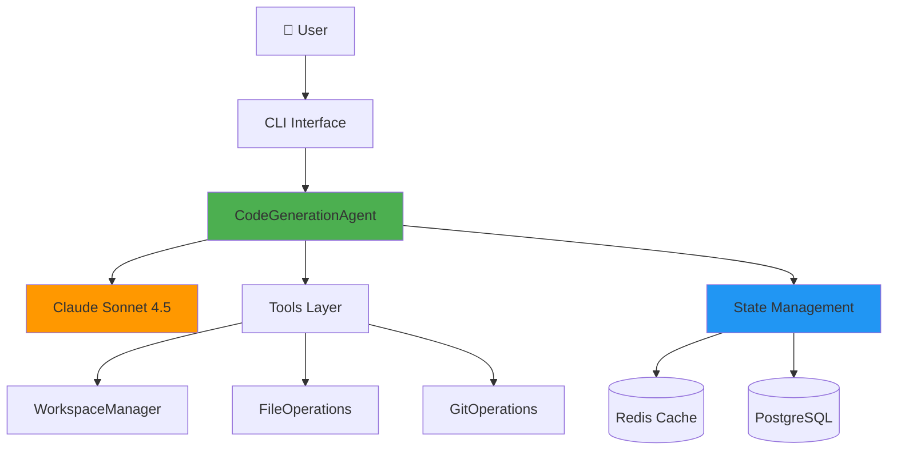
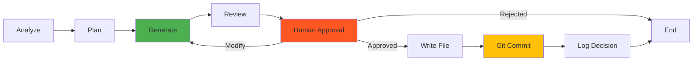
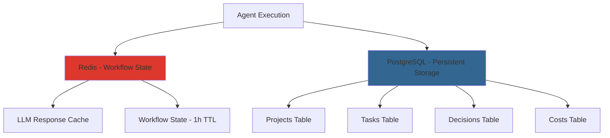
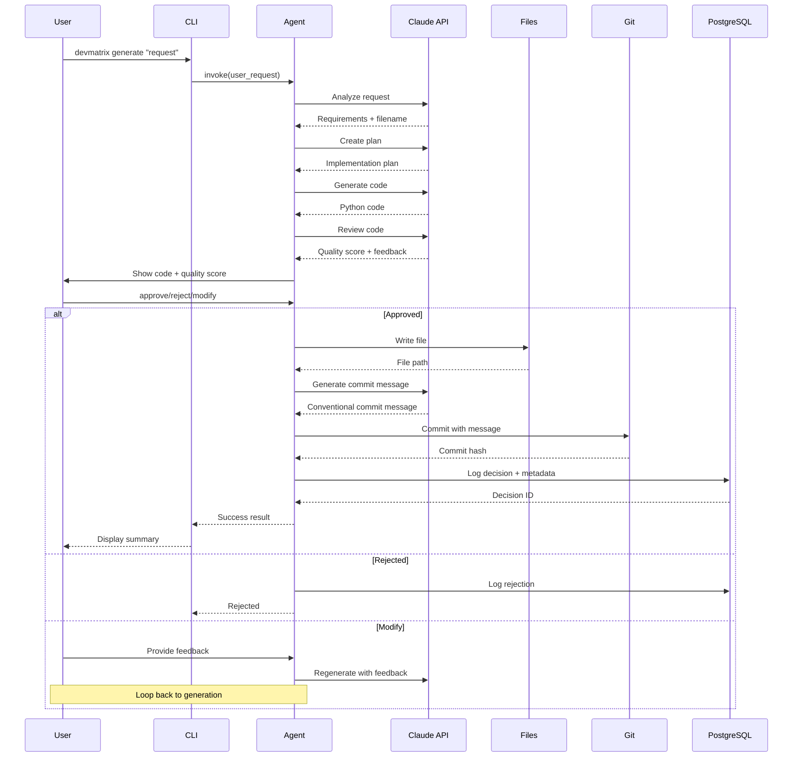
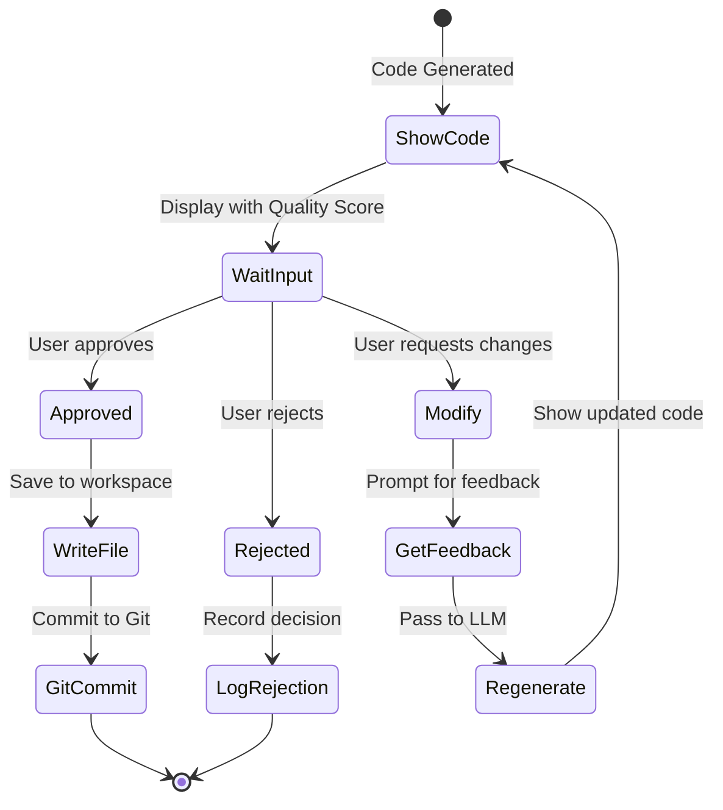
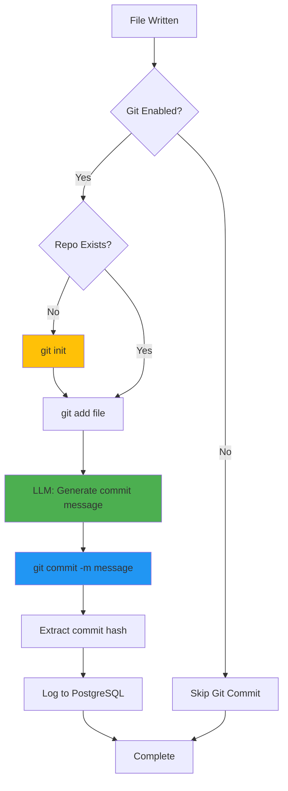
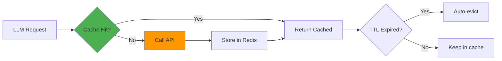
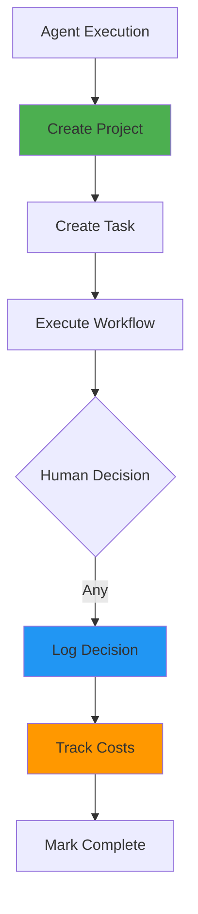
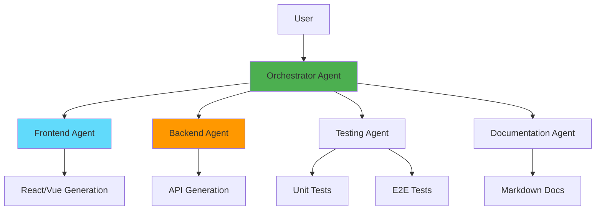

# Devmatrix Architecture

Comprehensive architecture documentation for the Devmatrix AI code generation system.

---

## Table of Contents

1. [System Overview](#system-overview)
2. [Component Architecture](#component-architecture)
3. [Workflow Diagrams](#workflow-diagrams)
4. [Data Flow](#data-flow)
5. [State Management](#state-management)
6. [Technology Stack](#technology-stack)

---

## System Overview

Devmatrix is an AI-powered code generation system built on LangGraph, featuring human-in-loop approval gates and Git integration.

### High-Level Architecture



---

## Component Architecture

### 1. CodeGenerationAgent (Core)

The central agent orchestrating the code generation workflow using LangGraph.



**Responsibilities**:
- Request analysis and requirement extraction
- Implementation planning
- Code generation with Claude Sonnet 4.5
- Self-review with quality scoring
- Human approval gate management
- File writing and Git commits
- Decision logging to PostgreSQL

### 2. Tools Layer

#### WorkspaceManager
- Creates isolated workspace environments
- Manages workspace lifecycle (create/cleanup)
- Handles path traversal protection
- Supports context manager protocol

```python
with WorkspaceManager("my-project") as ws:
    ws.write_file("code.py", content)
    # Auto-cleanup on exit if auto_cleanup=True
```

#### FileOperations
- Safe file read/write/delete operations
- Directory management
- File metadata and hashing
- Tree structure visualization

#### GitOperations
- Repository initialization and status
- File staging and commits
- Diff generation
- Commit history tracking

### 3. State Management



#### Redis Manager
- **Purpose**: Fast in-memory caching
- **Use Cases**:
  - Workflow state caching (1 hour TTL)
  - LLM response caching (1 hour TTL)
  - Session data
- **Performance**: Sub-millisecond access

#### PostgreSQL Manager
- **Purpose**: Persistent storage and audit trail
- **Schema**:
  - `projects`: Project metadata
  - `tasks`: Task execution records
  - `decisions`: Human approval decisions
  - `costs`: Token usage and cost tracking

---

## Workflow Diagrams

### Complete Code Generation Flow



### Human Approval Flow



### Git Integration Flow



---

## Data Flow

### State Structure (LangGraph)

```python
class CodeGenState(TypedDict):
    # Input
    user_request: str
    context: dict

    # Planning
    plan: dict
    tasks: list

    # Generation
    generated_code: str
    target_filename: str

    # Review
    review_feedback: str
    code_quality_score: float

    # Approval
    approval_status: Literal["pending", "approved", "rejected", "needs_modification"]
    user_feedback: str

    # File Operations
    workspace_id: str
    file_written: bool
    file_path: str

    # Git Integration
    git_enabled: bool
    git_commit_message: str
    git_commit_hash: str
    git_committed: bool

    # Tracking
    messages: Sequence[dict]
    decision_id: str
```

### Database Schema

```sql
-- Projects
CREATE TABLE projects (
    id SERIAL PRIMARY KEY,
    name VARCHAR(255) NOT NULL,
    description TEXT,
    created_at TIMESTAMP DEFAULT CURRENT_TIMESTAMP
);

-- Tasks
CREATE TABLE tasks (
    id SERIAL PRIMARY KEY,
    project_id INTEGER REFERENCES projects(id),
    agent_name VARCHAR(100),
    task_type VARCHAR(50),
    input_data TEXT,
    output_data TEXT,
    status VARCHAR(20),
    created_at TIMESTAMP DEFAULT CURRENT_TIMESTAMP,
    completed_at TIMESTAMP
);

-- Decisions
CREATE TABLE decisions (
    id SERIAL PRIMARY KEY,
    task_id INTEGER REFERENCES tasks(id),
    decision_point VARCHAR(100),
    options TEXT[],
    selected_option VARCHAR(100),
    rationale TEXT,
    created_at TIMESTAMP DEFAULT CURRENT_TIMESTAMP
);

-- Costs
CREATE TABLE costs (
    id SERIAL PRIMARY KEY,
    task_id INTEGER REFERENCES tasks(id),
    model VARCHAR(50),
    input_tokens INTEGER,
    output_tokens INTEGER,
    cost_usd DECIMAL(10, 6),
    created_at TIMESTAMP DEFAULT CURRENT_TIMESTAMP
);
```

---

## State Management

### Redis Caching Strategy



**Cache Keys**:
- `workflow:{workflow_id}` - Workflow state (1h TTL)
- `llm_cache:{prompt_hash}` - LLM responses (1h TTL)

### PostgreSQL Persistence



**Data Retention**:
- Projects: Permanent
- Tasks: Permanent (with completed_at timestamp)
- Decisions: Permanent (audit trail)
- Costs: Permanent (budget tracking)

---

## Technology Stack

### Core Framework
- **LangGraph**: State machine workflow orchestration
- **LangChain**: LLM integration and tooling
- **Anthropic Claude**: Sonnet 4.5 for code generation

### State Management
- **Redis**: In-memory caching (Docker container)
- **PostgreSQL**: Persistent storage (Docker container)
- **psycopg2**: PostgreSQL driver
- **redis-py**: Redis client

### CLI & UI
- **Typer**: CLI framework
- **Rich**: Terminal formatting and syntax highlighting
- **Click**: Command-line utilities

### Testing
- **pytest**: Test framework
- **pytest-cov**: Coverage reporting
- **pytest-asyncio**: Async test support
- **unittest.mock**: Mocking utilities

### Development
- **Black**: Code formatting
- **Ruff**: Linting
- **Mypy**: Type checking
- **Docker Compose**: Service orchestration

---

## Design Patterns

### 1. State Machine Pattern (LangGraph)
- Nodes represent discrete processing steps
- Edges define flow between nodes
- Conditional routing based on state
- Immutable state updates (functional style)

### 2. Strategy Pattern (LLM Routing)
- Future: Route complex tasks to Claude
- Future: Route simple tasks to Gemini
- Cost-optimized model selection

### 3. Command Pattern (CLI)
- Each command is isolated
- Composable operations
- Clear separation of concerns

### 4. Repository Pattern (Database)
- Abstract data access
- Consistent interface
- Easy to test with mocks

---

## Performance Characteristics

### Benchmarks
- **Code Generation**: 5-10 seconds (typical)
- **Test Suite**: ~3 seconds (244 tests)
- **Workspace Creation**: <100ms
- **Git Commit**: <500ms
- **Database Write**: <50ms
- **Redis Cache**: <5ms

### Scalability
- **Current**: Single-threaded execution
- **Future**: Multi-agent parallel execution
- **Bottleneck**: LLM API calls (rate limited)
- **Optimization**: Response caching in Redis

---

## Security Considerations

### API Key Management
- Stored in `.env` file (gitignored)
- Never logged or exposed
- Environment variable isolation

### Workspace Isolation
- Path traversal protection
- Sandboxed to `/workspace` directory
- No access to parent directories

### Database Security
- Connection strings in environment
- No SQL injection (parameterized queries)
- Docker network isolation

### Git Operations
- No automatic push to remote
- Local commits only
- User controls remote operations

---

## Extension Points

### Adding New Agents
```python
class NewAgent:
    def __init__(self):
        self.graph = self._build_graph()

    def _build_graph(self) -> StateGraph:
        workflow = StateGraph(CustomState)
        workflow.add_node("step1", self._step1)
        workflow.add_node("step2", self._step2)
        # Define workflow...
        return workflow.compile()
```

### Adding New Tools
```python
class CustomTool:
    def __init__(self, base_path: Path):
        self.base_path = base_path

    def execute(self, params: dict) -> dict:
        # Tool implementation
        return result
```

### Custom LLM Integration
```python
class CustomLLMClient:
    def generate(self, messages: list, **kwargs) -> dict:
        # Implement LLM API call
        return {"content": "...", "usage": {...}}
```

---

## Future Architecture (Phase 2)



**Planned Enhancements**:
- Multi-agent orchestration
- Specialized agents per domain
- Inter-agent communication protocol
- Parallel execution
- Advanced cost optimization
- Multi-language support

---

**Last Updated**: 2025-10-11
**Version**: 0.1.0 (MVP)
