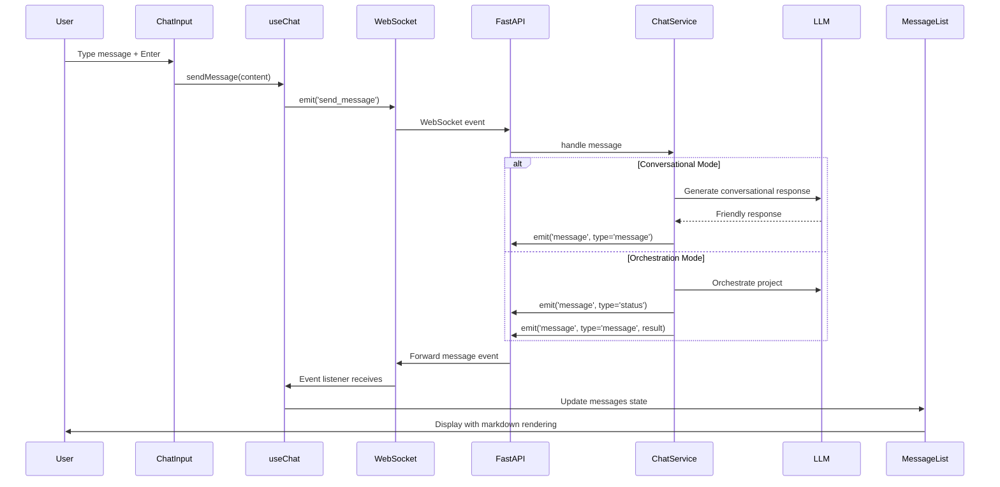
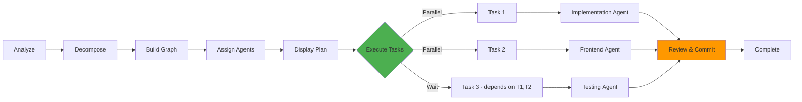

# Devmatrix Architecture

Comprehensive architecture documentation for the Devmatrix autonomous software development system.

**Version**: 0.3.0
**Last Updated**: 2025-10-14
**Status**: Phase 3 Complete - Conversational Web UI Operational

---

## Table of Contents

1. [System Overview](#system-overview)
2. [Component Architecture](#component-architecture)
3. [Web UI Architecture](#web-ui-architecture)
4. [Multi-Agent System](#multi-agent-system)
5. [Workflow Diagrams](#workflow-diagrams)
6. [Data Flow](#data-flow)
7. [State Management](#state-management)
8. [Technology Stack](#technology-stack)

---

## System Overview

Devmatrix is an autonomous software development system featuring:
- **Conversational Web UI** with React 18 + TypeScript
- **Multi-Agent Orchestration** with specialized domain agents
- **Real-time WebSocket** communication for streaming responses
- **Intelligent Intent Detection** routing between conversation and implementation
- **LangGraph Workflows** for state machine orchestration
- **Human-in-Loop Approval** gates with feedback mechanisms

### High-Level Architecture

```mermaid
graph TB
    User[👤 User] --> WebUI[Web UI - React]
    User --> CLI[CLI Interface]

    WebUI --> WS[WebSocket - Socket.IO]
    WS --> API[FastAPI Server]
    CLI --> API

    API --> ChatService[ChatService]
    ChatService --> ConvAgent[Conversational Agent]
    ChatService --> Orch[OrchestratorAgent]

    Orch --> Impl[ImplementationAgent]
    Orch --> Test[TestingAgent]
    Orch --> Doc[DocumentationAgent]
    Orch --> FE[FrontendAgent]
    Orch --> BE[BackendAgent]

    Orch --> LLM[Claude Sonnet 4.5]
    Orch --> Tools[Tools Layer]
    Orch --> State[State Management]

    Tools --> WSM[WorkspaceManager]
    Tools --> Files[FileOperations]
    Tools --> Git[GitOperations]

    State --> Redis[(Redis Cache)]
    State --> Postgres[(PostgreSQL)]

    style WebUI fill:#61DAFB
    style Orch fill:#4CAF50
    style LLM fill:#FF9800
    style State fill:#2196F3
```



---

## Component Architecture

### 1. CodeGenerationAgent (Core)

The central agent orchestrating the code generation workflow using LangGraph.


**Responsibilities**:
- Request analysis and requirement extraction
- Implementation planning
- Code generation with Claude Sonnet 4.5
- Self-review with quality scoring
- Human approval gate management
- File writing and Git commits
- Decision logging to PostgreSQL

### 2. Tools Layer

#### WorkspaceManager
- Creates isolated workspace environments
- Manages workspace lifecycle (create/cleanup)
- Handles path traversal protection
- Supports context manager protocol

```python
with WorkspaceManager("my-project") as ws:
    ws.write_file("code.py", content)
    # Auto-cleanup on exit if auto_cleanup=True
```

#### FileOperations
- Safe file read/write/delete operations
- Directory management
- File metadata and hashing
- Tree structure visualization

#### GitOperations
- Repository initialization and status
- File staging and commits
- Diff generation
- Commit history tracking

### 3. ChatService (Conversational Router)

**Purpose**: Intelligent routing between conversational and orchestration modes based on user intent.

**Responsibilities**:
- User intent detection and classification
- Conversation management with message history
- Command parsing and execution
- Routing to conversational agent or orchestrator
- WebSocket event emission for real-time updates

**Intent Detection Logic**:
```python
# Implementation keywords → Direct orchestration
['crear', 'create', 'implementar', 'implement', 'desarrollar', 'armar', 'build']

# Ready indicators → Proceed with implementation
['si a todo', 'dale', 'empecemos', 'vamos']

# Context awareness → Check if user gave enough details
- 3+ messages with >20 words each
- Technical keywords (FastAPI, React, PostgreSQL, etc.)
- Message length >30 words with tech details

# Discussion keywords → Conversational mode
['diseñar', 'design', 'planear', 'podría', 'cómo']
```

**Conversational Agent**:
- Friendly, natural Spanish (Argentine dialect)
- Maximum 2-3 clarification questions
- Direct answers to technical questions
- Guides user towards implementation readiness

### 4. State Management


#### Redis Manager
- **Purpose**: Fast in-memory caching
- **Use Cases**:
  - Workflow state caching (1 hour TTL)
  - LLM response caching (1 hour TTL)
  - Session data
- **Performance**: Sub-millisecond access

#### PostgreSQL Manager
- **Purpose**: Persistent storage and audit trail
- **Schema**:
  - `projects`: Project metadata
  - `tasks`: Task execution records
  - `decisions`: Human approval decisions
  - `costs`: Token usage and cost tracking

---

## Web UI Architecture

### Component Hierarchy

```
ChatWindow (Main Container)
├── Header
│   ├── Connection Status Indicator
│   └── "Nuevo Proyecto" Button
├── MessageList (Scrollable Message Display)
│   ├── UserMessage (Blue, right-aligned)
│   ├── AssistantMessage (Gray, markdown rendered)
│   │   ├── ReactMarkdown + remark-gfm
│   │   └── rehype-highlight (syntax highlighting)
│   ├── SystemMessage (Yellow, bordered)
│   └── LoadingIndicator (animated)
└── ChatInput (Message Composition)
    ├── Textarea (auto-resize, command hints)
    └── Send Button
```

### Custom Hooks

#### useChat Hook
**Location**: `src/ui/src/hooks/useChat.ts`

**Purpose**: Core chat logic and message management

**State Management**:
```typescript
{
  conversationId: string          // Unique conversation ID
  messages: ChatMessage[]         // Message history
  isLoading: boolean              // Agent processing state
  isConnected: boolean            // WebSocket connection state
  isJoined: boolean               // Chat room joined state
}
```

**Critical Implementation Detail** (Bug Fix 2025-10-14):
```typescript
// FIXED: Separate useEffects for listeners and chat joining
// Listeners depend ONLY on isConnected (persist throughout session)
useEffect(() => {
  if (!isConnected) return

  const cleanup1 = on('chat_joined', handleJoined)
  const cleanup2 = on('message', handleMessage)
  const cleanup3 = on('error', handleError)

  return () => {
    cleanup1()
    cleanup2()
    cleanup3()
  }
}, [isConnected, on]) // NOT isJoined!

// Chat joining logic (separate effect)
useEffect(() => {
  if (!isConnected || isJoined) return

  send('join_chat', { conversation_id, workspace_id })

  return () => {
    if (conversationId) {
      send('leave_chat', { conversation_id: conversationId })
    }
  }
}, [isConnected, isJoined, conversationId, workspaceId, send])
```

**Why This Matters**: Previously, event listeners were cleaned up when `isJoined` changed to `true`, causing messages to never reach the UI. This separation ensures listeners persist throughout the session.

#### useWebSocket Hook
**Location**: `src/ui/src/hooks/useWebSocket.ts`

**Purpose**: WebSocket connection management

**Functionality**:
- Singleton WebSocketService connection
- Connection state tracking
- Event emission and listening
- Automatic reconnection handling

### WebSocket Communication

#### Client → Server Events
```typescript
{
  join_chat: { conversation_id?, workspace_id? }
  send_message: { conversation_id, content, metadata? }
  leave_chat: { conversation_id }
}
```

#### Server → Client Events
```typescript
{
  connected: { session_id }
  chat_joined: { conversation_id, history? }
  message: {
    type: 'user_message' | 'message' | 'status' | 'error'
    role: 'user' | 'assistant' | 'system'
    content: string
    metadata?: any
    done: boolean
  }
  error: { message: string }
}
```

### Message Flow



### UI/UX Features

**Auto-Focus**: Input automatically focuses after agent responses for seamless conversation flow.

**Nuevo Proyecto Button**: Clears conversation and refreshes page with confirmation dialog.

**Command Autocomplete**: Detects `/` prefix and shows available commands:
- `/help` - Show available commands
- `/orchestrate <description>` - Start orchestration
- `/analyze` - Analyze code
- `/test` - Run tests
- `/clear` - Clear history
- `/workspace` - Show workspace info

**Responsive Design**: Tailwind CSS with dark mode support, mobile-friendly layout.

**Markdown Rendering**: Full GitHub-flavored markdown with:
- Code blocks with syntax highlighting (via highlight.js)
- Tables, lists, links
- Proper escaping and security

---

## Multi-Agent System

### OrchestratorAgent

**Purpose**: Main orchestration controller that decomposes projects and coordinates specialized agents.

**LangGraph Workflow**:
```
analyze_project → decompose_tasks → build_dependency_graph →
assign_agents → display_plan → finalize → END
```

**Current Limitation**: ⚠️ No `execute_tasks` node - system plans but doesn't execute.

**Workflow Nodes**:

1. **analyze_project**: Extract requirements, identify tech stack, assess complexity
2. **decompose_tasks**: Break into atomic tasks with clear scope
3. **build_dependency_graph**: Identify task dependencies for ordering
4. **assign_agents**: Route tasks to appropriate specialized agents
5. **display_plan**: Format and present task breakdown
6. **finalize**: Prepare final output
7. **🔴 MISSING: execute_tasks**: Actually invoke agents and generate code

### Specialized Agents

#### ImplementationAgent
**Domain**: Core business logic, data structures, algorithms
**Languages**: Python, TypeScript, Java, Go
**Outputs**: Implementation files with type hints and docstrings

#### FrontendAgent
**Domain**: UI components, client-side logic, styling
**Frameworks**: React, Vue, Angular, Svelte
**Outputs**: Component files, styles, tests

#### BackendAgent
**Domain**: APIs, databases, authentication, middleware
**Frameworks**: FastAPI, Django, Flask, Express
**Outputs**: API routes, models, migrations, middleware

#### TestingAgent
**Domain**: Unit tests, integration tests, E2E tests
**Frameworks**: pytest, Jest, Vitest, Playwright
**Outputs**: Test files with comprehensive coverage

#### DocumentationAgent
**Domain**: READMEs, API docs, architecture diagrams
**Formats**: Markdown, OpenAPI, Mermaid diagrams
**Outputs**: Documentation files with clear structure

### Agent Registry

**Purpose**: Dynamic agent management and capability discovery

**Functions**:
```python
registry.register_agent(agent_type, agent_class, capabilities)
registry.get_agent(agent_type) → agent_instance
registry.list_agents() → List[AgentInfo]
registry.get_capabilities(agent_type) → List[str]
```

**Agent Capabilities**:
```python
{
  'implementation': ['python', 'typescript', 'algorithm', 'data_structure'],
  'frontend': ['react', 'vue', 'angular', 'css', 'ui_component'],
  'backend': ['api', 'database', 'authentication', 'fastapi', 'django'],
  'testing': ['unit_test', 'integration_test', 'e2e_test', 'pytest'],
  'documentation': ['readme', 'api_doc', 'architecture', 'markdown']
}
```

---

## Workflow Diagrams

### Complete Code Generation Flow


### Human Approval Flow


### Git Integration Flow


---

## Data Flow

### State Structure (LangGraph)

```python
class CodeGenState(TypedDict):
    # Input
    user_request: str
    context: dict

    # Planning
    plan: dict
    tasks: list

    # Generation
    generated_code: str
    target_filename: str

    # Review
    review_feedback: str
    code_quality_score: float

    # Approval
    approval_status: Literal["pending", "approved", "rejected", "needs_modification"]
    user_feedback: str

    # File Operations
    workspace_id: str
    file_written: bool
    file_path: str

    # Git Integration
    git_enabled: bool
    git_commit_message: str
    git_commit_hash: str
    git_committed: bool

    # Tracking
    messages: Sequence[dict]
    decision_id: str
```

### Database Schema

```sql
-- Projects
CREATE TABLE projects (
    id SERIAL PRIMARY KEY,
    name VARCHAR(255) NOT NULL,
    description TEXT,
    created_at TIMESTAMP DEFAULT CURRENT_TIMESTAMP
);

-- Tasks
CREATE TABLE tasks (
    id SERIAL PRIMARY KEY,
    project_id INTEGER REFERENCES projects(id),
    agent_name VARCHAR(100),
    task_type VARCHAR(50),
    input_data TEXT,
    output_data TEXT,
    status VARCHAR(20),
    created_at TIMESTAMP DEFAULT CURRENT_TIMESTAMP,
    completed_at TIMESTAMP
);

-- Decisions
CREATE TABLE decisions (
    id SERIAL PRIMARY KEY,
    task_id INTEGER REFERENCES tasks(id),
    decision_point VARCHAR(100),
    options TEXT[],
    selected_option VARCHAR(100),
    rationale TEXT,
    created_at TIMESTAMP DEFAULT CURRENT_TIMESTAMP
);

-- Costs
CREATE TABLE costs (
    id SERIAL PRIMARY KEY,
    task_id INTEGER REFERENCES tasks(id),
    model VARCHAR(50),
    input_tokens INTEGER,
    output_tokens INTEGER,
    cost_usd DECIMAL(10, 6),
    created_at TIMESTAMP DEFAULT CURRENT_TIMESTAMP
);
```

---

## State Management

### Redis Caching Strategy


**Cache Keys**:
- `workflow:{workflow_id}` - Workflow state (1h TTL)
- `llm_cache:{prompt_hash}` - LLM responses (1h TTL)

### PostgreSQL Persistence


**Data Retention**:
- Projects: Permanent
- Tasks: Permanent (with completed_at timestamp)
- Decisions: Permanent (audit trail)
- Costs: Permanent (budget tracking)

---

## Technology Stack

### Frontend
- **React 18**: UI library with hooks and functional components
- **TypeScript 5**: Type-safe JavaScript
- **Vite**: Fast build tool with HMR
- **Tailwind CSS 3**: Utility-first CSS framework
- **Socket.IO Client 4.6**: WebSocket client library
- **React Markdown**: Markdown rendering with GitHub-flavored support
- **Highlight.js**: Syntax highlighting for code blocks
- **React Icons**: Icon library (Feather Icons)

### Backend
- **FastAPI**: Modern Python web framework
- **python-socketio 5.11**: WebSocket server integration
- **LangGraph**: State machine workflow orchestration
- **LangChain**: LLM integration and tooling
- **Anthropic Claude**: Sonnet 3.5 (current), targeting Opus 4.1 + Sonnet 4.5

### State Management
- **Redis**: In-memory caching (Docker container)
- **PostgreSQL**: Persistent storage (Docker container)
- **psycopg2**: PostgreSQL driver
- **redis-py**: Redis client

### CLI & UI
- **Typer**: CLI framework
- **Rich**: Terminal formatting and syntax highlighting
- **Click**: Command-line utilities

### Testing
- **pytest**: Test framework
- **pytest-cov**: Coverage reporting
- **pytest-asyncio**: Async test support
- **unittest.mock**: Mocking utilities
- **Vitest**: Frontend unit testing (planned)
- **Playwright**: E2E testing (planned)

### Development
- **Black**: Code formatting
- **Ruff**: Linting
- **Mypy**: Type checking
- **ESLint**: JavaScript/TypeScript linting
- **Prettier**: Frontend code formatting (planned)
- **Docker Compose**: Service orchestration

---

## Design Patterns

### 1. State Machine Pattern (LangGraph)
- Nodes represent discrete processing steps
- Edges define flow between nodes
- Conditional routing based on state
- Immutable state updates (functional style)

### 2. Strategy Pattern (LLM Routing)
- Future: Route complex tasks to Claude
- Future: Route simple tasks to Gemini
- Cost-optimized model selection

### 3. Command Pattern (CLI)
- Each command is isolated
- Composable operations
- Clear separation of concerns

### 4. Repository Pattern (Database)
- Abstract data access
- Consistent interface
- Easy to test with mocks

---

## Performance Characteristics

### Benchmarks
- **Code Generation**: 5-10 seconds (typical)
- **Test Suite**: ~3 seconds (244 tests)
- **Workspace Creation**: <100ms
- **Git Commit**: <500ms
- **Database Write**: <50ms
- **Redis Cache**: <5ms

### Scalability
- **Current**: Single-threaded execution
- **Future**: Multi-agent parallel execution
- **Bottleneck**: LLM API calls (rate limited)
- **Optimization**: Response caching in Redis

---

## Security Considerations

### API Key Management
- Stored in `.env` file (gitignored)
- Never logged or exposed
- Environment variable isolation

### Workspace Isolation
- Path traversal protection
- Sandboxed to `/workspace` directory
- No access to parent directories

### Database Security
- Connection strings in environment
- No SQL injection (parameterized queries)
- Docker network isolation

### Git Operations
- No automatic push to remote
- Local commits only
- User controls remote operations

---

## Extension Points

### Adding New Agents
```python
class NewAgent:
    def __init__(self):
        self.graph = self._build_graph()

    def _build_graph(self) -> StateGraph:
        workflow = StateGraph(CustomState)
        workflow.add_node("step1", self._step1)
        workflow.add_node("step2", self._step2)
        # Define workflow...
        return workflow.compile()
```

### Adding New Tools
```python
class CustomTool:
    def __init__(self, base_path: Path):
        self.base_path = base_path

    def execute(self, params: dict) -> dict:
        # Tool implementation
        return result
```

### Custom LLM Integration
```python
class CustomLLMClient:
    def generate(self, messages: list, **kwargs) -> dict:
        # Implement LLM API call
        return {"content": "...", "usage": {...}}
```

---

## Future Architecture (Phase 4 - Task Execution)

**Current Gap**: System plans projects but doesn't execute tasks. Phase 4 will add execution capabilities.

### Enhanced OrchestratorAgent Workflow



### Phase 4 Planned Enhancements

**Task Execution Engine**:
- Dependency-aware execution order
- Parallel execution for independent tasks
- Real-time progress streaming via WebSocket
- Error handling and retry mechanisms
- Partial completion and resume capabilities

**Agent Communication Protocol**:
- Inter-agent message passing
- Shared context and state
- Task result validation
- Coordination for cross-cutting concerns

**Model Configuration**:
- **Claude Opus 4.1**: For orchestration and complex reasoning
- **Claude Sonnet 4.5**: For specialized agent execution
- Smart routing based on task complexity

**Execution Features**:
- Streaming code generation with live updates
- Incremental Git commits per completed task
- Human approval gates for critical decisions
- Rollback and undo capabilities
- Cost tracking per agent execution

**Performance Optimizations**:
- Agent result caching
- Parallel tool execution
- Smart context window management
- Token usage optimization

---

**Last Updated**: 2025-10-14
**Version**: 0.3.0 (Phase 3 Complete - Conversational Web UI)
