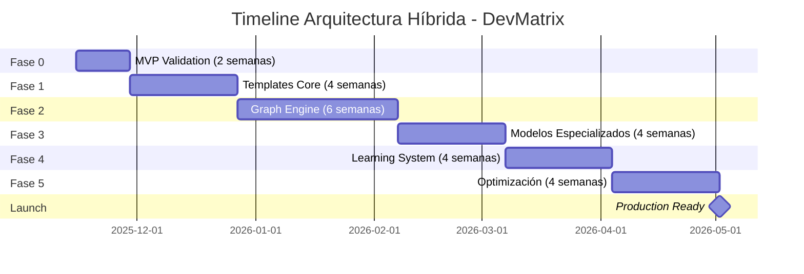

# 📅 TIMELINE DE IMPLEMENTACIÓN - ARQUITECTURA HÍBRIDA
## Plan B: 80/15/4/1 - Ruta hacia 90-96% Precisión

**Versión**: 1.0
**Fecha**: 2025-11-12
**Timeline Total**: 6-8 meses
**Inversión**: $200K
**ROI Proyectado**: 643% en 18 meses

---

## 🎯 HITOS PRINCIPALES



---

## 📊 FASE 0: MVP VALIDATION (Semanas 0-2)
**Objetivo**: Validar viabilidad con 5-10 templates
**Precisión Target**: 60%+
**Decision Gate**: GO/NO-GO para Plan B completo

### Semana 1: PoC Rápido
```python
tasks_week_1 = {
    "Día 1-2": [
        "Setup Neo4j local con Docker",
        "Crear estructura base del proyecto",
        "Implementar 3 templates básicos (auth, crud, model)"
    ],
    "Día 3-4": [
        "Integrar templates con Neo4j",
        "Crear generador simple",
        "Test de generación básica"
    ],
    "Día 5": [
        "Medir precisión inicial",
        "Documentar resultados",
        "Preparar demo"
    ]
}

deliverables = {
    "templates": ["JWTAuth", "CRUDEndpoints", "UserModel"],
    "neo4j": "Grafo básico funcionando",
    "metrics": "Precisión medida y documentada",
    "demo": "Generación de mini-app funcional"
}
```

### Semana 2: Validación y Decisión
```python
validation_week_2 = {
    "Día 6-8": [
        "Expandir a 10 templates",
        "Agregar 2 templates React",
        "Medir coherencia DDD"
    ],
    "Día 9-10": [
        "Testing exhaustivo",
        "Análisis de resultados",
        "Preparar reporte ejecutivo"
    ]
}

decision_criteria = {
    "precision": ">60% para proceder",
    "coherence": ">80% patrones DDD correctos",
    "performance": "<5 min generación",
    "decision": "GO → Fase 1 | NO-GO → Volver a Plan A"
}
```

**Entregable Final**: Decisión ejecutiva con evidencia empírica

---

## 🔨 FASE 1: FOUNDATION - TEMPLATES CORE (Semanas 3-6)
**Objetivo**: 30 templates determinísticos de alta precisión
**Precisión Target**: 70%
**Inversión**: $30K

### Semana 3-4: Backend Templates
```python
backend_templates_priority = {
    "week_3": {
        "auth": [
            "JWTAuthService",
            "RoleBasedAccess",
            "SessionManager",
            "PasswordValidator",
            "TokenRefresh"
        ],
        "api": [
            "RestfulEndpoints",
            "ErrorHandler",
            "ValidationMiddleware",
            "RateLimiter",
            "CORSSetup"
        ]
    },
    "week_4": {
        "ddd": [
            "AggregateRoot",
            "DomainEntity",
            "ValueObject",
            "Repository",
            "DomainService"
        ],
        "data": [
            "PostgresCRUD",
            "RedisCache",
            "QueryBuilder",
            "Migration",
            "Seeder"
        ]
    }
}

quality_metrics = {
    "test_coverage": ">95% por template",
    "precision": ">98% código compilable",
    "performance": "<100ms generación",
    "documentation": "100% documentado"
}
```

### Semana 5-6: Frontend Templates
```python
frontend_templates_priority = {
    "week_5": {
        "components": [
            "DataTable",
            "FormBuilder",
            "ModalDialog",
            "NavigationMenu",
            "Dashboard"
        ],
        "patterns": [
            "AuthContext",
            "ApiClient",
            "ErrorBoundary",
            "RouteGuard",
            "LoadingStates"
        ]
    },
    "week_6": {
        "integration": [
            "ReactQuerySetup",
            "StateManagement",
            "FormValidation",
            "I18nProvider",
            "ThemeProvider"
        ],
        "testing": [
            "TestsUnitarios",
            "TestsIntegracion",
            "E2ESetup"
        ]
    }
}
```

**Entregable**: 30 templates con 70% precisión global

---

## 🧠 FASE 2: COGNITIVE GRAPH ENGINE (Semanas 7-12)
**Objetivo**: Sistema de grafos cognitivos completo
**Precisión Target**: 80%
**Inversión**: $45K

### Semana 7-8: Graph Foundation
```python
graph_foundation = {
    "schema": {
        "nodes": [
            "Template", "Project", "Component",
            "Requirement", "GeneratedCode", "TestCase"
        ],
        "relationships": [
            "USES", "REQUIRES", "GENERATES",
            "VALIDATES", "EVOLVES_TO", "DEPENDS_ON"
        ],
        "properties": {
            "metrics": ["precision", "usage_count", "success_rate"],
            "metadata": ["version", "created_at", "last_used"],
            "evolution": ["parent_id", "improvements", "issues"]
        }
    },
    "implementation": {
        "week_7": "Schema completo + índices",
        "week_8": "CRUD operations + queries optimizadas"
    }
}
```

### Semana 9-10: Semantic Builder
```python
class CognitiveGraphBuilder:
    """Construcción automatizada del grafo"""

    def __init__(self):
        self.extractors = {
            'figma': FigmaGraphExtractor(),
            'code': CodeSemanticExtractor(),
            'docs': DocAnalysisExtractor(),
            'requirements': RequirementParser()
        }

    def build_project_graph(self, project_spec):
        """1-2 horas para grafo completo"""
        # Extracción paralela de 100+ agentes
        semantic_nodes = self.parallel_extraction(project_spec)

        # Construcción del grafo
        graph = self.build_relationships(semantic_nodes)

        # Validación de coherencia
        self.validate_coherence(graph)

        return graph
```

### Semana 11-12: Integration & Testing
```python
integration_tasks = {
    "week_11": [
        "Integrar con generador de código",
        "Sistema de navegación de grafo",
        "Optimización de queries"
    ],
    "week_12": [
        "Testing de coherencia 95%+",
        "Benchmark de performance",
        "Dashboard de visualización"
    ]
}
```

**Entregable**: Motor de grafos con 95% coherencia

---

## 🤖 FASE 3: SPECIALIZED MODELS (Semanas 13-16)
**Objetivo**: 5 modelos especializados para el 15%
**Precisión Target**: 85%
**Inversión**: $40K

### Semana 13-14: Core Models
```python
specialized_models = {
    "sql_specialist": {
        "model": "DeepSeek-SQL-7B",
        "training": "10K queries PostgreSQL",
        "precision_target": "98% queries válidas",
        "deployment": "Ollama local"
    },
    "business_logic": {
        "model": "CodeLlama-7B-Python",
        "training": "DDD patterns + business rules",
        "precision_target": "95% lógica correcta",
        "deployment": "GGUF quantized"
    },
    "ui_specialist": {
        "model": "StarCoder-3B",
        "training": "React components + Tailwind",
        "precision_target": "96% componentes funcionales",
        "deployment": "Edge runtime"
    }
}
```

### Semana 15-16: Advanced Models
```python
advanced_models = {
    "test_generator": {
        "model": "Specialized-Test-3B",
        "focus": "Unit + Integration tests",
        "coverage_target": "90% código generado"
    },
    "performance_optimizer": {
        "model": "Opt-Code-3B",
        "focus": "Query optimization + caching",
        "improvement_target": "50% faster"
    }
}

integration = {
    "router": "Intelligent routing to specialists",
    "fallback": "LLM for edge cases",
    "monitoring": "Track specialist performance"
}
```

**Entregable**: 5 modelos con 95% precisión en sus dominios

---

## 🎓 FASE 4: LEARNING SYSTEM (Semanas 17-20)
**Objetivo**: Sistema de aprendizaje continuo
**Precisión Target**: 90%
**Inversión**: $35K

### Semana 17-18: Feedback Loop
```python
learning_system = {
    "collection": {
        "user_feedback": "Captura de correcciones",
        "test_results": "Análisis de fallos",
        "usage_patterns": "Tracking de uso"
    },
    "analysis": {
        "pattern_recognition": "Identificar mejoras comunes",
        "error_clustering": "Agrupar tipos de errores",
        "success_metrics": "Qué funciona mejor"
    },
    "evolution": {
        "template_updates": "Mejorar templates existentes",
        "new_patterns": "Crear nuevos templates",
        "model_retraining": "Afinar especialistas"
    }
}
```

### Semana 19-20: Automation
```python
automated_improvement = {
    "weekly_cycle": {
        "monday": "Collect week's feedback",
        "tuesday": "Analyze patterns",
        "wednesday": "Generate improvements",
        "thursday": "Test changes",
        "friday": "Deploy updates"
    },
    "metrics": {
        "improvement_rate": ">2% monthly",
        "regression_prevention": "Zero degradation",
        "user_satisfaction": ">90%"
    }
}
```

**Entregable**: Sistema evolutivo funcionando

---

## 🚀 FASE 5: OPTIMIZATION & SCALE (Semanas 21-24)
**Objetivo**: Optimización final y preparación para producción
**Precisión Target**: 94-96%
**Inversión**: $30K

### Semana 21-22: Performance
```python
optimization_targets = {
    "generation_speed": {
        "current": "10 minutes",
        "target": "3 minutes",
        "how": "Parallel processing + caching"
    },
    "precision": {
        "current": "90%",
        "target": "96%",
        "how": "Template refinement + specialist tuning"
    },
    "scale": {
        "current": "10 projects/day",
        "target": "100 projects/day",
        "how": "Horizontal scaling + queue system"
    }
}
```

### Semana 23-24: Production Ready
```python
production_checklist = {
    "infrastructure": [
        "Kubernetes deployment",
        "Auto-scaling configured",
        "Monitoring & alerting",
        "Backup & recovery"
    ],
    "security": [
        "Authentication system",
        "Rate limiting",
        "Input validation",
        "Audit logging"
    ],
    "documentation": [
        "API documentation",
        "User guides",
        "Admin manual",
        "Troubleshooting guide"
    ],
    "sla": {
        "uptime": "99.9%",
        "response_time": "<5 seconds",
        "precision": ">94%",
        "support": "24/7"
    }
}
```

**Entregable**: Sistema listo para producción

---

## 💰 PRESUPUESTO DETALLADO

| Fase | Duración | Inversión | Precisión | ROI Incremental |
|------|----------|-----------|-----------|-----------------|
| **MVP** | 2 semanas | $10K | 60% | Validación |
| **Templates** | 4 semanas | $30K | 70% | Primeros clientes |
| **Graph Engine** | 6 semanas | $45K | 80% | $20K MRR |
| **Specialists** | 4 semanas | $40K | 85% | $50K MRR |
| **Learning** | 4 semanas | $35K | 90% | $80K MRR |
| **Optimization** | 4 semanas | $30K | 96% | $150K MRR |
| **Buffer** | - | $10K | - | - |
| **TOTAL** | 24 semanas | $200K | 96% | $150K MRR |

### ROI Calculation (18 meses)
```python
roi_projection = {
    "investment": 200_000,
    "monthly_revenue_month_6": 150_000,
    "growth_rate": 1.15,  # 15% monthly
    "months": 18,

    "revenue_18_months": 1_486_000,
    "roi": "643%",
    "payback_period": "8 months"
}
```

---

## 🎯 MÉTRICAS DE ÉXITO POR FASE

### KPIs Principales
| Métrica | MVP | F1 | F2 | F3 | F4 | F5 |
|---------|-----|----|----|----|----|-----|
| **Precisión** | 60% | 70% | 80% | 85% | 90% | 96% |
| **Tiempo Gen** | 30m | 20m | 15m | 10m | 7m | 3m |
| **Coherencia** | 70% | 80% | 95% | 95% | 97% | 99% |
| **Templates** | 10 | 30 | 30 | 30 | 35 | 55 |
| **Test Pass** | 60% | 75% | 85% | 90% | 92% | 95% |

### Quality Gates
```yaml
phase_gates:
  mvp_to_phase1:
    precision: ">60%"
    decision: "executive_review"

  phase1_to_phase2:
    precision: ">70%"
    templates_working: ">90%"

  phase2_to_phase3:
    graph_coherence: ">95%"
    navigation_working: "true"

  phase3_to_phase4:
    specialists_precision: ">95%"
    routing_accuracy: ">90%"

  phase4_to_phase5:
    learning_active: "true"
    improvement_rate: ">2%"

  phase5_to_production:
    overall_precision: ">94%"
    sla_met: "true"
```

---

## 🚨 RIESGOS Y MITIGACIÓN

### Top 5 Riesgos
| Riesgo | Probabilidad | Impacto | Mitigación |
|--------|-------------|---------|------------|
| **Neo4j Complejidad** | Media | Alto | Contratar experto, training intensivo |
| **Templates Insuficientes** | Baja | Medio | Comenzar con 20 core, expandir gradual |
| **Modelos No Convergen** | Media | Alto | Usar modelos pre-trained, fine-tune mínimo |
| **Timeline Optimista** | Alta | Medio | Buffer 20%, fases paralelas donde posible |
| **Adopción Usuarios** | Media | Alto | Beta testers early, feedback continuo |

### Plan B (Fallback)
```python
fallback_options = {
    "if_mvp_fails": {
        "action": "Return to Plan A optimization",
        "loss": "2 weeks + $10K",
        "learning": "Apply insights to optimization"
    },
    "if_precision_stalls": {
        "action": "Focus on single domain (e.g., CRUD apps)",
        "adjustment": "Reduce scope, increase depth",
        "target": "95% in narrow domain"
    },
    "if_timeline_extends": {
        "action": "Launch with 85% precision",
        "revenue": "Start earlier, improve in production",
        "communication": "Set clear expectations"
    }
}
```

---

## 📈 HOJA DE RUTA POST-LANZAMIENTO

### Meses 7-12: Expansión
```python
expansion_plan = {
    "month_7_8": {
        "focus": "Stabilization",
        "templates": 55 → 75,
        "precision": "96% → 97%"
    },
    "month_9_10": {
        "focus": "New domains",
        "add": ["Django", "Vue", "MongoDB"],
        "precision": "Maintain 96%+"
    },
    "month_11_12": {
        "focus": "Enterprise features",
        "add": ["Multi-tenancy", "RBAC", "Audit"],
        "pricing": "Enterprise tier $5K/month"
    }
}
```

### Año 2: Scale
```python
year_2_vision = {
    "templates": 200+,
    "frameworks": 10+,
    "precision": 98%,
    "revenue": "$5M ARR",
    "team": 25,
    "valuation": "$50M"
}
```

---

## 🎬 PRÓXIMOS PASOS INMEDIATOS

### Esta Semana
- [ ] Aprobar presupuesto y timeline
- [ ] Contratar experto Neo4j
- [ ] Setup ambiente de desarrollo
- [ ] Definir 10 templates para MVP

### Próxima Semana
- [ ] Comenzar MVP (Fase 0)
- [ ] Implementar primeros 3 templates
- [ ] Setup Neo4j con Docker
- [ ] Crear generador básico

### En 2 Semanas
- [ ] Decisión GO/NO-GO basada en MVP
- [ ] Si GO: Iniciar contrataciones
- [ ] Si NO-GO: Pivotar a Plan A

---

## 📋 CHECKLIST DE INICIO

### Técnico
- [ ] Neo4j Desktop o Docker instalado
- [ ] Python 3.11+ environment
- [ ] Node.js 18+ y pnpm
- [ ] Ollama para modelos locales
- [ ] GPU disponible (opcional pero recomendado)

### Equipo
- [ ] Lead Developer (senior)
- [ ] Neo4j Expert (contractor OK)
- [ ] Frontend Developer
- [ ] QA Engineer (part-time OK)

### Recursos
- [ ] $10K para MVP
- [ ] $200K comprometidos si MVP exitoso
- [ ] 6-8 meses de runway
- [ ] Beta testers identificados

---

## 🏁 CONCLUSIÓN

El Timeline de Implementación muestra un camino claro y medible hacia 96% de precisión:

1. **MVP en 2 semanas** para validación empírica
2. **6 meses hasta producción** con hitos claros
3. **$200K de inversión** con ROI de 643%
4. **Riesgos identificados** y mitigados
5. **Fallback options** si algo falla

**La clave**: Empezar con el MVP AHORA para validar la hipótesis con datos reales.

---

*Timeline actualizado: 2025-11-12*
*Estado: Listo para ejecutar con aprobación ejecutiva*
*Próxima revisión: Post-MVP (2 semanas)*