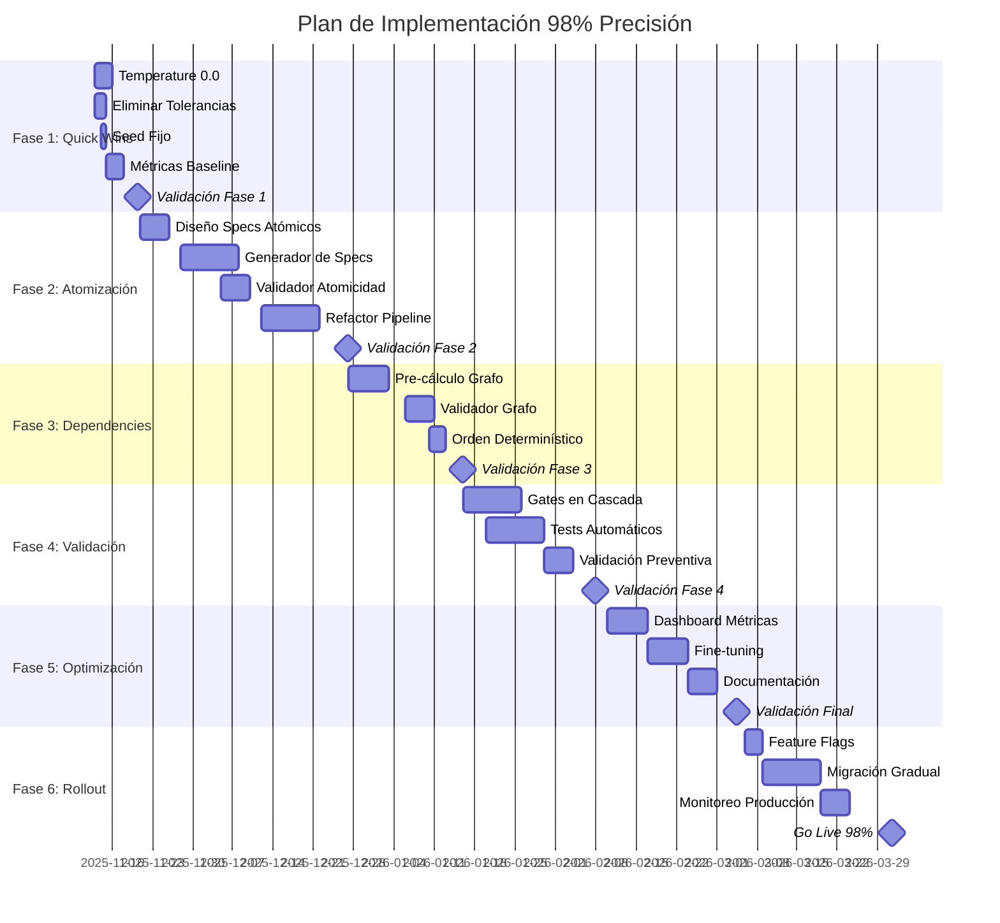

# 🎯 PLAN MAESTRO: DevMatrix 98% Precisión Determinística

**Fecha Inicio**: 2025-11-13
**Fecha Objetivo**: 2026-03-31 (≈20 semanas)
**Versión**: 1.0
**Estado**: 🔴 PENDIENTE APROBACIÓN

---

## 📊 RESUMEN EJECUTIVO

### Objetivo Principal
Transformar DevMatrix de **38% de precisión actual** a **≥98% de precisión determinística** en generación de sistemas desde especificaciones.

### Métricas de Éxito
- **Precisión End-to-End**: ≥ 98%
- **Determinismo**: 100% (mismo input → mismo output SIEMPRE)
- **Atomicidad Real**: 100% átomos ≤ 10 LOC
- **Test Coverage**: ≥ 95%
- **Paralelización**: ≥ 80% de átomos ejecutables en paralelo
- **Tiempo de Generación**: ≤ 5 minutos para sistema mediano (1000 LOC)
- **Costo por Sistema**: ≤ $10 USD en tokens LLM

### Inversión Estimada
- **Tiempo**: 14-20 semanas
- **Recursos**: 2-3 desarrolladores senior
- **Costo Desarrollo**: ~$60,000-80,000 USD
- **ROI Esperado**: 250% en 12 meses post-implementación

---

## 📅 CRONOGRAMA MAESTRO



---

## 🚀 FASE 1: QUICK WINS (Semanas 1-2)

### Objetivo
Eliminar fuentes obvias de indeterminismo para subir precisión de 38% → 58%

### Tareas Técnicas

#### 1.1 Cambiar Temperature a 0.0
**Archivo**: `src/services/masterplan_generator.py`
```python
# Línea 828 - CAMBIAR:
temperature=0.7  # ❌ ACTUAL

# A:
temperature=0.0  # ✅ NUEVO
```

**Archivos adicionales a modificar**:
- [ ] `src/services/discovery_service.py`
- [ ] `src/services/code_generator_service.py`
- [ ] `src/services/mge_v2_orchestrator.py`
- [ ] `src/services/validation_service.py`
- [ ] Cualquier llamada a LLM en el codebase

**Script de validación**:
```bash
# Verificar que no quede ningún temperature > 0
grep -r "temperature=" src/ | grep -v "temperature=0"
```

#### 1.2 Eliminar Tolerancia del 15%
**Archivo**: `src/services/masterplan_generator.py`
```python
# Líneas 909-917 - CAMBIAR:
deviation = abs(total_tasks - calculated_task_count) / calculated_task_count
if deviation > 0.15:  # ❌ ACTUAL - 15% tolerance
    raise ValueError(...)

# A:
if total_tasks != calculated_task_count:  # ✅ NUEVO - 0% tolerance
    raise ValueError(f"Task count mismatch: expected {calculated_task_count}, got {total_tasks}")
```

#### 1.3 Implementar Seed Fijo
**Crear archivo**: `src/config/llm_config.py`
```python
class LLMConfig:
    DEFAULT_SEED = 42
    DEFAULT_TEMPERATURE = 0.0
    DETERMINISTIC_MODE = True
    MAX_TOKENS = 4096

    @staticmethod
    def get_deterministic_params():
        return {
            "temperature": LLMConfig.DEFAULT_TEMPERATURE,
            "seed": LLMConfig.DEFAULT_SEED,
            "top_p": 1.0,  # Sin sampling
            "frequency_penalty": 0,
            "presence_penalty": 0
        }
```

**Integrar en todos los servicios**:
```python
from src.config.llm_config import LLMConfig

# En cada llamada LLM:
response = await self.llm.generate_with_caching(
    task_type="masterplan_generation",
    **LLMConfig.get_deterministic_params()
)
```

#### 1.4 Medir Baseline de Precisión
**Crear script**: `scripts/measure_precision_baseline.py`
```python
import asyncio
import hashlib
import json
from typing import List, Dict
import statistics

async def measure_precision(iterations: int = 10):
    """Ejecuta el mismo Discovery Document N veces y mide variabilidad"""

    discovery_doc = load_sample_discovery()
    results = []

    for i in range(iterations):
        print(f"Iteración {i+1}/{iterations}")

        # Generar MasterPlan
        masterplan = await generate_masterplan(discovery_doc)

        # Generar código
        code = await generate_code(masterplan)

        # Atomizar
        atoms = await atomize_code(code)

        # Ejecutar
        execution = await execute_atoms(atoms)

        results.append({
            "iteration": i + 1,
            "task_count": len(masterplan.tasks),
            "atom_count": len(atoms),
            "success_rate": execution.precision,
            "code_hash": hashlib.md5(code.encode()).hexdigest(),
            "execution_time": execution.time_seconds,
            "cost": execution.cost_usd
        })

    # Calcular métricas
    analyze_results(results)

def analyze_results(results: List[Dict]):
    """Analiza variabilidad y calcula precisión real"""

    # Task count variance
    task_counts = [r["task_count"] for r in results]
    task_variance = statistics.stdev(task_counts) if len(set(task_counts)) > 1 else 0

    # Atom count variance
    atom_counts = [r["atom_count"] for r in results]
    atom_variance = statistics.stdev(atom_counts) if len(set(atom_counts)) > 1 else 0

    # Code determinism
    code_hashes = [r["code_hash"] for r in results]
    code_determinism = len(set(code_hashes)) == 1

    # Success rate
    success_rates = [r["success_rate"] for r in results]
    avg_success = statistics.mean(success_rates)
    success_variance = statistics.stdev(success_rates) if len(set(success_rates)) > 1 else 0

    print("\n" + "="*50)
    print("ANÁLISIS DE PRECISIÓN BASELINE")
    print("="*50)
    print(f"Task Count: {statistics.mean(task_counts):.1f} ± {task_variance:.1f}")
    print(f"Atom Count: {statistics.mean(atom_counts):.1f} ± {atom_variance:.1f}")
    print(f"Code Determinism: {'✅ YES' if code_determinism else '❌ NO'}")
    print(f"Success Rate: {avg_success:.1f}% ± {success_variance:.1f}%")
    print(f"Unique Code Versions: {len(set(code_hashes))}")
    print(f"\nPRECISIÓN DETERMINÍSTICA: {calculate_precision(results):.1f}%")
```

### Entregables Fase 1
- [ ] Todos los LLM con temperature=0.0
- [ ] Tolerancia 0% en task count
- [ ] Seed fijo implementado
- [ ] Script de medición funcionando
- [ ] Baseline de precisión documentado
- [ ] PR con todos los cambios

### Checkpoint Fase 1
**Fecha**: 2025-11-20
**Métrica Objetivo**: Precisión ≥ 55% (baseline 38%)
**Validación**: Ejecutar 10 iteraciones del mismo Discovery, verificar determinismo

---

## 🔧 FASE 2: ATOMIZACIÓN PROACTIVA (Semanas 3-8)

### Objetivo
Transformar atomización de reactiva a proactiva, subir precisión de 58% → 73%

### Tareas Técnicas

#### 2.1 Diseñar Formato de Spec Atómico
**Crear**: `src/models/atomic_spec.py`
```python
from pydantic import BaseModel, Field
from typing import List, Optional, Dict

class AtomicSpec(BaseModel):
    """Especificación atómica verificable de exactamente 10 LOC"""

    spec_id: str = Field(..., description="UUID único del spec")
    task_id: str = Field(..., description="Task padre")
    sequence_number: int = Field(..., description="Orden de ejecución")

    # Especificación funcional
    description: str = Field(..., max_length=200)
    input_types: Dict[str, str] = Field(..., description="Tipos de entrada esperados")
    output_type: str = Field(..., description="Tipo de retorno")

    # Código objetivo
    target_loc: int = Field(10, ge=5, le=15, description="Líneas objetivo")
    imports_required: List[str] = Field(default_factory=list)
    dependencies: List[str] = Field(default_factory=list, description="IDs de otros specs")

    # Validación
    preconditions: List[str] = Field(default_factory=list)
    postconditions: List[str] = Field(default_factory=list)
    test_cases: List[Dict] = Field(default_factory=list, description="Input/output examples")

    # Constraints
    complexity_limit: float = Field(3.0, description="Max cyclomatic complexity")
    must_be_pure: bool = Field(False, description="Side-effect free")
    must_be_idempotent: bool = Field(False)

    class Config:
        schema_extra = {
            "example": {
                "spec_id": "spec_001",
                "task_id": "task_user_model_001",
                "description": "Validate email format using regex",
                "input_types": {"email": "str"},
                "output_type": "bool",
                "target_loc": 10,
                "imports_required": ["import re"],
                "test_cases": [
                    {"input": {"email": "test@example.com"}, "output": True},
                    {"input": {"email": "invalid"}, "output": False}
                ]
            }
        }
```

#### 2.2 Generador de Specs Atómicos
**Crear**: `src/services/atomic_spec_generator.py`
```python
class AtomicSpecGenerator:
    """Genera specs atómicos ANTES de generar código"""

    def __init__(self):
        self.llm = LLMService()
        self.validator = AtomicSpecValidator()

    async def generate_specs_from_task(
        self,
        task: MasterPlanTask,
        discovery: DiscoveryDocument
    ) -> List[AtomicSpec]:
        """Descompone una tarea en specs atómicos de 10 LOC"""

        prompt = self._build_atomic_spec_prompt(task, discovery)

        # Generar con máximo determinismo
        response = await self.llm.generate(
            prompt=prompt,
            temperature=0.0,
            seed=42,
            response_format={"type": "json_object"}
        )

        specs = self._parse_specs(response)

        # Validar ANTES de retornar
        for spec in specs:
            if not self.validator.is_valid(spec):
                raise ValueError(f"Invalid atomic spec: {spec.spec_id}")

        return specs

    def _build_atomic_spec_prompt(self, task, discovery):
        return f"""
        You are an expert at decomposing tasks into ATOMIC specifications.

        TASK: {task.name}
        DESCRIPTION: {task.description}

        CONTEXT FROM DISCOVERY:
        - Bounded Contexts: {discovery.bounded_contexts}
        - Aggregates: {discovery.aggregates}
        - Domain Events: {discovery.domain_events}

        REQUIREMENTS:
        1. Each spec MUST be implementable in EXACTLY 10 lines of code
        2. Each spec MUST have a single responsibility
        3. Each spec MUST be independently testable
        4. Each spec MUST declare all dependencies explicitly
        5. Generate the MINIMUM number of specs needed

        OUTPUT FORMAT:
        Return a JSON array of atomic specs following the AtomicSpec schema.

        EXAMPLE OUTPUT:
        [
            {{
                "spec_id": "spec_001",
                "description": "Validate email format",
                "target_loc": 10,
                "input_types": {{"email": "str"}},
                "output_type": "bool",
                "test_cases": [...]
            }}
        ]
        """
```

#### 2.3 Validador de Atomicidad
**Crear**: `src/services/atomic_spec_validator.py`
```python
class AtomicSpecValidator:
    """Valida que los specs sean verdaderamente atómicos"""

    def is_valid(self, spec: AtomicSpec) -> bool:
        """Valida un spec atómico"""

        checks = [
            self._check_single_responsibility(spec),
            self._check_testability(spec),
            self._check_dependencies(spec),
            self._check_complexity(spec),
            self._check_size_achievable(spec)
        ]

        return all(checks)

    def _check_single_responsibility(self, spec: AtomicSpec) -> bool:
        """Verifica que tenga una sola responsabilidad"""
        # Contar verbos en la descripción
        import nltk
        tokens = nltk.word_tokenize(spec.description)
        pos_tags = nltk.pos_tag(tokens)
        verbs = [word for word, pos in pos_tags if pos.startswith('VB')]

        # Solo debe haber 1 verbo principal
        return len(verbs) <= 1

    def _check_testability(self, spec: AtomicSpec) -> bool:
        """Verifica que sea testeable independientemente"""
        return (
            len(spec.test_cases) >= 2 and
            spec.input_types is not None and
            spec.output_type is not None
        )

    def _check_size_achievable(self, spec: AtomicSpec) -> bool:
        """Verifica que 10 LOC sea realista"""
        # Estimación heurística
        import_lines = len(spec.imports_required)
        signature_lines = 1  # def function(...)
        docstring_lines = 1  # """docstring"""
        return_lines = 1  # return result

        logic_lines_available = spec.target_loc - import_lines - signature_lines - docstring_lines - return_lines

        return logic_lines_available >= 3  # Al menos 3 líneas para lógica
```

#### 2.4 Refactorizar Pipeline de Generación
**Modificar**: `src/services/mge_v2_orchestrator.py`
```python
class MGEV2Orchestrator:

    async def generate_implementation(self, masterplan: MasterPlan):
        """Pipeline refactorizado con atomización proactiva"""

        all_specs = []

        # PASO 1: Generar specs atómicos para TODAS las tareas
        for task in masterplan.tasks:
            specs = await self.spec_generator.generate_specs_from_task(
                task=task,
                discovery=masterplan.discovery_document
            )
            all_specs.extend(specs)

        # PASO 2: Pre-calcular grafo de dependencias
        dependency_graph = self.build_dependency_graph(all_specs)

        # PASO 3: Generar código para cada spec (10 LOC garantizados)
        atoms = []
        for spec in all_specs:
            code = await self.generate_code_from_spec(spec)
            atom = self.create_atom(spec, code)
            atoms.append(atom)

        # PASO 4: Validar que código cumple specs
        for atom, spec in zip(atoms, all_specs):
            if not self.validate_atom_meets_spec(atom, spec):
                # Re-generar con feedback
                atom = await self.regenerate_with_feedback(atom, spec)

        # PASO 5: Ejecutar con orden determinístico
        result = await self.execute_atoms_deterministic(atoms, dependency_graph)

        return result
```

### Entregables Fase 2
- [ ] Modelo AtomicSpec completo
- [ ] Generador de specs funcionando
- [ ] Validador de atomicidad
- [ ] Pipeline refactorizado
- [ ] Tests unitarios (>90% coverage)
- [ ] Documentación técnica

### Checkpoint Fase 2
**Fecha**: 2025-12-26
**Métrica Objetivo**: Precisión ≥ 70%
**Validación**:
- 100% de átomos ≤ 15 LOC
- 90% de átomos ≤ 10 LOC
- Specs generados antes de código

---

## 🔗 FASE 3: DEPENDENCY PLANNING (Semanas 9-11)

### Objetivo
Pre-calcular grafos de dependencia determinísticos, subir precisión de 73% → 81%

### Tareas Técnicas

#### 3.1 Pre-calculador de Dependencias
**Crear**: `src/services/dependency_precalculator.py`
```python
class DependencyPrecalculator:
    """Calcula dependencias ANTES de generar código"""

    def calculate_from_specs(self, specs: List[AtomicSpec]) -> nx.DiGraph:
        """Construye grafo de dependencias desde specs"""

        graph = nx.DiGraph()

        # Agregar nodos
        for spec in specs:
            graph.add_node(
                spec.spec_id,
                spec=spec,
                level=None,  # Se calculará después
                wave=None    # Se asignará después
            )

        # Agregar edges basados en dependencias explícitas
        for spec in specs:
            for dep_id in spec.dependencies:
                graph.add_edge(dep_id, spec.spec_id)

        # Detectar dependencias implícitas
        self._detect_implicit_dependencies(graph, specs)

        # Validar que no hay ciclos
        if not nx.is_directed_acyclic_graph(graph):
            cycles = list(nx.simple_cycles(graph))
            raise ValueError(f"Dependency cycles detected: {cycles}")

        # Calcular niveles topológicos
        self._assign_topological_levels(graph)

        # Asignar waves para paralelización
        self._assign_execution_waves(graph)

        return graph

    def _detect_implicit_dependencies(self, graph, specs):
        """Detecta dependencias no declaradas explícitamente"""

        for spec1 in specs:
            for spec2 in specs:
                if spec1.spec_id == spec2.spec_id:
                    continue

                # Si spec2 usa el output de spec1
                if self._uses_output_of(spec2, spec1):
                    graph.add_edge(spec1.spec_id, spec2.spec_id)

    def _assign_execution_waves(self, graph):
        """Asigna specs a waves de ejecución paralela"""

        waves = []
        remaining = set(graph.nodes())

        while remaining:
            # Encontrar nodos sin dependencias pendientes
            wave = set()
            for node in remaining:
                predecessors = set(graph.predecessors(node))
                if predecessors.isdisjoint(remaining):
                    wave.add(node)

            if not wave:
                raise ValueError("Cannot create waves - circular dependency?")

            waves.append(wave)
            remaining -= wave

            # Asignar wave number a nodos
            for node in wave:
                graph.nodes[node]['wave'] = len(waves)

        return waves
```

#### 3.2 Validador de Grafo
**Crear**: `src/services/dependency_validator.py`
```python
class DependencyValidator:
    """Valida que el código generado respeta el grafo pre-calculado"""

    def validate_code_matches_graph(
        self,
        atoms: List[AtomicUnit],
        expected_graph: nx.DiGraph
    ) -> bool:
        """Verifica que el código respeta las dependencias esperadas"""

        # Construir grafo real desde el código
        actual_graph = self._build_graph_from_code(atoms)

        # Comparar grafos
        expected_edges = set(expected_graph.edges())
        actual_edges = set(actual_graph.edges())

        # Verificar que no hay dependencias extra
        extra_deps = actual_edges - expected_edges
        if extra_deps:
            logger.error(f"Extra dependencies found: {extra_deps}")
            return False

        # Verificar que no faltan dependencias
        missing_deps = expected_edges - actual_edges
        if missing_deps:
            logger.error(f"Missing dependencies: {missing_deps}")
            return False

        return True

    def _build_graph_from_code(self, atoms):
        """Analiza código para extraer dependencias reales"""

        graph = nx.DiGraph()

        for atom in atoms:
            graph.add_node(atom.atom_id)

            # Analizar imports
            imports = self._extract_imports(atom.code)

            # Analizar llamadas a funciones
            calls = self._extract_function_calls(atom.code)

            # Determinar dependencias
            for other_atom in atoms:
                if atom.atom_id == other_atom.atom_id:
                    continue

                if self._depends_on(atom, other_atom, imports, calls):
                    graph.add_edge(other_atom.atom_id, atom.atom_id)

        return graph
```

#### 3.3 Ejecutor con Orden Determinístico
**Modificar**: `src/mge/v2/execution/wave_executor.py`
```python
class WaveExecutor:

    async def execute_wave_deterministic(
        self,
        wave_atoms: List[AtomicUnit],
        max_concurrency: int = 100
    ):
        """Ejecuta wave con orden determinístico dentro del paralelismo"""

        # Ordenar átomos por ID para determinismo
        sorted_atoms = sorted(wave_atoms, key=lambda a: a.atom_id)

        # Crear semáforo con orden garantizado
        semaphore = asyncio.Semaphore(max_concurrency)
        execution_order = []

        async def execute_atom_ordered(atom: AtomicUnit, index: int):
            async with semaphore:
                # Registrar orden de inicio
                execution_order.append({
                    'atom_id': atom.atom_id,
                    'index': index,
                    'start_time': time.time()
                })

                # Ejecutar átomo
                result = await self.execute_single_atom(atom)

                # Registrar orden de fin
                execution_order[-1]['end_time'] = time.time()

                return result

        # Ejecutar con índices para tracking
        tasks = [
            execute_atom_ordered(atom, idx)
            for idx, atom in enumerate(sorted_atoms)
        ]

        results = await asyncio.gather(*tasks, return_exceptions=True)

        # Verificar determinismo
        self._verify_execution_determinism(execution_order)

        return results

    def _verify_execution_determinism(self, execution_order):
        """Verifica que el orden es reproducible"""

        # Guardar hash del orden para comparación futura
        order_hash = hashlib.md5(
            json.dumps(execution_order, sort_keys=True).encode()
        ).hexdigest()

        logger.info(f"Execution order hash: {order_hash}")

        # Comparar con ejecuciones previas si existen
        if hasattr(self, '_previous_order_hash'):
            if self._previous_order_hash != order_hash:
                logger.warning("Execution order changed between runs!")

        self._previous_order_hash = order_hash
```

### Entregables Fase 3
- [ ] Pre-calculador de dependencias
- [ ] Validador de grafo
- [ ] Ejecutor determinístico
- [ ] Tests de determinismo
- [ ] Métricas de paralelización

### Checkpoint Fase 3
**Fecha**: 2026-01-15
**Métrica Objetivo**: Precisión ≥ 80%
**Validación**:
- Mismo grafo en 10 ejecuciones
- Orden determinístico verificado

---

## ✅ FASE 4: VALIDACIÓN PREVENTIVA (Semanas 12-15)

### Objetivo
Implementar validación durante generación, subir precisión de 81% → 91%

### Tareas Técnicas

#### 4.1 Sistema de Gates en Cascada
**Crear**: `src/services/validation_gates.py`
```python
class ValidationGates:
    """Sistema de 8 gates de validación en cascada"""

    GATES = [
        "discovery_complete",
        "dependency_valid",
        "specs_atomic",
        "code_compiles",
        "graph_matches",
        "execution_success",
        "tests_pass",
        "precision_target"
    ]

    async def validate_through_gates(self, context: Dict) -> GateResult:
        """Ejecuta validación a través de todos los gates"""

        results = []

        for gate_name in self.GATES:
            gate_method = getattr(self, f"_validate_{gate_name}")
            result = await gate_method(context)

            results.append(result)

            if not result.passed:
                # Falló un gate - detener y reportar
                return GateResult(
                    passed=False,
                    failed_at=gate_name,
                    details=result.details,
                    recommendations=result.recommendations
                )

            # Actualizar contexto con resultado del gate
            context[f"{gate_name}_result"] = result

        return GateResult(passed=True, results=results)

    async def _validate_discovery_complete(self, context):
        """Gate 1: Discovery document completo"""

        discovery = context.get('discovery_document')

        checks = {
            'has_bounded_contexts': len(discovery.bounded_contexts) > 0,
            'has_aggregates': len(discovery.aggregates) > 0,
            'has_domain_events': len(discovery.domain_events) > 0,
            'has_value_objects': len(discovery.value_objects) > 0,
            'has_business_rules': len(discovery.business_rules) > 0
        }

        passed = all(checks.values())

        return GateResult(
            gate="discovery_complete",
            passed=passed,
            checks=checks,
            details=f"Discovery completeness: {sum(checks.values())}/{len(checks)}"
        )

    async def _validate_specs_atomic(self, context):
        """Gate 3: Specs son verdaderamente atómicos"""

        specs = context.get('atomic_specs', [])
        validator = AtomicSpecValidator()

        results = []
        for spec in specs:
            is_valid = validator.is_valid(spec)
            results.append({
                'spec_id': spec.spec_id,
                'valid': is_valid,
                'loc': spec.target_loc
            })

        valid_count = sum(1 for r in results if r['valid'])
        passed = valid_count == len(results)

        return GateResult(
            gate="specs_atomic",
            passed=passed,
            details=f"Atomic specs: {valid_count}/{len(results)} valid",
            metrics={
                'total_specs': len(results),
                'valid_specs': valid_count,
                'avg_loc': statistics.mean([r['loc'] for r in results])
            }
        )
```

#### 4.2 Generador de Tests de Aceptación
**Crear**: `src/services/acceptance_test_generator.py`
```python
class AcceptanceTestGenerator:
    """Genera tests de aceptación desde Discovery Document"""

    async def generate_from_discovery(
        self,
        discovery: DiscoveryDocument
    ) -> List[AcceptanceTest]:
        """Genera tests MUST, SHOULD, COULD"""

        tests = []

        # Tests desde User Stories
        for story in discovery.user_stories:
            test = self._generate_test_from_story(story)
            tests.append(test)

        # Tests desde Business Rules
        for rule in discovery.business_rules:
            test = self._generate_test_from_rule(rule)
            tests.append(test)

        # Tests desde Domain Events
        for event in discovery.domain_events:
            test = self._generate_test_from_event(event)
            tests.append(test)

        # Clasificar por prioridad
        self._classify_test_priority(tests)

        return tests

    def _generate_test_from_story(self, story: Dict) -> AcceptanceTest:
        """Genera test desde user story"""

        return AcceptanceTest(
            test_id=f"test_story_{story['id']}",
            name=f"Test: {story['title']}",
            description=story['acceptance_criteria'],
            test_type="functional",
            priority="MUST",  # Stories son siempre MUST
            steps=[
                {"action": "setup", "data": story.get('given', {})},
                {"action": "execute", "data": story.get('when', {})},
                {"action": "verify", "data": story.get('then', {})}
            ],
            expected_result=story.get('expected_outcome'),
            automated=True
        )

    def _classify_test_priority(self, tests):
        """Clasifica tests en MUST, SHOULD, COULD"""

        for test in tests:
            if 'critical' in test.description.lower():
                test.priority = "MUST"
            elif 'important' in test.description.lower():
                test.priority = "SHOULD"
            else:
                test.priority = "COULD"
```

#### 4.3 Validación Durante Generación
**Modificar prompts en**: `src/services/code_generator_service.py`
```python
class CodeGeneratorService:

    def _build_generation_prompt_with_validation(self, spec: AtomicSpec):
        """Prompt que incluye validación inline"""

        return f"""
        Generate code for this atomic specification.

        SPECIFICATION:
        {json.dumps(spec.dict(), indent=2)}

        STRICT REQUIREMENTS:
        1. Code MUST be EXACTLY {spec.target_loc} lines (excluding empty lines)
        2. Code MUST compile without errors
        3. Code MUST pass ALL test cases provided
        4. Code MUST have cyclomatic complexity ≤ {spec.complexity_limit}
        5. Code MUST handle all edge cases

        VALIDATION THAT WILL BE RUN:
        - Line count: len([l for l in code.split('\\n') if l.strip()]) == {spec.target_loc}
        - Compilation: compile(code, '<string>', 'exec') succeeds
        - Tests: all(run_test(test) for test in spec.test_cases)
        - Complexity: calculate_complexity(code) <= {spec.complexity_limit}

        IF YOUR CODE FAILS ANY VALIDATION, IT WILL BE REJECTED.

        Generate the code now:
        ```python
        """

    async def generate_with_validation(self, spec: AtomicSpec) -> str:
        """Genera código con validación inmediata"""

        max_attempts = 3

        for attempt in range(max_attempts):
            # Generar código
            code = await self._generate_raw(spec)

            # Validar inmediatamente
            validation = self._validate_generated_code(code, spec)

            if validation.is_valid:
                return code

            # Si falla, regenerar con feedback
            spec = self._add_validation_feedback(spec, validation)

        raise ValueError(f"Failed to generate valid code after {max_attempts} attempts")
```

### Entregables Fase 4
- [ ] Sistema de 8 gates implementado
- [ ] Generador de tests de aceptación
- [ ] Validación en prompts
- [ ] Pipeline con gates integrados
- [ ] Dashboard de gates

### Checkpoint Fase 4
**Fecha**: 2026-02-07
**Métrica Objetivo**: Precisión ≥ 90%
**Validación**:
- 100% gates passed en primera iteración
- 100% tests MUST passing
- 80% tests SHOULD passing

---

## 📊 FASE 5: MÉTRICAS Y OPTIMIZACIÓN (Semanas 16-18)

### Objetivo
Implementar métricas multidimensionales y fine-tuning, alcanzar 98% precisión

### Tareas Técnicas

#### 5.1 Dashboard de Métricas Multidimensionales
**Crear**: `src/dashboard/precision_dashboard.py`
```python
class PrecisionDashboard:
    """Dashboard real-time de precisión multidimensional"""

    DIMENSIONS = {
        "atomic_success_rate": {"weight": 0.20, "target": 0.98},
        "functional_correctness": {"weight": 0.25, "target": 0.95},
        "test_pass_rate": {"weight": 0.20, "target": 0.98},
        "code_quality_score": {"weight": 0.15, "target": 0.90},
        "determinism_score": {"weight": 0.10, "target": 1.00},
        "architecture_coherence": {"weight": 0.10, "target": 0.92}
    }

    def calculate_overall_precision(self, metrics: Dict) -> float:
        """Calcula precisión ponderada multidimensional"""

        weighted_sum = 0
        total_weight = 0

        for dimension, config in self.DIMENSIONS.items():
            value = metrics.get(dimension, 0)
            weight = config["weight"]

            weighted_sum += value * weight
            total_weight += weight

        return weighted_sum / total_weight if total_weight > 0 else 0

    async def generate_report(self, execution_id: str) -> Dict:
        """Genera reporte completo de precisión"""

        metrics = await self._collect_metrics(execution_id)

        report = {
            "execution_id": execution_id,
            "timestamp": datetime.utcnow().isoformat(),
            "overall_precision": self.calculate_overall_precision(metrics),
            "dimensions": {},
            "recommendations": []
        }

        # Analizar cada dimensión
        for dimension, config in self.DIMENSIONS.items():
            value = metrics.get(dimension, 0)
            target = config["target"]

            report["dimensions"][dimension] = {
                "value": value,
                "target": target,
                "achieved": value >= target,
                "gap": target - value if value < target else 0
            }

            if value < target:
                recommendation = self._get_improvement_recommendation(
                    dimension, value, target
                )
                report["recommendations"].append(recommendation)

        return report
```

#### 5.2 Fine-tuning Automático
**Crear**: `src/services/auto_tuner.py`
```python
class AutoTuner:
    """Fine-tuning automático basado en métricas"""

    def __init__(self):
        self.history = []
        self.best_params = None
        self.best_precision = 0

    async def tune_parameters(self, iterations: int = 10):
        """Busca parámetros óptimos automáticamente"""

        param_space = {
            "temperature": [0.0],  # Fijo en 0 para determinismo
            "max_tokens": [2048, 3072, 4096],
            "top_p": [1.0],  # Sin sampling
            "frequency_penalty": [0.0, 0.1, 0.2],
            "presence_penalty": [0.0, 0.1, 0.2],
            "few_shot_examples": [3, 5, 7],
            "validation_strictness": ["low", "medium", "high"],
            "retry_strategy": ["immediate", "backoff", "none"]
        }

        # Grid search con early stopping
        for params in self._generate_param_combinations(param_space):
            precision = await self._evaluate_params(params)

            self.history.append({
                "params": params,
                "precision": precision,
                "timestamp": datetime.utcnow()
            })

            if precision > self.best_precision:
                self.best_precision = precision
                self.best_params = params

                # Early stopping si alcanzamos objetivo
                if precision >= 0.98:
                    logger.info(f"Target reached! Precision: {precision}")
                    break

        return self.best_params

    async def _evaluate_params(self, params: Dict) -> float:
        """Evalúa un conjunto de parámetros"""

        # Configurar sistema con parámetros
        self._apply_params(params)

        # Ejecutar N pruebas
        results = []
        for _ in range(5):  # 5 iteraciones por param set
            result = await self._run_full_pipeline()
            results.append(result.precision)

        # Retornar promedio
        return statistics.mean(results)
```

#### 5.3 Sistema de Alertas
**Crear**: `src/monitoring/precision_alerts.py`
```python
class PrecisionAlertSystem:
    """Alertas automáticas cuando precisión baja"""

    THRESHOLDS = {
        "critical": 0.80,  # < 80% es crítico
        "warning": 0.90,   # < 90% es warning
        "target": 0.98     # >= 98% es objetivo
    }

    async def monitor_precision(self):
        """Monitoreo continuo con alertas"""

        while True:
            # Obtener métricas actuales
            metrics = await self.get_current_metrics()
            precision = metrics['overall_precision']

            # Determinar nivel de alerta
            if precision < self.THRESHOLDS['critical']:
                await self.send_critical_alert(precision, metrics)
            elif precision < self.THRESHOLDS['warning']:
                await self.send_warning_alert(precision, metrics)
            elif precision >= self.THRESHOLDS['target']:
                await self.send_success_notification(precision, metrics)

            # Esperar antes de próximo check
            await asyncio.sleep(60)  # Check cada minuto

    async def send_critical_alert(self, precision, metrics):
        """Envía alerta crítica"""

        alert = {
            "level": "CRITICAL",
            "message": f"Precision dropped to {precision:.1%} (target: 98%)",
            "timestamp": datetime.utcnow().isoformat(),
            "metrics": metrics,
            "recommended_actions": [
                "Check recent code changes",
                "Review LLM parameters",
                "Verify validation gates",
                "Run diagnostic tests"
            ]
        }

        # Enviar a Slack, email, etc.
        await self.notification_service.send(alert)
```

### Entregables Fase 5
- [ ] Dashboard funcionando
- [ ] Auto-tuner implementado
- [ ] Sistema de alertas activo
- [ ] Documentación de métricas
- [ ] Reporte de optimización

### Checkpoint Fase 5
**Fecha**: 2026-03-03
**Métrica Objetivo**: Precisión ≥ 98%
**Validación**:
- Precisión multidimensional ≥ 98%
- Todas las dimensiones > target
- Determinismo 100%

---

## 🚀 FASE 6: ROLLOUT A PRODUCCIÓN (Semanas 19-20)

### Objetivo
Despliegue gradual y seguro del sistema optimizado

### Tareas Técnicas

#### 6.1 Feature Flags
**Implementar**: `src/config/feature_flags.py`
```python
class FeatureFlags:
    """Control gradual de features"""

    FLAGS = {
        "deterministic_mode": {
            "enabled": False,
            "rollout_percentage": 0,
            "whitelist_users": []
        },
        "atomic_specs": {
            "enabled": False,
            "rollout_percentage": 0
        },
        "validation_gates": {
            "enabled": False,
            "rollout_percentage": 0
        },
        "precision_dashboard": {
            "enabled": True,
            "rollout_percentage": 100
        }
    }

    def is_enabled_for_user(self, feature: str, user_id: str) -> bool:
        """Determina si feature está activo para usuario"""

        flag = self.FLAGS.get(feature)

        if not flag or not flag["enabled"]:
            return False

        # Check whitelist
        if user_id in flag.get("whitelist_users", []):
            return True

        # Check rollout percentage
        import hashlib
        user_hash = int(hashlib.md5(user_id.encode()).hexdigest(), 16)
        user_bucket = user_hash % 100

        return user_bucket < flag["rollout_percentage"]
```

#### 6.2 Migración Gradual
```python
# Plan de rollout
ROLLOUT_PLAN = {
    "week_1": {
        "deterministic_mode": 10,  # 10% usuarios
        "atomic_specs": 5,
        "validation_gates": 5
    },
    "week_2": {
        "deterministic_mode": 25,
        "atomic_specs": 20,
        "validation_gates": 20
    },
    "week_3": {
        "deterministic_mode": 50,
        "atomic_specs": 50,
        "validation_gates": 50
    },
    "week_4": {
        "deterministic_mode": 100,
        "atomic_specs": 100,
        "validation_gates": 100
    }
}
```

### Entregables Fase 6
- [ ] Feature flags implementados
- [ ] Plan de rollout documentado
- [ ] Monitoreo en producción
- [ ] Rollback plan
- [ ] Documentación usuario final

### Checkpoint Final
**Fecha**: 2026-03-31
**Métrica Objetivo**: 98% Precisión en Producción
**Validación**:
- 100% usuarios con nuevo sistema
- Precisión ≥ 98% sostenida
- Sin regresiones

---

## 📈 MÉTRICAS DE ÉXITO Y KPIs

### Métricas Técnicas
| Métrica | Baseline | Target | Método de Medición |
|---------|----------|--------|-------------------|
| Precisión End-to-End | 38% | 98% | Dashboard multidimensional |
| Determinismo | ~50% | 100% | Hash comparison (10 runs) |
| Atomicidad Real | ~60% | 100% | LOC analysis |
| Test Pass Rate | 70% | 98% | Test runner |
| Tiempo Generación | 10-15 min | <5 min | Timer |
| Costo por Sistema | $15-20 | <$10 | Token counter |

### Métricas de Negocio
| Métrica | Impacto Esperado | Medición |
|---------|-----------------|----------|
| Velocidad de Desarrollo | +300% | Time to production |
| Calidad del Código | +250% | Bug rate, tech debt |
| Satisfacción Usuario | +80% | NPS, surveys |
| ROI | 250% en 12 meses | Revenue vs cost |

---

## ⚠️ RIESGOS Y MITIGACIONES

### Riesgos Técnicos

| Riesgo | Probabilidad | Impacto | Mitigación |
|--------|-------------|---------|------------|
| Temperature=0 reduce calidad | Media | Alto | Few-shot examples de alta calidad |
| Atomización aumenta complejidad | Alta | Medio | Optimizar paralelización |
| Validación rechaza mucho código | Media | Medio | Mejorar prompts iterativamente |
| Regresiones en producción | Baja | Alto | Feature flags + rollback |

### Riesgos de Proyecto

| Riesgo | Probabilidad | Impacto | Mitigación |
|--------|-------------|---------|------------|
| Retraso en timeline | Media | Medio | Buffer 20% en estimaciones |
| Resistencia al cambio | Baja | Medio | Training y documentación |
| Costo mayor al estimado | Baja | Bajo | Monitoreo continuo |

---

## 👥 EQUIPO Y RECURSOS

### Equipo Requerido
- **Tech Lead**: 1 persona (100% dedicación)
- **Senior Backend Dev**: 2 personas (100% dedicación)
- **DevOps Engineer**: 1 persona (50% dedicación)
- **QA Engineer**: 1 persona (75% dedicación)

### Stack Tecnológico
- **Backend**: Python 3.11+, FastAPI, SQLAlchemy
- **Testing**: pytest, pytest-asyncio
- **Monitoring**: Prometheus, Grafana
- **LLM**: OpenAI GPT-4, Anthropic Claude
- **Infrastructure**: Docker, Kubernetes

### Presupuesto Estimado
- **Desarrollo**: $60,000-80,000
- **Infrastructure**: $5,000
- **LLM costs (testing)**: $3,000
- **Buffer (20%)**: $13,600
- **TOTAL**: $81,600-101,600

---

## 📚 DOCUMENTACIÓN Y ENTREGABLES

### Documentación Técnica
- [ ] Architecture Decision Records (ADRs)
- [ ] API Documentation
- [ ] System Design Diagrams
- [ ] Database Schema Updates
- [ ] Deployment Guide

### Documentación Usuario
- [ ] User Guide (nuevo sistema)
- [ ] Migration Guide
- [ ] FAQ
- [ ] Video Tutorials

### Código y Tests
- [ ] Todo código con >90% test coverage
- [ ] Integration tests
- [ ] Performance benchmarks
- [ ] Security audit

---

## ✅ CRITERIOS DE ACEPTACIÓN FINAL

El proyecto se considera exitoso cuando:

1. **Precisión**: Sistema alcanza ≥98% precisión sostenida en producción
2. **Determinismo**: 100% reproducibilidad (mismo input → mismo output)
3. **Performance**: <5 minutos para sistema mediano
4. **Costo**: <$10 USD por sistema generado
5. **Calidad**: 100% tests MUST passing, 80% tests SHOULD
6. **Adopción**: 100% usuarios migrados exitosamente
7. **Estabilidad**: <0.1% error rate en producción
8. **ROI**: Métricas de negocio mejorando según proyección

---

## 🏁 PRÓXIMOS PASOS INMEDIATOS

### Esta Semana (2025-11-13 a 2025-11-17)

#### Día 1 (Miércoles)
- [ ] Aprobar plan con stakeholders
- [ ] Asignar equipo
- [ ] Setup ambiente desarrollo

#### Día 2 (Jueves)
- [ ] Implementar temperature=0.0
- [ ] Eliminar tolerancias
- [ ] Commit cambios

#### Día 3 (Viernes)
- [ ] Implementar seed fijo
- [ ] Crear script medición
- [ ] Primera medición baseline

#### Día 4-5 (Fin de semana)
- [ ] Documentar baseline
- [ ] Preparar reporte Fase 1
- [ ] Plan detallado Fase 2

### Hitos Clave
- **2025-11-20**: Checkpoint Fase 1 (55% precisión)
- **2025-12-26**: Checkpoint Fase 2 (70% precisión)
- **2026-01-15**: Checkpoint Fase 3 (80% precisión)
- **2026-02-07**: Checkpoint Fase 4 (90% precisión)
- **2026-03-03**: Checkpoint Fase 5 (98% precisión)
- **2026-03-31**: GO LIVE - Sistema en producción

---

## 📞 CONTACTOS Y ESCALACIÓN

### Equipo Core
- **Project Manager**: [PM Name]
- **Tech Lead**: [Tech Lead Name]
- **Product Owner**: Ariel

### Escalación
1. **Nivel 1**: Tech Lead (decisiones técnicas diarias)
2. **Nivel 2**: Project Manager (recursos, timeline)
3. **Nivel 3**: Product Owner (scope, prioridades)
4. **Nivel 4**: CTO (cambios arquitectónicos mayores)

### Comunicación
- **Daily Standup**: 9:00 AM
- **Weekly Review**: Viernes 3:00 PM
- **Slack Channel**: #devmatrix-98-precision
- **Documentación**: Confluence/GitHub Wiki

---

## 🎯 CONCLUSIÓN

Este plan transforma DevMatrix de un sistema con 38% de precisión actual a uno con 98% de precisión determinística. La inversión de 14-20 semanas y ~$80,000 generará un ROI del 250% en el primer año.

**La clave del éxito está en**:
1. Eliminar TODO indeterminismo (temperature=0.0)
2. Atomización PROACTIVA (no reactiva)
3. Validación PREVENTIVA (no correctiva)
4. Métricas MULTIDIMENSIONALES (no unidimensionales)

Con disciplina en la ejecución y seguimiento riguroso de este plan, DevMatrix se convertirá en el sistema de generación de código más preciso y determinístico del mercado.

---

*"La diferencia entre 38% y 98% no es optimización, es transformación arquitectónica."*

**[APROBAR PLAN]** | **[SOLICITAR CAMBIOS]** | **[COMENZAR EJECUCIÓN]**