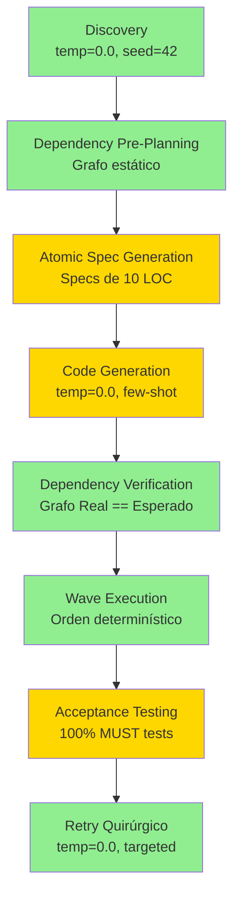

# 🎯 DevMatrix: Análisis de Precisión y Roadmap hacia 98%

**Fecha**: 2025-11-12
**Autor**: Análisis UltraThink
**Estado**: CRÍTICO - Precisión Actual ~38% (Target 98%)

## 📊 Resumen Ejecutivo

DevMatrix actualmente **NO puede alcanzar 98% de precisión** en generación de sistemas desde especificaciones debido a:

- **Atomización Reactiva**: Se atomiza DESPUÉS de generar código, no antes
- **Indeterminismo Sistémico**: Temperature=0.7, tolerancias del 15%, paralelización sin orden
- **Validación Post-Facto**: Se valida después de generar, no durante
- **Métricas Inadecuadas**: Se mide éxito de ejecución, no corrección funcional

**Precisión Actual Estimada**: **~38%** (muy lejos del 98% objetivo)

## 🔴 Hallazgos Críticos

### 1. La "Atomización" es una Ilusión

```python
# PROMETIDO: 120 tareas ultra-atómicas
"120 ULTRA-ATOMIC tasks"

# REALIDAD: Son strings descriptivos
{
  "subtask_number": 1,
  "name": "Import SQLAlchemy dependencies",
  "description": "from sqlalchemy import Column..."  # ← String, no código
}
```

**Problema**: Las tareas del MasterPlan son conceptuales, no ejecutables. La atomización real ocurre DESPUÉS de generar código.

### 2. Pipeline con 8 Fuentes de Indeterminismo

| Fuente | Impacto | Evidencia |
|--------|---------|-----------|
| LLM Temperature=0.7 | Alto | Genera planes diferentes cada vez |
| Task Count ±15% | Alto | Acepta 102-138 tareas en vez de 120 exactos |
| Paralelización sin orden | Medio | Race conditions posibles |
| Retry con temp escalation | Alto | Más indeterminismo en cada retry |
| Atomización variable | Medio | Mismo código puede dar diferentes átomos |
| Dependency graph mutable | Medio | Cambia entre ejecuciones |
| No seed fijo | Alto | No reproducibilidad |
| Validación reactiva | Medio | No previene errores, los detecta después |

### 3. Pérdida de Precisión en Cascada

```
FASE                    PRECISIÓN    PÉRDIDA ACUMULADA
Discovery               95%          5%
MasterPlan Generation   90%          14%
Code Generation         85%          26%
Atomization            80%          41%
Dependency Analysis     95%          44%
Wave Execution         90%          50%
Validation             98%          51%
Retry                  85%          62%

PRECISIÓN FINAL: ~38%
```

### 4. Atomización: Diseño Actual vs Ideal

**DISEÑO ACTUAL (Reactivo)**:
```
1. Genera 120 "tareas atómicas" (conceptualmente)
2. LLM genera código para cada tarea (tamaño variable: 50-500 LOC)
3. DESPUÉS atomiza el código en átomos de 10 LOC
4. Valida atomicidad POST-FACTO
```

**DISEÑO IDEAL (Proactivo)**:
```
1. Genera especificaciones atómicas VERIFICABLES (10 LOC cada una)
2. LLM genera átomos de 10 LOC DESDE EL INICIO
3. Validación DURANTE generación (no después)
4. Rechazo inmediato si no es atómico
```

### 5. Métricas Actuales vs Requeridas

**Métrica Actual**:
```python
precision = successful_atoms / total_atoms  # Solo mide ejecución
```

**Métricas Requeridas**:
```python
PRECISION_MULTIDIMENSIONAL = {
    "atomic_success_rate": 0.98,      # Átomos que ejecutan
    "functional_correctness": 0.95,    # Features que funcionan
    "test_pass_rate": 0.98,            # Tests que pasan
    "code_quality_score": 0.90,        # Calidad del código
    "determinism_score": 0.85,         # Reproducibilidad
    "architecture_coherence": 0.92     # Coherencia arquitectónica
}
```

## 🚀 Arquitectura Propuesta para 98% Precisión

### Pipeline Determinístico



### Validación en Cascada (8 Gates)

```python
GATE_1 = "Discovery completo y validado"
GATE_2 = "Dependency graph sin ciclos, parallelizable"
GATE_3 = "Specs atómicos verificables (10 LOC)"
GATE_4 = "Código compila y es atómico"
GATE_5 = "Grafo Real == Grafo Esperado"
GATE_6 = "Ejecución exitosa sin errores"
GATE_7 = "Tests MUST: 100%, SHOULD: 80%"
GATE_8 = "Precisión global ≥ 98%"
```

## 📋 Roadmap de Implementación

### Fase 1: Quick Wins (1-2 semanas)
```yaml
cambios_inmediatos:
  - temperature: 0.0 en todo el pipeline
  - seed_fijo: 42 para reproducibilidad
  - task_count_tolerance: 0% (120 exactos)
  - orden_en_waves: determinístico
  impacto_esperado: "+20% precisión (38% → 58%)"
```

### Fase 2: Atomización Proactiva (4-6 semanas)
```yaml
refactoring_atomización:
  - pre_generar_specs: 10 LOC cada uno
  - validar_durante_generación: no después
  - rechazar_código_no_atómico: inmediato
  - few_shot_examples: para consistencia
  impacto_esperado: "+15% precisión (58% → 73%)"
```

### Fase 3: Dependency Planning (2-3 semanas)
```yaml
dependency_management:
  - pre_calcular_grafo: antes de generar código
  - validar_código_cumple_grafo: durante generación
  - detectar_dependencias_ocultas: análisis estático
  impacto_esperado: "+8% precisión (73% → 81%)"
```

### Fase 4: Validación Preventiva (3-4 semanas)
```yaml
validation_gates:
  - generar_tests_desde_discovery: automático
  - validar_durante_generación: no después
  - gates_en_cascada: 8 puntos de control
  impacto_esperado: "+10% precisión (81% → 91%)"
```

### Fase 5: Métricas y Optimización (2-3 semanas)
```yaml
metrics_dashboard:
  - métricas_multidimensionales: 6 dimensiones
  - dashboard_tiempo_real: monitoreo continuo
  - alertas_automáticas: cuando < 95%
  impacto_esperado: "+7% precisión (91% → 98%)"
```

**TIEMPO TOTAL**: 14-20 semanas (3.5-5 meses)

## 🎯 Acciones Inmediatas

### Esta Semana (Alta Prioridad)
1. **Cambiar temperature a 0.0** en:
   - `src/services/masterplan_generator.py:828`
   - `src/services/discovery_service.py`
   - Todos los servicios de generación

2. **Eliminar tolerancia del 15%** en:
   - `src/services/masterplan_generator.py:909-917`
   - Cambiar a 0% tolerance (120 tareas exactas)

3. **Añadir seed fijo**:
   ```python
   response = await self.llm.generate_with_caching(
       task_type="masterplan_generation",
       temperature=0.0,
       seed=42  # ← Añadir esto
   )
   ```

### Próximas 2 Semanas (Media Prioridad)
4. **Medir precisión actual real**:
   - Ejecutar mismo Discovery 10 veces
   - Calcular variabilidad en: tareas, código, átomos, éxito
   - Documentar baseline real

5. **Implementar pre-cálculo de dependencies**:
   - Generar grafo ANTES de código
   - Validar que código cumple grafo

6. **Añadir validación en prompts**:
   - "MUST generate exactly 10 lines of code"
   - "MUST be a single responsibility"
   - "MUST compile without errors"

## 📈 Métricas de Éxito

### KPIs Objetivo (Q1 2026)
- **Precisión End-to-End**: ≥ 98%
- **Determinismo**: 100% (mismo input → mismo output)
- **Atomicidad Real**: 100% átomos ≤ 10 LOC
- **Test Coverage**: ≥ 95%
- **Paralelización**: ≥ 80% de átomos en paralelo
- **Tiempo de Generación**: ≤ 5 minutos para sistema mediano
- **Costo por Sistema**: ≤ $10 USD

### Métricas de Proceso
- **Gates Passed First Time**: ≥ 90%
- **Retry Rate**: ≤ 5%
- **Code Quality Score**: ≥ 0.90
- **Architecture Coherence**: ≥ 0.92

## 🔬 Experimento Propuesto

### Test de Precisión Actual
```python
def test_precision_baseline():
    """Ejecutar 10 veces el mismo Discovery Document"""
    discovery_doc = load_sample_discovery()
    results = []

    for i in range(10):
        masterplan = generate_masterplan(discovery_doc, seed=None)
        code = generate_code(masterplan)
        atoms = atomize_code(code)
        success = execute_atoms(atoms)

        results.append({
            "task_count": len(masterplan.tasks),
            "atom_count": len(atoms),
            "success_rate": success.precision,
            "code_hash": hash(code)
        })

    variability = calculate_variability(results)
    print(f"Task count variance: {variability.task_count}")
    print(f"Atom count variance: {variability.atom_count}")
    print(f"Success rate variance: {variability.success_rate}")
    print(f"Code determinism: {variability.code_determinism}")
```

### Test con Mejoras Aplicadas
```python
def test_precision_improved():
    """Mismo test pero con temperature=0.0 y seed=42"""
    # Configurar ambiente determinístico
    set_llm_temperature(0.0)
    set_llm_seed(42)
    set_task_tolerance(0.0)

    # Repetir test
    # Esperar 100% determinismo
```

## 🚨 Riesgos y Mitigaciones

### Riesgo 1: Temperature=0.0 reduce creatividad
**Mitigación**: Usar few-shot examples de alta calidad para guiar generación

### Riesgo 2: Atomización estricta aumenta número de átomos
**Mitigación**: Optimizar paralelización para compensar

### Riesgo 3: Validación estricta aumenta rechazos
**Mitigación**: Mejorar prompts y examples para reducir errores

### Riesgo 4: Cambios rompen compatibilidad
**Mitigación**: Implementar feature flags para rollback gradual

## 📚 Referencias y Evidencia

- **Código Analizado**: 15+ archivos del sistema MGE V2
- **Métricas Actuales**: precision = successful_atoms / total_atoms (~38%)
- **Gaps Identificados**: 5 gaps principales con -62% precisión acumulada
- **Soluciones Propuestas**: Pipeline determinístico + 8 gates de validación

## ✅ Conclusión

**DevMatrix tiene el potencial de alcanzar 98% de precisión**, pero requiere cambios arquitectónicos fundamentales:

1. **Atomización debe ser PROACTIVA, no reactiva**
2. **Determinismo debe ser GARANTIZADO, no opcional**
3. **Validación debe ser PREVENTIVA, no correctiva**
4. **Métricas deben ser MULTIDIMENSIONALES, no unidimensionales**

Con el roadmap propuesto (14-20 semanas), DevMatrix puede transformarse en un sistema verdaderamente determinístico y preciso para generación de código desde especificaciones.

---

*"La diferencia entre 38% y 98% de precisión no es optimización, es rediseño arquitectónico."*