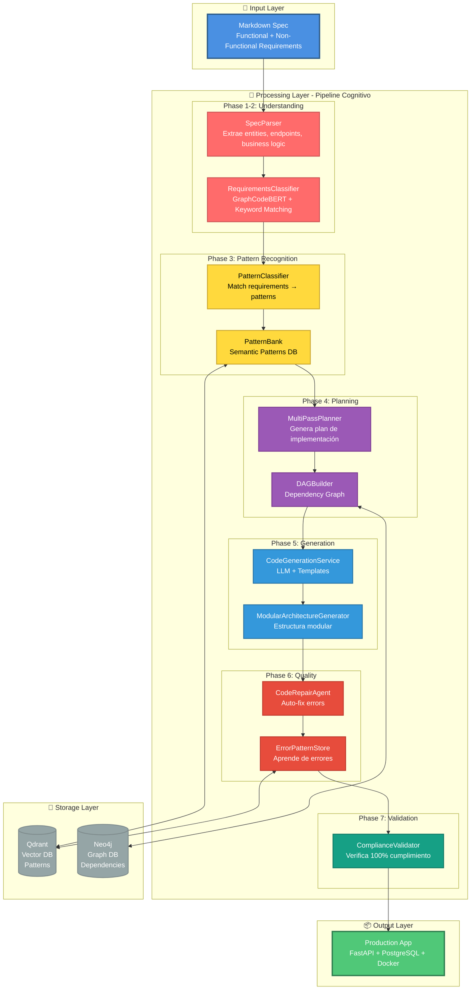
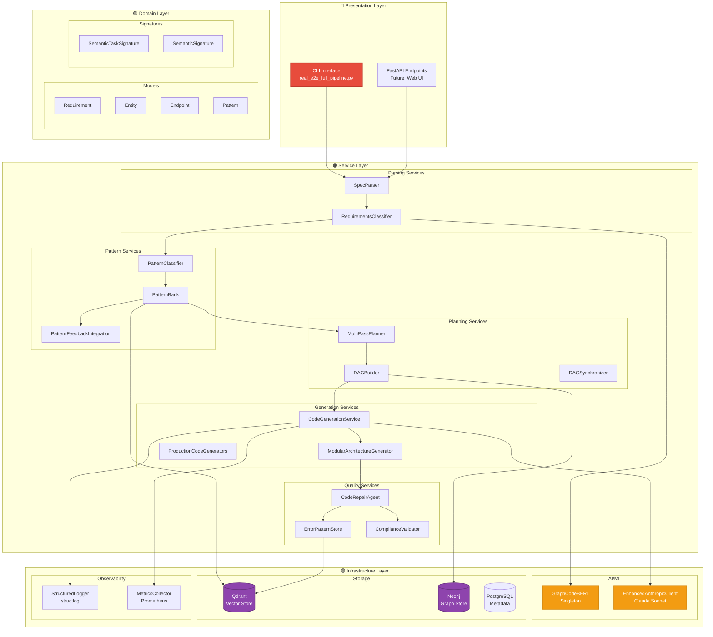

# Arquitectura Completa de DevMatrix

## 📋 Índice

1. [Visión General](#visión-general)
2. [Arquitectura de Sistema](#arquitectura-de-sistema)
3. [Componentes Principales](#componentes-principales)
4. [Flujo de Datos](#flujo-de-datos)
5. [Tecnologías](#tecnologías)

---

## Visión General

**DevMatrix** es un sistema de generación automática de código production-ready que transforma especificaciones en markdown a aplicaciones completas usando un pipeline cognitivo de 7 fases.

### Características Clave

- 🧠 **Cognitivo**: Usa GraphCodeBERT para clasificación semántica
- 📚 **Aprendizaje**: Pattern Bank que mejora con el tiempo
- 🔄 **Autorreparación**: Code Repair automático con feedback loops
- ✅ **Validación**: 100% compliance con la spec original
- 🚀 **Production-Ready**: Apps listas para producción desde el primer momento

### Arquitectura de Alto Nivel



---

## Arquitectura de Sistema

### Capas del Sistema



---

## Componentes Principales

### 1. SpecParser
**Archivo:** `src/parsing/spec_parser.py`

**Responsabilidades:**
- Parsear markdown specs con estructura flexible
- Extraer entities con fields, types, constraints
- Identificar endpoints (method, path, params)
- Detectar business logic y validaciones

**Output Example:**
```python
Entity(
    name="Product",
    fields=[
        Field(name="id", type="UUID", primary_key=True),
        Field(name="price", type="Decimal", constraints=["gt=0"])
    ]
)
```

### 2. RequirementsClassifier
**Archivo:** `src/classification/requirements_classifier.py`

**Enfoque Híbrido:**
1. Keyword matching (baseline rápido)
2. GraphCodeBERT embeddings (semantic)
3. Domain templates (CRUD, Auth, Payment, etc.)

**Performance:** 90%+ accuracy, ~5s processing

### 3. PatternBank
**Archivo:** `src/cognitive/patterns/pattern_bank.py`

**Categories:**
- Production (database, config, logging)
- Testing (pytest, fixtures, integration)
- Security (sanitization, rate limiting)
- Observability (metrics, health checks)

**Storage:** Qdrant vector DB

### 4. CodeGenerationService
**Archivo:** `src/services/code_generation_service.py`

**Estrategia:**
- Templates Jinja2 para estructura
- Claude LLM para lógica compleja
- Production generators (hardcoded) para calidad

**Features:**
- Retry logic exponential backoff
- Token usage tracking
- Code validation

---

## Flujo de Datos

```mermaid
sequenceDiagram
    participant USER as Usuario
    participant SP as SpecParser
    participant RC as RequirementsClassifier
    participant PB as PatternBank
    participant CG as CodeGenerationService
    participant CR as CodeRepairAgent
    participant CV as ComplianceValidator

    USER->>SP: spec.md
    SP->>SP: Extract entities/endpoints
    SP-->>RC: SpecRequirements

    RC->>RC: Classify (GraphCodeBERT)
    RC-->>PB: Classified Requirements

    PB->>PB: Match patterns (Qdrant)
    PB-->>CG: Matched Patterns

    CG->>CG: Generate code (LLM)
    CG-->>CR: Generated Files

    CR->>CR: Run tests & repair
    CR-->>CV: Repaired Code

    CV->>CV: Validate compliance
    CV-->>USER: ✅ Production App

    style SP fill:#FF6B6B,stroke:#CC5555,color:#FFFFFF
    style RC fill:#FFD93D,stroke:#CCA830,color:#000000
    style PB fill:#9B59B6,stroke:#7D3C92,color:#FFFFFF
    style CG fill:#3498DB,stroke:#2874A6,color:#FFFFFF
    style CR fill:#E74C3C,stroke:#C0392B,color:#FFFFFF
    style CV fill:#16A085,stroke:#117A65,color:#FFFFFF
```

---

## Tecnologías

| Layer | Tecnología | Uso |
|-------|------------|-----|
| **AI/ML** | GraphCodeBERT | Embeddings semánticos |
| **AI/ML** | Claude Sonnet 4.5 | Generación de código |
| **Storage** | Qdrant | Vector DB patterns |
| **Storage** | Neo4j | Dependency graphs |
| **Framework** | FastAPI | Apps generadas |
| **ORM** | SQLAlchemy async | Database access |
| **Testing** | pytest | Unit + integration |
| **Observability** | structlog + Prometheus | Logging + metrics |

---

**Continuar leyendo:** [02_Pipeline_Flow.md](02_Pipeline_Flow.md)
