# Pipeline Flow - 7 Fases Detalladas

## 📋 Índice

1. [Overview del Pipeline](#overview-del-pipeline)
2. [Phase 1: Spec Ingestion](#phase-1-spec-ingestion)
3. [Phase 2: Requirements Analysis](#phase-2-requirements-analysis)
4. [Phase 3: Pattern Matching](#phase-3-pattern-matching)
5. [Phase 4: Code Planning](#phase-4-code-planning)
6. [Phase 5: Code Generation](#phase-5-code-generation)
7. [Phase 6: Code Repair](#phase-6-code-repair)
8. [Phase 7: Compliance Validation](#phase-7-compliance-validation)
9. [Métricas por Fase](#métricas-por-fase)

---

## Overview del Pipeline


**Tiempo Total:** ~1-2 minutos para app production-ready completa

---

## Phase 1: Spec Ingestion

### Objetivo
Parsear y estructurar la especificación markdown en componentes procesables.

### Proceso Detallado


### Ejemplo de Extracción

**Input Markdown:**
```markdown
## 2. Domain Model

1. **Product**
   - id (UUID)
   - name (string, required)
   - price (decimal, required, > 0)
   - stock (int, required, >= 0)
   - is_active (bool, default true)

**F1. Create product**
API must allow creating products with `name`, `description`, `price`, `stock`, and `is_active`.
```

**Output Estructurado:**
```python
# Entity extraída
Entity(
    name="Product",
    fields=[
        Field(name="id", type="UUID", primary_key=True),
        Field(name="name", type="str", required=True),
        Field(name="price", type="Decimal", required=True, constraints=["gt=0"]),
        Field(name="stock", type="int", required=True, constraints=["ge=0"]),
        Field(name="is_active", type="bool", default="true")
    ]
)

# Requirement extraído
Requirement(
    id="F1",
    type="functional",
    priority="MUST",
    description="Create product - API must allow creating products..."
)
```

### Checkpoints (CP)

| Checkpoint | Descripción | Datos |
|------------|-------------|-------|
| **CP-1.1** | Spec loaded from file | `file_size`, `lines` |
| **CP-1.2** | Requirements extracted | `functional: 17`, `entities: 5`, `endpoints: 17` |
| **CP-1.3** | Context loaded | `business_logic: 8` |
| **CP-1.4** | Complexity assessed | `complexity: 0.45` |

### Métricas
- ⏱️ **Tiempo:** ~2s
- 📊 **Extracted:** 17 functional reqs, 5 entities, 17 endpoints
- ✅ **Success Rate:** 100%

---

## Phase 2: Requirements Analysis

### Objetivo
Clasificar requirements por domain, priority, risk usando **clasificación semántica híbrida**.

### Proceso Detallado



```mermaid
graph TB
    subgraph "📥 Input"
        REQS[Requirements<br/>from Phase 1]
    end

    subgraph "🧠 RequirementsClassifier"
        direction TB

        subgraph "Hybrid Classification"
            KW[Keyword Matching<br/>Fast baseline]
            EMB[GraphCodeBERT<br/>Semantic embeddings]
            TMPL[Domain Templates<br/>CRUD, Auth, Payment]
        end

        COMBINE[Combine Scores<br/>Weighted average]

        subgraph "Classification Output"
            DOM[Domain<br/>CRUD, Payment, Workflow]
            PRI[Priority<br/>MUST, SHOULD, COULD]
            RISK[Risk Level<br/>low, medium, high]
        end

        DAG[Build Dependency DAG<br/>Requirement relationships]
    end

    subgraph "📊 Output"
        CLASS[Classified Requirements<br/>+ Dependency Graph]
    end

    REQS --> KW
    REQS --> EMB
    REQS --> TMPL

    KW --> COMBINE
    EMB --> COMBINE
    TMPL --> COMBINE

    COMBINE --> DOM
    COMBINE --> PRI
    COMBINE --> RISK

    DOM --> DAG
    PRI --> DAG
    RISK --> DAG

    DAG --> CLASS

    style REQS fill:#4A90E2,stroke:#2E5C8A,color:#FFFFFF,stroke-width:3px
    style CLASS fill:#50C878,stroke:#2E7D4E,color:#FFFFFF,stroke-width:3px
    style KW fill:#FFD93D,stroke:#CCA830,color:#000000,stroke-width:2px
    style EMB fill:#9B59B6,stroke:#7D3C92,color:#FFFFFF,stroke-width:2px
    style TMPL fill:#3498DB,stroke:#2874A6,color:#FFFFFF,stroke-width:2px
```

### Clasificación Híbrida

#### 1. Keyword Matching (Rápido)
```python
CRUD_KEYWORDS = ["create", "list", "get", "update", "delete"]
AUTH_KEYWORDS = ["login", "register", "user", "password"]
PAYMENT_KEYWORDS = ["checkout", "payment", "order", "total"]
```

#### 2. GraphCodeBERT Embeddings (Preciso)
```python
# Embedding del requirement
req_embedding = graphcodebert.encode("Create product with validation")

# Búsqueda semántica en templates
templates = get_domain_templates()
similarities = cosine_similarity(req_embedding, template_embeddings)

# Top match
domain = templates[argmax(similarities)].domain
```

#### 3. Domain Templates
```python
TEMPLATES = {
    "crud": ["Entity management with CRUD operations"],
    "authentication": ["User registration and login flow"],
    "payment": ["Order processing and payment simulation"],
    "workflow": ["Multi-step business process with state"]
}
```

### Ejemplo de Clasificación

**Requirement:** "F13. Checkout cart - Create an Order from the OPEN cart"

**Classification:**
```python
ClassifiedRequirement(
    id="F13",
    domain="payment",        # High similarity con payment template
    priority="MUST",         # Keyword "Create" en functional req
    risk="high",            # Payment operations = high risk
    complexity=0.8,         # Multi-entity, state changes, validation
    dependencies=["F8", "F9", "F10"]  # Depende de cart operations
)
```

### Dependency Graph


### Checkpoints (CP)

| Checkpoint | Descripción | Datos |
|------------|-------------|-------|
| **CP-2.1** | GraphCodeBERT loaded | `model_size`, `device` |
| **CP-2.2** | Requirements classified | `functional: 17`, `domains: 4` |
| **CP-2.3** | Dependency graph built | `nodes: 17`, `edges: 15` |
| **CP-2.4** | DAG validated | `acyclic: true`, `topological_order: valid` |

### Métricas
- ⏱️ **Tiempo:** ~5s
- 🎯 **Accuracy:** 90%+ (vs 42% keyword-only)
- 📊 **Domain Distribution:** CRUD 53%, Payment 24%, Workflow 18%, Auth 5%
- ✅ **DAG Valid:** Acyclic, topologically sortable

---

## Phase 3: Pattern Matching

### Objetivo
Encontrar patterns reutilizables en PatternBank que matcheen con los requirements.

### Proceso Detallado


### Pattern Categories

#### Production Patterns
```python
{
    "database": [
        "sqlalchemy_async_setup",
        "alembic_migrations",
        "connection_pooling"
    ],
    "config": [
        "pydantic_settings",
        "env_management",
        "multi_environment"
    ],
    "logging": [
        "structlog_setup",
        "request_id_tracking",
        "log_levels"
    ]
}
```

#### Testing Patterns
```python
{
    "unit_tests": [
        "pytest_fixtures",
        "model_validation_tests",
        "service_layer_tests"
    ],
    "integration_tests": [
        "api_endpoint_tests",
        "database_integration",
        "full_flow_tests"
    ]
}
```

### Semantic Search Process

```python
# 1. Generar embedding del requirement
req_text = "Create product with price validation"
req_embedding = graphcodebert.encode(req_text)

# 2. Búsqueda en Qdrant
results = qdrant_client.search(
    collection="semantic_patterns",
    query_vector=req_embedding,
    limit=5,
    score_threshold=0.7
)

# 3. Patterns encontrados
matched_patterns = [
    Pattern(name="pydantic_field_validation", score=0.92),
    Pattern(name="decimal_precision", score=0.87),
    Pattern(name="constraint_validation", score=0.85)
]
```

### Composition Order

Orden correcto de aplicación de patterns:


### Checkpoints

| Checkpoint | Descripción | Datos |
|------------|-------------|-------|
| **CP-3.1** | Pattern search started | `requirements: 17` |
| **CP-3.2** | Patterns matched | `matched: 42`, `avg_score: 0.85` |
| **CP-3.3** | Composition order determined | `layers: 8` |

### Métricas
- ⏱️ **Tiempo:** ~3s
- 🎯 **Patterns Matched:** 42 patterns
- 📊 **Categories:** Production 18, Testing 12, Security 8, Observability 4
- ✅ **Avg Score:** 0.85 (threshold: 0.7)

---

## Phase 4: Code Planning

### Objetivo
Generar un plan de implementación estructurado (MasterPlan) con todas las tareas y dependencias.

### Multi-Pass Planning Strategy

```mermaid
graph TB
    subgraph "📥 Input"
        PATTERNS[Matched Patterns<br/>+ Requirements]
    end

    subgraph "🎯 MultiPassPlanner"
        direction TB

        PASS1[Pass 1: Core Architecture<br/>Entities, schemas, database]
        PASS2[Pass 2: Business Logic<br/>Services, repositories, routes]
        PASS3[Pass 3: Infrastructure<br/>Config, logging, middleware]
        PASS4[Pass 4: Quality<br/>Tests, migrations, docker]

        PASS1 --> PASS2
        PASS2 --> PASS3
        PASS3 --> PASS4
    end

    subgraph "🔗 DAGBuilder"
        BUILD[Build Dependency Graph<br/>Task relationships]
        VALIDATE[Validate DAG<br/>Detect cycles]
        TOPO[Topological Sort<br/>Execution order]
    end

    subgraph "📊 Output"
        PLAN[MasterPlan<br/>Tasks + Dependencies + Order]
    end

    PATTERNS --> PASS1
    PASS4 --> BUILD
    BUILD --> VALIDATE
    VALIDATE --> TOPO
    TOPO --> PLAN

    style PATTERNS fill:#4A90E2,stroke:#2E5C8A,color:#FFFFFF,stroke-width:3px
    style PLAN fill:#50C878,stroke:#2E7D4E,color:#FFFFFF,stroke-width:3px
    style PASS1 fill:#3498DB,stroke:#2874A6,color:#FFFFFF,stroke-width:2px
    style PASS2 fill:#9B59B6,stroke:#7D3C92,color:#FFFFFF,stroke-width:2px
    style PASS3 fill:#E67E22,stroke:#CA6F1E,color:#FFFFFF,stroke-width:2px
    style PASS4 fill:#27AE60,stroke:#1E8449,color:#FFFFFF,stroke-width:2px
```



### Pass 1: Core Architecture

**Tasks generadas:**
```python
[
    Task(name="Generate src/models/entities.py", deps=[]),
    Task(name="Generate src/models/schemas.py", deps=[]),
    Task(name="Generate src/core/database.py", deps=[]),
    Task(name="Generate alembic/versions/001_initial.py", deps=["entities.py"])
]
```

### Pass 2: Business Logic

**Tasks generadas:**
```python
[
    Task(name="Generate src/repositories/product_repository.py",
         deps=["entities.py", "database.py"]),
    Task(name="Generate src/services/product_service.py",
         deps=["product_repository.py", "schemas.py"]),
    Task(name="Generate src/api/routes/product.py",
         deps=["product_service.py"])
]
```

### Dependency Graph Example


### Checkpoints

| Checkpoint | Descripción | Datos |
|------------|-------------|-------|
| **CP-4.1** | Pass 1 completed | `tasks: 8` |
| **CP-4.2** | Pass 2 completed | `tasks: 24` |
| **CP-4.3** | Pass 3 completed | `tasks: 12` |
| **CP-4.4** | DAG built and validated | `total_tasks: 52`, `edges: 78` |

### Métricas
- ⏱️ **Tiempo:** ~4s
- 📊 **Total Tasks:** 52
- 🔗 **Dependencies:** 78 edges
- ✅ **DAG Valid:** True (acyclic)

---

## Phase 5: Code Generation

### Objetivo
Generar código real para cada task del MasterPlan usando LLM + Templates.

### Proceso Detallado


### Strategy Selection

```python
def select_generation_strategy(task):
    if task.category == "config":
        return "template"  # Config files son estructurados
    elif task.category == "models":
        return "hardcoded"  # Entities necesitan calidad máxima
    elif task.category == "services":
        return "llm"  # Business logic es compleja
    elif task.category == "tests":
        return "hardcoded"  # Tests requieren patterns específicos
```

### Example: Generate entities.py

**Using Hardcoded Generator:**
```python
from src.services.production_code_generators import generate_entities

code = generate_entities(
    entities=[
        Entity(name="Product", fields=[...]),
        Entity(name="Customer", fields=[...])
    ],
    use_async=True,
    include_timestamps=True
)
```

**Generated Code:**
```python
from sqlalchemy.ext.asyncio import AsyncAttrs
from sqlalchemy.orm import DeclarativeBase, Mapped, mapped_column
from sqlalchemy import String, Numeric, Integer, Boolean
from datetime import datetime
from uuid import UUID, uuid4

class Base(AsyncAttrs, DeclarativeBase):
    pass

class Product(Base):
    __tablename__ = "products"

    id: Mapped[UUID] = mapped_column(primary_key=True, default=uuid4)
    name: Mapped[str] = mapped_column(String(255), nullable=False)
    price: Mapped[Decimal] = mapped_column(Numeric(10, 2), nullable=False)
    stock: Mapped[int] = mapped_column(Integer, nullable=False, default=0)
    is_active: Mapped[bool] = mapped_column(Boolean, default=True)
    created_at: Mapped[datetime] = mapped_column(default=datetime.utcnow)
```

### LLM Prompt Example

**For service method:**
```
Generate a Python async method for ProductService that creates a new product.

Requirements:
- Validate price > 0
- Validate stock >= 0
- Check for duplicate names
- Return ProductResponse schema
- Handle database errors with proper exceptions

Context:
- Using SQLAlchemy async
- Repository: ProductRepository
- Schema: ProductCreate, ProductResponse
```

### Checkpoints

| Checkpoint | Descripción | Datos |
|------------|-------------|-------|
| **CP-5.1** | Generation started | `tasks: 52` |
| **CP-5.2** | Core files generated | `entities, schemas, config: 8 files` |
| **CP-5.3** | Business logic generated | `services, repositories, routes: 24 files` |
| **CP-5.4** | Infrastructure generated | `logging, middleware, docker: 12 files` |
| **CP-5.5** | Tests generated | `unit + integration: 8 files` |

### Métricas
- ⏱️ **Tiempo:** ~30-60s
- 📊 **Files Generated:** 52 files
- 📝 **Lines of Code:** ~5000 LOC
- 🔄 **Retries:** ~3-5 retries total
- ✅ **Success Rate:** 94% (49/52 on first try)

---

## Phase 6: Code Repair

### Objetivo
Ejecutar tests, detectar errores, y repararlos automáticamente.

### Proceso Detallado


### Error Detection Example

**Test Output:**
```python
FAILED tests/unit/test_services.py::test_create_product_invalid_price
AssertionError: Product creation should fail with price=0

src/services/product_service.py:25: in create_product
    if product_data.price <= 0:
TypeError: '<=' not supported between Decimal and int
```

**Context Extraction:**
```python
error_context = {
    "file": "src/services/product_service.py",
    "line": 25,
    "error_type": "TypeError",
    "code_snippet": "if product_data.price <= 0:",
    "fix_needed": "Decimal comparison requires Decimal(0)"
}
```

### Fix Generation

**Search ErrorPatternStore:**
```python
# Búsqueda semántica en errores pasados
similar_errors = error_pattern_store.find_similar(
    error_text="Decimal comparison TypeError",
    threshold=0.8
)

if similar_errors:
    # Aplicar fix conocido
    fix = similar_errors[0].solution
else:
    # Generar fix con LLM
    fix = llm.generate_fix(error_context)
```

**Generated Fix:**
```python
# Before
if product_data.price <= 0:
    raise ValueError("Price must be greater than 0")

# After
if product_data.price <= Decimal("0"):
    raise ValueError("Price must be greater than 0")
```

### Learning Loop

```python
# Después de fix exitoso, almacenar pattern
success_pattern = SuccessPattern(
    error_type="decimal_comparison",
    context="Comparing Decimal with int",
    solution="Use Decimal('0') for comparison",
    embedding=graphcodebert.encode(error_context)
)

error_pattern_store.store(success_pattern)
# → Disponible para futuros repairs
```

### Checkpoints

| Checkpoint | Descripción | Datos |
|------------|-------------|-------|
| **CP-6.1** | Initial test run | `total: 45`, `failed: 5` |
| **CP-6.2** | Errors analyzed | `patterns_found: 3`, `new: 2` |
| **CP-6.3** | Fixes applied | `files_modified: 4` |
| **CP-6.4** | Tests re-run | `passing: 45/45` |
| **CP-6.5** | Patterns stored | `new_patterns: 2` |

### Métricas
- ⏱️ **Tiempo:** ~10-20s
- 🔧 **Errors Found:** 5
- ✅ **Fixes Applied:** 4 (1 manual review)
- 📚 **Patterns Stored:** 2 nuevos
- ✅ **Final Success:** 100% tests passing

---

## Phase 7: Compliance Validation

### Objetivo
Validar que el código generado cumple 100% con la especificación original.

### Proceso Detallado



```mermaid
graph TB
    subgraph "📥 Input"
        CODE[Repaired Code]
        SPEC[Original Spec]
    end

    subgraph "✅ ComplianceValidator"
        direction TB

        subgraph "Structural Validation"
            FILES[Check Files Exist<br/>All expected files present]
            IMPORTS[Validate Imports<br/>No missing dependencies]
        end

        subgraph "Semantic Validation"
            ENTITIES[Verify Entities<br/>All fields implemented]
            ENDPOINTS[Verify Endpoints<br/>All routes present]
            LOGIC[Verify Business Logic<br/>Validations implemented]
        end

        subgraph "Functional Validation"
            TESTS[Run All Tests<br/>Unit + Integration]
            COVERAGE[Check Coverage<br/>80%+ required]
        end

        COMPARE[Compare Spec vs Code<br/>Requirement mapping]
        REPORT[Generate Report<br/>Coverage + Missing]
    end

    subgraph "📊 Output"
        RESULT[ComplianceResult<br/>100% compliant]
    end

    CODE --> FILES
    CODE --> IMPORTS
    SPEC --> COMPARE

    FILES --> ENTITIES
    IMPORTS --> ENDPOINTS

    ENTITIES --> LOGIC
    ENDPOINTS --> LOGIC

    LOGIC --> TESTS
    TESTS --> COVERAGE

    COVERAGE --> COMPARE
    COMPARE --> REPORT
    REPORT --> RESULT

    style CODE fill:#4A90E2,stroke:#2E5C8A,color:#FFFFFF,stroke-width:3px
    style SPEC fill:#4A90E2,stroke:#2E5C8A,color:#FFFFFF,stroke-width:3px
    style RESULT fill:#50C878,stroke:#2E7D4E,color:#FFFFFF,stroke-width:3px
    style FILES fill:#3498DB,stroke:#2874A6,color:#FFFFFF,stroke-width:2px
    style ENTITIES fill:#9B59B6,stroke:#7D3C92,color:#FFFFFF,stroke-width:2px
    style TESTS fill:#27AE60,stroke:#1E8449,color:#FFFFFF,stroke-width:2px
```

### Validation Checks

#### 1. Structural Validation
```python
required_files = [
    "src/models/entities.py",
    "src/models/schemas.py",
    "src/core/config.py",
    "src/core/database.py",
    "src/api/routes/product.py",
    ...
]

for file in required_files:
    assert os.path.exists(file), f"Missing: {file}"
```

#### 2. Semantic Validation
```python
# Verificar que Product entity tenga todos los campos
spec_entity = spec_requirements.get_entity("Product")
code_entity = parse_entity_from_file("src/models/entities.py", "Product")

for field in spec_entity.fields:
    assert field.name in code_entity.fields, f"Missing field: {field.name}"
    assert code_entity.fields[field.name].type == field.type
```

#### 3. Endpoint Validation
```python
# Verificar que existan todos los endpoints
spec_endpoints = [
    "POST /api/v1/products",
    "GET /api/v1/products",
    "GET /api/v1/products/{id}",
    ...
]

for endpoint in spec_endpoints:
    method, path = endpoint.split(" ")
    assert route_exists(code, method, path), f"Missing: {endpoint}"
```

#### 4. Business Logic Validation
```python
# Verificar validación: price > 0
assert "price" in validation_rules["Product"]
assert validation_rules["Product"]["price"].constraint == "gt=0"

# Verificar workflow: checkout deducta stock
checkout_code = get_function_code("order_service.py", "checkout_cart")
assert "product.stock -=" in checkout_code
```

### Requirement Mapping

```mermaid
graph LR
    subgraph "Spec Requirements"
        F1[F1: Create Product]
        F2[F2: List Products]
        F13[F13: Checkout Cart]
    end

    subgraph "Code Implementation"
        R1[POST /products<br/>+ ProductService.create]
        R2[GET /products<br/>+ ProductService.list]
        R13[POST /cart/checkout<br/>+ OrderService.checkout]
    end

    F1 -.->|✅ Implemented| R1
    F2 -.->|✅ Implemented| R2
    F13 -.->|✅ Implemented| R13

    style F1 fill:#3498DB,stroke:#2874A6,color:#FFFFFF,stroke-width:2px
    style F2 fill:#3498DB,stroke:#2874A6,color:#FFFFFF,stroke-width:2px
    style F13 fill:#E74C3C,stroke:#C0392B,color:#FFFFFF,stroke-width:2px
    style R1 fill:#27AE60,stroke:#1E8449,color:#FFFFFF,stroke-width:2px
    style R2 fill:#27AE60,stroke:#1E8449,color:#FFFFFF,stroke-width:2px
    style R13 fill:#27AE60,stroke:#1E8449,color:#FFFFFF,stroke-width:2px
```



### Compliance Report

```json
{
  "compliant": true,
  "coverage": 1.0,
  "requirements": {
    "total": 17,
    "implemented": 17,
    "missing": []
  },
  "entities": {
    "total": 5,
    "implemented": 5,
    "fields_coverage": 1.0
  },
  "endpoints": {
    "total": 17,
    "implemented": 17
  },
  "tests": {
    "total": 45,
    "passing": 45,
    "coverage": 0.82
  },
  "quality_score": 0.95
}
```

### Checkpoints

| Checkpoint | Descripción | Datos |
|------------|-------------|-------|
| **CP-7.1** | Structural validation | `files: 52/52` |
| **CP-7.2** | Semantic validation | `entities: 5/5`, `endpoints: 17/17` |
| **CP-7.3** | Functional validation | `tests: 45/45 passing` |
| **CP-7.4** | Compliance report | `compliant: true`, `coverage: 100%` |

### Métricas
- ⏱️ **Tiempo:** ~5s
- ✅ **Structural:** 100% (52/52 files)
- ✅ **Semantic:** 100% (17/17 requirements)
- ✅ **Functional:** 100% (45/45 tests)
- 🎯 **Overall:** 100% compliant

---

## Métricas por Fase

### Resumen de Performance

| Phase | Tiempo | Success Rate | Output |
|-------|--------|--------------|--------|
| **1. Spec Ingestion** | ~2s | 100% | 17 requirements, 5 entities |
| **2. Requirements Analysis** | ~5s | 90%+ accuracy | Classified + DAG |
| **3. Pattern Matching** | ~3s | 85% avg score | 42 patterns |
| **4. Code Planning** | ~4s | 100% | 52 tasks, DAG valid |
| **5. Code Generation** | ~30-60s | 94% | 52 files, 5000 LOC |
| **6. Code Repair** | ~10-20s | 100% | All tests passing |
| **7. Compliance** | ~5s | 100% | Full compliance |
| **TOTAL** | **~1-2 min** | **100%** | **Production-ready app** |

### Quality Metrics


---

**Continuar leyendo:**
- [03_Cognitive_Components.md](03_Cognitive_Components.md) - Deep dive en componentes
- [04_Generated_App_Architecture.md](04_Generated_App_Architecture.md) - Arquitectura de apps generadas
