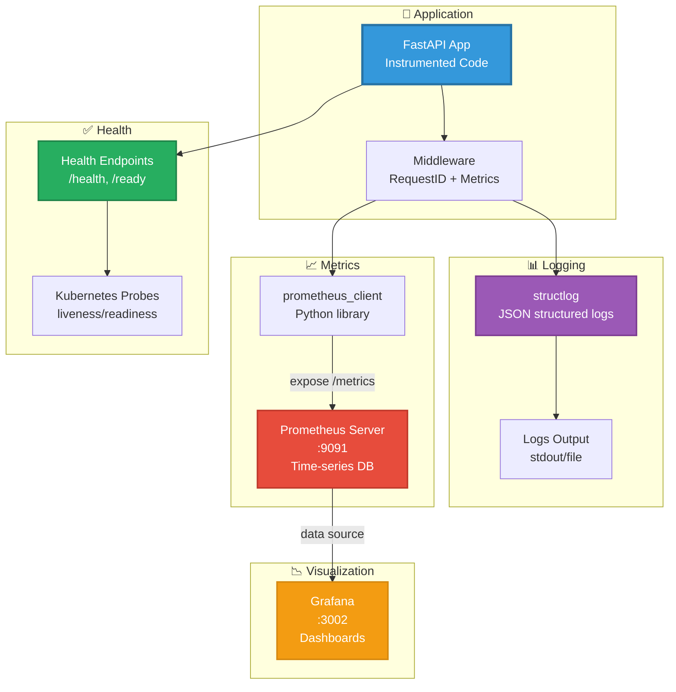
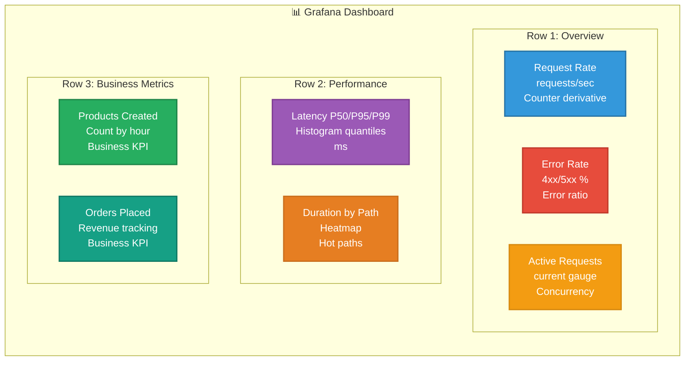
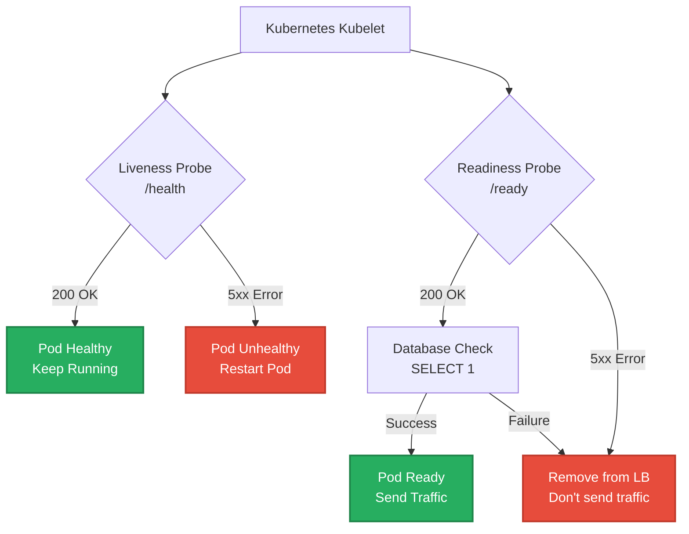

# Stack de Observabilidad

## 📋 Índice

1. [Overview](#overview)
2. [Structured Logging](#structured-logging)
3. [Metrics (Prometheus)](#metrics-prometheus)
4. [Dashboards (Grafana)](#dashboards-grafana)
5. [Health Checks](#health-checks)
6. [Request Tracing](#request-tracing)

---

## Overview

Las apps generadas incluyen **observabilidad completa** out-of-the-box:



---

## Structured Logging

### Setup (structlog)

**Archivo:** `src/core/logging.py`

```python
import structlog
import logging

def setup_logging(log_level: str = "INFO"):
    logging.basicConfig(
        format="%(message)s",
        stream=sys.stdout,
        level=log_level
    )

    structlog.configure(
        processors=[
            structlog.contextvars.merge_contextvars,
            structlog.stdlib.add_log_level,
            structlog.stdlib.add_logger_name,
            structlog.processors.TimeStamper(fmt="iso"),
            structlog.processors.StackInfoRenderer(),
            structlog.processors.format_exc_info,
            structlog.processors.JSONRenderer()
        ],
        wrapper_class=structlog.stdlib.BoundLogger,
        context_class=dict,
        logger_factory=structlog.stdlib.LoggerFactory(),
        cache_logger_on_first_use=True
    )
```

### Uso en Código

```python
import structlog

logger = structlog.get_logger(__name__)

# Log con contexto
logger.info(
    "product_created",
    product_id=product.id,
    product_name=product.name,
    price=float(product.price),
    user_id=request.state.user_id
)

# Log de error
try:
    result = await service.checkout_cart(cart_id)
except InsufficientStockError as e:
    logger.error(
        "checkout_failed",
        cart_id=cart_id,
        error=str(e),
        exc_info=True
    )
    raise
```

### Output Example

```json
{
  "event": "product_created",
  "product_id": "550e8400-e29b-41d4-a716-446655440000",
  "product_name": "Laptop",
  "price": 999.99,
  "user_id": "admin",
  "request_id": "7c9e6679-7425-40de-944b-e07fc1f90ae7",
  "timestamp": "2025-11-21T14:32:15.123456Z",
  "level": "info",
  "logger": "services.product_service"
}
```

### Request ID Tracking

```mermaid
sequenceDiagram
    participant Client
    participant MW as RequestIDMiddleware
    participant Route
    participant Service
    participant LOG as structlog

    Client->>MW: Request (no X-Request-ID)
    MW->>MW: Generate UUID<br/>7c9e6679-7425-...

    MW->>LOG: Bind request_id to context
    LOG->>LOG: contextvars.bind(request_id=...)

    MW->>Route: request.state.request_id
    Route->>Service: Business logic

    Service->>LOG: logger.info("action")
    LOG->>LOG: Auto-include request_id

    Service-->>Route: Response
    Route-->>MW: Response
    MW->>MW: Add X-Request-ID header
    MW-->>Client: Response + X-Request-ID

    style MW fill:#E74C3C,stroke:#C0392B,color:#FFFFFF,stroke-width:2px
    style LOG fill:#9B59B6,stroke:#7D3C92,color:#FFFFFF,stroke-width:2px
```

---

## Metrics (Prometheus)

### Middleware de Métricas

**Archivo:** `src/core/middleware.py`

```python
from prometheus_client import Counter, Histogram, Gauge

# Métricas definidas
REQUEST_COUNT = Counter(
    'http_requests_total',
    'Total HTTP requests',
    ['method', 'path', 'status']
)

REQUEST_DURATION = Histogram(
    'http_request_duration_seconds',
    'HTTP request duration',
    ['method', 'path', 'status']
)

ACTIVE_REQUESTS = Gauge(
    'http_requests_active',
    'Active HTTP requests'
)

class MetricsMiddleware(BaseHTTPMiddleware):
    async def dispatch(self, request: Request, call_next):
        ACTIVE_REQUESTS.inc()
        start_time = time.time()

        try:
            response = await call_next(request)

            duration = time.time() - start_time
            REQUEST_DURATION.labels(
                method=request.method,
                path=request.url.path,
                status=response.status_code
            ).observe(duration)

            REQUEST_COUNT.labels(
                method=request.method,
                path=request.url.path,
                status=response.status_code
            ).inc()

            return response

        finally:
            ACTIVE_REQUESTS.dec()
```

### Métricas Expuestas

**Endpoint:** `GET /metrics/metrics`

```prometheus
# HELP http_requests_total Total HTTP requests
# TYPE http_requests_total counter
http_requests_total{method="POST",path="/api/v1/products",status="201"} 150

# HELP http_request_duration_seconds HTTP request duration
# TYPE http_request_duration_seconds histogram
http_request_duration_seconds_bucket{method="POST",path="/api/v1/products",status="201",le="0.1"} 120
http_request_duration_seconds_bucket{method="POST",path="/api/v1/products",status="201",le="0.5"} 145
http_request_duration_seconds_bucket{method="POST",path="/api/v1/products",status="201",le="+Inf"} 150
http_request_duration_seconds_sum{method="POST",path="/api/v1/products",status="201"} 12.5
http_request_duration_seconds_count{method="POST",path="/api/v1/products",status="201"} 150

# HELP http_requests_active Active HTTP requests
# TYPE http_requests_active gauge
http_requests_active 3
```

### Prometheus Configuration

**Archivo:** `docker/prometheus.yml`

```yaml
global:
  scrape_interval: 15s
  evaluation_interval: 15s

scrape_configs:
  - job_name: 'fastapi-app'
    static_configs:
      - targets: ['app:8000']
    metrics_path: '/metrics/metrics'
    scrape_interval: 10s
```

---

## Dashboards (Grafana)

### Grafana Setup

**Docker Compose:**
```yaml
grafana:
  image: grafana/grafana:latest
  container_name: app_grafana
  ports:
    - "3002:3000"
  environment:
    - GF_SECURITY_ADMIN_USER=devmatrix
    - GF_SECURITY_ADMIN_PASSWORD=admin
  volumes:
    - grafana-data:/var/lib/grafana
    - ./docker/grafana/dashboards:/etc/grafana/provisioning/dashboards
    - ./docker/grafana/datasources:/etc/grafana/provisioning/datasources
```

### Dashboard Example



### PromQL Queries

**Request Rate:**
```promql
rate(http_requests_total[5m])
```

**Error Rate:**
```promql
sum(rate(http_requests_total{status=~"4..|5.."}[5m]))
/
sum(rate(http_requests_total[5m]))
* 100
```

**Latency P95:**
```promql
histogram_quantile(0.95,
  rate(http_request_duration_seconds_bucket[5m])
)
```

---

## Health Checks

### Endpoints

**Archivo:** `src/api/routes/health.py`

```python
from fastapi import APIRouter, Depends, HTTPException
from sqlalchemy.ext.asyncio import AsyncSession
from src.core.database import get_db
import structlog

router = APIRouter(prefix="/health", tags=["health"])
logger = structlog.get_logger(__name__)

@router.get("/health")
async def health_check():
    """
    Liveness probe - Verifica que la app esté running.

    Kubernetes usa esto para saber si reiniciar el pod.
    """
    logger.info("health_check_called", endpoint="/health")
    return {
        "status": "healthy",
        "service": "ecommerce-api",
        "version": "1.0.0"
    }

@router.get("/ready")
async def readiness_check(db: AsyncSession = Depends(get_db)):
    """
    Readiness probe - Verifica que la app pueda recibir tráfico.

    Kubernetes usa esto para saber si enviar requests al pod.
    """
    try:
        # Check database connectivity
        await db.execute("SELECT 1")
        logger.info("readiness_check_passed", endpoint="/ready")

        return {
            "status": "ready",
            "database": "connected",
            "service": "ecommerce-api"
        }
    except Exception as e:
        logger.error(
            "readiness_check_failed",
            endpoint="/ready",
            error=str(e),
            exc_info=True
        )
        raise HTTPException(
            status_code=503,
            detail="Service not ready - database connection failed"
        )
```

### Kubernetes Probes

```yaml
apiVersion: v1
kind: Pod
spec:
  containers:
  - name: ecommerce-api
    image: ecommerce-api:1.0.0
    livenessProbe:
      httpGet:
        path: /health/health
        port: 8000
      initialDelaySeconds: 10
      periodSeconds: 30
      timeoutSeconds: 5
      failureThreshold: 3

    readinessProbe:
      httpGet:
        path: /health/ready
        port: 8000
      initialDelaySeconds: 5
      periodSeconds: 10
      timeoutSeconds: 3
      successThreshold: 1
      failureThreshold: 3
```

### Health Check Flow



---

## Request Tracing

### Complete Trace Flow

```mermaid
sequenceDiagram
    participant Client
    participant MW as Middleware
    participant Route
    participant Service
    participant Repo
    participant DB
    participant LOG as Logs
    participant PROM as Metrics

    Note over Client,PROM: Request ID: 7c9e6679-7425-40de-944b

    Client->>MW: POST /api/v1/products
    MW->>MW: Generate Request ID
    MW->>LOG: Log: request_started
    MW->>PROM: ACTIVE_REQUESTS.inc()

    MW->>Route: Forward with request_id
    Route->>Service: product_service.create()
    Service->>LOG: Log: validating_product
    Service->>Repo: repository.create()
    Repo->>DB: INSERT INTO products
    DB-->>Repo: Product row
    Repo-->>Service: Product entity
    Service->>LOG: Log: product_created
    Service-->>Route: ProductResponse

    Route-->>MW: Response 201
    MW->>PROM: REQUEST_COUNT.inc()
    MW->>PROM: REQUEST_DURATION.observe()
    MW->>PROM: ACTIVE_REQUESTS.dec()
    MW->>LOG: Log: request_completed
    MW-->>Client: Response + X-Request-ID

    style MW fill:#E74C3C,stroke:#C0392B,color:#FFFFFF,stroke-width:2px
    style LOG fill:#9B59B6,stroke:#7D3C92,color:#FFFFFF,stroke-width:2px
    style PROM fill:#F39C12,stroke:#D68910,color:#FFFFFF,stroke-width:2px
```

### Log Aggregation

```json
// Request Started
{
  "event": "request_started",
  "request_id": "7c9e6679-7425-40de-944b",
  "method": "POST",
  "path": "/api/v1/products",
  "timestamp": "2025-11-21T14:32:15.100Z"
}

// Business Logic
{
  "event": "validating_product",
  "request_id": "7c9e6679-7425-40de-944b",
  "product_name": "Laptop",
  "price": 999.99,
  "timestamp": "2025-11-21T14:32:15.150Z"
}

// Success
{
  "event": "product_created",
  "request_id": "7c9e6679-7425-40de-944b",
  "product_id": "550e8400-e29b-41d4-a716-446655440000",
  "timestamp": "2025-11-21T14:32:15.200Z"
}

// Request Completed
{
  "event": "request_completed",
  "request_id": "7c9e6679-7425-40de-944b",
  "status_code": 201,
  "duration_ms": 105,
  "timestamp": "2025-11-21T14:32:15.205Z"
}
```

**Query logs by request_id:**
```bash
jq 'select(.request_id == "7c9e6679-7425-40de-944b")' app.log
```

---

## Alerting (Future)

### Prometheus Alerts

```yaml
groups:
  - name: api_alerts
    rules:
      - alert: HighErrorRate
        expr: |
          sum(rate(http_requests_total{status=~"5.."}[5m]))
          / sum(rate(http_requests_total[5m])) > 0.05
        for: 5m
        labels:
          severity: critical
        annotations:
          summary: "High error rate detected"
          description: "Error rate is {{ $value }}%"

      - alert: HighLatency
        expr: |
          histogram_quantile(0.95,
            rate(http_request_duration_seconds_bucket[5m])
          ) > 1.0
        for: 10m
        labels:
          severity: warning
        annotations:
          summary: "High latency (P95 > 1s)"
```

---

## Resumen de Features

| Feature | Implementado | Tool | Endpoint/Config |
|---------|--------------|------|-----------------|
| **Structured Logging** | ✅ | structlog | JSON logs to stdout |
| **Request ID Tracking** | ✅ | UUID middleware | X-Request-ID header |
| **HTTP Metrics** | ✅ | prometheus_client | /metrics/metrics |
| **Health Checks** | ✅ | FastAPI routes | /health, /ready |
| **Prometheus Server** | ✅ | Docker Compose | localhost:9091 |
| **Grafana Dashboards** | ✅ | Docker Compose | localhost:3002 |
| **Alerting** | ⏳ Future | Alertmanager | TBD |
| **Distributed Tracing** | ⏳ Future | Jaeger/Tempo | TBD |

---

**Continuar leyendo:**
- [06_Testing_Infrastructure.md](06_Testing_Infrastructure.md) - Testing completo
- [07_Ecommerce_Case_Study.md](07_Ecommerce_Case_Study.md) - Caso de estudio

---

**Versión**: 1.0.0
**Última actualización**: 2025-11-21
