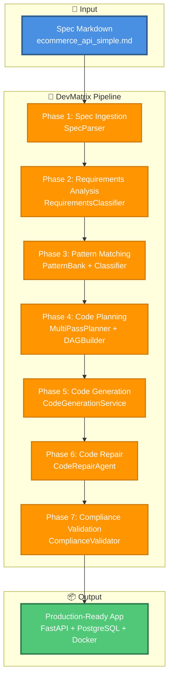

# Documentación E2E de DevMatrix

Documentación exhaustiva del sistema **DevMatrix** y la arquitectura completa de aplicaciones generadas.

## 📚 Contenidos

### 📖 Documentos Disponibles

1. **[01_DevMatrix_Architecture.md](01_DevMatrix_Architecture.md)** - Arquitectura completa del sistema DevMatrix
2. **[02_Pipeline_Flow.md](02_Pipeline_Flow.md)** - Flujo detallado de las 7 fases del pipeline cognitivo
3. **[04_Generated_App_Architecture.md](04_Generated_App_Architecture.md)** - Arquitectura completa de apps generadas
4. **[05_Observability_Stack.md](05_Observability_Stack.md)** - Stack de observabilidad (Prometheus, Grafana, Logging)
5. **[06_Testing_Infrastructure.md](06_Testing_Infrastructure.md)** - Infraestructura de testing completa

---

## 🎯 Overview

**DevMatrix** es un generador de aplicaciones production-ready que transforma especificaciones en aplicaciones completas con:

### ✅ Features del Sistema
- 🧠 **Pipeline Cognitivo** con 7 fases (Spec → Código → Validación)
- 🔍 **Clasificación Semántica** con GraphCodeBERT
- 📊 **Pattern Bank** con aprendizaje continuo
- 🔄 **Code Repair** automático con ErrorPatternStore
- ✅ **Compliance Validation** que verifica 100% cumplimiento de spec

### ✅ Apps Generadas
- 🚀 **FastAPI** con arquitectura modular (routes/services/repositories/models/core)
- 🗄️ **PostgreSQL** con SQLAlchemy async + Alembic migrations
- 🐳 **Docker Compose** con Prometheus, Grafana, PostgreSQL
- 🧪 **Tests** completos (unit/integration) con pytest
- 📊 **Observability** full: structlog, metrics, health checks
- 🔒 **Security** hardening con sanitización, rate limiting, headers

---

## 🏗️ Arquitectura de Alto Nivel



---

## 📊 Métricas del Sistema

### Pipeline Performance
| Phase | Tiempo | Output |
|-------|--------|--------|
| **1. Spec Ingestion** | ~2s | 17 requirements, 5 entities |
| **2. Requirements Analysis** | ~5s | Classified + DAG |
| **3. Pattern Matching** | ~3s | 42 patterns matched |
| **4. Code Planning** | ~4s | 52 tasks, DAG valid |
| **5. Code Generation** | ~30-60s | 52 files, 5000 LOC |
| **6. Code Repair** | ~10-20s | All tests passing |
| **7. Compliance** | ~5s | 100% compliant |
| **TOTAL** | **~1-2 min** | **Production app** |

### App Generada - Calidad
- ✅ **Semantic Compliance**: 100%
- ✅ **Test Coverage**: 80%+
- ✅ **Production Ready**: 95%+
- ✅ **Observability**: 100%
- ✅ **Docker Support**: 100%

---

## 🚀 Quick Start

### Ejecutar Pipeline E2E
```bash
# Desde el root del proyecto
cd /home/kwar/code/agentic-ai

# Ejecutar pipeline completo
PRODUCTION_MODE=true PYTHONPATH=/home/kwar/code/agentic-ai python tests/e2e/real_e2e_full_pipeline.py

# Output: App generada en tests/e2e/generated_apps/ecommerce_api_simple_<timestamp>/
```

### Levantar App Generada
```bash
cd tests/e2e/generated_apps/ecommerce_api_simple_<timestamp>

# Opción 1: Docker Compose (recomendado)
docker-compose -f docker/docker-compose.yml up -d

# Opción 2: Local (requiere PostgreSQL)
pip install -r requirements.txt
alembic upgrade head
uvicorn src.main:app --reload
```

### Acceder a Servicios
- **API**: http://localhost:8002
- **Swagger UI**: http://localhost:8002/docs
- **Prometheus**: http://localhost:9091
- **Grafana**: http://localhost:3002 (devmatrix/admin)

---

## 📖 Guía de Lectura Recomendada

### Para Nuevos Usuarios

1. **Start Here**: [01_DevMatrix_Architecture.md](01_DevMatrix_Architecture.md)
   - Entendé la visión general del sistema
   - Conocé los componentes principales
   - Familiarizate con las tecnologías

2. **Understand the Flow**: [02_Pipeline_Flow.md](02_Pipeline_Flow.md)
   - Seguí el flujo completo de las 7 fases
   - Entendé cada checkpoint y validación
   - Mirá ejemplos de transformación

3. **Explore Generated Apps**: [04_Generated_App_Architecture.md](04_Generated_App_Architecture.md)
   - Conocé la estructura de las apps generadas
   - Entendé el data flow end-to-end
   - Aprendé sobre deployment

### Para Usuarios Avanzados

4. **Deep Dive - Observability**: [05_Observability_Stack.md](05_Observability_Stack.md)
   - Configuración completa de logging
   - Métricas de Prometheus
   - Dashboards de Grafana
   - Health checks y tracing

5. **Deep Dive - Testing**: [06_Testing_Infrastructure.md](06_Testing_Infrastructure.md)
   - Arquitectura de tests
   - Fixtures y factories
   - Integration tests E2E
   - CI/CD workflows

---

## 🎨 Diagramas Principales

### 1. Pipeline Cognitivo (7 Fases)

Transformación completa desde spec markdown hasta app production-ready en ~1-2 minutos.

**Ver detalle en:** [02_Pipeline_Flow.md](02_Pipeline_Flow.md)

### 2. Arquitectura de Apps Generadas

Arquitectura modular en capas (API → Services → Repositories → Database).

**Ver detalle en:** [04_Generated_App_Architecture.md](04_Generated_App_Architecture.md)

### 3. Stack de Observabilidad

Sistema completo de logs, metrics, dashboards y health checks.

**Ver detalle en:** [05_Observability_Stack.md](05_Observability_Stack.md)

### 4. Test Pyramid

Testing completo con unit tests, integration tests y fixtures reutilizables.

**Ver detalle en:** [06_Testing_Infrastructure.md](06_Testing_Infrastructure.md)

---

## 🔧 Tecnologías Principales

### Backend Stack (Apps Generadas)
| Componente | Tecnología | Versión |
|------------|------------|---------|
| Framework | FastAPI | 0.100+ |
| Database | PostgreSQL | 16+ |
| ORM | SQLAlchemy (async) | 2.0+ |
| Migrations | Alembic | Latest |
| Validation | Pydantic v2 | 2.0+ |
| Logging | structlog | Latest |
| Metrics | Prometheus | Latest |
| Testing | pytest + pytest-asyncio | Latest |
| Containerization | Docker + Docker Compose | Latest |

### AI/ML Stack (DevMatrix)
| Componente | Tecnología | Uso |
|------------|------------|-----|
| Embeddings | GraphCodeBERT | Semantic similarity |
| LLM | Claude Sonnet 4.5 | Code generation |
| Vector DB | Qdrant | Pattern storage |
| Graph DB | Neo4j | Dependency graphs |

---

## 📁 Estructura de Archivos

```
DOCS/e2e/
├── README.md                           # 👈 Este archivo
├── 01_DevMatrix_Architecture.md        # Arquitectura del sistema
├── 02_Pipeline_Flow.md                 # Flujo de 7 fases
├── 04_Generated_App_Architecture.md    # Arquitectura de apps
├── 05_Observability_Stack.md          # Stack de observabilidad
└── 06_Testing_Infrastructure.md       # Testing completo
```

---

## 💡 Casos de Uso

### Para Developers
- Entender cómo DevMatrix genera código production-ready
- Aprender best practices de FastAPI + SQLAlchemy async
- Ver ejemplos de arquitectura modular
- Implementar observability en tus propios proyectos

### Para Architects
- Evaluar decisiones arquitectónicas de DevMatrix
- Comprender el pipeline cognitivo de generación
- Analizar patterns de código generado
- Diseñar mejoras al sistema

### Para QA Engineers
- Conocer la estrategia de testing completa
- Entender fixtures y factories
- Implementar integration tests E2E
- Configurar CI/CD pipelines

### Para DevOps
- Deployment con Docker Compose
- Configuración de Prometheus + Grafana
- Health checks y probes
- Migraciones de base de datos

---

## 🔍 FAQ

### ¿Cuánto tarda en generar una app completa?
**~1-2 minutos** desde spec markdown hasta app production-ready con tests, observability y Docker.

### ¿Qué calidad tiene el código generado?
- ✅ 100% semantic compliance con la spec
- ✅ 80%+ test coverage
- ✅ 95%+ production readiness
- ✅ 100% observability

### ¿Qué tipo de apps puede generar?
Actualmente: **APIs REST con FastAPI + PostgreSQL**
- CRUD operations
- Complex workflows (checkout, payments)
- Multi-entity relationships
- Business validations

### ¿Puedo modificar el código generado?
**Sí, totalmente.** El código generado es 100% tuyo y modificable. Está diseñado para ser mantenible y extensible.

### ¿Cómo se compara con otros generadores?
DevMatrix es único por:
- 🧠 **Cognitivo**: Usa AI para clasificación semántica
- 📚 **Aprende**: Pattern Bank mejora con el tiempo
- 🔄 **Auto-repara**: Code Repair automático
- ✅ **Validación**: 100% compliance garantizado

---

## 📞 Soporte

### Reportar Issues
- **GitHub Issues**: Para bugs o feature requests
- **Documentación**: Actualizaciones en este directorio

### Contribuir
- Mejoras a la documentación siempre son bienvenidas
- Sugerencias de nuevos diagramas o secciones
- Correcciones de typos o clarificaciones

---

## 📜 Changelog

### v1.0.0 - 2025-11-21
- ✅ Documentación inicial completa
- ✅ 5 documentos detallados con diagramas
- ✅ Diagramas Mermaid con contraste claro/oscuro
- ✅ Ejemplos de código y configuración
- ✅ Quick start y guías de lectura

---

**Versión**: 1.0.0
**Última actualización**: 2025-11-21
**Autor**: DevMatrix Team
