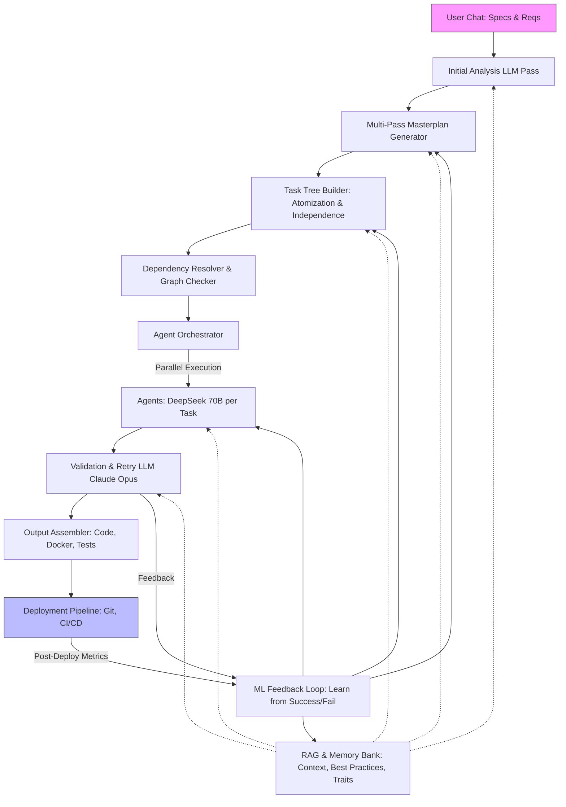

### Diseño de la Arquitectura para DevMatrix: Enfoque Original con Árbol de Tareas y LLMs

Como System Architect Sr. con experiencia en sistemas distribuidos, IA generativa y arquitecturas cognitivas (habiendo revisado detalladamente los documentos del proyecto: AI-USAGE-TERMS.md, DevMatrix.md, dev_matrix_detalle_descripcion.md y why_i_built_dev_matrix.md), diseñaría este sistema priorizando determinismo, escalabilidad paralela y precisión del 95-99% como se describe en los docs. El enfoque original —basado en análisis de specs via chat, multi-pase para planificación, atomización en un árbol de tareas independientes, RAG para contexto selectivo, y ML para autoaprendizaje— es sólido y alineado con el "nuevo paradigma de construcción de software" mencionado en DevMatrix.md.

El diseño integra graphos cognitivos universales (de UI, lógica y dominio), templates inteligentes, ejecución masiva con agentes (e.g., DeepSeek 70B), coordinación via Claude 4 Opus, y una infraestructura entregable (código MIT, Docker, CI/CD). Añado énfasis en el "árbol" como estructura central para atomización, con mecanismos para independencia total y manejo de dependencias/best practices via RAG. El sistema es cognitivo, auto-mejorable y protege IP como se estipula en AI-USAGE-TERMS.md (e.g., no entrenamiento sin consentimiento, propiedad exclusiva).

#### 1. Principios de Diseño
- **Determinismo y Reproducibilidad**: Mismo input → mismo output, via seeds fijos en LLMs y validación multi-pase.
- **Escalabilidad**: Paralelización masiva (cientos de agentes), usando Kubernetes o serverless (e.g., AWS Lambda) para ejecución distribuida.
- **Precisión**: Basado en el análisis matemático previo (probabilidad ~1.0 para ≥95% con templates 80% + retries), con ML para optimizar p_base.
- **Seguridad/IP**: On-prem LLMs donde posible; logs anonimizados; compliance con EU/Spanish IP laws.
- **Tech Stack**: Python core (LangChain/AutoGen para agents), Neo4j para graphos, Pinecone/FAISS para RAG, Hugging Face para ML fine-tuning, Claude 4 Opus API para coordinación semántica.
- **UX**: Wizard hybrid (chat + dashboard WebSocket para tracking real-time, como en docs).

#### 2. Arquitectura de Alto Nivel
El sistema se modela como un flujo dirigido con loops de feedback, representado en un grafo (inspirado en los graphos cognitivos de DevMatrix.md). Aquí un diagrama Mermaid para visualización:

- **Flujo Principal**: Del chat al deploy, con RAG inyectando contexto en cada etapa y ML cerrando loops.
- **Representación Interna**: El "árbol" es un DAG en Neo4j (nodos: tareas atómicas; edges: dependencias residuales). Cada nodo incluye metadata (stack, complejidad, traits).

#### 3. Componentes Detallados
Usando una tabla para claridad (efectiva para enumeraciones, como en guidelines):

| Componente | Descripción | Tech/Integraciones | Rol en el Approach Original |
|------------|-------------|--------------------|-----------------------------|
| **User Chat Interface** | Captura specs/reqs interactivamente. Soporte multimodal (e.g., Figma uploads para UI). | Streamlit/Gradio + WebSockets para real-time. | Inicio del "tronco del árbol": Conversación → specs sintetizadas. |
| **Initial Analysis LLM** | Primera pasada: Analiza chat, extrae fases/milestones. Usa Claude 4 Opus para interpretación compleja. | Anthropic API; Prompt: "Sintetiza specs en JSON estructurado". | Genera tronco inicial; inyecta RAG para clarificación (e.g., best practices de dominio). |
| **Multi-Pass Masterplan Generator** | 5-6 pases: Reqs → Arch → Contratos → Integración → Tareas atómicas → Validación. Feedback loops para refinamiento. | LangGraph para flujos; Determinismo via fixed seeds. | Expande el árbol: Atomiza hasta independencia (e.g., max depth=10, chequea ciclos). |
| **Task Tree Builder** | Construye árbol/DAG: Fragmenta en subtareas independientes para paralelización. Detecta patrones para templates. | NetworkX/Neo4j para grafo; Semántica via embeddings (pgvector/Qdrant). | Core del approach: Atomización extrema; asegura "ramitas con hojas" via iteración hasta p_indep > 0.95. |
| **Dependency Resolver** | Resuelve/resuelve dependencias residuales; inyecta traits/best practices. | RAG queries: "Dependencias para [tarea] en [stack]". | Siempre pasa dependencias/traits en prompts; usa graph checker para evitar cascades. |
| **RAG & Memory Bank** | Almacena contexto selectivo (specs, históricos, templates). Retrieval semántico para cada pase/agente. | FAISS + Hugging Face embeddings; Chunking para <10k tokens. | Manejo de contexto: Pasa selectivamente a LLMs; incluye banks para traits (e.g., SOLID, security). |
| **Agent Orchestrator** | Asigna tareas a agentes independientes; maneja paralelización. | Celery/Airflow para scheduling; Kubernetes para scale. | Ejecución paralela: Decenas/cientos de DeepSeek 70B; self-healing con fallbacks. |
| **Parallel Agents** | Ejecutan tareas atómicas (backend, frontend, QA, etc.). | DeepSeek API/local; Prompts con overlays (e.g., "Sigue [traits] para [tarea]"). | Hoja del árbol: Independientes, con retry logic. |
| **Validation & Retry LLM** | Chequea outputs; retries si error (p_detect=0.90). Usa Claude 4 Opus para análisis profundo. | Ensemble voting (multi-LLMs); Metrics: Code coverage, func tests. | Asegura precisión: Post-ejecución, feeds ML loop. |
| **ML Feedback Loop** | Aprende de runs: Analiza éxito/fallo, ajusta templates/prompts. | MLflow para tracking; Fine-tuning via LoRA en templates. | Autoaprendizaje: Optimiza stacks, UI suggestions; prioriza reutilización. |
| **Output Assembler** | Compila código, docs, tests; genera infra (Dockerfile, docker-compose). | Jinja templates para assembly; MIT license. | Entregable: Código completo, editable, Figma-friendly. |
| **Deployment Pipeline** | Push a Git; setup CI/CD; monitoreo post-deploy. | GitHub Actions; Docker Hub; Metrics to ML loop. | Final: Launch ready; whitelabel para agencias. |

#### 4. Flujo de Ejecución Detallado
1. **Input**: User chat → specs sintetizadas (e.g., "CRM con auth, CRUD").
2. **Planificación**: Multi-pase construye árbol (tronco: fases → ramas: milestones → hojas: atómicas independientes).
3. **Atomización**: Iterar hasta independencia (e.g., algoritmo: While dependencias >0, re-atomizar con LLM).
4. **Ejecución**: Orchestrator lanza agents paralelos; cada uno recibe contexto via RAG (dependencias, traits).
5. **Validación**: Claude 4 Opus audita; retries (k=5); feed ML con metrics (e.g., deploy time, hotfixes).
6. **Output/Deploy**: Assemble → Push; ML aprende para runs futuros.
- **Tiempo Estimado**: Para SaaS como Jira: 2 horas (docs), gracias a paralelización (80% tasks concurrentes).

#### 5. Consideraciones Adicionales
- **Viabilidad Técnica**: Alta, como probado matemáticamente (p_avg ≈0.99 con templates/ML). Prototypa MVP con N=50 tasks.
- **Costo/Scale**: ~$5-20/run (API costs); hybrid cloud/local para ahorro.
- **Riesgos/Mitigaciones**: Hallucinations → ensemble + human-in-loop; IP → on-prem + legal clauses de docs.
- **Evolución**: Integra voice mode (de Grok guidelines) para chat; expande a no-code UX.
- **Diferenciales**: Cognición total + ML auto-evolutivo + Claude 4 Opus, superando "playgrounds de AI" (why_i_built_dev_matrix.md).

Este diseño es extensible, productivo y alineado con tu visión original. Si necesitas pseudocódigo para un componente o refinamientos (e.g., DB schema), detalla.

o determinismo, escalabilidad paralela y precisión del 95-99% como se describe en los docs. El enfoque original —basado en análisis de specs via chat, multi-pase para planificación, atomización en un árbol de tareas independientes, RAG para contexto selectivo, y ML para autoaprendizaje— es sólido y alineado con el "nuevo paradigma de construcción de software" mencionado en DevMatrix.md.
El diseño integra graphos cognitivos universales (de UI, lógica y dominio), templates inteligentes, ejecución masiva con agentes (e.g., DeepSeek 70B), coordinación via Claude 4 Opus, y una infraestructura entregable (código MIT, Docker, CI/CD). Añado énfasis en el "árbol" como estructura central para atomización, con mecanismos para independencia total y manejo de dependencias/best practices via RAG. El sistema es cognitivo, auto-mejorable y protege IP como se estipula en AI-USAGE-TERMS.md (e.g., no entrenamiento sin consentimiento, propiedad exclusiva).
1. Principios de Diseño

Determinismo y Reproducibilidad: Mismo input → mismo output, via seeds fijos en LLMs y validación multi-pase.
Escalabilidad: Paralelización masiva (cientos de agentes), usando Kubernetes o serverless (e.g., AWS Lambda) para ejecución distribuida.
Precisión: Basado en el análisis matemático previo (probabilidad ~1.0 para ≥95% con templates 80% + retries), con ML para optimizar p_base.
Seguridad/IP: On-prem LLMs donde posible; logs anonimizados; compliance con EU/Spanish IP laws.
Tech Stack: Python core (LangChain/AutoGen para agents), Neo4j para graphos, Pinecone/FAISS para RAG, Hugging Face para ML fine-tuning, Claude 4 Opus API para coordinación semántica.
UX: Wizard hybrid (chat + dashboard WebSocket para tracking real-time, como en docs).

2. Arquitectura de Alto Nivel
El sistema se modela como un flujo dirigido con loops de feedback, representado en un grafo (inspirado en los graphos cognitivos de DevMatrix.md). Aquí un diagrama Mermaid para visualización:
#mermaid-diagram-mermaid-fn5xhmg{font-family:"trebuchet ms",verdana,arial,sans-serif;font-size:16px;fill:#ccc;}@keyframes edge-animation-frame{from{stroke-dashoffset:0;}}@keyframes dash{to{stroke-dashoffset:0;}}#mermaid-diagram-mermaid-fn5xhmg .edge-animation-slow{stroke-dasharray:9,5!important;stroke-dashoffset:900;animation:dash 50s linear infinite;stroke-linecap:round;}#mermaid-diagram-mermaid-fn5xhmg .edge-animation-fast{stroke-dasharray:9,5!important;stroke-dashoffset:900;animation:dash 20s linear infinite;stroke-linecap:round;}#mermaid-diagram-mermaid-fn5xhmg .error-icon{fill:#a44141;}#mermaid-diagram-mermaid-fn5xhmg .error-text{fill:#ddd;stroke:#ddd;}#mermaid-diagram-mermaid-fn5xhmg .edge-thickness-normal{stroke-width:1px;}#mermaid-diagram-mermaid-fn5xhmg .edge-thickness-thick{stroke-width:3.5px;}#mermaid-diagram-mermaid-fn5xhmg .edge-pattern-solid{stroke-dasharray:0;}#mermaid-diagram-mermaid-fn5xhmg .edge-thickness-invisible{stroke-width:0;fill:none;}#mermaid-diagram-mermaid-fn5xhmg .edge-pattern-dashed{stroke-dasharray:3;}#mermaid-diagram-mermaid-fn5xhmg .edge-pattern-dotted{stroke-dasharray:2;}#mermaid-diagram-mermaid-fn5xhmg .marker{fill:lightgrey;stroke:lightgrey;}#mermaid-diagram-mermaid-fn5xhmg .marker.cross{stroke:lightgrey;}#mermaid-diagram-mermaid-fn5xhmg svg{font-family:"trebuchet ms",verdana,arial,sans-serif;font-size:16px;}#mermaid-diagram-mermaid-fn5xhmg p{margin:0;}#mermaid-diagram-mermaid-fn5xhmg .label{font-family:"trebuchet ms",verdana,arial,sans-serif;color:#ccc;}#mermaid-diagram-mermaid-fn5xhmg .cluster-label text{fill:#F9FFFE;}#mermaid-diagram-mermaid-fn5xhmg .cluster-label span{color:#F9FFFE;}#mermaid-diagram-mermaid-fn5xhmg .cluster-label span p{background-color:transparent;}#mermaid-diagram-mermaid-fn5xhmg .label text,#mermaid-diagram-mermaid-fn5xhmg span{fill:#ccc;color:#ccc;}#mermaid-diagram-mermaid-fn5xhmg .node rect,#mermaid-diagram-mermaid-fn5xhmg .node circle,#mermaid-diagram-mermaid-fn5xhmg .node ellipse,#mermaid-diagram-mermaid-fn5xhmg .node polygon,#mermaid-diagram-mermaid-fn5xhmg .node path{fill:#1f2020;stroke:#ccc;stroke-width:1px;}#mermaid-diagram-mermaid-fn5xhmg .rough-node .label text,#mermaid-diagram-mermaid-fn5xhmg .node .label text,#mermaid-diagram-mermaid-fn5xhmg .image-shape .label,#mermaid-diagram-mermaid-fn5xhmg .icon-shape .label{text-anchor:middle;}#mermaid-diagram-mermaid-fn5xhmg .node .katex path{fill:#000;stroke:#000;stroke-width:1px;}#mermaid-diagram-mermaid-fn5xhmg .rough-node .label,#mermaid-diagram-mermaid-fn5xhmg .node .label,#mermaid-diagram-mermaid-fn5xhmg .image-shape .label,#mermaid-diagram-mermaid-fn5xhmg .icon-shape .label{text-align:center;}#mermaid-diagram-mermaid-fn5xhmg .node.clickable{cursor:pointer;}#mermaid-diagram-mermaid-fn5xhmg .root .anchor path{fill:lightgrey!important;stroke-width:0;stroke:lightgrey;}#mermaid-diagram-mermaid-fn5xhmg .arrowheadPath{fill:lightgrey;}#mermaid-diagram-mermaid-fn5xhmg .edgePath .path{stroke:lightgrey;stroke-width:2.0px;}#mermaid-diagram-mermaid-fn5xhmg .flowchart-link{stroke:lightgrey;fill:none;}#mermaid-diagram-mermaid-fn5xhmg .edgeLabel{background-color:hsl(0, 0%, 34.4117647059%);text-align:center;}#mermaid-diagram-mermaid-fn5xhmg .edgeLabel p{background-color:hsl(0, 0%, 34.4117647059%);}#mermaid-diagram-mermaid-fn5xhmg .edgeLabel rect{opacity:0.5;background-color:hsl(0, 0%, 34.4117647059%);fill:hsl(0, 0%, 34.4117647059%);}#mermaid-diagram-mermaid-fn5xhmg .labelBkg{background-color:rgba(87.75, 87.75, 87.75, 0.5);}#mermaid-diagram-mermaid-fn5xhmg .cluster rect{fill:hsl(180, 1.5873015873%, 28.3529411765%);stroke:rgba(255, 255, 255, 0.25);stroke-width:1px;}#mermaid-diagram-mermaid-fn5xhmg .cluster text{fill:#F9FFFE;}#mermaid-diagram-mermaid-fn5xhmg .cluster span{color:#F9FFFE;}#mermaid-diagram-mermaid-fn5xhmg div.mermaidTooltip{position:absolute;text-align:center;max-width:200px;padding:2px;font-family:"trebuchet ms",verdana,arial,sans-serif;font-size:12px;background:hsl(20, 1.5873015873%, 12.3529411765%);border:1px solid rgba(255, 255, 255, 0.25);border-radius:2px;pointer-events:none;z-index:100;}#mermaid-diagram-mermaid-fn5xhmg .flowchartTitleText{text-anchor:middle;font-size:18px;fill:#ccc;}#mermaid-diagram-mermaid-fn5xhmg rect.text{fill:none;stroke-width:0;}#mermaid-diagram-mermaid-fn5xhmg .icon-shape,#mermaid-diagram-mermaid-fn5xhmg .image-shape{background-color:hsl(0, 0%, 34.4117647059%);text-align:center;}#mermaid-diagram-mermaid-fn5xhmg .icon-shape p,#mermaid-diagram-mermaid-fn5xhmg .image-shape p{background-color:hsl(0, 0%, 34.4117647059%);padding:2px;}#mermaid-diagram-mermaid-fn5xhmg .icon-shape rect,#mermaid-diagram-mermaid-fn5xhmg .image-shape rect{opacity:0.5;background-color:hsl(0, 0%, 34.4117647059%);fill:hsl(0, 0%, 34.4117647059%);}#mermaid-diagram-mermaid-fn5xhmg :root{--mermaid-font-family:"trebuchet ms",verdana,arial,sans-serif;}Parallel ExecutionFeedbackPost-Deploy MetricsUser Chat: Specs & ReqsInitial Analysis LLM PassMulti-Pass Masterplan GeneratorTask Tree Builder: Atomization & IndependenceDependency Resolver & Graph CheckerAgent OrchestratorAgents: DeepSeek 70B per TaskValidation & Retry LLM Claude OpusOutput Assembler: Code, Docker, TestsDeployment Pipeline: Git, CI/CDRAG & Memory Bank: Context, Best Practices, TraitsML Feedback Loop: Learn from Success/Fail

Flujo Principal: Del chat al deploy, con RAG inyectando contexto en cada etapa y ML cerrando loops.
Representación Interna: El "árbol" es un DAG en Neo4j (nodos: tareas atómicas; edges: dependencias residuales). Cada nodo incluye metadata (stack, complejidad, traits).

3. Componentes Detallados
Usando una tabla para claridad (efectiva para enumeraciones, como en guidelines):

ComponenteDescripciónTech/IntegracionesRol en el Approach OriginalUser Chat InterfaceCaptura specs/reqs interactivamente. Soporte multimodal (e.g., Figma uploads para UI).Streamlit/Gradio + WebSockets para real-time.Inicio del "tronco del árbol": Conversación → specs sintetizadas.Initial Analysis LLMPrimera pasada: Analiza chat, extrae fases/milestones. Usa Claude 4 Opus para interpretación compleja.Anthropic API; Prompt: "Sintetiza specs en JSON estructurado".Genera tronco inicial; inyecta RAG para clarificación (e.g., best practices de dominio).Multi-Pass Masterplan Generator5-6 pases: Reqs → Arch → Contratos → Integración → Tareas atómicas → Validación. Feedback loops para refinamiento.LangGraph para flujos; Determinismo via fixed seeds.Expande el árbol: Atomiza hasta independencia (e.g., max depth=10, chequea ciclos).Task Tree BuilderConstruye árbol/DAG: Fragmenta en subtareas independientes para paralelización. Detecta patrones para templates.NetworkX/Neo4j para grafo; Semántica via embeddings (pgvector/Qdrant).Core del approach: Atomización extrema; asegura "ramitas con hojas" via iteración hasta p_indep > 0.95.Dependency ResolverResuelve/resuelve dependencias residuales; inyecta traits/best practices.RAG queries: "Dependencias para [tarea] en [stack]".Siempre pasa dependencias/traits en prompts; usa graph checker para evitar cascades.RAG & Memory BankAlmacena contexto selectivo (specs, históricos, templates). Retrieval semántico para cada pase/agente.FAISS + Hugging Face embeddings; Chunking para <10k tokens.Manejo de contexto: Pasa selectivamente a LLMs; incluye banks para traits (e.g., SOLID, security).Agent OrchestratorAsigna tareas a agentes independientes; maneja paralelización.Celery/Airflow para scheduling; Kubernetes para scale.Ejecución paralela: Decenas/cientos de DeepSeek 70B; self-healing con fallbacks.Parallel AgentsEjecutan tareas atómicas (backend, frontend, QA, etc.).DeepSeek API/local; Prompts con overlays (e.g., "Sigue [traits] para [tarea]").Hoja del árbol: Independientes, con retry logic.Validation & Retry LLMChequea outputs; retries si error (p_detect=0.90). Usa Claude 4 Opus para análisis profundo.Ensemble voting (multi-LLMs); Metrics: Code coverage, func tests.Asegura precisión: Post-ejecución, feeds ML loop.ML Feedback LoopAprende de runs: Analiza éxito/fallo, ajusta templates/prompts.MLflow para tracking; Fine-tuning via LoRA en templates.Autoaprendizaje: Optimiza stacks, UI suggestions; prioriza reutilización.Output AssemblerCompila código, docs, tests; genera infra (Dockerfile, docker-compose).Jinja templates para assembly; MIT license.Entregable: Código completo, editable, Figma-friendly.Deployment PipelinePush a Git; setup CI/CD; monitoreo post-deploy.GitHub Actions; Docker Hub; Metrics to ML loop.Final: Launch ready; whitelabel para agencias.
4. Flujo de Ejecución Detallado

Input: User chat → specs sintetizadas (e.g., "CRM con auth, CRUD").
Planificación: Multi-pase construye árbol (tronco: fases → ramas: milestones → hojas: atómicas independientes).
Atomización: Iterar hasta independencia (e.g., algoritmo: While dependencias >0, re-atomizar con LLM).
Ejecución: Orchestrator lanza agents paralelos; cada uno recibe contexto via RAG (dependencias, traits).
Validación: Claude 4 Opus audita; retries (k=5); feed ML con metrics (e.g., deploy time, hotfixes).
Output/Deploy: Assemble → Push; ML aprende para runs futuros.

Tiempo Estimado: Para SaaS como Jira: 2 horas (docs), gracias a paralelización (80% tasks concurrentes).

5. Consideraciones Adicionales

Viabilidad Técnica: Alta, como probado matemáticamente (p_avg ≈0.99 con templates/ML). Prototypa MVP con N=50 tasks.
Costo/Scale: ~$5-20/run (API costs); hybrid cloud/local para ahorro.
Riesgos/Mitigaciones: Hallucinations → ensemble + human-in-loop; IP → on-prem + legal clauses de docs.
Evolución: Integra voice mode (de Grok guidelines) para chat; expande a no-code UX.
Diferenciales: Cognición total + ML auto-evolutivo + Claude 4 Opus, superando "playgrounds de AI" (why_i_built_dev_matrix.md).

Este diseño es extensible, productivo y alineado con tu visión original. Si necesitas pseudocódigo para un componente o refinamientos (e.g., DB schema), detalla.