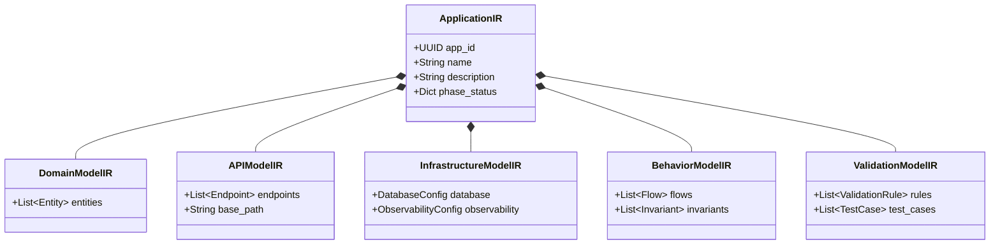

# Application Intermediate Representation (ApplicationIR)

The **ApplicationIR** is the central, unified data model for DevMatrix. It serves as the "single source of truth" for the application being generated, replacing loose dictionaries and ad-hoc structures.

## 1. Purpose

-   **Determinism**: Ensures that every phase of the pipeline (Generation, Validation, Repair) operates on the exact same structural definition.
-   **Validation**: Provides a strict schema against which generated code can be validated.
-   **Interoperability**: Decouples the "intent" (what to build) from the "implementation" (how to build it), allowing for future support of different stacks (e.g., Django, Node.js).

## 2. Class Structure

The ApplicationIR is a hierarchical Pydantic model composed of several sub-models.



### 2.1 Domain Model (`src/cognitive/ir/domain_model.py`)
Defines the business entities, their attributes, and relationships. This is the "Database Schema" abstraction.

### 2.2 API Model (`src/cognitive/ir/api_model.py`)
Defines the REST API surface, including endpoints, HTTP methods, and request/response schemas.

### 2.3 Infrastructure Model (`src/cognitive/ir/infrastructure_model.py`)
Defines the required infrastructure, such as databases (PostgreSQL, Neo4j), vector stores (Qdrant), and container configurations.

### 2.4 Behavior Model (`src/cognitive/ir/behavior_model.py`)
**[NEW]** Describes dynamic behaviors, workflows, and business invariants (e.g., "Checkout must reduce stock"). This enables complex logic generation beyond simple CRUD.

### 2.5 Validation Model (`src/cognitive/ir/validation_model.py`)
**[NEW]** Defines validation rules and compliance requirements. This serves as the basis for generating contract tests and acceptance tests.

## 3. Strategic Vision: Multi-Backend Generation

The `ApplicationIR` is designed to be **stack-agnostic**. By decoupling the "intent" (IR) from the "implementation" (Code), we enable a future where the same IR can generate:

-   **FastAPI** (Current)
-   **Django** (Future)
-   **Node.js / Express** (Future)
-   **Go / Rust** (Future)

This positions DevMatrix as a true **Builder Platform**, offering determinism that loose prompt-based generators cannot match.

## 4. Integration Flow

The `ApplicationIR` is constructed early in the pipeline (Phase 1) and then passed down to subsequent phases.


## 4. Usage

### Construction
The `IRBuilder` converts the raw `SpecRequirements` (output of the text parser) into the structured `ApplicationIR`.

```python
from src.cognitive.ir.ir_builder import IRBuilder

# spec is a SpecRequirements object
app_ir = IRBuilder.build_from_spec(spec)
```

### In Prompts
The `ApplicationIR` provides a clean, structured summary for LLM prompts:

```python
prompt += f"Domain Entities: {', '.join([e.name for e in app_ir.domain_model.entities])}"
prompt += f"API Endpoints: {len(app_ir.api_model.endpoints)} defined"
```

## 5. Future Roadmap

-   **Persistence**: Save the `ApplicationIR` to Neo4j as a graph of nodes (`(:Application)-[:HAS_DOMAIN]->(:DomainModel)`).
-   **Versioning**: Store versions of the IR (`v1`, `v2`) to track how the application evolves during the repair loop.
-   **Validation**: Use the IR to automatically generate test cases (e.g., "Ensure endpoint X exists and accepts schema Y").
