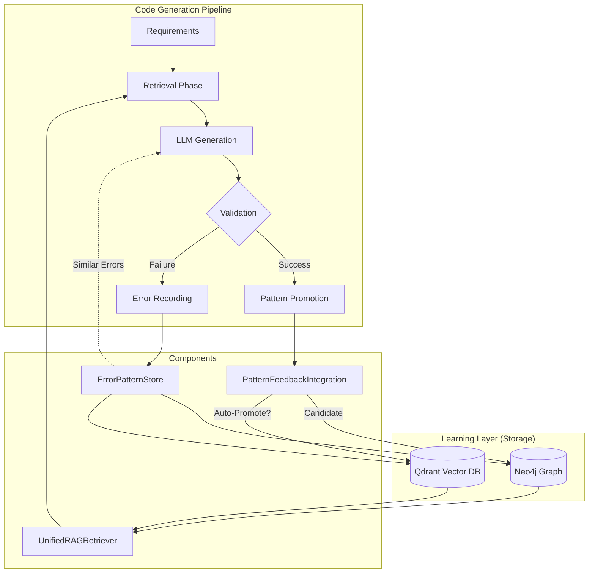

# Learning Layer Integration

This document details the integration of the "Learning Layer" (Neo4j, Qdrant, PostgreSQL) into the DevMatrix production pipeline, as implemented in Milestone 4.

## 1. Overview

The Learning Layer enables DevMatrix to learn from its own execution history. It captures:
- **Errors**: To avoid repeating mistakes (via `ErrorPatternStore`).
- **Successes**: To promote high-quality code patterns (via `PatternFeedbackIntegration`).
- **Context**: To provide relevant examples during generation (via `UnifiedRAGRetriever`).

## 2. Implementation Status Matrix

| Feature | Status | Component | Notes |
| :--- | :--- | :--- | :--- |
| **Unified RAG Retrieval** | ✅ Implemented | `UnifiedRAGRetriever` | Combines Neo4j (Knowledge Graph) and Qdrant (Semantic Search). |
| **Error Recording** | ✅ Implemented | `ErrorPatternStore` | Captures Timeouts, Syntax Errors, and Empty Responses. |
| **Pattern Promotion** | ✅ Implemented | `PatternFeedbackIntegration` | Includes Quality Evaluation, Scoring, and Lineage Tracking. |
| **Dual Validation** | ✅ Implemented | `DualValidator` | Fully implemented with `anthropic` and `openai` clients. Auto-detects API keys to enable/disable mock mode. |
| **Adaptive Thresholds** | ✅ Implemented | `AdaptiveThresholdManager` | Adjusts promotion thresholds based on domain success rates. |
| **Auto-Promotion** | ✅ Enabled | `CodeGenerationService` | `enable_auto_promotion` is set to `True`. Patterns are automatically promoted if they pass all checks. |
| **Feedback Loop (Retry)** | ✅ Implemented | `CodeGenerationService` | Uses error history to improve prompts during retries. |

## 3. Integration Architecture

The following diagram illustrates how the Learning Layer integrates with the main `CodeGenerationService` pipeline.

## 4. Component Details

### 4.1 Unified RAG Retriever
- **Role**: Provides "few-shot" examples to the LLM.
- **Mechanism**:
    - **Semantic Search (Qdrant)**: Finds code snippets with similar intent/functionality using GraphCodeBERT embeddings.
    - **Graph Search (Neo4j)**: Finds related concepts and structural patterns.
- **Integration**: Called at the start of `generate_from_requirements`.

### 4.2 Error Pattern Store
- **Role**: The system's "long-term memory" of failures.
- **Mechanism**:
    - Stores structured error data (type, message, failed code).
    - Links errors to the specific task and requirements in Neo4j.
- **Integration**: Triggered by `asyncio.TimeoutError`, empty responses, or syntax validation failures.

### 4.3 Pattern Feedback Integration
- **Role**: The "quality control" and "promotion" engine.
- **Mechanism**:
    - **QualityEvaluator**: Calculates scores based on test coverage, complexity, and security.
    - **DualValidator**: (Optional) Uses secondary LLMs to review code.
    - **LineageTracker**: Tracks how patterns evolve over time.
- **Integration**: Triggered upon successful code generation and validation.

## 5. Future Work
- **Dashboard**: Build a UI to visualize the Error Graph and Promotion Pipeline.
