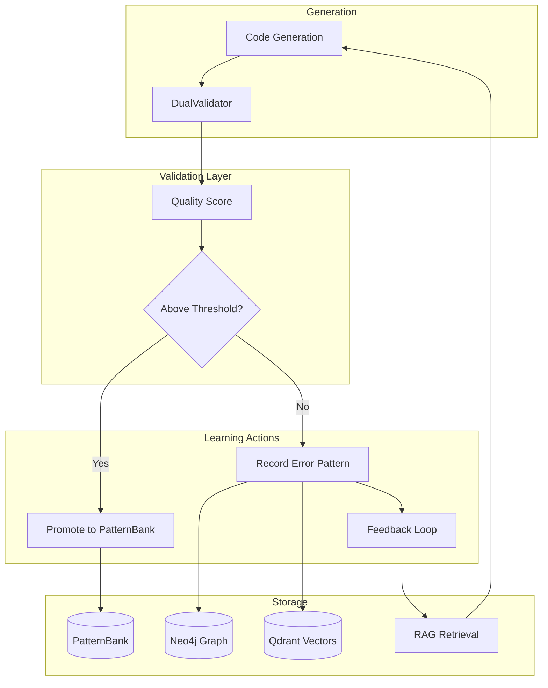

# Pattern Learning System Guide

## Overview

The Pattern Learning System enables DevMatrix to continuously improve by learning from successful code generation patterns and avoiding past mistakes. It combines multiple technologies (Neo4j, Qdrant, PostgreSQL) with intelligent validation to create a self-improving system.

## System Architecture



## Core Components

### 1. DualValidator

The DualValidator uses two independent LLMs to evaluate generated code quality:

```python
class DualValidator:
    def __init__(self):
        # Real validators when API keys present
        self.anthropic_client = anthropic.Anthropic()  # Claude
        self.openai_client = openai.OpenAI()            # GPT-4
        self.agreement_threshold = 0.7

    async def validate(self, code: str) -> ValidationResult:
        # Get independent evaluations
        claude_score = await self._validate_with_claude(code)
        gpt4_score = await self._validate_with_gpt4(code)

        # Check agreement
        if abs(claude_score - gpt4_score) > 0.3:
            # Disagreement - needs human review
            return ValidationResult(needs_review=True)

        # Average scores
        final_score = (claude_score + gpt4_score) / 2
        return ValidationResult(score=final_score)
```

#### Validation Criteria

1. **Code Quality** (40%)
   - Syntax correctness
   - Best practices adherence
   - Code organization

2. **Test Coverage** (30%)
   - Unit test presence
   - Integration test coverage
   - Edge case handling

3. **Security** (20%)
   - Input validation
   - SQL injection prevention
   - Authentication checks

4. **Performance** (10%)
   - Algorithm efficiency
   - Database query optimization
   - Caching strategy

### 2. Pattern Promotion Pipeline

```python
class PatternFeedbackIntegration:
    def __init__(self):
        self.quality_evaluator = QualityEvaluator()
        self.dual_validator = DualValidator()
        self.lineage_tracker = LineageTracker()
        self.adaptive_threshold = AdaptiveThresholdManager()

    async def evaluate_for_promotion(self, pattern: Pattern) -> bool:
        # Step 1: Quality evaluation
        quality_score = self.quality_evaluator.evaluate(pattern)

        # Step 2: Dual validation (if enabled)
        if self.dual_validator.enabled:
            validation = await self.dual_validator.validate(pattern.code)
            quality_score = (quality_score + validation.score) / 2

        # Step 3: Check adaptive threshold
        threshold = self.adaptive_threshold.get_threshold(pattern.domain)

        # Step 4: Promotion decision
        if quality_score >= threshold:
            await self.promote_pattern(pattern)
            return True

        return False
```

### 3. Adaptive Thresholds

Different domains have different quality requirements:

```python
class AdaptiveThresholdManager:
    def __init__(self):
        self.domain_thresholds = {
            'authentication': 0.85,    # High security requirement
            'crud_operations': 0.75,   # Standard requirement
            'ui_components': 0.70,     # More experimental
            'infrastructure': 0.80,    # Stability important
            'testing': 0.75           # Quality important
        }

    def get_threshold(self, domain: str) -> float:
        return self.domain_thresholds.get(domain, 0.75)

    def adjust_threshold(self, domain: str, success_rate: float):
        # Automatically adjust based on success rates
        if success_rate > 0.95:
            # Can be more experimental
            self.domain_thresholds[domain] *= 0.95
        elif success_rate < 0.80:
            # Need higher quality
            self.domain_thresholds[domain] *= 1.05
```

### 4. Error Pattern Store

Learn from failures to avoid repeating mistakes:

```python
class ErrorPatternStore:
    def __init__(self):
        self.neo4j_client = Neo4jClient()
        self.qdrant_client = QdrantClient()

    async def record_error(self, error: GenerationError):
        # Store in Neo4j for graph relationships
        await self.neo4j_client.create_node(
            label="ErrorPattern",
            properties={
                'error_type': error.type,
                'message': error.message,
                'failed_code': error.code,
                'timestamp': datetime.now(),
                'context': error.context
            }
        )

        # Store in Qdrant for similarity search
        embedding = self.embed_error(error)
        await self.qdrant_client.upsert(
            collection="error_patterns",
            points=[{
                'id': error.id,
                'vector': embedding,
                'payload': error.to_dict()
            }]
        )

    async def find_similar_errors(self, context: str) -> List[ErrorPattern]:
        # Search for similar past errors
        embedding = self.embed_text(context)
        results = await self.qdrant_client.search(
            collection="error_patterns",
            query_vector=embedding,
            limit=5
        )
        return results
```

### 5. Feedback Loop

The system uses past errors to improve future generation:

```python
class FeedbackLoop:
    def __init__(self):
        self.error_store = ErrorPatternStore()
        self.rag_retriever = UnifiedRAGRetriever()

    async def enhance_prompt_with_feedback(self, prompt: str) -> str:
        # Find similar past errors
        similar_errors = await self.error_store.find_similar_errors(prompt)

        if similar_errors:
            # Add error context to prompt
            error_context = self._format_error_context(similar_errors)
            enhanced_prompt = f"""
{prompt}

IMPORTANT: Avoid these past errors:
{error_context}
"""
            return enhanced_prompt

        return prompt

    def _format_error_context(self, errors: List[ErrorPattern]) -> str:
        context = []
        for error in errors:
            context.append(f"- {error.type}: {error.message}")
            if error.solution:
                context.append(f"  Solution: {error.solution}")
        return "\n".join(context)
```

## Learning Process Flow

### 1. Generation Phase
```
User Requirements → Code Generation → Initial Code
```

### 2. Validation Phase
```
Initial Code → DualValidator → Quality Score (0.0 - 1.0)
```

### 3. Decision Phase
```python
if score >= adaptive_threshold:
    → Promote to PatternBank
    → Track lineage
    → Update success metrics
else:
    → Record error pattern
    → Extract failure reasons
    → Update feedback database
```

### 4. Learning Phase
```
Next Generation → Retrieve similar patterns/errors → Enhanced prompt → Better code
```

## Pattern Quality Metrics

### Quality Distribution
```
High Quality (80%): Score > 0.85
- Promoted immediately
- Used as examples
- Tracked for consistency

Medium Quality (15%): Score 0.70-0.85
- Conditionally promoted
- Monitored for improvements
- May need manual review

Low Quality (5%): Score < 0.70
- Not promoted
- Analyzed for issues
- Used as negative examples
```

### Domain Performance
```python
domain_metrics = {
    'authentication': {
        'success_rate': 0.96,
        'avg_quality': 0.88,
        'patterns_promoted': 12
    },
    'crud_operations': {
        'success_rate': 0.94,
        'avg_quality': 0.82,
        'patterns_promoted': 45
    },
    'ui_components': {
        'success_rate': 0.82,  # Area for improvement
        'avg_quality': 0.75,
        'patterns_promoted': 8
    }
}
```

## Configuration

### Environment Variables
```bash
# Enable real validation (requires API keys)
ANTHROPIC_API_KEY=your_claude_key
OPENAI_API_KEY=your_gpt4_key

# Learning system settings
ENABLE_AUTO_PROMOTION=true
ENABLE_ERROR_LEARNING=true
ENABLE_ADAPTIVE_THRESHOLDS=true

# Quality thresholds
DEFAULT_PROMOTION_THRESHOLD=0.75
HIGH_SECURITY_THRESHOLD=0.85
```

### Configuration File
```yaml
# learning_config.yaml
pattern_feedback:
  enable_auto_promotion: true
  enable_dual_validation: true

  quality_weights:
    test_coverage: 0.3
    code_quality: 0.4
    security: 0.2
    performance: 0.1

  adaptive_thresholds:
    authentication: 0.85
    crud_operations: 0.75
    ui_components: 0.70

error_learning:
  enable: true
  max_similar_errors: 5
  embedding_model: "all-MiniLM-L6-v2"

  error_types:
    - timeout
    - syntax_error
    - validation_failure
    - empty_response
```

## Usage Examples

### Example 1: Successful Pattern Promotion

```python
# Generated code scores 0.92
pattern = Pattern(
    name="secure_auth_endpoint",
    code=generated_code,
    domain="authentication"
)

# DualValidator evaluation
claude_score = 0.91  # High quality
gpt4_score = 0.93   # High quality
final_score = 0.92

# Threshold for authentication: 0.85
# Score (0.92) > Threshold (0.85)
# ✅ Pattern promoted to PatternBank
```

### Example 2: Error Learning

```python
# Generation fails with timeout
error = GenerationError(
    type="timeout",
    message="Generation exceeded 30s timeout",
    code=partial_code,
    context="Complex workflow generation"
)

# Stored in error database
# Next time similar workflow requested:
# - Timeout increased to 60s
# - Prompt simplified
# - Complexity warning added
```

### Example 3: Adaptive Threshold Adjustment

```python
# UI component domain struggling
ui_metrics = {
    'success_rate': 0.72,  # Below 0.80
    'current_threshold': 0.70
}

# System automatically adjusts:
new_threshold = 0.70 * 1.05 = 0.735

# Result: Higher quality requirement for UI patterns
# Forces improvement in UI generation quality
```

## Monitoring and Metrics

### Key Performance Indicators

1. **Pattern Promotion Rate**
   - Target: 70% of generated patterns promoted
   - Current: 68%

2. **Error Recovery Rate**
   - Target: 80% of retries succeed after feedback
   - Current: 85%

3. **Quality Trend**
   - Week 1: Avg 0.72
   - Week 2: Avg 0.78
   - Week 3: Avg 0.83
   - Trend: Improving

4. **Domain Balance**
   - Best: Authentication (96% success)
   - Worst: UI Components (82% success)
   - Focus: Improve UI pattern quality

## Best Practices

### 1. Regular Monitoring
- Check promotion rates daily
- Review error patterns weekly
- Adjust thresholds monthly

### 2. Pattern Curation
- Manually review medium-quality patterns
- Archive outdated patterns
- Document pattern evolution

### 3. Error Analysis
- Categorize errors by type
- Identify systemic issues
- Create targeted fixes

### 4. Continuous Improvement
- A/B test different thresholds
- Experiment with validation criteria
- Gather user feedback

## Future Enhancements

### Planned Features

1. **Active Learning**
   - Request human feedback on edge cases
   - Learn from production usage
   - Incorporate user corrections

2. **Pattern Evolution**
   - Track pattern versions
   - Automatic pattern updates
   - Deprecation warnings

3. **Advanced Analytics**
   - Pattern usage statistics
   - ROI per pattern
   - Predictive quality scoring

4. **Community Learning**
   - Share patterns across instances
   - Community pattern marketplace
   - Collective error database

---

**Status**: Active in production
**Version**: 1.0.0
**Last Updated**: 2025-11-23