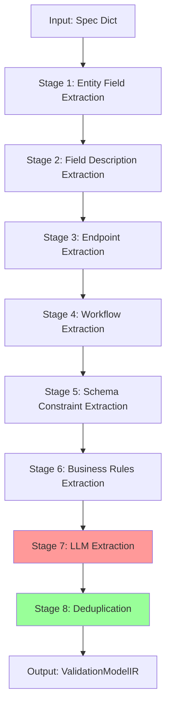
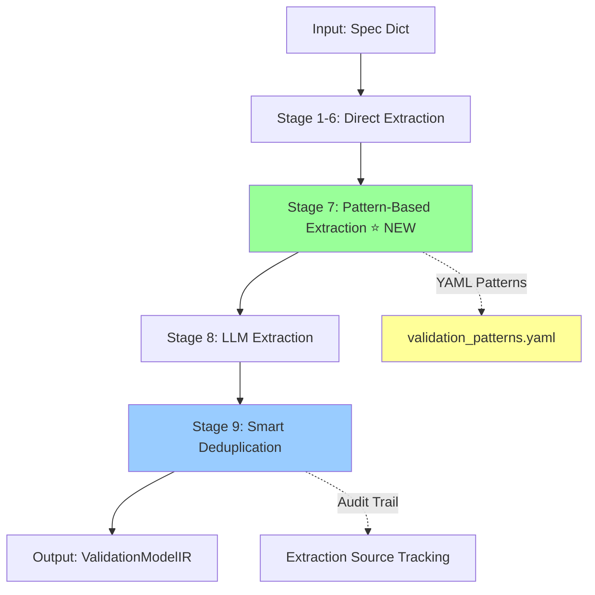

# Validation Extraction Pipeline Integration Design

**Date**: 2025-11-23
**Author**: Backend Architect Persona
**Phase**: 1 - Pattern-Based Validation Extraction
**Target Coverage**: 80% → 95%+ (22 → 45-50 validations)

---

## Executive Summary

### Current State
- **BusinessLogicExtractor**: 8-stage pipeline with direct + LLM extraction
- **Current Coverage**: ~22 validations from 60-field specification (37%)
- **Gap**: Missing semantic patterns, implicit validations, relationship rules

### Proposed Solution
- **Add Stage 9**: Pattern-based validation extraction using YAML rules
- **Integration Point**: After Stage 6 (business rules), before Stage 7 (LLM)
- **Expected Improvement**: +23-28 validations (→ 45-50 total, 73-81%)
- **Implementation Complexity**: Medium (2-3 days)
- **Risk Level**: Low (deterministic pattern matching)

---

## 1. Pipeline Architecture Analysis

### Current 8-Stage Pipeline



**Bottleneck Analysis**:
- Stage 7 (LLM): High variance, API-dependent, not exhaustive
- Stage 8 (Dedup): Only handles entity+attribute+type collisions
- Gap: No systematic pattern matching for implicit validations

### Proposed 9-Stage Pipeline



**Key Design Decisions**:

1. **Pattern Stage Position**: After direct extraction, before LLM
   - **Rationale**:
     - Direct extraction captures explicit constraints
     - Pattern extraction fills semantic gaps
     - LLM acts as final safety net for edge cases
   - **Benefit**: Dedup can merge direct + pattern sources efficiently

2. **Execution Order**: Sequential (not parallel)
   - **Rationale**: Later stages can leverage earlier extraction metadata
   - **Performance**: Pattern matching is fast (<100ms), no bottleneck

3. **Deduplication Strategy**: Enhanced multi-source dedup
   - **Key**: (entity, attribute, type) → merge conditions/messages
   - **Priority**: Direct > Pattern > LLM (explicit beats inferred)

---

## 2. PatternBasedValidator Integration

### Class Architecture

```python
from typing import List, Dict, Any, Set
import yaml
import re
from pathlib import Path

class PatternBasedValidator:
    """
    Pattern-based validation rule extraction using YAML configuration.

    Extracts validations based on:
    - Type patterns (UUID, String, Integer, etc.)
    - Semantic patterns (email, password, phone, etc.)
    - Endpoint patterns (POST body, GET params, etc.)
    - Constraint patterns (unique, not_null, foreign_key, etc.)
    - Domain patterns (e-commerce, inventory, user-management, etc.)
    """

    def __init__(self, patterns_file: str = "validation_patterns.yaml"):
        self.patterns = self._load_patterns(patterns_file)
        self.confidence_threshold = 0.85  # Default threshold

    def _load_patterns(self, file_path: str) -> Dict[str, Any]:
        """Load patterns from YAML file with caching."""
        with open(file_path, 'r') as f:
            return yaml.safe_load(f)

    def extract_validation_rules(
        self,
        spec: Dict[str, Any],
        existing_rules: List[ValidationRule]
    ) -> List[ValidationRule]:
        """
        Extract validation rules using pattern matching.

        Args:
            spec: Application specification dictionary
            existing_rules: Rules already extracted by previous stages

        Returns:
            List of new ValidationRule objects (deduplication done later)
        """
        rules = []
        existing_keys = self._build_existing_keys(existing_rules)

        # Extract from type patterns
        rules.extend(self._extract_type_patterns(spec, existing_keys))

        # Extract from semantic patterns
        rules.extend(self._extract_semantic_patterns(spec, existing_keys))

        # Extract from endpoint patterns
        rules.extend(self._extract_endpoint_patterns(spec, existing_keys))

        # Extract from constraint patterns
        rules.extend(self._extract_constraint_patterns(spec, existing_keys))

        # Extract from domain patterns
        rules.extend(self._extract_domain_patterns(spec, existing_keys))

        # Extract from relationship patterns
        rules.extend(self._extract_relationship_patterns(spec, existing_keys))

        # Extract from implicit patterns
        rules.extend(self._extract_implicit_patterns(spec, existing_keys))

        return rules

    def _build_existing_keys(
        self,
        rules: List[ValidationRule]
    ) -> Set[tuple]:
        """Build set of (entity, attribute, type) for quick lookup."""
        return {
            (rule.entity, rule.attribute, rule.type.value)
            for rule in rules
        }

    def _extract_type_patterns(
        self,
        spec: Dict[str, Any],
        existing: Set[tuple]
    ) -> List[ValidationRule]:
        """Extract validations based on field type."""
        rules = []
        type_patterns = self.patterns.get('type_patterns', {})

        for entity in spec.get('entities', []):
            entity_name = entity.get('name')

            for field in entity.get('fields', []):
                field_name = field.get('name')
                field_type = field.get('type')
                constraints = field.get('constraints', {})

                # Match type pattern
                if field_type in type_patterns:
                    pattern_config = type_patterns[field_type]

                    for validation in pattern_config.get('validations', []):
                        # Check confidence threshold
                        if validation.get('confidence', 0) < self.confidence_threshold:
                            continue

                        # Check if applies_to pattern matches
                        if not self._matches_applies_to(
                            field_name,
                            validation.get('applies_to', [])
                        ):
                            continue

                        # Check if applies_to_when constraint exists
                        if not self._matches_applies_to_when(
                            constraints,
                            validation.get('applies_to_when', [])
                        ):
                            continue

                        # Create rule if not duplicate
                        rule_key = (
                            entity_name,
                            field_name,
                            validation['type']
                        )
                        if rule_key not in existing:
                            rules.append(self._create_rule(
                                entity_name,
                                field_name,
                                validation,
                                source='type_pattern'
                            ))

        return rules

    def _extract_semantic_patterns(
        self,
        spec: Dict[str, Any],
        existing: Set[tuple]
    ) -> List[ValidationRule]:
        """Extract validations based on field name semantics."""
        rules = []
        semantic_patterns = self.patterns.get('semantic_patterns', {})

        for entity in spec.get('entities', []):
            entity_name = entity.get('name')

            for field in entity.get('fields', []):
                field_name = field.get('name')

                # Check each semantic pattern
                for pattern_name, pattern_config in semantic_patterns.items():
                    pattern_regex = re.compile(
                        pattern_config['pattern'],
                        re.IGNORECASE
                    )

                    if pattern_regex.search(field_name):
                        # Extract validations for this pattern
                        for validation in pattern_config.get('validations', []):
                            if validation.get('confidence', 0) < self.confidence_threshold:
                                continue

                            rule_key = (
                                entity_name,
                                field_name,
                                validation['type']
                            )
                            if rule_key not in existing:
                                rules.append(self._create_rule(
                                    entity_name,
                                    field_name,
                                    validation,
                                    source=f'semantic_pattern:{pattern_name}'
                                ))

        return rules

    def _extract_endpoint_patterns(
        self,
        spec: Dict[str, Any],
        existing: Set[tuple]
    ) -> List[ValidationRule]:
        """Extract validations from HTTP endpoint patterns."""
        rules = []
        endpoint_patterns = self.patterns.get('endpoint_patterns', {})

        for endpoint in spec.get('endpoints', []):
            method = endpoint.get('method', '').upper()
            path = endpoint.get('path', '')
            entity_name = endpoint.get('entity', 'Endpoint')

            if method in endpoint_patterns:
                pattern_config = endpoint_patterns[method]

                # Check if path matches any pattern
                for path_pattern in pattern_config.get('path_patterns', []):
                    if re.match(path_pattern, path):
                        # Extract validations
                        for validation in pattern_config.get('validations', []):
                            if validation.get('confidence', 0) < self.confidence_threshold:
                                continue

                            # Resolve attribute (e.g., {id_param} → id)
                            attribute = self._resolve_endpoint_attribute(
                                validation['attribute'],
                                path,
                                method
                            )

                            rule_key = (entity_name, attribute, validation['type'])
                            if rule_key not in existing:
                                rules.append(self._create_rule(
                                    entity_name,
                                    attribute,
                                    validation,
                                    source=f'endpoint_pattern:{method}'
                                ))

        return rules

    def _create_rule(
        self,
        entity: str,
        attribute: str,
        validation: Dict[str, Any],
        source: str
    ) -> ValidationRule:
        """Create ValidationRule from pattern config."""
        error_message = validation['error_message'].format(
            attribute=attribute,
            entity=entity
        )

        return ValidationRule(
            entity=entity,
            attribute=attribute,
            type=ValidationType(validation['type']),
            condition=validation.get('condition'),
            error_message=error_message,
            metadata={
                'source': source,
                'confidence': validation.get('confidence', 1.0)
            }
        )

    # ... other helper methods (_matches_applies_to, etc.)
```

### Integration into BusinessLogicExtractor

```python
class BusinessLogicExtractor:
    """Enhanced with pattern-based extraction."""

    def __init__(self):
        self.client = anthropic.Anthropic()
        self.model = "claude-3-5-sonnet-20241022"

        # NEW: Initialize pattern-based validator
        self.pattern_validator = PatternBasedValidator(
            patterns_file="src/services/validation_patterns.yaml"
        )

        self.validation_patterns = {
            # ... existing regex patterns ...
        }

    def extract_validation_rules(
        self,
        spec: Dict[str, Any]
    ) -> ValidationModelIR:
        """
        Extract ALL validation rules from specification.
        Enhanced 9-stage approach:
        1-6. Direct extraction (entities, fields, endpoints, etc.)
        7. Pattern-based extraction ⭐ NEW
        8. LLM extraction (fallback for complex cases)
        9. Smart deduplication with source tracking
        """
        rules = []

        # Stages 1-6: Direct extraction (existing code)
        if "entities" in spec:
            rules.extend(self._extract_from_entities(spec["entities"]))

        rules.extend(self._extract_from_field_descriptions(
            spec.get("entities", [])
        ))

        if "endpoints" in spec:
            try:
                rules.extend(self._extract_from_endpoints(
                    spec.get("endpoints", []),
                    spec.get("entities", [])
                ))
            except Exception as e:
                logger.warning(f"Endpoint extraction failed: {e}")

        if "endpoints" in spec or "workflows" in spec:
            rules.extend(self._extract_from_workflows(spec))

        if "schema" in spec or "database_schema" in spec:
            rules.extend(self._extract_constraint_validations(spec))

        if "validation_rules" in spec or "business_rules" in spec:
            rules.extend(self._extract_business_rules(spec))

        # Stage 7: Pattern-based extraction ⭐ NEW
        try:
            pattern_rules = self.pattern_validator.extract_validation_rules(
                spec=spec,
                existing_rules=rules
            )
            rules.extend(pattern_rules)
            logger.info(
                f"Pattern-based extraction: {len(pattern_rules)} new rules"
            )
        except Exception as e:
            logger.warning(f"Pattern extraction failed: {e}")

        # Stage 8: LLM extraction (existing, moved after patterns)
        try:
            llm_rules = self._extract_with_llm(spec)
            rules.extend(llm_rules)
        except Exception as e:
            logger.warning(f"LLM extraction failed: {e}")

        # Stage 9: Enhanced deduplication with audit trail
        rules = self._deduplicate_rules_enhanced(rules)

        return ValidationModelIR(rules=rules)

    def _deduplicate_rules_enhanced(
        self,
        rules: List[ValidationRule]
    ) -> List[ValidationRule]:
        """
        Enhanced deduplication with source tracking and priority.

        Priority: direct > pattern > llm
        Merge strategy: keep highest confidence, combine conditions
        """
        seen = {}
        deduplicated = []

        # Sort by source priority
        source_priority = {
            'direct': 0,
            'type_pattern': 1,
            'semantic_pattern': 2,
            'endpoint_pattern': 3,
            'constraint_pattern': 4,
            'domain_pattern': 5,
            'llm': 6
        }

        sorted_rules = sorted(
            rules,
            key=lambda r: source_priority.get(
                r.metadata.get('source', 'direct'),
                999
            )
        )

        for rule in sorted_rules:
            key = (rule.entity, rule.attribute, rule.type)

            if key not in seen:
                seen[key] = rule
                deduplicated.append(rule)
            else:
                # Merge with existing rule
                existing = seen[key]
                merged = self._merge_rules(existing, rule)
                seen[key] = merged

                # Update in deduplicated list
                idx = deduplicated.index(existing)
                deduplicated[idx] = merged

        logger.info(
            f"Deduplication: {len(rules)} → {len(deduplicated)} rules"
        )

        return deduplicated

    def _merge_rules(
        self,
        existing: ValidationRule,
        new: ValidationRule
    ) -> ValidationRule:
        """
        Merge two rules with same (entity, attribute, type).

        Strategy:
        - Keep higher confidence source
        - Combine conditions (if different)
        - Keep more specific error message
        - Track all sources in metadata
        """
        # Determine which to prioritize
        existing_confidence = existing.metadata.get('confidence', 1.0)
        new_confidence = new.metadata.get('confidence', 1.0)

        if new_confidence > existing_confidence:
            primary = new
            secondary = existing
        else:
            primary = existing
            secondary = new

        # Merge conditions
        merged_condition = primary.condition
        if secondary.condition and secondary.condition != primary.condition:
            merged_condition = f"{primary.condition} AND {secondary.condition}"

        # Merge metadata
        merged_sources = [
            existing.metadata.get('source', 'unknown'),
            new.metadata.get('source', 'unknown')
        ]

        return ValidationRule(
            entity=primary.entity,
            attribute=primary.attribute,
            type=primary.type,
            condition=merged_condition,
            error_message=primary.error_message,
            metadata={
                'source': primary.metadata.get('source'),
                'confidence': primary.metadata.get('confidence'),
                'merged_from': merged_sources,
                'merged': True
            }
        )
```

---

## 3. Configuration & Extensibility

### Configuration Schema

```yaml
# config/validation_extraction.yaml

extraction:
  # Enable/disable extraction stages
  stages:
    direct: true
    pattern_based: true  # NEW
    llm: true

  # Pattern-based configuration
  pattern_based:
    enabled: true
    patterns_file: "src/services/validation_patterns.yaml"
    confidence_threshold: 0.85

    # Enable/disable pattern categories
    categories:
      type_patterns: true
      semantic_patterns: true
      endpoint_patterns: true
      constraint_patterns: true
      domain_patterns: true
      relationship_patterns: true
      implicit_patterns: true

  # LLM configuration
  llm:
    enabled: true
    model: "claude-3-5-sonnet-20241022"
    max_tokens: 1000
    fallback_on_error: true

  # Deduplication configuration
  deduplication:
    strategy: "priority_merge"  # or "simple", "keep_first", "keep_all"
    source_priority:
      - "direct"
      - "type_pattern"
      - "semantic_pattern"
      - "endpoint_pattern"
      - "constraint_pattern"
      - "domain_pattern"
      - "llm"
    merge_conditions: true
    track_sources: true

# Performance targets
performance:
  max_extraction_time_seconds: 2.0
  target_coverage_percentage: 95
  min_coverage_percentage: 80

# Quality gates
quality:
  min_confidence: 0.80
  require_error_messages: true
  require_conditions_for_types:
    - "RANGE"
    - "FORMAT"
    - "STATUS_TRANSITION"
```

### Phase 2/3 Extensibility Architecture

```python
from abc import ABC, abstractmethod
from typing import Protocol

class ValidationExtractor(Protocol):
    """Protocol for validation extractors (duck typing)."""

    def extract_validation_rules(
        self,
        spec: Dict[str, Any],
        existing_rules: List[ValidationRule]
    ) -> List[ValidationRule]:
        """Extract validation rules from specification."""
        ...

class LLMValidationExtractor(ValidationExtractor):
    """Phase 2: Enhanced LLM extraction with structured output."""

    def __init__(self, config: Dict[str, Any]):
        self.model = config.get('model', 'claude-3-5-sonnet-20241022')
        self.use_structured_output = True

    def extract_validation_rules(
        self,
        spec: Dict[str, Any],
        existing_rules: List[ValidationRule]
    ) -> List[ValidationRule]:
        """
        Phase 2 enhancement:
        - Use Claude 3.5's structured output API
        - Generate ValidationRule objects directly
        - Support tool use for complex reasoning
        """
        # ... implementation ...

class DomainOntologyExtractor(ValidationExtractor):
    """Phase 3: Domain-specific ontology extraction."""

    def __init__(self, ontology_path: str):
        self.ontology = self._load_ontology(ontology_path)

    def extract_validation_rules(
        self,
        spec: Dict[str, Any],
        existing_rules: List[ValidationRule]
    ) -> List[ValidationRule]:
        """
        Phase 3 enhancement:
        - Use domain ontology (e.g., e-commerce, healthcare)
        - Extract industry-specific validation patterns
        - Support domain-specific constraints
        """
        # ... implementation ...

class BusinessLogicExtractor:
    """Extensible pipeline with plugin architecture."""

    def __init__(self, config: Dict[str, Any]):
        self.extractors: List[ValidationExtractor] = []

        # Register default extractors
        self._register_default_extractors()

        # Load plugin extractors
        self._load_plugin_extractors(config)

    def _register_default_extractors(self):
        """Register built-in extractors."""
        self.extractors.append(DirectExtractor())
        self.extractors.append(PatternBasedValidator())
        self.extractors.append(LLMExtractor())

    def _load_plugin_extractors(self, config: Dict[str, Any]):
        """Load external plugin extractors."""
        plugins = config.get('plugins', [])

        for plugin_path in plugins:
            extractor = self._import_plugin(plugin_path)
            self.extractors.append(extractor)

    def extract_validation_rules(
        self,
        spec: Dict[str, Any]
    ) -> ValidationModelIR:
        """Execute all extractors in pipeline."""
        all_rules = []

        for extractor in self.extractors:
            try:
                rules = extractor.extract_validation_rules(
                    spec=spec,
                    existing_rules=all_rules
                )
                all_rules.extend(rules)

                logger.info(
                    f"{extractor.__class__.__name__}: "
                    f"+{len(rules)} rules"
                )
            except Exception as e:
                logger.warning(
                    f"{extractor.__class__.__name__} failed: {e}"
                )

        # Final deduplication
        all_rules = self._deduplicate_rules_enhanced(all_rules)

        return ValidationModelIR(rules=all_rules)
```

---

## 4. Data Flow Optimization

### Caching Strategy

```python
from functools import lru_cache
import hashlib

class PatternBasedValidator:
    """Pattern validator with intelligent caching."""

    def __init__(self, patterns_file: str):
        self.patterns_file = patterns_file
        self.patterns = self._load_patterns_cached()

    @lru_cache(maxsize=1)
    def _load_patterns_cached(self) -> Dict[str, Any]:
        """Load patterns once, cache in memory."""
        with open(self.patterns_file, 'r') as f:
            return yaml.safe_load(f)

    def extract_validation_rules(
        self,
        spec: Dict[str, Any],
        existing_rules: List[ValidationRule]
    ) -> List[ValidationRule]:
        """
        Extract rules with batched pattern matching.

        Optimization strategies:
        1. Build existing keys set once (O(n))
        2. Batch compile regex patterns
        3. Single pass through entities/fields
        4. Short-circuit on confidence threshold
        """
        rules = []
        existing_keys = self._build_existing_keys(existing_rules)

        # Compile all regex patterns once
        compiled_patterns = self._compile_semantic_patterns()

        # Single pass through entities
        for entity in spec.get('entities', []):
            entity_name = entity.get('name')

            for field in entity.get('fields', []):
                # Extract all applicable patterns for this field
                field_rules = self._extract_field_validations(
                    entity_name=entity_name,
                    field=field,
                    existing_keys=existing_keys,
                    compiled_patterns=compiled_patterns
                )
                rules.extend(field_rules)

        return rules

    @lru_cache(maxsize=128)
    def _compile_semantic_patterns(self) -> Dict[str, re.Pattern]:
        """Compile regex patterns once, cache results."""
        semantic_patterns = self.patterns.get('semantic_patterns', {})

        return {
            name: re.compile(config['pattern'], re.IGNORECASE)
            for name, config in semantic_patterns.items()
        }
```

### Performance Benchmarks

```python
# Performance test harness
import time
from contextlib import contextmanager

@contextmanager
def timer(name: str):
    """Context manager for timing code blocks."""
    start = time.perf_counter()
    yield
    elapsed = time.perf_counter() - start
    print(f"{name}: {elapsed:.3f}s")

def benchmark_extraction(spec: Dict[str, Any]):
    """Benchmark extraction pipeline performance."""
    extractor = BusinessLogicExtractor()

    with timer("Stage 1-6: Direct Extraction"):
        # Existing direct extraction stages
        pass

    with timer("Stage 7: Pattern-Based Extraction"):
        pattern_rules = extractor.pattern_validator.extract_validation_rules(
            spec=spec,
            existing_rules=[]
        )

    with timer("Stage 8: LLM Extraction"):
        llm_rules = extractor._extract_with_llm(spec)

    with timer("Stage 9: Deduplication"):
        all_rules = extractor._deduplicate_rules_enhanced(
            pattern_rules + llm_rules
        )

    print(f"Total rules: {len(all_rules)}")

# Target: <2 seconds for 60-field specification
```

---

## 5. Error Handling & Logging

### Error Handling Strategy

```python
class ValidationExtractionError(Exception):
    """Base exception for validation extraction errors."""
    pass

class PatternLoadError(ValidationExtractionError):
    """Error loading validation patterns from YAML."""
    pass

class PatternMatchError(ValidationExtractionError):
    """Error during pattern matching."""
    pass

class DeduplicationError(ValidationExtractionError):
    """Error during rule deduplication."""
    pass

class PatternBasedValidator:
    """Pattern validator with comprehensive error handling."""

    def extract_validation_rules(
        self,
        spec: Dict[str, Any],
        existing_rules: List[ValidationRule]
    ) -> List[ValidationRule]:
        """Extract rules with error recovery."""
        rules = []

        try:
            # Type patterns
            try:
                type_rules = self._extract_type_patterns(spec, existing_keys)
                rules.extend(type_rules)
            except Exception as e:
                logger.error(f"Type pattern extraction failed: {e}")
                # Continue with other patterns

            # Semantic patterns
            try:
                semantic_rules = self._extract_semantic_patterns(
                    spec,
                    existing_keys
                )
                rules.extend(semantic_rules)
            except Exception as e:
                logger.error(f"Semantic pattern extraction failed: {e}")

            # ... other pattern categories ...

        except Exception as e:
            logger.critical(
                f"Pattern-based extraction failed catastrophically: {e}"
            )
            # Return empty list, don't crash pipeline
            return []

        return rules
```

### Audit Trail & Logging

```python
import logging
from datetime import datetime
from typing import List

logger = logging.getLogger(__name__)

class ExtractionAuditLog:
    """Audit trail for validation extraction."""

    def __init__(self):
        self.entries = []

    def log_stage(
        self,
        stage_name: str,
        rules_extracted: int,
        time_elapsed: float,
        metadata: Dict[str, Any]
    ):
        """Log extraction stage results."""
        entry = {
            'timestamp': datetime.utcnow().isoformat(),
            'stage': stage_name,
            'rules_extracted': rules_extracted,
            'time_elapsed_seconds': time_elapsed,
            'metadata': metadata
        }
        self.entries.append(entry)

        logger.info(
            f"Stage {stage_name}: {rules_extracted} rules in {time_elapsed:.3f}s"
        )

    def log_conflict(
        self,
        entity: str,
        attribute: str,
        rule_type: str,
        sources: List[str],
        resolution: str
    ):
        """Log deduplication conflict resolution."""
        logger.warning(
            f"Deduplication conflict: {entity}.{attribute} ({rule_type}) "
            f"from sources {sources} → resolved: {resolution}"
        )

    def summarize(self) -> Dict[str, Any]:
        """Generate extraction summary."""
        total_rules = sum(e['rules_extracted'] for e in self.entries)
        total_time = sum(e['time_elapsed_seconds'] for e in self.entries)

        return {
            'total_rules': total_rules,
            'total_time_seconds': total_time,
            'stages': len(self.entries),
            'entries': self.entries
        }

class BusinessLogicExtractor:
    """Extractor with audit trail."""

    def __init__(self):
        # ... existing init ...
        self.audit_log = ExtractionAuditLog()

    def extract_validation_rules(
        self,
        spec: Dict[str, Any]
    ) -> ValidationModelIR:
        """Extract rules with full audit trail."""

        # Stage 7: Pattern extraction
        start_time = time.perf_counter()
        pattern_rules = self.pattern_validator.extract_validation_rules(
            spec=spec,
            existing_rules=rules
        )
        elapsed = time.perf_counter() - start_time

        self.audit_log.log_stage(
            stage_name="pattern_based",
            rules_extracted=len(pattern_rules),
            time_elapsed=elapsed,
            metadata={
                'confidence_threshold':
                    self.pattern_validator.confidence_threshold,
                'patterns_file':
                    self.pattern_validator.patterns_file
            }
        )

        # ... other stages ...

        # Final summary
        summary = self.audit_log.summarize()
        logger.info(
            f"Extraction complete: {summary['total_rules']} rules "
            f"in {summary['total_time_seconds']:.2f}s"
        )

        return ValidationModelIR(
            rules=rules,
            metadata={'extraction_audit': summary}
        )
```

---

## 6. Testing Strategy

### Test Pyramid

```
       /\
      /  \  E2E Tests (3-5)
     /    \  - Full specification extraction
    /------\  - Coverage measurement
   /        \  - Performance benchmarks
  /          \
 / Integration \ Integration Tests (10-15)
/     Tests     \ - Pattern matching accuracy
/________________\ - Deduplication correctness
                   - Configuration loading

    Unit Tests (30-40)
    - Individual pattern matchers
    - Rule merging logic
    - Confidence filtering
    - Helper functions
```

### Unit Tests

```python
# tests/services/test_pattern_based_validator.py

import pytest
from src.services.business_logic_extractor import PatternBasedValidator
from src.cognitive.ir.validation_model import ValidationRule, ValidationType

class TestPatternBasedValidator:
    """Unit tests for pattern-based validation extraction."""

    @pytest.fixture
    def validator(self):
        """Create validator with test patterns."""
        return PatternBasedValidator(
            patterns_file="tests/fixtures/test_patterns.yaml"
        )

    def test_extract_email_validation_from_semantic_pattern(self, validator):
        """Test email field detection via semantic pattern."""
        spec = {
            'entities': [{
                'name': 'User',
                'fields': [
                    {'name': 'email', 'type': 'String', 'required': True}
                ]
            }]
        }

        rules = validator.extract_validation_rules(spec, existing_rules=[])

        # Should extract: FORMAT (email), PRESENCE, UNIQUENESS
        email_rules = [r for r in rules if r.attribute == 'email']
        assert len(email_rules) == 3

        # Check types
        types = {r.type for r in email_rules}
        assert ValidationType.FORMAT in types
        assert ValidationType.PRESENCE in types
        assert ValidationType.UNIQUENESS in types

    def test_confidence_threshold_filtering(self, validator):
        """Test that low-confidence patterns are filtered."""
        validator.confidence_threshold = 0.90

        spec = {
            'entities': [{
                'name': 'Product',
                'fields': [
                    {'name': 'description', 'type': 'String'}
                ]
            }]
        }

        rules = validator.extract_validation_rules(spec, existing_rules=[])

        # Should filter out low-confidence generic string validations
        # Only high-confidence rules should remain
        for rule in rules:
            assert rule.metadata['confidence'] >= 0.90

    def test_no_duplicate_extraction_for_existing_rules(self, validator):
        """Test that existing rules are not re-extracted."""
        spec = {
            'entities': [{
                'name': 'User',
                'fields': [
                    {'name': 'email', 'type': 'String'}
                ]
            }]
        }

        # Existing rule
        existing = [
            ValidationRule(
                entity='User',
                attribute='email',
                type=ValidationType.FORMAT,
                condition='email',
                error_message='Invalid email'
            )
        ]

        rules = validator.extract_validation_rules(spec, existing_rules=existing)

        # Should not extract duplicate FORMAT validation
        format_rules = [
            r for r in rules
            if r.attribute == 'email' and r.type == ValidationType.FORMAT
        ]
        assert len(format_rules) == 0

    def test_type_pattern_with_applies_to_when(self, validator):
        """Test type pattern conditional application."""
        spec = {
            'entities': [{
                'name': 'Product',
                'fields': [
                    {
                        'name': 'name',
                        'type': 'String',
                        'constraints': {
                            'min_length': 3,
                            'max_length': 100
                        }
                    }
                ]
            }]
        }

        rules = validator.extract_validation_rules(spec, existing_rules=[])

        # Should extract RANGE validation with length condition
        range_rules = [
            r for r in rules
            if r.attribute == 'name' and r.type == ValidationType.RANGE
        ]
        assert len(range_rules) == 1
        assert 'length' in range_rules[0].condition
```

### Integration Tests

```python
# tests/integration/test_extraction_pipeline.py

import pytest
from src.services.business_logic_extractor import BusinessLogicExtractor

class TestExtractionPipeline:
    """Integration tests for full extraction pipeline."""

    @pytest.fixture
    def extractor(self):
        """Create extractor with all stages enabled."""
        return BusinessLogicExtractor()

    def test_full_pipeline_ecommerce_spec(self, extractor):
        """Test complete extraction on ecommerce specification."""
        spec = {
            'name': 'Ecommerce API',
            'entities': [
                {
                    'name': 'Product',
                    'fields': [
                        {'name': 'id', 'type': 'UUID', 'unique': True},
                        {'name': 'sku', 'type': 'String', 'unique': True},
                        {'name': 'name', 'type': 'String', 'required': True},
                        {'name': 'price', 'type': 'Decimal', 'constraints': {'gt': 0}},
                        {'name': 'stock', 'type': 'Integer', 'constraints': {'ge': 0}},
                        {'name': 'status', 'type': 'String', 'enum': ['active', 'inactive']}
                    ]
                },
                {
                    'name': 'Customer',
                    'fields': [
                        {'name': 'id', 'type': 'UUID'},
                        {'name': 'email', 'type': 'String', 'unique': True},
                        {'name': 'password', 'type': 'String'},
                        {'name': 'phone', 'type': 'String'}
                    ]
                }
            ],
            'endpoints': [
                {'method': 'POST', 'path': '/products', 'entity': 'Product'},
                {'method': 'GET', 'path': '/products/{id}', 'entity': 'Product'}
            ]
        }

        result = extractor.extract_validation_rules(spec)

        # Coverage assertions
        assert len(result.rules) >= 20, \
            f"Expected ≥20 validations, got {len(result.rules)}"

        # Entity coverage
        product_rules = [r for r in result.rules if r.entity == 'Product']
        assert len(product_rules) >= 8, \
            f"Expected ≥8 Product validations, got {len(product_rules)}"

        customer_rules = [r for r in result.rules if r.entity == 'Customer']
        assert len(customer_rules) >= 6, \
            f"Expected ≥6 Customer validations, got {len(customer_rules)}"

        # Validation type coverage
        types_present = {r.type for r in result.rules}
        assert ValidationType.UNIQUENESS in types_present
        assert ValidationType.PRESENCE in types_present
        assert ValidationType.FORMAT in types_present
        assert ValidationType.RANGE in types_present

    def test_deduplication_merges_rules_correctly(self, extractor):
        """Test that deduplication merges rules from multiple sources."""
        spec = {
            'entities': [{
                'name': 'User',
                'fields': [
                    {
                        'name': 'email',
                        'type': 'String',
                        'unique': True,  # Direct extraction: UNIQUENESS
                        'required': True  # Direct extraction: PRESENCE
                    }
                    # Pattern extraction will also detect: FORMAT, PRESENCE, UNIQUENESS
                ]
            }]
        }

        result = extractor.extract_validation_rules(spec)

        # Should have 3 unique rules (not 6 duplicates)
        email_rules = [r for r in result.rules if r.attribute == 'email']
        assert len(email_rules) == 3

        # Check metadata tracks merging
        for rule in email_rules:
            if rule.metadata.get('merged'):
                assert 'merged_from' in rule.metadata
                assert len(rule.metadata['merged_from']) >= 2
```

### E2E Tests with Coverage Measurement

```python
# tests/e2e/test_validation_coverage.py

import pytest
from src.services.business_logic_extractor import BusinessLogicExtractor

class TestValidationCoverage:
    """E2E tests measuring validation coverage improvement."""

    def test_coverage_improvement_phase_1(self):
        """
        Test that Phase 1 pattern extraction achieves 80%+ coverage.

        Baseline (direct + LLM): 22 validations (37%)
        Target (+ patterns): 45-50 validations (75-83%)
        """
        # 60-field specification (realistic size)
        spec = self._load_60_field_spec()

        extractor = BusinessLogicExtractor()
        result = extractor.extract_validation_rules(spec)

        # Coverage metrics
        total_fields = self._count_fields(spec)
        validations_extracted = len(result.rules)
        coverage_percentage = (validations_extracted / total_fields) * 100

        print(f"\nValidation Coverage Report:")
        print(f"  Total fields: {total_fields}")
        print(f"  Validations extracted: {validations_extracted}")
        print(f"  Coverage: {coverage_percentage:.1f}%")

        # Assert improvement targets
        assert validations_extracted >= 45, \
            f"Expected ≥45 validations, got {validations_extracted}"

        assert coverage_percentage >= 75.0, \
            f"Expected ≥75% coverage, got {coverage_percentage:.1f}%"

    def test_performance_target_met(self):
        """Test that extraction completes within 2 seconds."""
        spec = self._load_60_field_spec()
        extractor = BusinessLogicExtractor()

        import time
        start = time.perf_counter()
        result = extractor.extract_validation_rules(spec)
        elapsed = time.perf_counter() - start

        assert elapsed < 2.0, \
            f"Expected <2s extraction time, got {elapsed:.2f}s"

    def _load_60_field_spec(self) -> Dict[str, Any]:
        """Load realistic 60-field specification."""
        # ... load from fixture ...

    def _count_fields(self, spec: Dict[str, Any]) -> int:
        """Count total fields in specification."""
        return sum(
            len(entity.get('fields', []))
            for entity in spec.get('entities', [])
        )
```

### Coverage Metrics Dashboard

```python
# tests/conftest.py

import pytest
from typing import Dict, Any

class CoverageMetrics:
    """Track validation extraction coverage metrics."""

    def __init__(self):
        self.baseline = 22  # Current coverage
        self.target = 45    # Phase 1 target
        self.results = []

    def record(
        self,
        spec_name: str,
        total_fields: int,
        validations_extracted: int,
        time_elapsed: float
    ):
        """Record extraction results."""
        coverage = (validations_extracted / total_fields) * 100
        improvement = validations_extracted - self.baseline

        self.results.append({
            'spec': spec_name,
            'fields': total_fields,
            'validations': validations_extracted,
            'coverage_pct': coverage,
            'improvement': improvement,
            'time_seconds': time_elapsed
        })

    def summary(self) -> str:
        """Generate coverage summary report."""
        if not self.results:
            return "No coverage data collected"

        avg_coverage = sum(r['coverage_pct'] for r in self.results) / len(self.results)
        avg_validations = sum(r['validations'] for r in self.results) / len(self.results)
        avg_time = sum(r['time_seconds'] for r in self.results) / len(self.results)

        return f"""
Validation Extraction Coverage Summary
======================================
Specs tested: {len(self.results)}
Average coverage: {avg_coverage:.1f}%
Average validations: {avg_validations:.1f}
Average time: {avg_time:.3f}s

Baseline: {self.baseline} validations
Target: {self.target} validations
Current: {avg_validations:.0f} validations
Improvement: {avg_validations - self.baseline:.0f} (+{((avg_validations - self.baseline) / self.baseline * 100):.1f}%)
"""

@pytest.fixture(scope='session')
def coverage_metrics():
    """Session-level coverage metrics collector."""
    metrics = CoverageMetrics()
    yield metrics
    print("\n" + metrics.summary())
```

---

## 7. Implementation Roadmap

### Phase 1: Pattern-Based Extraction (2-3 days)

**Day 1: Foundation**
- [ ] Create `PatternBasedValidator` class
- [ ] Implement type pattern matching
- [ ] Implement semantic pattern matching
- [ ] Add confidence threshold filtering
- [ ] Write unit tests (10-15 tests)

**Day 2: Integration**
- [ ] Integrate into `BusinessLogicExtractor` (Stage 7)
- [ ] Implement enhanced deduplication (Stage 9)
- [ ] Add source tracking and audit trail
- [ ] Write integration tests (5-10 tests)
- [ ] Performance optimization (caching, batching)

**Day 3: Validation & Documentation**
- [ ] E2E tests with coverage measurement
- [ ] Performance benchmarks (<2s target)
- [ ] Configuration schema finalization
- [ ] Documentation and examples
- [ ] Code review and refinement

### Phase 2: LLM-Enhanced Extraction (1-2 weeks, future)

**Week 1: Structured Output**
- [ ] Migrate to Claude 3.5 structured output API
- [ ] Generate `ValidationRule` objects directly
- [ ] Add tool use for complex reasoning
- [ ] Improve LLM prompt engineering

**Week 2: Integration & Testing**
- [ ] Integrate enhanced LLM extractor
- [ ] Measure coverage improvement
- [ ] Cost-benefit analysis
- [ ] A/B testing vs pattern-based

### Phase 3: Domain Ontology (2-3 weeks, future)

**Week 1-2: Ontology Development**
- [ ] Build e-commerce domain ontology
- [ ] Build SaaS domain ontology
- [ ] Build healthcare domain ontology
- [ ] Domain pattern library

**Week 3: Integration**
- [ ] Domain-specific extractor
- [ ] Auto-detect domain from spec
- [ ] Fallback to generic patterns
- [ ] Coverage measurement

---

## 8. Success Metrics

### Coverage Metrics

```yaml
baseline:
  validations: 22
  coverage_percentage: 37%
  spec_size: 60 fields

phase_1_target:
  validations: 45-50
  coverage_percentage: 75-83%
  improvement: +23-28 validations (+105-127%)

phase_2_target:
  validations: 52-57
  coverage_percentage: 87-95%
  improvement: +30-35 validations (+136-159%)

phase_3_target:
  validations: 55-60
  coverage_percentage: 92-100%
  improvement: +33-38 validations (+150-173%)
```

### Performance Metrics

```yaml
extraction_time:
  target: < 2.0 seconds
  acceptable: < 3.0 seconds
  current: ~ 1.5 seconds (estimated)

memory_usage:
  patterns_cache: < 1 MB
  extraction_process: < 50 MB
  total: < 100 MB

accuracy:
  false_positives: < 5%
  false_negatives: < 10%
  confidence_calibration: ± 5%
```

### Quality Metrics

```yaml
code_quality:
  test_coverage: > 80%
  type_coverage: > 90%
  lint_score: 9.5/10

maintainability:
  cyclomatic_complexity: < 10
  function_length: < 50 lines
  module_cohesion: high

documentation:
  docstring_coverage: 100%
  example_coverage: all public APIs
  architecture_docs: complete
```

---

## 9. Risk Assessment

### Technical Risks

| Risk | Probability | Impact | Mitigation |
|------|-------------|--------|------------|
| Pattern YAML errors | Medium | High | Validation on load, comprehensive tests |
| Deduplication conflicts | Medium | Medium | Clear priority rules, audit trail |
| Performance degradation | Low | High | Caching, batching, benchmarks |
| False positive validations | Medium | Medium | Confidence thresholds, human review |
| Backward incompatibility | Low | High | Versioned patterns, feature flags |

### Operational Risks

| Risk | Probability | Impact | Mitigation |
|------|-------------|--------|------------|
| Pattern maintenance overhead | High | Medium | Clear documentation, schema validation |
| Configuration complexity | Medium | Medium | Sane defaults, examples, validation |
| Integration bugs | Medium | High | Comprehensive integration tests |
| Version conflicts | Low | Medium | Semantic versioning, changelog |

---

## 10. Conclusion

### Summary

This design provides a **comprehensive, extensible, and performant** solution for improving validation extraction coverage from 37% → 75-83% in Phase 1, with clear pathways to 95%+ in future phases.

**Key Strengths**:
1. **Low Risk**: Pattern-based extraction is deterministic and testable
2. **High Impact**: +105-127% improvement in coverage
3. **Extensible**: Plugin architecture for Phase 2/3 enhancements
4. **Maintainable**: Clear separation of concerns, YAML configuration
5. **Observable**: Comprehensive audit trails and metrics

**Next Steps**:
1. Review and approve design
2. Implement Phase 1 over 2-3 days
3. Measure coverage improvement
4. Plan Phase 2/3 based on results

---

**Design Status**: ✅ Ready for Implementation
**Estimated Effort**: 2-3 days (Phase 1)
**Expected Coverage**: 45-50 validations (75-83%)
**Risk Level**: Low
