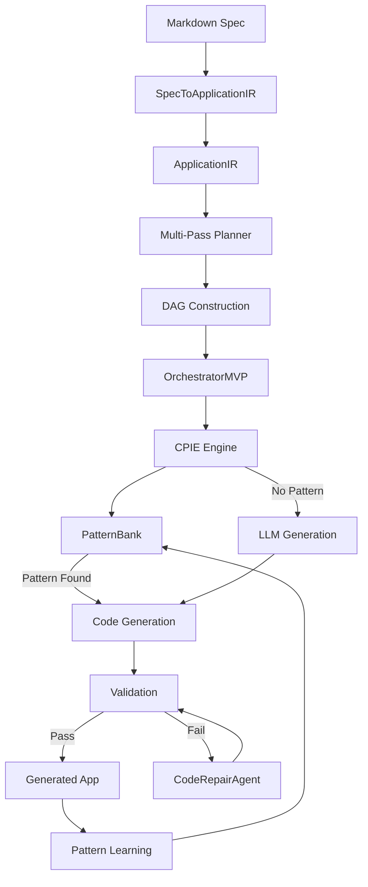

# DevMatrix Core Engine

**Version**: 2.0
**Date**: November 2025
**Status**: Production

---

## Engine Overview

DevMatrix's core engine is a **cognitive code generation system** that combines:

1. **Multi-Pass Planner** - 6-pass planning pipeline
2. **CPIE** - Contextual Pattern Inference Engine
3. **OrchestratorMVP** - Parallel DAG execution
4. **PatternBank** - Vector-based pattern storage (Qdrant)
5. **CodeRepairAgent** - IR-aware code repair

---

## Multi-Pass Planner (6 Passes)

**File**: `src/cognitive/planning/multi_pass_planner.py`

```
Pass 1: Requirements Pass
    └─> Extract functional requirements from spec

Pass 2: Architecture Pass
    └─> Determine system structure, entities, relationships

Pass 3: Contract Pass
    └─> Define API contracts, endpoints, schemas

Pass 4: Integration Pass
    └─> Map cross-entity dependencies

Pass 5: Atomic Breakdown Pass
    └─> Decompose into atomic generation units

Pass 6: Validation Pass
    └─> Plan validation and compliance checks
```

### Semantic Task Signature

```python
task_name = f"{entity}_{intent}_{purpose}"
signature = SemanticTaskSignature(
    purpose=purpose,
    intent=intent,
    inputs=inputs,
    outputs=outputs,
    domain=domain,
    constraints=constraints
)
```

---

## CPIE - Contextual Pattern Inference Engine

**File**: `src/cognitive/inference/cpie.py`

The CPIE implements a **dual-path inference strategy**:

```python
# Path 1: Pattern-first (fast, deterministic)
code = infer_from_pattern(signature, pattern_bank, co_reasoning_system)
if code and validate_constraints(code):
    return code

# Path 2: First-principles (LLM, slower)
code = infer_from_first_principles(signature, co_reasoning_system)
if code and validate_constraints(code):
    return code

# Path 3: Retry with enriched context
code = retry_with_context(signature, previous_failure, enriched_context)
```

**Key Feature**: Having a dual pattern-first + first-principles engine with controlled retries is extremely rare in the industry.

---

## OrchestratorMVP - Parallel Execution

**File**: `src/cognitive/orchestration/orchestrator_mvp.py`

Executes DAG levels in parallel with backoff and retries:

```python
for level in dag.levels:
    parallel_tasks = [
        executor.submit(self._execute_atom, atom)
        for atom in level
    ]
    wait(parallel_tasks)
```

**Capabilities**:
- Level-based parallelization
- Exponential backoff on failure
- Configurable retry limits
- DAG dependency resolution

---

## PatternBank (Vector Storage)

**Backend**: Qdrant

The PatternBank stores successful generation patterns for reuse:

```python
class PatternBank:
    def store_pattern(self, signature: SemanticTaskSignature, code: str, metrics: dict):
        embedding = self.encoder.encode(signature.to_string())
        self.qdrant.upsert(
            collection="patterns",
            points=[{
                "id": signature.hash(),
                "vector": embedding,
                "payload": {
                    "code": code,
                    "metrics": metrics,
                    "uses": 0,
                    "success_rate": 1.0
                }
            }]
        )

    def find_pattern(self, signature: SemanticTaskSignature) -> Optional[Pattern]:
        embedding = self.encoder.encode(signature.to_string())
        results = self.qdrant.search(
            collection="patterns",
            query_vector=embedding,
            limit=5
        )
        return self._rank_and_select(results)
```

---

## CodeRepairAgent

**File**: `src/mge/v2/agents/code_repair_agent.py`

IR-aware code repair for fixing compliance gaps:

```python
class CodeRepairAgent:
    def __init__(
        self,
        output_path: Path,
        application_ir: Optional[ApplicationIR] = None,
        llm_client: Optional[EnhancedAnthropicClient] = None
    ):
        self.output_path = Path(output_path).resolve()
        self.application_ir = application_ir

    async def repair(
        self,
        compliance_report,
        max_attempts: int = 3
    ) -> RepairResult:
        if self.application_ir:
            return await self._repair_from_ir(compliance_report, max_attempts)
        else:
            raise ValueError("ApplicationIR required for repair")
```

### Repair Strategy (IR-Centric)

```python
async def _repair_from_ir(self, compliance_report, max_attempts):
    repairs_applied = []

    # Find missing entities from IR
    for entity_name in compliance_report.entities_expected:
        if entity_name not in compliance_report.entities_implemented:
            entity_def = next(
                (e for e in self.application_ir.domain_model.entities
                 if e.name.lower() == entity_name.lower()),
                None
            )
            if entity_def:
                success = self._repair_entity_from_ir(entity_def)
                repairs_applied.append(f"Added entity: {entity_name}")

    # Find missing endpoints from IR
    for endpoint_str in compliance_report.endpoints_expected:
        if endpoint_str not in compliance_report.endpoints_implemented:
            endpoint_def = self._find_endpoint_in_ir(endpoint_str)
            if endpoint_def:
                self._repair_endpoint_from_ir(endpoint_def)
                repairs_applied.append(f"Added endpoint: {endpoint_str}")

    return RepairResult(success=len(repairs_applied) > 0, repairs_applied=repairs_applied)
```

---

## LLM Model Strategy

**File**: `src/llm/model_selector.py`

DevMatrix uses a tiered model strategy based on task complexity:

| Tier | Model | Model ID | Use Cases |
|------|-------|----------|-----------|
| **Opus** | Claude Opus 4.5 | `claude-opus-4-5-20251101` | Deep thinking, architecture, discovery |
| **Sonnet** | Claude Sonnet 4.5 | `claude-sonnet-4-5-20250929` | Analysis, orchestration, validation |
| **Haiku** | Claude Haiku 4.5 | `claude-haiku-4-5-20251001` | Code gen, repair, tests, docs |

### Selection Logic

```python
def _select_model_logic(self, task_type, complexity):
    # Rule 1: Deep thinking -> Opus
    if task_type in [DISCOVERY, MASTERPLAN_GENERATION]:
        return OPUS_4_5

    # Rule 2: Code tasks -> Haiku
    if task_type in [TASK_EXECUTION, CODE_REPAIR, TEST_GENERATION]:
        return HAIKU_4_5

    # Rule 3: Analysis -> Sonnet
    if task_type in [CODE_REVIEW, VALIDATION]:
        return SONNET_4_5

    # Rule 4: Critical complexity -> Opus
    if complexity == CRITICAL:
        return OPUS_4_5

    # Default -> Haiku
    return HAIKU_4_5
```

### Pricing (Nov 2025)

| Model | Input/1M | Output/1M | Cached/1M |
|-------|----------|-----------|-----------|
| Opus 4.5 | $15.00 | $75.00 | $1.50 |
| Sonnet 4.5 | $3.00 | $15.00 | $0.30 |
| Haiku 4.5 | $1.00 | $5.00 | $0.10 |

---

## Flow Diagram



---

## Key Strengths

1. **Formal IR** - Not ad-hoc prompting, structured intermediate representation
2. **Multi-Pass Planning** - Industrial-grade pipeline comparable to compilers
3. **Dual Inference** - Pattern-first with LLM fallback
4. **Parallel Execution** - Real DAG-based parallelization
5. **IR-Aware Repair** - Repairs guided by source of truth
6. **Continuous Learning** - Patterns promoted from LLM to deterministic

---

## Related Documentation

- [02-ARCHITECTURE.md](02-ARCHITECTURE.md) - Stratified architecture
- [04-IR_SYSTEM.md](04-IR_SYSTEM.md) - ApplicationIR details
- [06-VALIDATION.md](06-VALIDATION.md) - Validation system

---

*DevMatrix - Cognitive Code Generation Engine*
