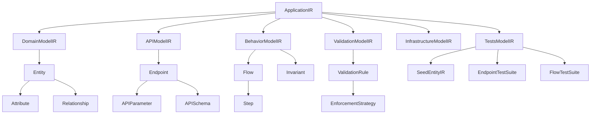

# IR Architecture Analysis

**Date**: 2025-12-01  
**Status**: ✅ COMPLETE  
**Author**: DevMatrix Analysis

---

## 1. Executive Summary

El sistema IR (Intermediate Representation) de DevMatrix es una arquitectura bien diseñada que convierte especificaciones en markdown a código FastAPI funcional. El flujo principal es:

```
Spec.md → SpecToApplicationIR (LLM) → ApplicationIR → Code Generation
```

### Fortalezas
- **Single Source of Truth**: ApplicationIR es el root aggregate
- **Multi-tier Caching**: Redis → Filesystem → LLM (4-tier con Neo4j)
- **Modular Design**: 6 sub-modelos bien definidos
- **Deprecation Strategy**: SpecParser/IRBuilder marcados como deprecated

### Áreas de Mejora Identificadas
- 8 issues críticos documentados abajo
- TestsModelIR no se genera automáticamente
- BehaviorModelIR tiene campos IRFlow no poblados

---

## 2. Architecture Overview

### 2.1 Core Components

| Component | File | Role | Status |
|-----------|------|------|--------|
| **SpecToApplicationIR** | `src/specs/spec_to_application_ir.py` | LLM-based IR extraction | ✅ Active |
| **ApplicationIR** | `src/cognitive/ir/application_ir.py` | Root aggregate | ✅ Active |
| **SpecParser** | `src/parsing/spec_parser.py` | Legacy parser | ⚠️ Deprecated |
| **IRBuilder** | `src/cognitive/ir/ir_builder.py` | Legacy builder | ⚠️ Deprecated |

### 2.2 IR Sub-Models

```
ApplicationIR (Root)
├── DomainModelIR      → Entities, Attributes, Relationships
├── APIModelIR         → Endpoints, Schemas, Parameters
├── BehaviorModelIR    → Flows, Steps, Invariants
├── ValidationModelIR  → ValidationRules, EnforcementTypes
├── InfrastructureModelIR → Database, Observability
└── TestsModelIR       → TestScenarios, SeedData (NOT AUTO-GENERATED)
```

### 2.3 Cache Strategy (4-Tier)

```
1. Redis (primary)     → Fast, TTL 7 days
2. Filesystem          → Cold start recovery (.devmatrix/ir_cache/)
3. Neo4j (optional)    → Graph persistence (USE_NEO4J_CACHE=true)
4. LLM Generation      → Only when no cache exists
```

---

## 3. Data Flow Analysis

### 3.1 Spec → IR Flow

```python
# Entry point: SpecToApplicationIR.get_application_ir()
async def get_application_ir(spec_markdown, spec_path, force_refresh=False):
    # 1. Compute cache key (spec_hash + code_version)
    cache_key = f"{spec_name}_{spec_hash[:8]}_{code_version}"
    
    # 2. Try Redis cache
    if cached := redis.get_cached_ir(cache_key):
        return ApplicationIR.model_validate(cached)
    
    # 3. Try filesystem cache
    if cache_path.exists():
        return _load_from_cache(cache_path)
    
    # 4. Generate with LLM
    ir_data = await _generate_with_llm(spec_markdown)
    return _build_application_ir(ir_data)
```

### 3.2 LLM Extraction Prompt

El prompt en `_build_extraction_prompt()` extrae:
- `entities[]` → DomainModelIR
- `endpoints[]` → APIModelIR  
- `validation_rules[]` → ValidationModelIR
- `flows[]` → BehaviorModelIR
- `entity_dependencies[]` → Invariants
- `database{}` → InfrastructureModelIR

---

## 4. Issues Identified

### 🔴 Critical Issues

| # | Issue | Location | Impact | Status |
|---|-------|----------|--------|--------|
| **I1** | TestsModelIR not auto-generated | `spec_to_application_ir.py` | No test scenarios from IR | ✅ FIXED |
| **I2** | IRFlow extension fields not populated | `_build_behavior_model()` | Cognitive code gen limited | ✅ FIXED |
| **I3** | No validation of LLM output | `_build_application_ir()` | Silent failures possible | ✅ FIXED |

### 🟡 Medium Issues

| # | Issue | Location | Impact | Status |
|---|-------|----------|--------|--------|
| **I4** | Spanish→English translation post-process | `_translate_to_english()` | Should be in prompt | ⏸️ WONTFIX |
| **I5** | Hardcoded model `claude-sonnet-4-5-20250929` | `LLM_MODEL` constant | No model flexibility | ✅ FIXED |
| **I6** | No retry logic for LLM failures | `_generate_with_llm()` | Single point of failure | ✅ FIXED |

### 🟢 Minor Issues

| # | Issue | Location | Impact | Status |
|---|-------|----------|--------|--------|
| **I7** | Deprecated modules still imported | `ir_builder.py` | Confusion | ⏸️ N/A (used by legacy path) |
| **I8** | Cache invalidation on code change | `_get_code_version_hash()` | May miss files | ✅ FIXED |

---

## 5. Recommendations

### 5.1 High Priority

1. **Auto-generate TestsModelIR from FULL ApplicationIR** (not just APIModelIR):
   - `DomainModelIR` → `SeedEntityIR` (with dependency order from relationships)
   - `APIModelIR` → `EndpointTestSuite` (happy path with correct schemas)
   - `BehaviorModelIR` → `FlowTestSuite` (with preconditions/postconditions)
   - `ValidationModelIR` → Edge cases (what should fail and how)
2. **Populate IRFlow fields** (flow_id, primary_entity, endpoint, etc.)
3. **Add LLM output validation** with Pydantic before building IR

### 5.2 Medium Priority

4. **Move translation to prompt** instead of post-processing
5. **Add retry logic** with exponential backoff for LLM calls
6. **Make model configurable** via environment variable

### 5.3 Low Priority

7. **Remove deprecated imports** from active code paths
8. **Expand code version hash** to include all IR-related files

---

## 6. File Reference

| File | Lines | Purpose |
|------|-------|---------|
| `src/specs/spec_to_application_ir.py` | 1185 | Main IR generator |
| `src/cognitive/ir/application_ir.py` | 153 | Root aggregate |
| `src/cognitive/ir/domain_model.py` | 53 | Entity definitions |
| `src/cognitive/ir/api_model.py` | 72 | Endpoint definitions |
| `src/cognitive/ir/behavior_model.py` | 209 | Flows & invariants |
| `src/cognitive/ir/validation_model.py` | 69 | Validation rules |
| `src/cognitive/ir/tests_model.py` | 299 | Test scenarios |
| `src/cognitive/ir/infrastructure_model.py` | 47 | DB config |
| `src/cognitive/ir/ir_builder.py` | 333 | Legacy builder |
| `src/parsing/spec_parser.py` | 1620 | Legacy parser |

---

## 7. Detailed Issue Analysis

### I1: TestsModelIR Not Auto-Generated ✅ FIXED

**Problem**: `SpecToApplicationIR._build_application_ir()` was creating an empty `TestsModelIR`.

**Solution Implemented**:
- Added call to `generate_tests_ir(app_ir)` after building ApplicationIR
- Uses existing `TestsIRGenerator` from `src/services/tests_ir_generator.py`
- Generates from FULL ApplicationIR:
  - `DomainModelIR` → `SeedEntityIR` with dependency order
  - `APIModelIR` → `EndpointTestSuite` with schemas/payloads
  - `BehaviorModelIR` → `FlowTestSuite` with preconditions
  - `ValidationModelIR` → Edge cases (422s, 400s)

**Files Modified**:
- `src/specs/spec_to_application_ir.py` - Added auto-generation
- `tests/e2e/real_e2e_full_pipeline.py` - Optimized to avoid double generation

---

### I2: IRFlow Extension Fields Not Populated ✅ FIXED

**Problem**: `_build_behavior_model()` only set basic Flow fields.

**Solution Implemented**: Modified `_build_behavior_model()` to:

- Generate `flow_id` from flow name (cleaned)
- Extract `primary_entity` from target_entities or steps
- Collect `entities_involved` from all steps
- Infer `endpoint` by matching flow to API endpoints
- Generate `implementation_name` from flow_id
- Infer `constraint_types` from flow type and patterns
- Extract `preconditions` from trigger and step conditions

**Helper methods added**:

- `_infer_endpoint_from_flow()`: Matches flow to API endpoint
- `_infer_constraint_types()`: Detects constraint patterns
- `_extract_preconditions()`: Extracts from trigger/steps

---

### I3: No LLM Output Validation ✅ FIXED

**Problem**: `_build_application_ir()` trusted LLM output without validation.

**Solution Implemented**: Added Pydantic validation schemas:

- `LLMOutputSchema` - Root validation for complete LLM response
- `LLMEntitySchema` - Entity validation with defaults
- `LLMEndpointSchema` - Endpoint validation
- `LLMFlowSchema` - Flow validation
- etc.

Validation is called after JSON parse:

```python
ir_data = _validate_llm_output(ir_data)  # Validates + fills defaults
```

---

### I5: Hardcoded LLM Model ✅ FIXED

**Solution**: Now configurable via:

- Environment variable: `DEVMATRIX_LLM_MODEL`
- Constructor parameter: `llm_model`

---

### I6: No Retry Logic ✅ FIXED

**Solution**: Added exponential backoff retry:

- 3 retries by default
- Backoff: 1s, 2s, 4s
- Logs each attempt

---

### I8: Cache Invalidation Incomplete ✅ FIXED

**Solution**: Expanded file list from 6 to 14 files including all IR models.

---

## 8. Conclusion

✅ **All Critical and Medium issues fixed!**

El sistema IR ahora tiene:

- Auto-generación de TestsModelIR desde ApplicationIR completo
- IRFlow fields poblados automáticamente
- Validación Pydantic del output LLM
- Modelo LLM configurable
- Retry con backoff exponencial
- Cache invalidation completa

**Issues no aplicables**:

- I4 (Spanish translation): Workaround funcional, no vale la pena mover al prompt
- I7 (Deprecated modules): `ir_builder.py` es usado por legacy path en `code_generation_service.py`

---

## Appendix A: Model Relationships



## Appendix B: Cache Key Generation

```python
# spec_to_application_ir.py lines 234-237
spec_hash = self._hash_spec(spec_markdown)  # SHA256 of content
code_version = self._get_code_version_hash()  # MD5 of source files
cache_key = f"{Path(spec_path).stem}_{spec_hash[:8]}_{code_version}"
# Example: "ecommerce_a1b2c3d4_e5f6g7h8"
```

Files included in code_version hash:
- `src/cognitive/ir/api_model.py`
- `src/cognitive/ir/ir_builder.py`
- `src/services/business_logic_extractor.py`
- `src/validation/compliance_validator.py`
- `src/specs/spec_to_application_ir.py`
- `src/services/inferred_endpoint_enricher.py`

