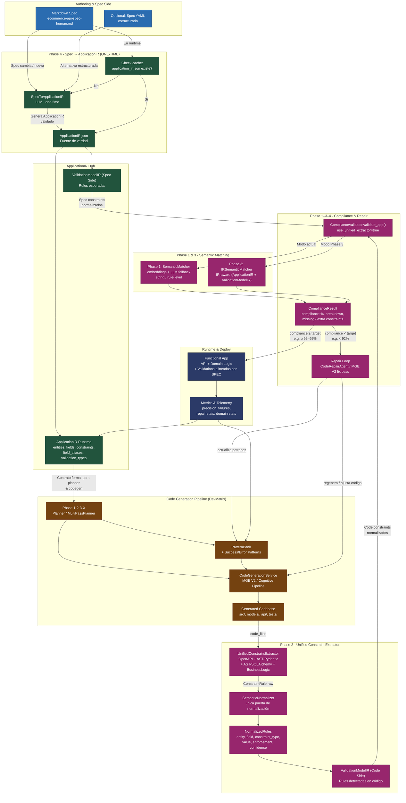
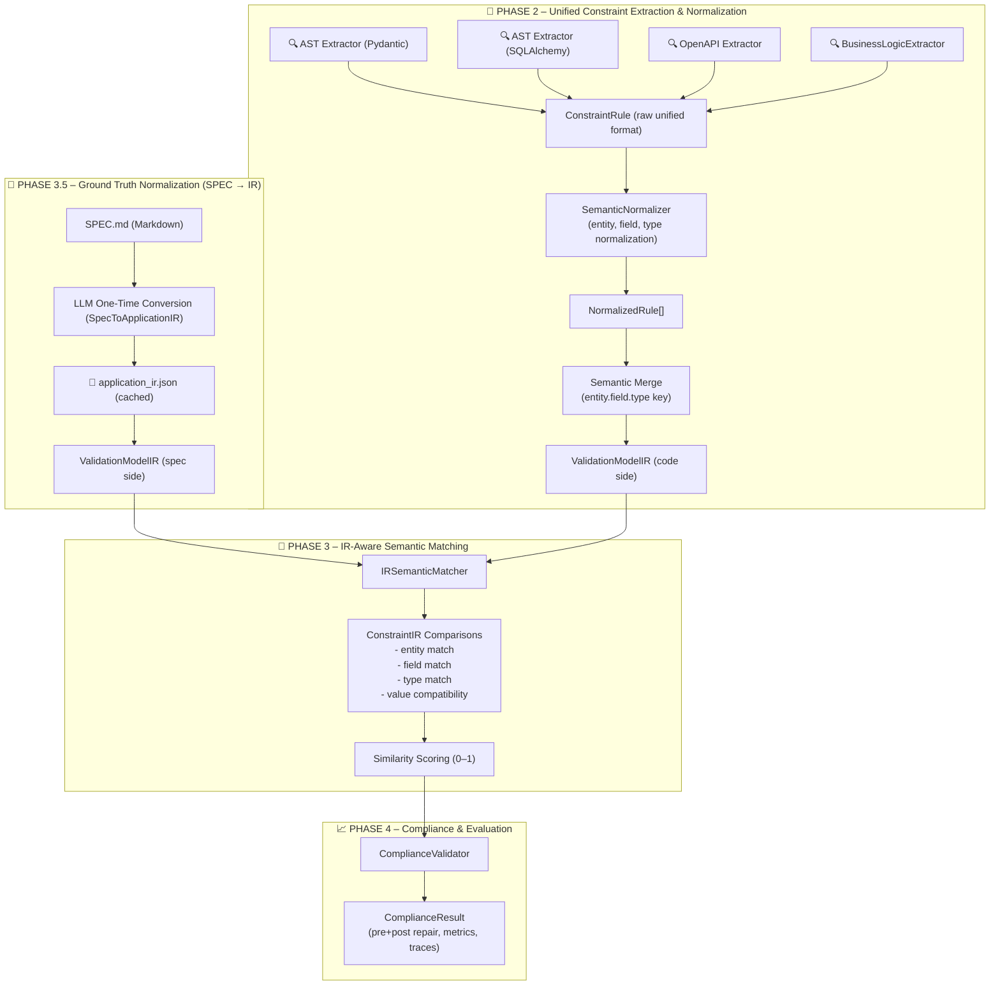

```mermaid

flowchart TB
    %% ORIENTACIÓN GENERAL
    %% left-to-right para ver claro SPEC -> IR -> CODE -> VALIDATION -> APP
    %% ---------------------------------------------------------------

    %% SECCIÓN 1: AUTHORING DE LA SPEC
    subgraph S["Authoring & Spec Side"]
      direction TB
      SM["Markdown Spec<br/>ecommerce-api-spec-human.md"]
      SY["Opcional: Spec YAML<br/>estructurado"]
    end

    %% SECCIÓN 2: GENERACIÓN Y CACHÉ DE APPLICATIONIR
    subgraph IR["Phase 4 - Spec → ApplicationIR #40;ONE-TIME#41;"]
      direction TB
      STAI["SpecToApplicationIR<br/>LLM · one-time"]
      AIC["Check cache:<br/>application_ir.json existe?"]
      AIR["ApplicationIR.json<br/>Fuente de verdad"]
    end

    %% Flujo SPEC → ApplicationIR
    SM -->|"Spec cambia / nueva"| STAI
    SY -->|"Alternativa estructurada"| STAI

    STAI -->|"Genera ApplicationIR<br/>validado"| AIR
    AIC -->|"Sí"| AIR
    AIC -->|"No"| STAI

    %% Punto de entrada runtime: siempre parte de ApplicationIR cacheado
    SM -->|"En runtime"| AIC

    %% SECCIÓN 3: APPLICATIONIR COMO HUB CENTRAL
    subgraph HUB["ApplicationIR Hub"]
      direction TB
      AIR --> VMIR_SPEC["ValidationModelIR #40;Spec Side#41;<br/>Rules esperadas"]
      AIR --> APPIR["ApplicationIR Runtime<br/>entities, fields, constraints,<br/>field_aliases, validation_types"]
    end

    %% SECCIÓN 4: CODE GENERATION PIPELINE
    subgraph CG["Code Generation Pipeline #40;DevMatrix#41;"]
      direction TB
      P1["Phase 1·2·3·X<br/>Planner / MultiPassPlanner"]
      PB["PatternBank<br/>+ Success/Error Patterns"]
      GEN["CodeGenerationService<br/>MGE V2 / Cognitive Pipeline"]
      WS["Generated Codebase<br/>src/, models/, api/, tests/"]
    end

    APPIR -->|"Contrato formal para planner<br/>& codegen"| P1
    P1 --> PB
    P1 --> GEN
    PB --> GEN
    GEN --> WS

    %% SECCIÓN 5: CONSTRAINT EXTRACTION DEL CÓDIGO
    subgraph EX["Phase 2 - Unified Constraint Extractor"]
      direction TB
      CE["UnifiedConstraintExtractor<br/>OpenAPI + AST-Pydantic<br/>+ AST-SQLAlchemy + BusinessLogic"]
      SN["SemanticNormalizer<br/>única puerta de normalización"]
      NR["NormalizedRules<br/>entity, field, constraint_type,<br/>value, enforcement, confidence"]
      VMIR_CODE["ValidationModelIR #40;Code Side#41;<br/>Rules detectadas en código"]
    end

    WS -->|"code_files"| CE
    CE -->|"ConstraintRule raw"| SN
    SN --> NR --> VMIR_CODE

    %% SECCIÓN 6: SEMANTIC MATCHING (PHASE 1 & 3)
    subgraph SMAC["Phase 1 & 3 - Semantic Matching"]
      direction TB
      SM1["Phase 1: SemanticMatcher<br/>embeddings + LLM fallback<br/>string / rule-level"]
      SM3["Phase 3: IRSemanticMatcher<br/>IR-aware #40;ApplicationIR + ValidationModelIR#41;"]
    end

    %% SECCIÓN 7: COMPLIANCE VALIDATOR + REPAIR LOOP
    subgraph CVG["Phase 1–3–4 - Compliance & Repair"]
      direction TB
      CV["ComplianceValidator.validate_app#40;#41;<br/>use_unified_extractor=true"]
      COMP["ComplianceResult<br/>compliance %, breakdown,<br/>missing / extra constraints"]
      REP["Repair Loop<br/>CodeRepairAgent / MGE V2 fix pass"]
    end

    %% Wiring de validación
    VMIR_SPEC -->|"Spec constraints<br/>normalizados"| CV
    VMIR_CODE -->|"Code constraints<br/>normalizados"| CV

    CV -->|"Modo actual"| SM1
    CV -->|"Modo Phase 3"| SM3

    SM1 --> COMP
    SM3 --> COMP

    COMP -->|"compliance < target<br/>e.g. < 92%"| REP
    REP -->|"regenera / ajusta código"| GEN
    REP -->|"actualiza patrones"| PB

    %% SECCIÓN 8: APP FUNCIONANDO
    subgraph RUN["Runtime & Deploy"]
      direction TB
      APP["Functional App<br/>API + Domain Logic<br/>+ Validations alineadas con SPEC"]
      MET["Metrics & Telemetry<br/>precision, failures,<br/>repair stats, domain stats"]
    end

    COMP -->|"compliance ≥ target<br/>e.g. ≥ 92–95%"| APP
    APP --> MET
    MET --> PB
    MET --> APPIR

    %% ANOTACIONES CLAVE
    classDef spec fill:#2b6cb0,stroke:#1a365d,color:#ffffff;
    classDef ir fill:#22543d,stroke:#1c4532,color:#ffffff;
    classDef code fill:#744210,stroke:#652b19,color:#ffffff;
    classDef val fill:#97266d,stroke:#702459,color:#ffffff;
    classDef run fill:#2b3a67,stroke:#1a202c,color:#ffffff;

    class SM,SY spec;
    class STAI,AIC,AIR,APPIR,VMIR_SPEC ir;
    class P1,PB,GEN,WS code;
    class CE,SN,NR,VMIR_CODE,SM1,SM3,CV,COMP,REP val;
    class APP,MET run;
```

```mermaid
flowchart TB

%% ============================
%% PHASE 3.5 – SPEC → ApplicationIR
%% ============================

subgraph P35["📘 PHASE 3.5 – Ground Truth Normalization (SPEC → IR)"]
    direction TB

    A1["SPEC.md (Markdown)"]
    A2["LLM One-Time Conversion (SpecToApplicationIR)"]
    A3["📄 application_ir.json (cached)"]
    A4["ValidationModelIR (spec side)"]

    A1 --> A2 --> A3 --> A4
end


%% ============================
%% PHASE 2 – CODE EXTRACTION & NORMALIZATION
%% ============================

subgraph P2["🧱 PHASE 2 – Unified Constraint Extraction & Normalization"]
    direction TB

    %% Sources
    S1["🔍 AST Extractor (Pydantic)"]
    S2["🔍 AST Extractor (SQLAlchemy)"]
    S3["🔍 OpenAPI Extractor"]
    S4["🔍 BusinessLogicExtractor"]

    %% Combined
    C1["ConstraintRule (raw unified format)"]

    %% Normalizer
    N1["SemanticNormalizer\n(entity, field, type normalization)"]
    N2["NormalizedRule[]"]

    %% Dedup
    D1["Semantic Merge\n(entity.field.type key)"]
    D2["ValidationModelIR (code side)"]

    %% Flow
    S1 --> C1
    S2 --> C1
    S3 --> C1
    S4 --> C1

    C1 --> N1 --> N2 --> D1 --> D2
end


%% ============================
%% PHASE 3 – IR Semantic Matching (IR vs IR)
%% ============================

subgraph P3["🧠 PHASE 3 – IR-Aware Semantic Matching"]
    direction TB

    M1["IRSemanticMatcher"]
    M2["ConstraintIR Comparisons\n- entity match\n- field match\n- type match\n- value compatibility"]
    M3["Similarity Scoring (0–1)"]

    M1 --> M2 --> M3
end


%% ============================
%% PHASE 4 – COMPLIANCE / OUTPUT
%% ============================

subgraph P4["📈 PHASE 4 – Compliance & Evaluation"]
    direction TB

    R1["ComplianceValidator"]
    R2["ComplianceResult\n(pre+post repair, metrics, traces)"]

    R1 --> R2
end


%% ============================
%% GLOBAL PIPELINE CONNECTIONS
%% ============================

A4 --> M1
D2 --> M1

M3 --> R1
```