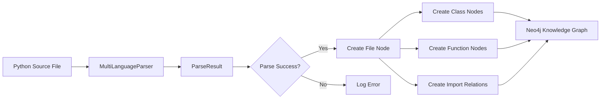

# Source Code Indexing to Neo4j Knowledge Graph

## Overview

Sistema de indexación que parsea código fuente Python y lo almacena en el knowledge graph de Neo4j para análisis, navegación y retrieval semántico.

## Componentes

### Script Principal
**Ubicación**: `/tmp/index_source_code_to_neo4j.py`

**Función**: Parsear archivos Python y crear nodos/relaciones en Neo4j

**Dependencias**:
- `MultiLanguageParser` (src/atomization/parser.py)
- `Neo4jPatternClient` (src/cognitive/infrastructure/neo4j_client.py)

## Esquema de Neo4j

### Nodos

#### File
Representa un archivo Python del codebase.

```cypher
(:File {
    path: String,           // Ruta absoluta del archivo
    name: String,           // Nombre del archivo
    code: String,           // Contenido completo del archivo
    loc: Integer,           // Lines of Code
    classes: Integer,       // Cantidad de clases
    functions: Integer,     // Cantidad de funciones
    imports: Integer,       // Cantidad de imports
    last_indexed: DateTime  // Timestamp de última indexación
})
```

#### Class
Representa una clase Python.

```cypher
(:Class {
    name: String,           // Nombre de la clase
    file_path: String,      // Archivo que contiene la clase
    start_line: Integer,    // Línea de inicio
    end_line: Integer,      // Línea de fin
    loc: Integer,           // Lines of Code
    methods: [String],      // Lista de métodos
    bases: [String]         // Clases base (herencia)
})
```

#### Enum
Subtype de Class para enumeraciones.

```cypher
(:Class:Enum {
    // Mismos campos que Class
    // Label adicional :Enum para identificar enumeraciones
})
```

**Ejemplo**: `EnforcementType` de validation_model.py

#### Function
Representa una función Python.

```cypher
(:Function {
    name: String,           // Nombre de la función
    file_path: String,      // Archivo que contiene la función
    start_line: Integer,    // Línea de inicio
    end_line: Integer,      // Línea de fin
    loc: Integer,           // Lines of Code
    complexity: Float,      // Complejidad ciclomática
    params: [String],       // Lista de parámetros
    signature: String       // Signature completa
})
```

**Ejemplo**: `_get_enforcement_for_field` de production_code_generators.py

#### Module
Representa un módulo Python importado.

```cypher
(:Module {
    name: String            // Nombre del módulo (ej: "pydantic", "typing")
})
```

### Relaciones

#### CONTAINS
```cypher
(:File)-[:CONTAINS]->(:Class)
(:File)-[:CONTAINS]->(:Function)
```

Indica que un archivo contiene una clase o función.

#### IMPORTS
```cypher
(:File)-[:IMPORTS {module: String}]->(:Module)
```

Indica que un archivo importa un módulo.

#### HAS_ATTRIBUTE (Futuro)
```cypher
(:Class)-[:HAS_ATTRIBUTE]->(:Attribute)
```

Relación para atributos de clase (no implementada aún).

## Uso

### Indexar Todo el Proyecto

```bash
cd /home/kwar/code/agentic-ai
python /tmp/index_source_code_to_neo4j.py
```

Indexa todo el directorio `src/` recursivamente.

### Indexar Archivos Específicos

```bash
# Indexar validation_model.py
python /tmp/index_source_code_to_neo4j.py \
    src/cognitive/ir/validation_model.py

# Indexar production_code_generators.py
python /tmp/index_source_code_to_neo4j.py \
    src/services/production_code_generators.py

# Indexar ambos (cambios de Fase 1)
python /tmp/index_source_code_to_neo4j.py \
    src/cognitive/ir/validation_model.py \
    src/services/production_code_generators.py
```

### Indexar Directorio Específico

```bash
# Indexar solo src/cognitive
python /tmp/index_source_code_to_neo4j.py src/cognitive

# Indexar solo src/services
python /tmp/index_source_code_to_neo4j.py src/services
```

## Queries Útiles

### Verificar Fase 1 Cambios

```cypher
// Ver EnforcementType enum
MATCH (e:Class:Enum {name: 'EnforcementType'})
OPTIONAL MATCH (f:File)-[:CONTAINS]->(e)
RETURN e.name, e.bases, f.path, e.start_line

// Ver ValidationRule con enforcement fields
MATCH (c:Class {name: 'ValidationRule'})
OPTIONAL MATCH (f:File)-[:CONTAINS]->(c)
RETURN c.name, f.path, c.start_line, c.methods

// Ver función _get_enforcement_for_field
MATCH (fn:Function)
WHERE fn.name = '_get_enforcement_for_field'
OPTIONAL MATCH (f:File)-[:CONTAINS]->(fn)
RETURN fn.name, fn.signature, f.path, fn.start_line

// Ver todas las funciones que usan enforcement
MATCH (fn:Function)
WHERE fn.name CONTAINS 'enforcement' OR fn.signature CONTAINS 'enforcement'
OPTIONAL MATCH (f:File)-[:CONTAINS]->(fn)
RETURN fn.name, f.path, fn.start_line
ORDER BY f.path
```

### Navegación del Knowledge Graph

```cypher
// Ver estructura completa de validation_model.py
MATCH (f:File)
WHERE f.name = 'validation_model.py'
OPTIONAL MATCH (f)-[:CONTAINS]->(node)
RETURN f.path,
       collect(DISTINCT labels(node)) as node_types,
       collect(DISTINCT node.name) as contents

// Ver dependencias de production_code_generators.py
MATCH (f:File {name: 'production_code_generators.py'})
OPTIONAL MATCH (f)-[:IMPORTS]->(m:Module)
RETURN f.path, collect(m.name) as imports

// Buscar todas las clases que heredan de Enum
MATCH (c:Class:Enum)
OPTIONAL MATCH (f:File)-[:CONTAINS]->(c)
RETURN c.name, f.path, c.bases
ORDER BY c.name
```

### Análisis de Código

```cypher
// Archivos con más clases
MATCH (f:File)
WHERE f.classes > 0
RETURN f.name, f.path, f.classes, f.functions, f.loc
ORDER BY f.classes DESC
LIMIT 10

// Funciones más complejas
MATCH (fn:Function)
WHERE fn.complexity > 0
OPTIONAL MATCH (f:File)-[:CONTAINS]->(fn)
RETURN fn.name, f.path, fn.complexity, fn.loc
ORDER BY fn.complexity DESC
LIMIT 10

// Archivos más grandes
MATCH (f:File)
RETURN f.name, f.path, f.loc, f.classes, f.functions
ORDER BY f.loc DESC
LIMIT 10
```

## Flujo de Indexación



## Integración con Sistema Existente

### Fase 1: Quick Wins
Cambios indexados:
- ✅ `EnforcementType` enum en validation_model.py
- ✅ `ValidationRule.enforcement_type` field
- ✅ `_get_enforcement_for_field()` function
- ✅ Enforcement logic en `generate_schemas()`
- ✅ Enforcement logic en `generate_entities()`

### Uso en Desarrollo
```bash
# Después de modificar código fuente, re-indexar
python /tmp/index_source_code_to_neo4j.py src/cognitive/ir/validation_model.py

# Verificar con query
# (usar queries de sección anterior)
```

### Uso en CI/CD (Futuro)
```yaml
# .github/workflows/index-code.yml
name: Index Code to Neo4j
on:
  push:
    branches: [main, develop]
    paths:
      - 'src/**/*.py'

jobs:
  index:
    runs-on: ubuntu-latest
    steps:
      - uses: actions/checkout@v2
      - name: Index changed files
        run: |
          python /tmp/index_source_code_to_neo4j.py $(git diff --name-only HEAD~1 HEAD | grep '\.py$')
```

## Limitaciones Actuales

1. **Solo Python**: No indexa TypeScript/JavaScript aún (parser soporta, script no)
2. **No Incremental**: Re-indexa archivos completos (no detecta cambios)
3. **Sin Atributos**: No extrae atributos de clase detalladamente
4. **Sin Docstrings**: No extrae/indexa docstrings
5. **Sin Type Hints**: No procesa type annotations

## Roadmap

### Corto Plazo
- [ ] Extraer enum values (ej: DESCRIPTION, VALIDATOR, etc.)
- [ ] Extraer atributos de clase con tipos
- [ ] Indexar código generado por tests E2E
- [ ] Agregar timestamp de modificación de archivo

### Mediano Plazo
- [ ] Indexación incremental (solo archivos modificados)
- [ ] Soporte TypeScript/JavaScript
- [ ] Extraer docstrings y almacenar como propiedad
- [ ] Detectar relaciones entre clases (uso, composición)

### Largo Plazo
- [ ] Integración con sistema de retrieval semántico
- [ ] Auto-indexación en pre-commit hook
- [ ] Dashboard de métricas de código
- [ ] Búsqueda semántica sobre knowledge graph

## Referencias

- **Parser**: [src/atomization/parser.py](../../../src/atomization/parser.py)
- **Neo4j Client**: [src/cognitive/infrastructure/neo4j_client.py](../../../src/cognitive/infrastructure/neo4j_client.py)
- **Neo4j Schema**: [src/cognitive/infrastructure/neo4j_schema.py](../../../src/cognitive/infrastructure/neo4j_schema.py)
- **Compliance Plan**: [../enhancement/100_PERCENT_COMPLIANCE_PLAN.md](../enhancement/100_PERCENT_COMPLIANCE_PLAN.md)
