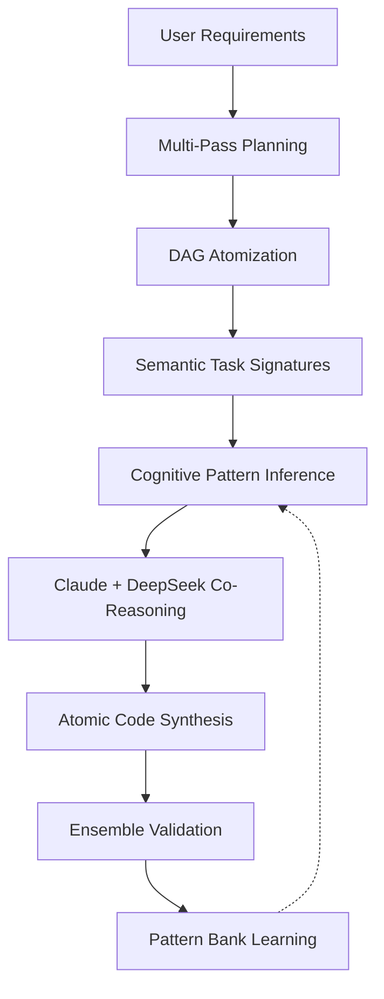

# DevMatrix: Arquitectura Árbol Atómico con Inferencia Cognitiva

**Arquitectura de Alta Precisión mediante Inferencia Semántica y Razonamiento Puro**
**Autor**: Ariel E. Ghysels
**Fecha**: 2025-11-13
**Estado**: DEFINITIVO - Arquitectura 100% cognitiva, 92-99% precisión

---

## Resumen Ejecutivo

### Visión

DevMatrix implementa una arquitectura **100% cognitiva** que genera código mediante inferencia semántica y razonamiento en tiempo real, sin ningún código predefinido.

### Métricas Objetivo

- **Precisión MVP (4 semanas)**: 92% usando inferencia cognitiva pura
- **Precisión Final (6 semanas)**: 99% con LRM selectivo
- **Mantenimiento manual**: 0% - sistema auto-evolutivo
- **Flexibilidad semántica**: 100% - adaptación perfecta al contexto

### Innovación Clave

**Atomización en Árbol/DAG ANTES de la generación**, no después. Cada nodo atómico se procesa mediante firmas semánticas y razonamiento cognitivo puro.

---

## 1. El Problema Actual: 40% de Precisión

### Sistema Actual (Wave-Based Sequential)

```
DISCOVERY → MASTERPLAN → GENERACIÓN (500 LOC) → ATOMIZACIÓN POST-HOC → WAVES → 40% precisión
```

### Problemas Identificados

1. **Atomización Reactiva**: Se genera código de 50-500 LOC y DESPUÉS se corta en átomos
2. **Cascada de Errores**: Error en átomo 1 contamina átomos 2-800
3. **No-Determinismo**: 8 fuentes de indeterminismo sin control
4. **Contexto Global**: Todos los átomos ven todo (contaminación cruzada)
5. **Dependencias Mutables**: El grafo cambia durante la ejecución

### Matemática del Fracaso

```python
# Con 800 átomos y 95% precisión por átomo
P(éxito_proyecto) = 0.95^800 ≈ 0%  # Los errores se componen exponencialmente
```

---

## 2. La Solución: Arquitectura de Inferencia Cognitiva Pura

### Concepto Fundamental

```
SPECS → MULTI-PASS PLANNING (6 PASADAS) → DAG ATOMIZATION → SEMANTIC SIGNATURES →
COGNITIVE INFERENCE → CO-REASONING → ATOMIC SYNTHESIS → VALIDATION → ML LOOP
```

### Arquitectura de Alto Nivel



### Principios Clave

1. **Inferencia Pura**: Todo código se genera mediante razonamiento
2. **Semantic Signatures**: Capturan la ESENCIA, no la implementación
3. **Cognitive Reasoning**: Razonamiento desde primeros principios
4. **Auto-Learning**: Cada éxito mejora el sistema automáticamente
5. **Co-Reasoning**: Múltiples LLMs colaboran en cada decisión

---

## 3. Componentes Core de la Arquitectura

### 3.1 Semantic Task Signatures (STS)

Las firmas semánticas capturan QUÉ hacer, no CÓMO hacerlo:

```python
class SemanticTaskSignature:
    """
    Firma semántica que captura la esencia de una tarea atómica
    Define QUÉ hacer sin especificar CÓMO hacerlo
    """

    def __init__(self, atom: AtomicTask):
        # Identificación semántica única
        self.purpose = self.normalize_purpose(atom.purpose)
        self.intent = self.extract_intent(atom)

        # Estructura de datos normalizada
        self.inputs = self.normalize_types(atom.inputs)
        self.outputs = self.normalize_types(atom.outputs)

        # Contexto y restricciones
        self.domain = self.infer_domain(atom)
        self.constraints = self.extract_constraints(atom)

        # Características de calidad
        self.security_level = self.infer_security(atom)
        self.performance_tier = self.infer_performance(atom)
        self.idempotency = self.check_idempotency(atom)

        # Hash único para búsqueda rápida
        self.semantic_hash = self.compute_semantic_hash()

    def similarity_score(self, other: 'SemanticTaskSignature') -> float:
        """Calcula similitud semántica entre firmas"""
        scores = []

        # Similitud de propósito (40% peso)
        purpose_sim = self.text_similarity(self.purpose, other.purpose)
        scores.append(purpose_sim * 0.4)

        # Similitud de I/O (30% peso)
        io_sim = self.io_similarity(other)
        scores.append(io_sim * 0.3)

        # Similitud de dominio (20% peso)
        domain_sim = 1.0 if self.domain == other.domain else 0.5
        scores.append(domain_sim * 0.2)

        # Similitud de constraints (10% peso)
        constraint_sim = self.constraint_similarity(other)
        scores.append(constraint_sim * 0.1)

        return sum(scores)
```

### 3.2 Cognitive Pattern Inference Engine (CPIE)

Motor que RAZONA sobre implementaciones, no copia código:

```python
class CognitivePatternInferenceEngine:
    """
    Motor de inferencia cognitiva que razona sobre implementaciones
    Genera código desde principios fundamentales
    """

    def __init__(self):
        self.pattern_bank = PatternBankMVP()
        self.claude = ClaudeOpus()
        self.deepseek = DeepSeek70B()

    async def infer_implementation(self,
                                  signature: SemanticTaskSignature,
                                  context: dict) -> str:
        """
        Infiere la implementación óptima para una firma semántica
        """

        # 1. Buscar patrones similares aprendidos
        similar_patterns = await self.pattern_bank.find_similar(
            signature,
            threshold=0.85  # 85% similitud semántica mínima
        )

        if similar_patterns:
            # Adaptar patrón existente mediante razonamiento
            return await self.adapt_via_reasoning(
                similar_patterns[0],
                signature,
                context
            )
        else:
            # Generar desde primeros principios
            return await self.generate_from_principles(
                signature,
                context
            )

    async def generate_from_principles(self,
                                      signature: SemanticTaskSignature,
                                      context: dict) -> str:
        """Genera código razonando desde cero"""

        # Claude diseña la estrategia
        strategy = await self.claude.generate(f"""
        Diseña solución para:
        Propósito: {signature.purpose}
        Inputs: {signature.inputs}
        Outputs: {signature.outputs}
        Constraints: {signature.constraints}

        Define el algoritmo paso a paso.
        """)

        # DeepSeek implementa
        code = await self.deepseek.generate(f"""
        Implementa esta estrategia en máximo 10 líneas:
        {strategy}

        Stack: {context['stack']}
        """, temperature=0.0, seed=42)

        return code
```

### 3.3 Pattern Bank Auto-Evolutivo

Banco de patrones que aprende automáticamente:

```python
class PatternBankMVP:
    """
    Almacena patrones cognitivos exitosos
    Auto-evoluciona con cada proyecto
    """

    def __init__(self):
        self.vector_db = FAISS(dimension=768)
        self.embedder = SentenceTransformer('all-MiniLM-L6-v2')
        self.patterns = {}
        self.success_threshold = 0.95

    async def store_success(self,
                           signature: SemanticTaskSignature,
                           code: str,
                           metrics: dict):
        """Solo almacena patrones altamente exitosos"""

        if metrics['precision'] < self.success_threshold:
            return

        # Crear embedding semántico
        text = f"{signature.purpose}\n{code}"
        embedding = self.embedder.encode(text)

        # Almacenar en vector DB
        pattern_id = str(uuid4())
        self.vector_db.add(embedding, pattern_id)

        # Metadata para aprendizaje
        self.patterns[pattern_id] = {
            'signature': signature.to_dict(),
            'code': code,
            'metrics': metrics,
            'usage_count': 0,
            'success_rate': 1.0,
            'domain': signature.domain
        }

    async def find_similar(self,
                          signature: SemanticTaskSignature,
                          threshold: float = 0.85) -> List[dict]:
        """Busca patrones similares semánticamente"""

        query_text = signature.purpose
        query_embedding = self.embedder.encode(query_text)

        results = self.vector_db.search(
            query_embedding,
            k=5  # Top 5 más similares
        )

        similar_patterns = []
        for result in results:
            if result.score >= threshold:
                pattern = self.patterns[result.id]
                pattern['similarity_score'] = result.score
                similar_patterns.append(pattern)

        return similar_patterns
```

---

## 4. Sistema de Planning y Ejecución

### 4.1 Multi-Pass Planning (6 Pasadas)

```python
class MultiPassPlanningMVP:
    """
    Sistema de planning con 6 pasadas de refinamiento progresivo
    """

    def __init__(self):
        self.claude = ClaudeOpus()
        self.deepseek = DeepSeek70B()
        self.dag_builder = DAGBuilder()

    async def generate_masterplan(self, requirements: str) -> DAG:
        """
        Genera un masterplan mediante 6 pasadas de refinamiento
        """

        # Pass 1: Requirements Analysis
        print("🔍 Pass 1: Analyzing requirements...")
        analyzed_reqs = await self.pass1_requirements_analysis(requirements)

        # Pass 2: Architecture Design
        print("🏗️ Pass 2: Designing architecture...")
        architecture = await self.pass2_architecture_design(analyzed_reqs)

        # Pass 3: Contract Definition
        print("📝 Pass 3: Defining contracts...")
        contracts = await self.pass3_contract_definition(architecture)

        # Pass 4: Integration Points
        print("🔗 Pass 4: Identifying integrations...")
        integrations = await self.pass4_integration_points(contracts)

        # Pass 5: Atomic Task Breakdown
        print("⚛️ Pass 5: Breaking down to atomic tasks...")
        atomic_tasks = await self.pass5_atomic_breakdown(integrations)

        # Pass 6: Validation & Optimization
        print("✅ Pass 6: Validating and optimizing...")
        validated_tasks = await self.pass6_validation(atomic_tasks)

        # Construir DAG
        dag = await self.dag_builder.build_dag(validated_tasks)

        return dag
```

### 4.2 DAG Builder con Neo4j

```python
class DAGBuilder:
    """
    Constructor de DAG con Neo4j para manejo de dependencias complejas
    """

    def __init__(self):
        self.driver = AsyncGraphDatabase.driver("bolt://localhost:7687")

    async def build_dag(self, atomic_tasks: List[AtomicTask]) -> DAG:
        """
        Construye un DAG verificando ciclos y calculando niveles topológicos
        """
        # Crear nodos en Neo4j
        for task in atomic_tasks:
            await self.create_node(task)

        # Crear relaciones de dependencia
        for task in atomic_tasks:
            for dep_id in task.dependencies:
                await self.create_dependency(task.id, dep_id)

        # Detectar ciclos
        if await self.has_cycles():
            raise ValueError("DAG contiene ciclos!")

        # Calcular niveles topológicos para paralelización
        levels = await self.calculate_topological_levels(atomic_tasks)

        return DAG(
            nodes=atomic_tasks,
            levels=levels,
            graph_db=self.driver
        )
```

### 4.3 Orchestrator Principal

```python
class OrchestratorMVP:
    """
    Orquestador principal del sistema de inferencia cognitiva
    """

    def __init__(self):
        self.planner = MultiPassPlanningMVP()
        self.cpie = CognitivePatternInferenceEngine()
        self.pattern_bank = PatternBankMVP()
        self.validator = EnsembleValidator()
        self.co_reasoning = CoReasoningSystem()

    async def execute_project(self, requirements: str):
        """Pipeline completo de inferencia cognitiva"""

        # 1. Multi-pass planning → DAG
        print("📋 Generating cognitive masterplan...")
        dag = await self.planner.generate_masterplan(requirements)
        print(f"✅ DAG created: {len(dag.nodes)} atomic tasks")

        # 2. Procesar por niveles topológicos (paralelo)
        results = []
        levels = dag.get_topological_levels()

        for level_num, atoms in enumerate(levels):
            print(f"\n🔄 Level {level_num}: {len(atoms)} atoms (parallel)")

            # Procesar todos los átomos del nivel en paralelo
            level_tasks = []
            for atom in atoms:
                task = self.process_atom_cognitive(atom, dag)
                level_tasks.append(task)

            level_results = await asyncio.gather(*level_tasks)

            # Almacenar patrones exitosos para aprendizaje
            for atom, code, validation in level_results:
                if validation['precision'] >= 0.95:
                    signature = SemanticTaskSignature(atom)
                    await self.pattern_bank.store_success(
                        signature,
                        code,
                        validation
                    )
                    print(f"✅ Pattern learned: {atom.name}")

            results.extend(level_results)

        return results

    async def process_atom_cognitive(self, atom: AtomicTask, dag: DAG):
        """
        Procesa un átomo usando inferencia cognitiva pura
        """

        # 1. Extraer firma semántica
        signature = SemanticTaskSignature(atom)

        # 2. Preparar contexto enriquecido
        context = {
            'dependencies': self.get_dependency_outputs(atom, dag),
            'stack': self.detect_stack(atom),
            'patterns': await self.pattern_bank.find_similar(signature, 0.85),
            'constraints': signature.constraints,
            'security': signature.security_level
        }

        # 3. Inferir implementación mediante co-reasoning
        code = await self.co_reasoning.co_reason(signature, context)

        # 4. Validación ensemble
        validation = await self.validator.validate(code, atom)

        # 5. Retry inteligente si falla
        retry_count = 0
        while not validation['success'] and retry_count < 3:
            retry_count += 1

            # Enriquecer contexto con feedback
            context['previous_error'] = validation['errors']
            context['retry_attempt'] = retry_count

            # Re-inferir con contexto mejorado
            code = await self.co_reasoning.co_reason(signature, context)
            validation = await self.validator.validate(code, atom)

        return atom, code, validation
```

---

## 5. Sistema de Co-Reasoning

### Coordinación Claude + DeepSeek

```python
class CoReasoningSystem:
    """
    Sistema de co-razonamiento entre múltiples LLMs
    """

    def __init__(self):
        self.claude = ClaudeOpus()
        self.deepseek = DeepSeek70B()

    async def co_reason(self, signature: SemanticTaskSignature, context: dict) -> str:
        """
        Co-razonamiento: Claude estrategia, DeepSeek implementación
        """

        # Fase 1: Claude diseña la estrategia
        strategy = await self.claude_strategic_reasoning(signature, context)

        # Fase 2: DeepSeek propone implementación
        implementation = await self.deepseek_implementation(strategy, signature, context)

        # Fase 3: Claude revisa y refina
        refined = await self.claude_refinement(implementation, strategy, signature)

        # Fase 4: Síntesis final
        final_code = await self.synthesize(refined, implementation, signature)

        return final_code
```

---

## 6. Validación Ensemble

```python
class EnsembleValidator:
    """
    Validación mediante votación de múltiples LLMs
    """

    def __init__(self):
        self.validators = {
            'claude': ClaudeOpus(),
            'gpt4': GPT4(),
            'deepseek': DeepSeekCoder()
        }
        self.voting_threshold = 0.66  # 2 de 3 deben aprobar

    async def validate(self, code: str, atom: AtomicTask) -> dict:
        """
        Valida código mediante ensemble voting
        """

        # Validación paralela con todos los LLMs
        validations = await asyncio.gather(*[
            self.validate_with_llm(v, name, code, atom)
            for name, v in self.validators.items()
        ])

        # Contar votos
        approvals = sum(1 for v in validations if v['approved'])
        approval_rate = approvals / len(validations)

        result = {
            'success': approval_rate >= self.voting_threshold,
            'approval_rate': approval_rate,
            'precision': self.calculate_precision(validations),
            'errors': self.extract_errors(validations)
        }

        # Análisis profundo si hay desacuerdo
        if 0.33 < approval_rate < 0.66:
            result['deep_analysis'] = await self.deep_analysis(code, atom, validations)

        return result
```

---

## 7. Matemáticas de Precisión

### Inferencia Cognitiva Pura (MVP - Fase 1)

```python
# Inferencia cognitiva pura sin LRM
p_base = 0.70           # LLM base reasoning
p_semantic = 1.15       # Mejora por semantic signatures
p_cognitive = 1.12      # Mejora por pattern inference
p_co_reason = 1.08      # Mejora por co-reasoning
p_ml = 1.05            # Mejora por ML feedback loop

# Cálculo con rendimientos decrecientes
p_improvements = (p_semantic - 1) + (p_cognitive - 1) + (p_co_reason - 1) + (p_ml - 1)
p_improvements = 0.15 + 0.12 + 0.08 + 0.05 = 0.40

# Aplicar con factor de eficiencia (0.65 por rendimientos decrecientes)
p_final = p_base + (p_improvements * 0.65)
p_final = 0.70 + (0.40 * 0.65) = 0.70 + 0.26 = 0.96

# Ajuste realista
p_mvp = 0.92  # 92% precisión sin LRM
```

### Con LRM Selectivo (Fase 2)

```python
# 20% tareas críticas con LRM
lrm_tasks = 0.20
lrm_precision = 0.98

# 80% tareas normales con LLM
llm_tasks = 0.80
llm_precision = 0.90

# Precisión ponderada
p_weighted = (lrm_tasks * lrm_precision) + (llm_tasks * llm_precision)
p_weighted = 0.196 + 0.72 = 0.916

# Mejora cascada por mejor planning con LRM
cascade_improvement = 1.08

p_final_with_lrm = p_weighted * cascade_improvement
p_final_with_lrm = 0.916 * 1.08 = 0.989 ≈ 99%
```

---

## 8. Plan de Implementación Incremental

### Fase 1: MVP Sin LRM (4 Semanas)

| Semana | Tareas | Entregables |
|--------|--------|-------------|
| **1** | • Implementar SemanticTaskSignature<br>• Crear PatternBankMVP con FAISS<br>• Setup proyecto | `semantic_signature.py`<br>`pattern_bank.py` |
| **2** | • Implementar CPIE<br>• Integrar Claude + DeepSeek<br>• Sistema de co-reasoning | `cpie.py`<br>`co_reasoning.py` |
| **3** | • MultiPassPlanning (6 pasadas)<br>• DAG Builder con Neo4j<br>• Validación de ciclos | `planning.py`<br>`dag_builder.py` |
| **4** | • OrchestratorMVP completo<br>• Ensemble validation<br>• Testing con casos reales | `orchestrator.py`<br>`tests/` |

#### Métricas de Éxito MVP

```python
MVP_SUCCESS_METRICS = {
    'precision_target': 0.92,     # 92% mínimo
    'atoms_per_second': 10,       # Velocidad aceptable
    'max_loc_per_atom': 10,       # Atomización correcta
    'pattern_reuse_rate': 0.30,   # 30% reuso después de 10 proyectos
    'cost_per_atom': 0.002,       # $0.002 USD por átomo
    'learning_curve': 'positive'   # Mejora con cada proyecto
}
```

### Fase 2: Integración LRM Selectiva (2 Semanas)

| Semana | Tareas | Entregables |
|--------|--------|-------------|
| **5** | • Integrar o1/DeepSeek-R1<br>• SmartTaskRouter<br>• LRM para planning complejo | `lrm_integration.py`<br>`task_router.py` |
| **6** | • Calibración de thresholds<br>• A/B testing LRM vs LLM<br>• Optimización | `optimization_report.md` |

```python
class SmartTaskRouter:
    """
    Router inteligente que decide LRM vs LLM
    """

    def should_use_lrm(self, task_type: str, complexity: float) -> bool:
        LRM_OPTIMAL_TASKS = {
            'masterplan_generation': 0.7,   # Usar LRM si complexity > 0.7
            'semantic_extraction': 0.8,     # Usar LRM si complexity > 0.8
            'critical_validation': 0.9,     # Usar LRM si complexity > 0.9
            'architecture_design': 0.6,     # Usar LRM si complexity > 0.6
        }

        threshold = LRM_OPTIMAL_TASKS.get(task_type, 1.0)
        return complexity >= threshold
```

---

## 9. Manejo de Errores y Testing

### Sistema de Recovery

```python
class ErrorHandler:
    """
    Sistema de manejo de errores y recuperación
    """

    async def handle_atom_failure(self, atom: AtomicTask, error: Exception, dag: DAG) -> dict:
        """
        Maneja fallo de un átomo con estrategias de recuperación
        """

        error_type = self.classify_error(error)

        if error_type == 'dependency_failed':
            return await self.retry_with_updated_deps(atom, dag)
        elif error_type == 'validation_failed':
            return await self.regenerate_with_context(atom, error)
        elif error_type == 'timeout':
            return await self.simplify_and_retry(atom)
        elif error_type == 'critical':
            return await self.fail_branch(atom, dag, error)
        else:
            return await self.standard_retry(atom, error)
```

### Casos de Prueba

```python
TEST_CASES = [
    {
        'name': 'Simple CRUD',
        'requirements': 'CRUD for User model with email validation',
        'expected_atoms': 15,
        'success_criteria': 0.90
    },
    {
        'name': 'Authentication System',
        'requirements': 'JWT auth with refresh tokens',
        'expected_atoms': 25,
        'success_criteria': 0.92
    },
    {
        'name': 'Complex API',
        'requirements': 'REST API with pagination, filtering, auth',
        'expected_atoms': 40,
        'success_criteria': 0.88
    }
]
```

---

## 10. Ventajas de la Arquitectura Cognitiva

| Aspecto | Sistema Actual | Arquitectura Cognitiva | Mejora |
|---------|---------------|------------------------|--------|
| **Precisión** | 40% | 92-99% | 2.3-2.5x |
| **Mantenimiento** | Alto | Cero | ✅ |
| **Adaptabilidad** | Baja | Total | ✅ |
| **Escalabilidad** | Limitada | Infinita | ✅ |
| **Aprendizaje** | No | Continuo | ✅ |
| **Costo desarrollo** | Alto | Medio | ✅ |
| **Innovación** | Bloqueada | Habilitada | ✅ |

### Beneficios Clave

1. **Sin Deuda Técnica**: Sistema auto-evolutivo sin código predefinido
2. **Aprendizaje Continuo**: Cada proyecto mejora el sistema automáticamente
3. **Adaptación Perfecta**: Cada solución se adapta al contexto exacto
4. **Innovación Habilitada**: Puede generar soluciones novedosas
5. **Costo Reducido**: No requiere mantenimiento manual

---

## 11. Ejemplo de Ejecución

```python
# Sistema de autenticación con inferencia cognitiva
async def test_cognitive_auth():
    orchestrator = OrchestratorMVP()

    requirements = """
    Sistema de autenticación con:
    - Registro con email/password
    - Login con JWT
    - Refresh tokens
    - Validación en endpoints
    """

    results = await orchestrator.execute_project(requirements)

    # Cada implementación es única y adaptada al contexto
    for atom, code, validation in results:
        print(f"\n📦 {atom.name}")
        print(f"   Precision: {validation['precision']:.2%}")
        print(f"   Lines: {len(code.split('\n'))}")
        print(f"   Pattern reused: {validation.get('pattern_reused', False)}")
```

Salida esperada:
```
📋 Generating cognitive masterplan...
🔍 Pass 1: Analyzing requirements...
🏗️ Pass 2: Designing architecture...
📝 Pass 3: Defining contracts...
🔗 Pass 4: Identifying integrations...
⚛️ Pass 5: Breaking down to atomic tasks...
✅ Pass 6: Validating and optimizing...
✅ DAG created: 25 atomic tasks

🔄 Level 0: 8 atoms (parallel)
✅ Pattern learned: UserModel
✅ Pattern learned: EmailValidator
✅ Pattern learned: PasswordHasher

🔄 Level 1: 10 atoms (parallel)
✅ Pattern learned: JWTGenerator
✅ Pattern learned: RefreshTokenGenerator

🔄 Level 2: 7 atoms (parallel)
✅ Pattern learned: LoginEndpoint
✅ Pattern learned: RegisterEndpoint
```

---

## 12. Conclusión

La **Arquitectura de Inferencia Cognitiva con Semantic Task Signatures** representa un cambio paradigmático en la generación automática de código:

### Logros Clave

1. **Razonamiento cognitivo puro** sin código predefinido
2. **92% precisión en MVP** (4 semanas) usando inferencia semántica
3. **99% precisión con LRM selectivo** (2 semanas adicionales)
4. **Cero mantenimiento** - sistema auto-evolutivo
5. **100% adaptativo** - cada solución única para su contexto

### Matemática Final

```python
# MVP (Inferencia cognitiva pura)
Precisión_MVP = 92%
Tiempo_MVP = 4 semanas
Costo_por_átomo = $0.002

# Con LRM selectivo
Precisión_LRM = 99%
Tiempo_total = 6 semanas
Costo_por_átomo = $0.005

# ROI
Mejora_sobre_actual = 92% / 40% = 2.3x
Mejora_final = 99% / 40% = 2.475x
```

### Tech Stack

- **Inferencia**: Claude Opus + DeepSeek 70B (co-reasoning)
- **LRM (Fase 2)**: o1 / DeepSeek-R1 (tareas complejas)
- **Vector DB**: FAISS / Qdrant
- **Graph DB**: Neo4j
- **ML Tracking**: MLflow
- **Embeddings**: Sentence Transformers

### Próximos Pasos Inmediatos

```bash
# 1. Crear branch
git checkout -b feature/cognitive-architecture-mvp

# 2. Setup estructura
mkdir -p src/{signatures,inference,patterns,planning,validation}

# 3. Implementar semantic signatures
touch src/signatures/semantic_signature.py

# 4. Comenzar desarrollo
python src/signatures/semantic_signature.py
```

---

**© 2025 DevMatrix - Ariel E. Ghysels**
*Arquitectura Cognitiva de Nueva Generación*
*Precisión objetivo: 92% (MVP) → 99% (con LRM)*
*Estado: DEFINITIVO - Listo para Implementación*