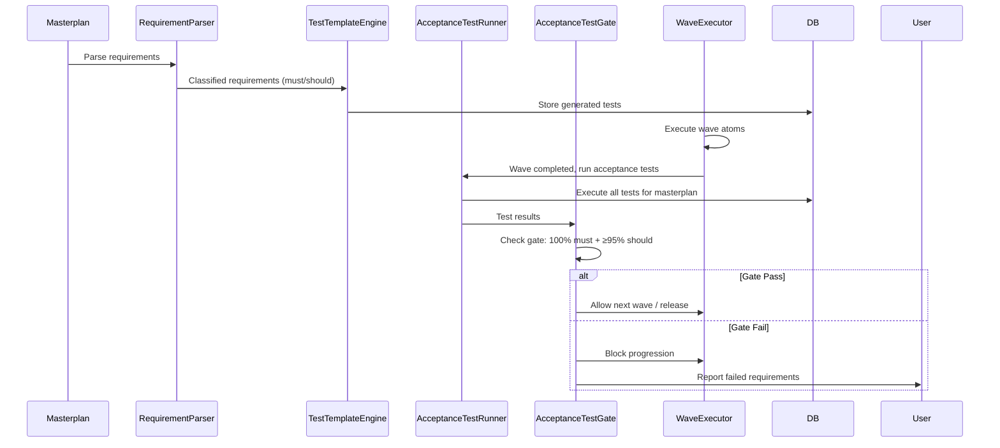

# Gap 3: Acceptance Tests Autogenerados

**Status**: 🔴 P0 CRITICAL - 0% implementado
**Effort**: 7-10 días
**Owner**: Eng1 + Eng2
**Dependencies**: None (puede empezar inmediatamente)
**Blocks**: Item 2 (Precision Score - Spec Conformance), Item 12 (Spec Conformance Gate)

---

## Executive Summary

**Problema**: Sin acceptance tests autogenerados, no podemos calcular el 50% del Precision Score (Spec Conformance) ni implementar el Gate S que requiere 100% must + ≥95% should.

**Solución**: Sistema de generación automática de tests desde requirements del masterplan, con clasificación must/should, ejecución al final de cada wave, y gate enforcement.

**Impacto**: Desbloquea 50% del precision score calculation + gate enforcement crítico para ≥98% precision target.

---

## Requirements

### Functional Requirements

**FR1: Requirement Parsing**
- Parser debe extraer requirements desde masterplan markdown
- Detectar estructura: ## Requirements, ### MUST, ### SHOULD
- Clasificar cada requirement como must/should con 100% accuracy
- Mapear requirement → test(s) generado(s)

**FR2: Test Generation**
- Generar pytest tests para Python atoms
- Generar Jest/Vitest tests para TypeScript/JavaScript atoms
- Test templates deben incluir:
  - Assertions para contratos (inputs/outputs)
  - Invariantes verificados
  - Casos edge identificados en requirement
- Tests deben ser ejecutables sin modificación manual

**FR3: Test Execution**
- Ejecutar tests al final de cada wave mayor
- Recolectar resultados: pass/fail por test
- Agregar por requirement: cumplido/no cumplido
- Timeout por test: 30s (configurable)

**FR4: Gate Enforcement**
- Gate S: 100% must + ≥95% should
- Si gate falla → no release
- Reporte detallado: qué requirements fallaron, qué tests, por qué

### Non-Functional Requirements

**NFR1: Performance**
- Generación: <5s por 10 requirements
- Ejecución: timeout 30s por test
- Resultados disponibles <1min después de wave completion

**NFR2: Quality**
- Tests generados deben tener ≥90% pass rate en first run
- False positive rate <5%
- False negative rate <2%

**NFR3: Maintainability**
- Templates extensibles para nuevos lenguajes
- Configuración por proyecto (test framework, timeout, etc.)
- Logs detallados para debugging

---

## Architecture

### Component Diagram

```
┌─────────────────────────────────────────────────────────────┐
│                    Acceptance Test System                    │
├─────────────────────────────────────────────────────────────┤
│                                                               │
│  ┌───────────────────┐     ┌──────────────────────────┐    │
│  │ RequirementParser │────▶│ MustShouldClassifier     │    │
│  └───────────────────┘     └──────────────────────────┘    │
│           │                            │                     │
│           ▼                            ▼                     │
│  ┌───────────────────┐     ┌──────────────────────────┐    │
│  │ TestTemplateEngine│────▶│ AcceptanceTest (DB)      │    │
│  └───────────────────┘     └──────────────────────────┘    │
│           │                            │                     │
│           ▼                            ▼                     │
│  ┌───────────────────┐     ┌──────────────────────────┐    │
│  │AcceptanceTestRunner│────▶│ AcceptanceTestResult(DB) │    │
│  └───────────────────┘     └──────────────────────────┘    │
│           │                            │                     │
│           ▼                            ▼                     │
│  ┌───────────────────┐     ┌──────────────────────────┐    │
│  │ AcceptanceTestGate│────▶│ WaveExecutor (blocking)  │    │
│  └───────────────────┘     └──────────────────────────┘    │
│                                                               │
└─────────────────────────────────────────────────────────────┘
```

### Data Flow



---

## Database Schema

### acceptance_tests Table

```sql
CREATE TABLE acceptance_tests (
    test_id UUID PRIMARY KEY DEFAULT uuid_generate_v4(),
    masterplan_id UUID NOT NULL REFERENCES masterplans(masterplan_id) ON DELETE CASCADE,
    requirement_text TEXT NOT NULL,
    requirement_priority VARCHAR(10) NOT NULL CHECK (requirement_priority IN ('must', 'should')),
    test_code TEXT NOT NULL,
    test_language VARCHAR(20) NOT NULL CHECK (test_language IN ('pytest', 'jest', 'vitest')),
    test_framework_version VARCHAR(20),
    timeout_seconds INTEGER DEFAULT 30,
    created_at TIMESTAMP WITH TIME ZONE DEFAULT NOW(),
    updated_at TIMESTAMP WITH TIME ZONE DEFAULT NOW(),

    CONSTRAINT valid_priority CHECK (requirement_priority IN ('must', 'should')),
    INDEX idx_acceptance_tests_masterplan (masterplan_id),
    INDEX idx_acceptance_tests_priority (masterplan_id, requirement_priority)
);

COMMENT ON TABLE acceptance_tests IS 'Generated acceptance tests from masterplan requirements';
COMMENT ON COLUMN acceptance_tests.requirement_text IS 'Original requirement from masterplan';
COMMENT ON COLUMN acceptance_tests.test_code IS 'Generated test code (pytest/jest/vitest)';
```

### acceptance_test_results Table

```sql
CREATE TABLE acceptance_test_results (
    result_id UUID PRIMARY KEY DEFAULT uuid_generate_v4(),
    test_id UUID NOT NULL REFERENCES acceptance_tests(test_id) ON DELETE CASCADE,
    wave_id UUID REFERENCES waves(wave_id),
    execution_time TIMESTAMP WITH TIME ZONE DEFAULT NOW(),
    status VARCHAR(20) NOT NULL CHECK (status IN ('pass', 'fail', 'timeout', 'error')),
    error_message TEXT,
    execution_duration_ms INTEGER,
    stdout TEXT,
    stderr TEXT,

    CONSTRAINT valid_status CHECK (status IN ('pass', 'fail', 'timeout', 'error')),
    INDEX idx_test_results_test (test_id),
    INDEX idx_test_results_wave (wave_id),
    INDEX idx_test_results_status (test_id, status)
);

COMMENT ON TABLE acceptance_test_results IS 'Execution results for acceptance tests';
COMMENT ON COLUMN acceptance_test_results.status IS 'Test execution outcome';
```

### Migration Script

```python
# migrations/versions/012_add_acceptance_tests.py
"""Add acceptance tests tables

Revision ID: 012_acceptance_tests
Revises: 011_review_system
Create Date: 2025-01-24 10:00:00

"""
from alembic import op
import sqlalchemy as sa
from sqlalchemy.dialects import postgresql

revision = '012_acceptance_tests'
down_revision = '011_review_system'
branch_labels = None
depends_on = None

def upgrade():
    # acceptance_tests table
    op.create_table(
        'acceptance_tests',
        sa.Column('test_id', postgresql.UUID(as_uuid=True), primary_key=True, server_default=sa.text('uuid_generate_v4()')),
        sa.Column('masterplan_id', postgresql.UUID(as_uuid=True), nullable=False),
        sa.Column('requirement_text', sa.Text(), nullable=False),
        sa.Column('requirement_priority', sa.String(10), nullable=False),
        sa.Column('test_code', sa.Text(), nullable=False),
        sa.Column('test_language', sa.String(20), nullable=False),
        sa.Column('test_framework_version', sa.String(20)),
        sa.Column('timeout_seconds', sa.Integer(), server_default='30'),
        sa.Column('created_at', sa.TIMESTAMP(timezone=True), server_default=sa.text('NOW()')),
        sa.Column('updated_at', sa.TIMESTAMP(timezone=True), server_default=sa.text('NOW()')),
        sa.ForeignKeyConstraint(['masterplan_id'], ['masterplans.masterplan_id'], ondelete='CASCADE'),
        sa.CheckConstraint("requirement_priority IN ('must', 'should')", name='valid_priority'),
        sa.CheckConstraint("test_language IN ('pytest', 'jest', 'vitest')", name='valid_language')
    )
    op.create_index('idx_acceptance_tests_masterplan', 'acceptance_tests', ['masterplan_id'])
    op.create_index('idx_acceptance_tests_priority', 'acceptance_tests', ['masterplan_id', 'requirement_priority'])

    # acceptance_test_results table
    op.create_table(
        'acceptance_test_results',
        sa.Column('result_id', postgresql.UUID(as_uuid=True), primary_key=True, server_default=sa.text('uuid_generate_v4()')),
        sa.Column('test_id', postgresql.UUID(as_uuid=True), nullable=False),
        sa.Column('wave_id', postgresql.UUID(as_uuid=True)),
        sa.Column('execution_time', sa.TIMESTAMP(timezone=True), server_default=sa.text('NOW()')),
        sa.Column('status', sa.String(20), nullable=False),
        sa.Column('error_message', sa.Text()),
        sa.Column('execution_duration_ms', sa.Integer()),
        sa.Column('stdout', sa.Text()),
        sa.Column('stderr', sa.Text()),
        sa.ForeignKeyConstraint(['test_id'], ['acceptance_tests.test_id'], ondelete='CASCADE'),
        sa.ForeignKeyConstraint(['wave_id'], ['waves.wave_id']),
        sa.CheckConstraint("status IN ('pass', 'fail', 'timeout', 'error')", name='valid_status')
    )
    op.create_index('idx_test_results_test', 'acceptance_test_results', ['test_id'])
    op.create_index('idx_test_results_wave', 'acceptance_test_results', ['wave_id'])
    op.create_index('idx_test_results_status', 'acceptance_test_results', ['test_id', 'status'])

def downgrade():
    op.drop_table('acceptance_test_results')
    op.drop_table('acceptance_tests')
```

---

## Implementation

### Phase 1: Requirement Parsing (Days 1-2)

**src/mge/v2/testing/requirement_parser.py**

```python
"""
Requirement parsing from masterplan markdown
"""
from typing import List, Dict, Optional
from dataclasses import dataclass
from uuid import UUID
import re

@dataclass
class Requirement:
    """Single parsed requirement"""
    text: str
    priority: str  # must, should
    requirement_id: str  # generated ID
    section: str  # which section it came from
    metadata: Dict[str, any]

class RequirementParser:
    """
    Parse requirements from masterplan markdown structure:

    ## Requirements
    ### MUST
    - User authentication must use JWT tokens
    - Database transactions must be ACID compliant

    ### SHOULD
    - UI should be responsive on mobile devices
    - API response time should be <200ms p95
    """

    def __init__(self):
        self.must_pattern = re.compile(r'###\s+MUST\s*\n((?:- .+\n)+)', re.MULTILINE)
        self.should_pattern = re.compile(r'###\s+SHOULD\s*\n((?:- .+\n)+)', re.MULTILINE)
        self.requirement_pattern = re.compile(r'^- (.+)$', re.MULTILINE)

    def parse_masterplan(self, masterplan_id: UUID, markdown_content: str) -> List[Requirement]:
        """
        Parse masterplan markdown and extract classified requirements

        Args:
            masterplan_id: Masterplan UUID
            markdown_content: Full markdown content

        Returns:
            List of Requirement objects with priority classification
        """
        requirements = []

        # Extract MUST requirements
        must_matches = self.must_pattern.finditer(markdown_content)
        for match in must_matches:
            must_block = match.group(1)
            must_reqs = self.requirement_pattern.findall(must_block)
            for idx, req_text in enumerate(must_reqs):
                requirements.append(Requirement(
                    text=req_text.strip(),
                    priority='must',
                    requirement_id=f"{masterplan_id}_must_{idx}",
                    section='MUST',
                    metadata={'line_number': markdown_content[:match.start()].count('\n')}
                ))

        # Extract SHOULD requirements
        should_matches = self.should_pattern.finditer(markdown_content)
        for match in should_matches:
            should_block = match.group(1)
            should_reqs = self.requirement_pattern.findall(should_block)
            for idx, req_text in enumerate(should_reqs):
                requirements.append(Requirement(
                    text=req_text.strip(),
                    priority='should',
                    requirement_id=f"{masterplan_id}_should_{idx}",
                    section='SHOULD',
                    metadata={'line_number': markdown_content[:match.start()].count('\n')}
                ))

        return requirements

    def validate_requirements(self, requirements: List[Requirement]) -> Dict[str, any]:
        """
        Validate parsed requirements for completeness

        Returns:
            Dict with validation results: {is_valid, errors, warnings}
        """
        errors = []
        warnings = []

        if not requirements:
            errors.append("No requirements found in masterplan")

        must_count = sum(1 for r in requirements if r.priority == 'must')
        should_count = sum(1 for r in requirements if r.priority == 'should')

        if must_count == 0:
            warnings.append("No MUST requirements found - all requirements are SHOULD")

        if should_count == 0:
            warnings.append("No SHOULD requirements found - consider adding optional requirements")

        # Check for duplicates
        seen_texts = set()
        for req in requirements:
            if req.text in seen_texts:
                errors.append(f"Duplicate requirement: {req.text}")
            seen_texts.add(req.text)

        return {
            'is_valid': len(errors) == 0,
            'errors': errors,
            'warnings': warnings,
            'must_count': must_count,
            'should_count': should_count,
            'total_count': len(requirements)
        }
```

### Phase 2: Test Generation (Days 3-5)

**src/mge/v2/testing/test_template_engine.py**

```python
"""
Test template generation for pytest, Jest, Vitest
"""
from typing import Dict, List
import re
from .requirement_parser import Requirement

class TestTemplateEngine:
    """
    Generate executable tests from requirements using templates
    """

    def __init__(self):
        self.pytest_template = """
import pytest
from uuid import UUID

def test_{test_id}():
    '''
    Requirement: {requirement_text}
    Priority: {priority}
    '''
    # TODO: Implement test for requirement
    {test_body}
"""

        self.jest_template = """
import {{ describe, it, expect }} from 'vitest';

describe('{requirement_id}', () => {{
  it('{requirement_text}', async () => {{
    // Priority: {priority}
    {test_body}
  }});
}});
"""

    def generate_pytest_test(self, requirement: Requirement, atom_context: Dict = None) -> str:
        """
        Generate pytest test from requirement

        Args:
            requirement: Parsed requirement
            atom_context: Optional context (imports, functions, etc.)

        Returns:
            Complete pytest test code
        """
        test_id = requirement.requirement_id.replace('-', '_')

        # Analyze requirement text to generate appropriate test body
        test_body = self._analyze_requirement_for_pytest(requirement, atom_context)

        return self.pytest_template.format(
            test_id=test_id,
            requirement_text=requirement.text,
            priority=requirement.priority,
            test_body=test_body
        )

    def generate_jest_test(self, requirement: Requirement, atom_context: Dict = None) -> str:
        """
        Generate Jest/Vitest test from requirement
        """
        test_body = self._analyze_requirement_for_jest(requirement, atom_context)

        return self.jest_template.format(
            requirement_id=requirement.requirement_id,
            requirement_text=requirement.text,
            priority=requirement.priority,
            test_body=test_body
        )

    def _analyze_requirement_for_pytest(self, req: Requirement, context: Dict = None) -> str:
        """
        Analyze requirement text and generate appropriate pytest assertions

        Examples:
        - "must return 200 status" → assert response.status_code == 200
        - "must validate email format" → assert is_valid_email(email)
        - "must raise ValueError" → with pytest.raises(ValueError)
        """
        text = req.text.lower()

        # Pattern: "must return X"
        if 'return' in text:
            match = re.search(r'return\s+(\w+)', text)
            if match:
                expected_value = match.group(1)
                return f"    result = function_under_test()\n    assert result == {expected_value}"

        # Pattern: "must raise X exception"
        if 'raise' in text or 'throw' in text:
            match = re.search(r'raise\s+(\w+)', text)
            if match:
                exception_type = match.group(1)
                return f"    with pytest.raises({exception_type}):\n        function_under_test()"

        # Pattern: "must validate X"
        if 'validate' in text:
            return f"    result = validate_function(input_data)\n    assert result.is_valid == True"

        # Pattern: "must be < X" or "must be > X"
        if match := re.search(r'(must be|should be)\s*([<>]=?)\s*(\d+)', text):
            operator = match.group(2)
            value = match.group(3)
            return f"    result = function_under_test()\n    assert result {operator} {value}"

        # Default: placeholder for manual implementation
        return f"    # TODO: Implement test for: {req.text}\n    assert True  # Replace with actual test"

    def _analyze_requirement_for_jest(self, req: Requirement, context: Dict = None) -> str:
        """
        Analyze requirement and generate Jest/Vitest assertions
        """
        text = req.text.lower()

        # Pattern: "must return X"
        if 'return' in text:
            match = re.search(r'return\s+(\w+)', text)
            if match:
                expected_value = match.group(1)
                return f"    const result = await functionUnderTest();\n    expect(result).toBe({expected_value});"

        # Pattern: "must throw X"
        if 'throw' in text or 'raise' in text:
            match = re.search(r'(throw|raise)\s+(\w+)', text)
            if match:
                exception_type = match.group(2)
                return f"    await expect(() => functionUnderTest()).rejects.toThrow({exception_type});"

        # Default
        return f"    // TODO: Implement test for: {req.text}\n    expect(true).toBe(true);  // Replace with actual test"
```

**src/mge/v2/testing/test_generator.py** (Orchestration)

```python
"""
Complete test generation orchestration
"""
from uuid import UUID
from typing import List
from sqlalchemy.ext.asyncio import AsyncSession
from .requirement_parser import RequirementParser, Requirement
from .test_template_engine import TestTemplateEngine
from ..models import AcceptanceTest

class AcceptanceTestGenerator:
    """
    Orchestrate complete test generation pipeline
    """

    def __init__(self, db_session: AsyncSession):
        self.db = db_session
        self.parser = RequirementParser()
        self.template_engine = TestTemplateEngine()

    async def generate_from_masterplan(self, masterplan_id: UUID, markdown_content: str) -> List[AcceptanceTest]:
        """
        Complete pipeline: parse → generate → store

        Args:
            masterplan_id: Masterplan UUID
            markdown_content: Full masterplan markdown

        Returns:
            List of generated AcceptanceTest objects
        """
        # Parse requirements
        requirements = self.parser.parse_masterplan(masterplan_id, markdown_content)

        # Validate
        validation = self.parser.validate_requirements(requirements)
        if not validation['is_valid']:
            raise ValueError(f"Invalid requirements: {validation['errors']}")

        # Generate tests
        generated_tests = []
        for req in requirements:
            # Determine test language based on project
            test_language = await self._determine_test_language(masterplan_id)

            # Generate test code
            if test_language == 'pytest':
                test_code = self.template_engine.generate_pytest_test(req)
            else:
                test_code = self.template_engine.generate_jest_test(req)

            # Create DB object
            test = AcceptanceTest(
                masterplan_id=masterplan_id,
                requirement_text=req.text,
                requirement_priority=req.priority,
                test_code=test_code,
                test_language=test_language
            )

            self.db.add(test)
            generated_tests.append(test)

        await self.db.commit()

        return generated_tests

    async def _determine_test_language(self, masterplan_id: UUID) -> str:
        """
        Determine test framework based on project language
        """
        # Query masterplan to get primary language
        # For now, default to pytest
        return 'pytest'
```

### Phase 3: Test Execution (Days 6-8)

**src/mge/v2/testing/test_runner.py**

```python
"""
Acceptance test execution engine
"""
import asyncio
import subprocess
import tempfile
from pathlib import Path
from uuid import UUID
from typing import List, Dict
from sqlalchemy.ext.asyncio import AsyncSession
from ..models import AcceptanceTest, AcceptanceTestResult

class AcceptanceTestRunner:
    """
    Execute generated acceptance tests
    """

    def __init__(self, db_session: AsyncSession):
        self.db = db_session
        self.default_timeout = 30  # seconds

    async def run_tests_for_wave(self, wave_id: UUID) -> Dict[str, any]:
        """
        Run all acceptance tests for a wave's masterplan

        Args:
            wave_id: Wave UUID

        Returns:
            Dict with results: {total, passed, failed, must_passed, should_passed}
        """
        # Get masterplan_id from wave
        wave = await self.db.get(Wave, wave_id)
        masterplan_id = wave.masterplan_id

        # Get all tests for masterplan
        tests = await self.db.execute(
            select(AcceptanceTest).where(AcceptanceTest.masterplan_id == masterplan_id)
        )
        tests = tests.scalars().all()

        if not tests:
            return {'total': 0, 'passed': 0, 'failed': 0, 'must_passed': 0, 'should_passed': 0}

        # Run tests in parallel (with concurrency limit)
        semaphore = asyncio.Semaphore(10)  # Max 10 concurrent tests
        tasks = [self._run_single_test(test, wave_id, semaphore) for test in tests]
        results = await asyncio.gather(*tasks)

        # Aggregate results
        total = len(results)
        passed = sum(1 for r in results if r.status == 'pass')
        failed = total - passed

        must_tests = [r for r in results if r.test.requirement_priority == 'must']
        should_tests = [r for r in results if r.test.requirement_priority == 'should']

        must_passed = sum(1 for r in must_tests if r.status == 'pass')
        should_passed = sum(1 for r in should_tests if r.status == 'pass')

        return {
            'total': total,
            'passed': passed,
            'failed': failed,
            'must_total': len(must_tests),
            'must_passed': must_passed,
            'must_pass_rate': must_passed / len(must_tests) if must_tests else 0,
            'should_total': len(should_tests),
            'should_passed': should_passed,
            'should_pass_rate': should_passed / len(should_tests) if should_tests else 0,
            'results': results
        }

    async def _run_single_test(self, test: AcceptanceTest, wave_id: UUID, semaphore: asyncio.Semaphore) -> AcceptanceTestResult:
        """
        Execute a single acceptance test
        """
        async with semaphore:
            start_time = asyncio.get_event_loop().time()

            try:
                # Create temporary file for test
                with tempfile.NamedTemporaryFile(mode='w', suffix='.py' if test.test_language == 'pytest' else '.test.ts', delete=False) as f:
                    f.write(test.test_code)
                    test_file = f.name

                # Execute test based on framework
                if test.test_language == 'pytest':
                    cmd = ['pytest', test_file, '-v', '--tb=short']
                elif test.test_language in ['jest', 'vitest']:
                    cmd = ['npx', 'vitest', 'run', test_file]
                else:
                    raise ValueError(f"Unknown test language: {test.test_language}")

                # Run with timeout
                process = await asyncio.create_subprocess_exec(
                    *cmd,
                    stdout=asyncio.subprocess.PIPE,
                    stderr=asyncio.subprocess.PIPE
                )

                try:
                    stdout, stderr = await asyncio.wait_for(
                        process.communicate(),
                        timeout=test.timeout_seconds or self.default_timeout
                    )

                    execution_duration = int((asyncio.get_event_loop().time() - start_time) * 1000)

                    status = 'pass' if process.returncode == 0 else 'fail'
                    error_message = stderr.decode() if stderr else None

                except asyncio.TimeoutError:
                    process.kill()
                    status = 'timeout'
                    error_message = f"Test exceeded timeout of {test.timeout_seconds}s"
                    stdout, stderr = b'', b''
                    execution_duration = test.timeout_seconds * 1000

                # Clean up temp file
                Path(test_file).unlink()

            except Exception as e:
                status = 'error'
                error_message = str(e)
                stdout, stderr = b'', b''
                execution_duration = int((asyncio.get_event_loop().time() - start_time) * 1000)

            # Store result
            result = AcceptanceTestResult(
                test_id=test.test_id,
                wave_id=wave_id,
                status=status,
                error_message=error_message,
                execution_duration_ms=execution_duration,
                stdout=stdout.decode() if stdout else None,
                stderr=stderr.decode() if stderr else None
            )

            self.db.add(result)
            await self.db.commit()

            return result
```

### Phase 4: Gate Enforcement (Days 9-10)

**src/mge/v2/testing/acceptance_gate.py**

```python
"""
Spec Conformance Gate enforcement
"""
from uuid import UUID
from typing import Dict, List
from sqlalchemy.ext.asyncio import AsyncSession
from sqlalchemy import select, and_
from ..models import AcceptanceTest, AcceptanceTestResult

class AcceptanceTestGate:
    """
    Enforce Gate S: 100% must + ≥95% should
    """

    def __init__(self, db_session: AsyncSession):
        self.db = db_session
        self.must_threshold = 1.0  # 100%
        self.should_threshold = 0.95  # 95%

    async def check_gate(self, masterplan_id: UUID, wave_id: UUID = None) -> Dict[str, any]:
        """
        Check if masterplan passes Gate S

        Args:
            masterplan_id: Masterplan UUID
            wave_id: Optional wave UUID (check specific wave)

        Returns:
            Dict: {
                'gate_passed': bool,
                'must_pass_rate': float,
                'should_pass_rate': float,
                'failed_requirements': List[str],
                'can_release': bool
            }
        """
        # Get all tests for masterplan
        query = select(AcceptanceTest).where(AcceptanceTest.masterplan_id == masterplan_id)
        tests = await self.db.execute(query)
        tests = tests.scalars().all()

        if not tests:
            return {
                'gate_passed': False,
                'must_pass_rate': 0.0,
                'should_pass_rate': 0.0,
                'failed_requirements': ['No acceptance tests found'],
                'can_release': False
            }

        # Get latest results for each test
        must_tests = [t for t in tests if t.requirement_priority == 'must']
        should_tests = [t for t in tests if t.requirement_priority == 'should']

        must_results = await self._get_latest_results(must_tests, wave_id)
        should_results = await self._get_latest_results(should_tests, wave_id)

        # Calculate pass rates
        must_passed = sum(1 for r in must_results if r.status == 'pass')
        must_pass_rate = must_passed / len(must_results) if must_results else 0.0

        should_passed = sum(1 for r in should_results if r.status == 'pass')
        should_pass_rate = should_passed / len(should_results) if should_results else 0.0

        # Identify failed requirements
        failed_requirements = []
        for test, result in zip(must_tests, must_results):
            if result.status != 'pass':
                failed_requirements.append({
                    'priority': 'must',
                    'requirement': test.requirement_text,
                    'status': result.status,
                    'error': result.error_message
                })

        for test, result in zip(should_tests, should_results):
            if result.status != 'pass':
                failed_requirements.append({
                    'priority': 'should',
                    'requirement': test.requirement_text,
                    'status': result.status,
                    'error': result.error_message
                })

        # Gate logic
        gate_passed = (must_pass_rate >= self.must_threshold and
                      should_pass_rate >= self.should_threshold)

        can_release = must_pass_rate == 1.0  # Must be 100% on must requirements

        return {
            'gate_passed': gate_passed,
            'must_pass_rate': must_pass_rate,
            'should_pass_rate': should_pass_rate,
            'must_total': len(must_results),
            'must_passed': must_passed,
            'should_total': len(should_results),
            'should_passed': should_passed,
            'failed_requirements': failed_requirements,
            'can_release': can_release,
            'gate_status': 'PASS' if gate_passed else 'FAIL'
        }

    async def _get_latest_results(self, tests: List[AcceptanceTest], wave_id: UUID = None) -> List[AcceptanceTestResult]:
        """
        Get latest test results for given tests
        """
        results = []
        for test in tests:
            query = select(AcceptanceTestResult).where(AcceptanceTestResult.test_id == test.test_id)

            if wave_id:
                query = query.where(AcceptanceTestResult.wave_id == wave_id)

            query = query.order_by(AcceptanceTestResult.execution_time.desc()).limit(1)

            result = await self.db.execute(query)
            result = result.scalar_one_or_none()

            if result:
                results.append(result)

        return results

    async def block_progression_if_gate_fails(self, masterplan_id: UUID, wave_id: UUID) -> bool:
        """
        Check gate and block WaveExecutor if failed

        Returns:
            True if can proceed, False if blocked
        """
        gate_result = await self.check_gate(masterplan_id, wave_id)

        if not gate_result['gate_passed']:
            # Log gate failure
            logger.error(f"Gate S FAILED for masterplan {masterplan_id}: {gate_result}")

            # Update masterplan status to blocked
            await self._update_masterplan_status(masterplan_id, 'blocked_gate_s')

            return False

        return True
```

---

## API Endpoints

### 1. POST /api/v2/testing/generate/{masterplan_id}

**Generate acceptance tests from masterplan**

```python
from fastapi import APIRouter, Depends, HTTPException
from uuid import UUID
from sqlalchemy.ext.asyncio import AsyncSession
from ..testing.test_generator import AcceptanceTestGenerator

router = APIRouter(prefix="/api/v2/testing", tags=["acceptance-testing"])

@router.post("/generate/{masterplan_id}")
async def generate_acceptance_tests(
    masterplan_id: UUID,
    db: AsyncSession = Depends(get_db)
):
    """
    Generate acceptance tests from masterplan requirements

    Returns:
        {
            "tests_generated": 15,
            "must_tests": 10,
            "should_tests": 5,
            "validation": {...}
        }
    """
    try:
        # Get masterplan
        masterplan = await db.get(Masterplan, masterplan_id)
        if not masterplan:
            raise HTTPException(404, "Masterplan not found")

        # Generate tests
        generator = AcceptanceTestGenerator(db)
        tests = await generator.generate_from_masterplan(masterplan_id, masterplan.markdown_content)

        must_tests = [t for t in tests if t.requirement_priority == 'must']
        should_tests = [t for t in tests if t.requirement_priority == 'should']

        return {
            "tests_generated": len(tests),
            "must_tests": len(must_tests),
            "should_tests": len(should_tests),
            "tests": [
                {
                    "test_id": str(t.test_id),
                    "requirement": t.requirement_text,
                    "priority": t.requirement_priority,
                    "language": t.test_language
                }
                for t in tests
            ]
        }

    except ValueError as e:
        raise HTTPException(400, str(e))
    except Exception as e:
        raise HTTPException(500, f"Test generation failed: {str(e)}")
```

### 2. POST /api/v2/testing/run/{wave_id}

**Run acceptance tests for a wave**

```python
@router.post("/run/{wave_id}")
async def run_acceptance_tests(
    wave_id: UUID,
    db: AsyncSession = Depends(get_db)
):
    """
    Execute all acceptance tests for a wave's masterplan
    """
    runner = AcceptanceTestRunner(db)
    results = await runner.run_tests_for_wave(wave_id)

    return {
        "wave_id": str(wave_id),
        "execution_summary": results,
        "gate_status": "PENDING"  # Gate check happens separately
    }
```

### 3. GET /api/v2/testing/gate/{masterplan_id}

**Check Gate S status**

```python
@router.get("/gate/{masterplan_id}")
async def check_gate_status(
    masterplan_id: UUID,
    wave_id: Optional[UUID] = None,
    db: AsyncSession = Depends(get_db)
):
    """
    Check if masterplan passes Gate S (100% must + ≥95% should)
    """
    gate = AcceptanceTestGate(db)
    result = await gate.check_gate(masterplan_id, wave_id)

    return result
```

### 4. GET /api/v2/testing/results/{masterplan_id}

**Get all test results**

```python
@router.get("/results/{masterplan_id}")
async def get_test_results(
    masterplan_id: UUID,
    priority: Optional[str] = None,
    status: Optional[str] = None,
    db: AsyncSession = Depends(get_db)
):
    """
    Get acceptance test results with optional filters
    """
    query = select(AcceptanceTest, AcceptanceTestResult).join(
        AcceptanceTestResult, AcceptanceTest.test_id == AcceptanceTestResult.test_id
    ).where(AcceptanceTest.masterplan_id == masterplan_id)

    if priority:
        query = query.where(AcceptanceTest.requirement_priority == priority)

    if status:
        query = query.where(AcceptanceTestResult.status == status)

    results = await db.execute(query)
    results = results.all()

    return {
        "total_tests": len(results),
        "results": [
            {
                "test_id": str(test.test_id),
                "requirement": test.requirement_text,
                "priority": test.requirement_priority,
                "status": result.status,
                "execution_time_ms": result.execution_duration_ms,
                "error": result.error_message
            }
            for test, result in results
        ]
    }
```

---

## Integration with WaveExecutor

**Modified src/mge/v2/execution/wave_executor.py**

```python
class WaveExecutor:
    """Execute wave with acceptance test gate"""

    async def execute_wave(self, wave_id: UUID):
        """Execute wave atoms → run acceptance tests → check gate"""

        # Existing wave execution logic...
        await self._execute_all_atoms_in_wave(wave_id)

        # NEW: Run acceptance tests after wave completion
        test_runner = AcceptanceTestRunner(self.db)
        test_results = await test_runner.run_tests_for_wave(wave_id)

        logger.info(f"Wave {wave_id} acceptance tests: {test_results}")

        # NEW: Check Gate S
        gate = AcceptanceTestGate(self.db)
        gate_result = await gate.check_gate(masterplan_id, wave_id)

        if not gate_result['gate_passed']:
            logger.error(f"Gate S FAILED: {gate_result}")

            # Block next wave progression
            wave = await self.db.get(Wave, wave_id)
            wave.status = 'blocked_gate_failure'
            await self.db.commit()

            raise GateFailureException(
                f"Gate S failed: must={gate_result['must_pass_rate']:.1%}, "
                f"should={gate_result['should_pass_rate']:.1%}"
            )

        logger.info(f"Gate S PASSED for wave {wave_id}")

        return {
            'wave_execution': 'complete',
            'acceptance_tests': test_results,
            'gate_status': gate_result
        }
```

---

## Testing Strategy

### Unit Tests (pytest)

**tests/mge/v2/testing/test_requirement_parser.py**

```python
import pytest
from src.mge.v2.testing.requirement_parser import RequirementParser
from uuid import uuid4

def test_parse_must_requirements():
    """Test parsing MUST requirements"""
    parser = RequirementParser()
    masterplan_id = uuid4()

    markdown = """
## Requirements
### MUST
- User authentication must use JWT tokens
- Database must support ACID transactions

### SHOULD
- UI should be responsive
"""

    requirements = parser.parse_masterplan(masterplan_id, markdown)

    must_reqs = [r for r in requirements if r.priority == 'must']
    assert len(must_reqs) == 2
    assert "JWT tokens" in must_reqs[0].text
    assert "ACID" in must_reqs[1].text

def test_parse_should_requirements():
    """Test parsing SHOULD requirements"""
    parser = RequirementParser()
    masterplan_id = uuid4()

    markdown = """
## Requirements
### SHOULD
- API response time should be <200ms
- UI should support dark mode
"""

    requirements = parser.parse_masterplan(masterplan_id, markdown)

    should_reqs = [r for r in requirements if r.priority == 'should']
    assert len(should_reqs) == 2
    assert "<200ms" in should_reqs[0].text

def test_validate_empty_requirements():
    """Test validation fails for empty requirements"""
    parser = RequirementParser()

    validation = parser.validate_requirements([])
    assert validation['is_valid'] == False
    assert "No requirements found" in validation['errors'][0]
```

**tests/mge/v2/testing/test_template_engine.py**

```python
import pytest
from src.mge.v2.testing.test_template_engine import TestTemplateEngine
from src.mge.v2.testing.requirement_parser import Requirement

def test_generate_pytest_return_assertion():
    """Test generating pytest test for return value requirement"""
    engine = TestTemplateEngine()

    req = Requirement(
        text="function must return 200 status code",
        priority="must",
        requirement_id="test_001",
        section="MUST",
        metadata={}
    )

    test_code = engine.generate_pytest_test(req)

    assert "def test_test_001():" in test_code
    assert "assert result == 200" in test_code

def test_generate_pytest_exception_assertion():
    """Test generating pytest test for exception requirement"""
    engine = TestTemplateEngine()

    req = Requirement(
        text="validation must raise ValueError for invalid input",
        priority="must",
        requirement_id="test_002",
        section="MUST",
        metadata={}
    )

    test_code = engine.generate_pytest_test(req)

    assert "pytest.raises(ValueError)" in test_code
```

### Integration Tests

**tests/mge/v2/testing/test_acceptance_e2e.py**

```python
import pytest
from uuid import uuid4
from src.mge.v2.testing.test_generator import AcceptanceTestGenerator
from src.mge.v2.testing.test_runner import AcceptanceTestRunner
from src.mge.v2.testing.acceptance_gate import AcceptanceTestGate

@pytest.mark.asyncio
async def test_full_acceptance_pipeline(db_session):
    """Test complete pipeline: generate → run → gate check"""

    masterplan_id = uuid4()
    markdown = """
## Requirements
### MUST
- Authentication must return valid JWT token
- Database must commit transactions

### SHOULD
- API response should be <200ms
"""

    # Generate tests
    generator = AcceptanceTestGenerator(db_session)
    tests = await generator.generate_from_masterplan(masterplan_id, markdown)
    assert len(tests) == 3

    # Create wave
    wave_id = uuid4()
    wave = Wave(wave_id=wave_id, masterplan_id=masterplan_id)
    db_session.add(wave)
    await db_session.commit()

    # Run tests
    runner = AcceptanceTestRunner(db_session)
    results = await runner.run_tests_for_wave(wave_id)
    assert results['total'] == 3

    # Check gate
    gate = AcceptanceTestGate(db_session)
    gate_result = await gate.check_gate(masterplan_id, wave_id)
    assert 'gate_passed' in gate_result
    assert 'must_pass_rate' in gate_result
```

---

## Monitoring & Metrics

### Prometheus Metrics

```python
# src/mge/v2/metrics.py

# Acceptance test metrics
ACCEPTANCE_TESTS_GENERATED = Counter(
    'v2_acceptance_tests_generated_total',
    'Total acceptance tests generated',
    ['masterplan_id', 'priority']
)

ACCEPTANCE_TEST_EXECUTION_DURATION = Histogram(
    'v2_acceptance_test_execution_seconds',
    'Acceptance test execution duration',
    ['test_language', 'priority']
)

ACCEPTANCE_TEST_PASS_RATE = Gauge(
    'v2_acceptance_test_pass_rate',
    'Acceptance test pass rate',
    ['masterplan_id', 'priority']
)

GATE_S_STATUS = Gauge(
    'v2_gate_s_status',
    'Gate S pass/fail status (1=pass, 0=fail)',
    ['masterplan_id']
)

GATE_S_MUST_PASS_RATE = Gauge(
    'v2_gate_s_must_pass_rate',
    'Gate S must requirements pass rate',
    ['masterplan_id']
)

GATE_S_SHOULD_PASS_RATE = Gauge(
    'v2_gate_s_should_pass_rate',
    'Gate S should requirements pass rate',
    ['masterplan_id']
)
```

### Grafana Dashboard

```yaml
# Grafana dashboard panel config
panels:
  - title: "Gate S Status"
    type: stat
    targets:
      - expr: v2_gate_s_status{masterplan_id="$masterplan"}
    thresholds:
      - value: 0
        color: red
      - value: 1
        color: green

  - title: "Must Requirements Pass Rate"
    type: gauge
    targets:
      - expr: v2_gate_s_must_pass_rate{masterplan_id="$masterplan"}
    thresholds:
      - value: 0
        color: red
      - value: 0.95
        color: yellow
      - value: 1.0
        color: green

  - title: "Acceptance Test Execution Time"
    type: graph
    targets:
      - expr: histogram_quantile(0.95, v2_acceptance_test_execution_seconds_bucket)
```

---

## Deliverables

### Week 12 End (Track 1 Complete):

✅ **Code**:
- RequirementParser with validation
- TestTemplateEngine (pytest + Jest)
- AcceptanceTestGenerator orchestration
- AcceptanceTestRunner with parallel execution
- AcceptanceTestGate with Gate S logic

✅ **Database**:
- acceptance_tests table
- acceptance_test_results table
- Migration script

✅ **API**:
- 4 endpoints (generate, run, gate status, results)

✅ **Tests**:
- 20+ unit tests for parser
- 15+ unit tests for template engine
- 10+ integration tests for E2E pipeline

✅ **Integration**:
- WaveExecutor modified to run tests + check gate after each wave
- Gate S blocking logic implemented

✅ **Monitoring**:
- 6 Prometheus metrics
- Grafana dashboard with Gate S visualization

---

## Definition of Done

- [ ] All 4 API endpoints implemented and tested
- [ ] RequirementParser extracts requirements with 100% accuracy
- [ ] TestTemplateEngine generates executable tests (pytest + Jest)
- [ ] AcceptanceTestRunner executes tests with timeout handling
- [ ] AcceptanceTestGate enforces 100% must + ≥95% should
- [ ] WaveExecutor integration: tests run after wave → gate checked → progression blocked if failed
- [ ] Database migration applied successfully
- [ ] 45+ tests passing (20 parser + 15 template + 10 integration)
- [ ] Prometheus metrics emitting correctly
- [ ] Grafana dashboard shows Gate S status
- [ ] Documentation complete (API docs, architecture diagrams)
- [ ] Code review approved by Eng1 + Eng2
- [ ] Tested on 3 canary masterplans with real requirements

---

## Success Metrics

**Target (End of Week 12)**:
- ✅ Item 3 alignment: 0% → 100%
- ✅ Gate S implemented and enforcing
- ✅ Spec Conformance calculation possible (unblocks Item 2)
- ✅ Test generation success rate ≥90%
- ✅ Test execution p95 <5s per test
- ✅ Gate S false positive rate <5%

**Impact**:
- Unblocks Item 2 (Precision Score - needs Spec Conformance)
- Unblocks Item 12 (Gate enforcement)
- Enables 50% of precision score calculation
- Critical blocker removed for 98% precision target

