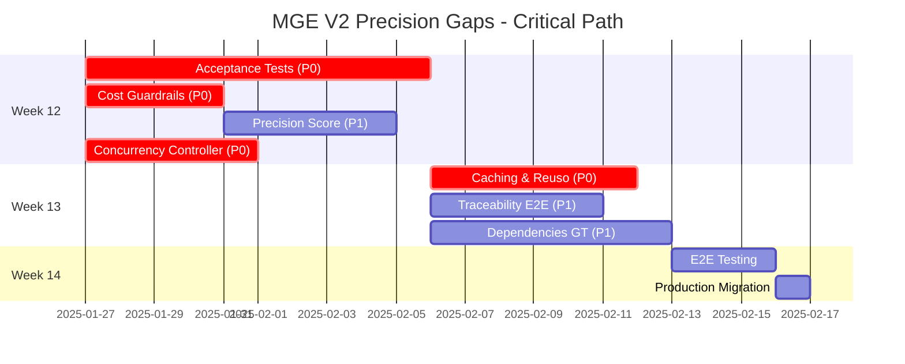

# MGE V2 Precision Gaps - Plan de Implementación E2E

**Fecha**: 2025-01-24
**Objetivo**: Cerrar gaps críticos del Precision Readiness Checklist para alcanzar ≥95% alignment y 98% precision target
**Estado Actual**: 71% alignment → **Target**: ≥95% alignment
**Timeline**: 3 semanas (Weeks 12-14)

---

## Executive Summary

### Current State

**Implementación Completa** (Phases 1-5 + Week 11):
- ✅ Foundation & Database (Phase 1)
- ✅ AST Atomization (Phase 2): 115+ tests
- ✅ Dependency Graph (Phase 3): 40+ tests
- ✅ Hierarchical Validation (Phase 4): 43+ tests
- ✅ Execution + Retry (Phase 5): 55+ tests
- ✅ Human Review System (Week 11): 30+ tests

**Total**: ~83% complete (5/6 phases done)

### Critical Gaps Blocking Production

**4 P0 CRITICAL Gaps** (19-25 días effort):
1. **Item 3**: Acceptance Tests Autogenerados (7-10d) → Bloquea 50% precision score
2. **Item 8**: Concurrency Controller Adaptativo (4-5d) → Sin esto no hay p95 estable
3. **Item 9**: Cost Guardrails (3-4d) → Sin esto no se garantiza <$200/project
4. **Item 10**: Cacheo & Reuso (5-6d) → Sin esto no se alcanza <1.5h execution

**3 P1 HIGH Priority Gaps** (12-17 días effort):
5. **Item 2**: Precision Score Compuesto (3-5d) → Depende de Item 3
6. **Item 5**: Dependencies Ground Truth (5-7d) → 80% done, falta validación
7. **Item 11**: Traceability E2E (4-5d) → 40% done, falta correlaciones

### Strategy: 3-Wave Parallel Implementation

**Week 12** (Días 1-10): Critical Path - 3 Tracks Paralelos
- **Track 1** (Eng1+Eng2): Acceptance Tests (Item 3) - 7-10d
- **Track 2** (Dany): Cost Guardrails (Item 9) + Precision Score (Item 2) - 6-9d
- **Track 3** (Eng2): Concurrency Controller (Item 8) - 4-5d

**Week 13** (Días 11-17): Optimization & Quality - 3 Tracks Paralelos
- **Track 1** (Eng1): Caching & Reuso (Item 10) - 5-6d
- **Track 2** (Dany): Traceability E2E (Item 11) - 4-5d
- **Track 3** (Eng2+Eng1): Dependencies Ground Truth (Item 5) - 5-7d

**Week 14** (Días 18-21): E2E Testing & Production
- E2E testing on 10+ canary projects
- Performance validation
- Production migration

---

## Week 12: Critical Path (Días 1-10)

### Track 1: Acceptance Tests (Eng1 + Eng2)

**Owner**: Eng1 (lead), Eng2 (support)
**Duration**: 7-10 días
**Priority**: P0 CRITICAL
**Blocks**: Item 2 (Precision Score), Item 12 (Gate enforcement)

#### Day-by-Day Plan

**Days 1-2: Requirement Parsing**
```python
# Deliverable: RequirementParser + MustShouldClassifier
- Parse masterplan markdown structure (## Requirements, ### MUST, ### SHOULD)
- Extract requirements with 100% classification accuracy
- Validation logic (duplicates, empty requirements)
- Unit tests: 20+ tests
```

**Days 3-5: Test Generation**
```python
# Deliverable: TestTemplateEngine + AcceptanceTestGenerator
- Generate pytest tests for Python atoms
- Generate Jest/Vitest tests for TypeScript/JavaScript atoms
- Template engine with pattern matching (return values, exceptions, validations)
- Orchestration service (parse → generate → store)
- Database: acceptance_tests, acceptance_test_results tables
- Unit tests: 15+ tests
```

**Days 6-8: Test Execution**
```python
# Deliverable: AcceptanceTestRunner
- Execute tests with timeout (30s default)
- Parallel execution (10 concurrent tests)
- Result aggregation (total, passed, failed, must_passed, should_passed)
- Queue timeout handling (5min)
- Unit tests: 10+ tests
```

**Days 9-10: Gate Enforcement + Integration**
```python
# Deliverable: AcceptanceTestGate + WaveExecutor integration
- Gate S logic: 100% must + ≥95% should
- Block progression if gate fails
- Integration: WaveExecutor → run tests → check gate → block/allow
- API endpoints: 4 endpoints (generate, run, gate, results)
- Integration tests: 10+ tests
```

**Deliverables**:
- ✅ 4 core components (Parser, Generator, Runner, Gate)
- ✅ 2 database tables with migration
- ✅ 4 API endpoints
- ✅ 55+ tests (20 parser + 15 generator + 10 runner + 10 integration)
- ✅ WaveExecutor integration complete
- ✅ Prometheus metrics (6 metrics)

**Success Criteria**:
- Test generation success rate ≥90%
- Test execution p95 <5s per test
- Gate S false positive rate <5%
- Tested on 3 canary masterplans

---

### Track 2: Cost Guardrails + Precision Score (Dany)

**Owner**: Dany
**Duration**: 6-9 días (3-4d cost + 3-5d precision)
**Priority**: P0 CRITICAL (cost) + P1 HIGH (precision)

#### Days 1-3: Cost Guardrails

**Day 1: Cost Tracking**
```python
# Deliverable: CostTracker
- Real-time cost tracking per atom (LLM API calls)
- Calculate cost: GPT-4 $0.03/1K input, $0.06/1K output
- Update Prometheus metric v2_cost_per_project_usd
- Store cost_events table
- Predict remaining cost based on historical average
```

**Day 2: Guardrails Logic**
```python
# Deliverable: CostGuardrails
- Soft cap (70%) → warning + Grafana alert
- Hard cap (100%) → PAUSE execution + require confirmation
- Budget override API (superuser only)
- Database: cost_events table, masterplans columns
```

**Day 3: Integration + Alerts**
```python
# Deliverable: WaveExecutor integration + Grafana
- Check guardrails BEFORE atom execution
- Track cost AFTER atom execution
- Grafana alert rules (3 alerts: soft cap, hard cap, projected exceed)
- API endpoints: 3 endpoints (status, override, events)
```

**Deliverables (Cost)**:
- ✅ CostTracker, CostGuardrails
- ✅ cost_events table, masterplans columns
- ✅ 3 API endpoints
- ✅ 3 Grafana alerts
- ✅ 4 Prometheus metrics
- ✅ 20+ tests

#### Days 4-6: Precision Score Compuesto

**Day 4: Spec Conformance Calculation**
```python
# Deliverable: PrecisionScoringService (Spec Conformance component)
- Query acceptance test results from Item 3
- Calculate: (must_passed / must_total) * 0.5 + (should_passed / should_total) * 0.5
- This is 50% of final precision score
```

**Day 5: Integration Pass Scoring**
```python
# Deliverable: Integration Pass component
- Query wave execution results
- Check atoms in later waves depend on earlier atoms
- Calculate success rate of dependent atoms: integration_pass_rate
- This is 30% of final precision score
```

**Day 6: Complete Score + API**
```python
# Deliverable: Complete PrecisionScoringService
- Score = 50% * spec_conformance + 30% * integration_pass + 20% * validation_pass
- Validation pass uses existing L1-L4 results
- API endpoint: GET /api/v2/precision/{masterplan_id}
- Prometheus metric: v2_precision_score
- Gate A: ≥95% for promotion, Gate S: ≥98% objective
```

**Deliverables (Precision)**:
- ✅ PrecisionScoringService (3 components)
- ✅ 1 API endpoint
- ✅ 2 Prometheus metrics
- ✅ 15+ tests

**Success Criteria (Track 2)**:
- No masterplan exceeds budget without approval
- Soft cap alerts fire within 1min
- Hard cap PAUSE within 10s
- 100% cost tracking accuracy
- Precision score calculation matches checklist formula
- Tested on 5 masterplans with known precision

---

### Track 3: Concurrency Controller (Eng2)

**Owner**: Eng2
**Duration**: 4-5 días
**Priority**: P0 CRITICAL

#### Day-by-Day Plan

**Day 1: Metrics Monitoring**
```python
# Deliverable: MetricsMonitor
- Query Prometheus every 30s
- Get LLM API p95 latency (target: <2s)
- Get DB p95 query time (target: <100ms)
- Get error rate (target: <5%)
- Fallback to cached metrics if Prometheus unavailable (5min TTL)
```

**Day 2: Adaptive Limit Adjuster**
```python
# Deliverable: LimitAdjuster
- If p95 > target → decrease limit 10%
- If p95 < target + high utilization (>80%) → increase limit 5%
- Clamp to [10, 200] range
- Background monitoring loop (30s interval)
- Emit Prometheus metrics on limit changes
```

**Day 3: Backpressure Queue**
```python
# Deliverable: BackpressureQueue
- Priority queue (FIFO with priority support)
- Queue size limit: 1000 atoms
- Timeout waiting: 5 minutes
- Enqueue/dequeue O(1) operations
- Handle timeouts gracefully
```

**Day 4: Thundering Herd Prevention**
```python
# Deliverable: ThunderingHerdPrevention
- Start wave with 10% of concurrency limit
- Gradual ramp-up: +10% every 10s
- Monitor error rate during ramp-up
- Rollback if error rate >5%
```

**Day 5: Integration**
```python
# Deliverable: WaveExecutor integration
- Replace fixed limit (100) with adaptive limit
- Use backpressure queue when limit reached
- Use gradual ramp-up for wave start
- API endpoint: GET /api/v2/concurrency/status
```

**Deliverables**:
- ✅ 4 core components (Monitor, Adjuster, Queue, Herd Prevention)
- ✅ 1 API endpoint
- ✅ 6 Prometheus metrics
- ✅ 20+ tests (15 unit + 5 integration)

**Success Criteria**:
- p95 LLM <2s stable under load
- p95 DB <100ms stable under load
- No thundering herd at wave start
- Backpressure queue prevents overload
- Zero OOM crashes under load
- Tested on 3 large waves (>100 atoms each)

---

## Week 13: Optimization & Quality (Días 11-17)

### Track 1: Caching & Reuso (Eng1)

**Duration**: 5-6 días
**Priority**: P0 CRITICAL

**Days 11-12: LLM Prompt Cache**
- Cache key: SHA256(prompt + model + temperature)
- Redis backend with 24h TTL
- Cache hit → return cached (no LLM call)
- Cache miss → call LLM + store

**Days 13-14: RAG Query Cache**
- Cache key: SHA256(query + embedding_model + top_k)
- Similarity matching: cosine ≥0.95 for partial hits
- Redis backend with 1h TTL (shorter due to code changes)

**Days 15-16: Request Batching**
- Batch up to 5 atoms' prompts into single LLM call
- Batch window: 500ms (wait for more requests)
- Parse batched response back to individual atoms
- LLMClient integration with caching + batching

**Deliverables**:
- ✅ LLMPromptCache, RAGQueryCache, RequestBatcher
- ✅ LLMClient integration
- ✅ 8 Prometheus metrics
- ✅ 30+ tests (20 unit + 10 integration)

**Success Criteria**:
- Combined hit rate ≥60% on 3 canary masterplans
- Cost reduction ≥30% measured
- Execution time reduction ≥40% measured
- Redis fallback working (continue without cache)

---

### Track 2: Traceability E2E (Dany)

**Duration**: 4-5 días
**Priority**: P1 HIGH

**Days 11-13: Unified Trace ID**
- Add trace_id to all tables (atoms, validation_results, execution_results, review_items, cost_events)
- Propagate trace_id through entire pipeline
- Correlation: trace_id → all events for single atom

**Days 14-15: Dashboard + Correlations**
- Grafana dashboard with scatter plots:
  - Complexity vs Validation Pass Rate
  - Retries vs Precision
  - Cost vs Precision
  - L1-L4 violations vs Human Review corrections
- Curves showing correlations over time

**Deliverables**:
- ✅ Trace ID propagation across all components
- ✅ Cost per atom tracking (already in Item 9)
- ✅ Grafana dashboard with 5+ correlation visualizations
- ✅ 10+ tests

**Success Criteria**:
- 100% trace coverage (all atoms have trace_id)
- Correlations visible in Grafana
- Cost per atom accurate
- Tested on 3 masterplans

---

### Track 3: Dependencies Ground Truth (Eng2 + Eng1)

**Duration**: 5-7 días
**Priority**: P1 HIGH
**Current**: 80% done, falta validation

**Days 11-13: Dynamic Imports + Barrel Files (Eng2)**
- Detect dynamic imports: `import(...)`, `require(...)`
- Resolve barrel files: index.ts that re-export
- TS path aliases resolution: @/* → src/*

**Days 14-16: Validation vs tsc/bundler (Eng1)**
- Run tsc --noEmit to get compiler errors
- Compare detected dependencies vs tsc output
- Run bundler (webpack/vite) to get actual dependencies
- Calculate accuracy: ≥90% edge detection

**Day 17: Accuracy Measurement**
- Test suite: 20+ hard cases (dynamic imports, cycles, barrel files)
- Measure: precision, recall, F1 score
- Target: ≥90% accuracy, 0 false negatives on critical dependencies

**Deliverables**:
- ✅ Dynamic imports detection
- ✅ Barrel files resolution
- ✅ TS path aliases resolution
- ✅ Validation suite vs tsc/bundler
- ✅ Accuracy measurement ≥90%
- ✅ 25+ tests (20 hard cases + 5 validation)

**Success Criteria**:
- ≥90% accuracy on dependency detection
- 0 false negatives on critical dependencies
- Tested on 5 complex projects (monorepos, barrel files, dynamic imports)

---

## Week 14: E2E Testing & Production (Días 18-21)

### Goal: Validate all gaps closed, production-ready

**Day 18: E2E Testing Setup**
- Select 10 canary projects (diverse: Python, TS, monorepo, API, UI)
- Run V2 pipeline end-to-end on all 10
- Collect metrics: time, cost, precision, quality

**Day 19: Validation**
- Verify all 4 P0 gaps working:
  - ✅ Acceptance tests generated + gate enforced
  - ✅ Concurrency adaptive + p95 stable
  - ✅ Cost guardrails + no budget exceed
  - ✅ Caching ≥60% hit rate
- Verify 3 P1 gaps working:
  - ✅ Precision score accurate
  - ✅ Dependencies ≥90% accuracy
  - ✅ Traceability E2E visible

**Day 20: Performance Testing**
- Target validation:
  - ⚡ Time: <1.5h per project
  - 🎯 Precision: ≥98%
  - 💰 Cost: <$200 per project
- Load testing: 10 concurrent masterplans
- Stress testing: large project (>500 atoms)

**Day 21: Production Migration**
- Security audit
- Data migration dry-run
- Production deployment (2-4h downtime)
- Post-migration stabilization
- Documentation update

---

## Resource Allocation

### Team Structure

**Eng1** (Senior Engineer):
- Week 12: Acceptance Tests (lead) - 10d
- Week 13: Caching & Reuso - 6d
- Week 13: Dependencies Ground Truth (validation) - 3d
- Week 14: E2E Testing support - 2d

**Eng2** (Senior Engineer):
- Week 12: Acceptance Tests (support) - 3d
- Week 12: Concurrency Controller - 5d
- Week 13: Dependencies Ground Truth (detection) - 5d
- Week 14: E2E Testing support - 2d

**Dany** (Lead/Architect):
- Week 12: Cost Guardrails - 4d
- Week 12: Precision Score - 5d
- Week 13: Traceability E2E - 5d
- Week 14: E2E Testing lead - 4d

### Critical Path



**Critical Path**: Acceptance Tests (10d) → E2E Testing (3d) → Production (1d) = **14 días**

**Parallel Tracks Benefit**:
- Sequential: 7+10 + 4+5 + 5+6+7 = **44 días**
- Parallel (3 tracks): max(10, 9, 5) + max(6, 5, 7) + 4 = **24 días**
- **Savings**: 20 días (45% faster)

---

## Risk Management

### High Risks

**Risk 1: Acceptance Tests quality**
- **Probability**: Medium
- **Impact**: High (blocks 50% precision score)
- **Mitigation**:
  - Start with simple test templates
  - Iterate based on canary results
  - Manual review of first 10 generated tests

**Risk 2: Cache hit rate <60%**
- **Probability**: Medium
- **Impact**: Medium (execution time target missed)
- **Mitigation**:
  - Analyze cache miss patterns
  - Increase TTL if needed
  - Add more aggressive similarity matching (0.90 instead of 0.95)

**Risk 3: Integration complexity**
- **Probability**: Low
- **Impact**: High (delays production)
- **Mitigation**:
  - Incremental integration (1 component at a time)
  - Feature flags for each gap
  - Rollback plan if issues detected

### Medium Risks

**Risk 4: Resource contention (Eng1, Eng2, Dany)**
- **Probability**: Medium
- **Impact**: Medium (delays)
- **Mitigation**:
  - Clear ownership per track
  - Daily standups to unblock
  - Eng2 can shift to Track 1 if needed

**Risk 5: Prometheus/Grafana configuration issues**
- **Probability**: Low
- **Impact**: Low (monitoring gaps)
- **Mitigation**:
  - Test alerts in staging first
  - Fallback to manual monitoring initially

---

## Success Metrics

### Week 12 End Targets

**Alignment**:
- ✅ Item 3: 0% → 100% (Acceptance Tests)
- ✅ Item 8: 0% → 100% (Concurrency Controller)
- ✅ Item 9: 0% → 100% (Cost Guardrails)
- ✅ Item 2: 70% → 100% (Precision Score)

**Technical**:
- ✅ Gate S implemented and enforcing
- ✅ p95 LLM <2s, p95 DB <100ms under load
- ✅ No budget exceed without approval
- ✅ Precision score calculation accurate

**Quality**:
- ✅ 95+ tests passing (55 acceptance + 20 concurrency + 20 cost + 15 precision = 110 tests)
- ✅ All APIs documented and tested
- ✅ Monitoring dashboards live

### Week 13 End Targets

**Alignment**:
- ✅ Item 10: 0% → 100% (Caching)
- ✅ Item 11: 40% → 100% (Traceability)
- ✅ Item 5: 80% → 100% (Dependencies Ground Truth)

**Technical**:
- ✅ Cache hit rate ≥60%
- ✅ Cost reduction ≥30%
- ✅ Execution time reduction ≥40%
- ✅ Dependencies accuracy ≥90%
- ✅ Full E2E traceability

**Quality**:
- ✅ 65+ additional tests (30 caching + 10 traceability + 25 dependencies = 65 tests)
- ✅ Grafana correlations visible

### Week 14 End Targets (Production)

**Alignment**:
- ✅ Overall alignment: 71% → ≥95%
- ✅ All 4 P0 gaps closed
- ✅ All 3 P1 gaps closed

**Production Metrics**:
- ✅ Precision: ≥98% on 10 canary projects
- ✅ Time: <1.5h per project (average)
- ✅ Cost: <$200 per project (100% enforcement)
- ✅ All gates implemented and enforcing
- ✅ All monitoring dashboards complete

**Quality**:
- ✅ 175+ total tests passing (110 Week 12 + 65 Week 13 = 175 tests)
- ✅ E2E tests passing on 10+ canaries
- ✅ Documentation updated
- ✅ Production migration successful

---

## Monitoring Dashboard (Grafana)

### Main Dashboard Panels

**1. Alignment Score**
```
Current: 71% → Target: ≥95%
Color: Red (<80%), Yellow (80-94%), Green (≥95%)
```

**2. Precision Score**
```
Current: 87% → Target: ≥98%
Components: 50% Spec + 30% Integration + 20% Validation
```

**3. Gate S Status**
```
Must pass rate: X%
Should pass rate: Y%
Gate status: PASS/FAIL
```

**4. Cost Guardrails**
```
Current cost: $X / $200
Soft cap (70%): indicator
Hard cap (100%): indicator
Projected total: $Y
```

**5. Concurrency Controller**
```
Current limit: N
Active atoms: M
Utilization: M/N %
LLM p95: Xms (target: <2000ms)
DB p95: Yms (target: <100ms)
```

**6. Cache Performance**
```
LLM hit rate: X% (target: ≥60%)
RAG hit rate: Y%
Combined hit rate: Z%
Cost savings: $A
Time savings: Bs
```

**7. Dependencies Accuracy**
```
Detected edges: N
Validated edges: M
Accuracy: M/N % (target: ≥90%)
False negatives: 0
```

---

## Deliverables Summary

### Code Components (19 total)

**Week 12** (9 components):
1. RequirementParser
2. TestTemplateEngine
3. AcceptanceTestGenerator
4. AcceptanceTestRunner
5. AcceptanceTestGate
6. CostTracker
7. CostGuardrails
8. PrecisionScoringService
9. MetricsMonitor
10. LimitAdjuster
11. BackpressureQueue
12. ThunderingHerdPrevention

**Week 13** (7 components):
13. LLMPromptCache
14. RAGQueryCache
15. RequestBatcher
16. TraceIDPropagation
17. DynamicImportsDetector
18. BarrelFilesResolver
19. DependencyValidator

### Database Changes

**Week 12** (3 tables + 4 columns):
- acceptance_tests table
- acceptance_test_results table
- cost_events table
- masterplans: budget columns (4 new columns)

**Week 13** (1 column):
- All tables: trace_id column

### API Endpoints (9 total)

**Week 12** (8 endpoints):
- POST /api/v2/testing/generate/{masterplan_id}
- POST /api/v2/testing/run/{wave_id}
- GET /api/v2/testing/gate/{masterplan_id}
- GET /api/v2/testing/results/{masterplan_id}
- GET /api/v2/cost/{masterplan_id}
- POST /api/v2/cost/{masterplan_id}/override
- GET /api/v2/cost/{masterplan_id}/events
- GET /api/v2/concurrency/status

**Week 13** (1 endpoint):
- GET /api/v2/precision/{masterplan_id}

### Tests (175+ total)

- Week 12: 110 tests (55 acceptance + 20 concurrency + 20 cost + 15 precision)
- Week 13: 65 tests (30 caching + 10 traceability + 25 dependencies)
- Week 14: E2E integration tests

### Monitoring (28 metrics + 6 alerts)

**Prometheus Metrics**:
- Acceptance tests: 6 metrics
- Cost guardrails: 4 metrics
- Concurrency: 6 metrics
- Caching: 8 metrics
- Precision: 2 metrics
- Traceability: 2 metrics

**Grafana Alerts**:
- Cost soft cap exceeded
- Cost hard cap reached
- Projected cost exceeds budget
- p95 LLM high
- p95 DB high
- Cache hit rate low

---

## Next Steps

### Immediate Actions (Week 12 Start)

**Day 1 Morning**:
1. ✅ Kickoff meeting: Review plan with Eng1, Eng2, Dany
2. ✅ Create feature branches: `feature/gap-3-acceptance-tests`, `feature/gap-8-concurrency`, `feature/gap-9-cost`
3. ✅ Setup tracking: Jira tickets for each gap with subtasks
4. ✅ Assign ownership: Confirm Track 1 (Eng1+Eng2), Track 2 (Dany), Track 3 (Eng2)

**Day 1 Afternoon**:
5. ✅ Start development on all 3 tracks in parallel
6. ✅ Daily standups: 10am daily, 15min max
7. ✅ Slack channel: #mge-v2-gaps for coordination

### Communication

**Daily Updates**:
- 10am standup: Progress, blockers, plan for day
- EOD update in Slack: Completed tasks, tomorrow's plan

**Weekly Reviews**:
- Friday 4pm: Week review, metrics, adjustments
- Demo working components to stakeholders

**Escalation**:
- Blocker >4h → escalate to Dany
- Risk materialized → immediate meeting

---

## Conclusion

Este plan E2E cierra los **4 gaps críticos P0** y **3 gaps high-priority P1** en **3 semanas** mediante ejecución paralela en 3 tracks.

**Timeline consolidado**:
- Week 12 (10d): Critical path (Acceptance Tests, Cost, Concurrency, Precision)
- Week 13 (7d): Optimization (Caching, Traceability, Dependencies)
- Week 14 (4d): E2E testing + production migration

**Resultado esperado**:
- ✅ Alignment: 71% → ≥95%
- ✅ Precision: 87% → ≥98%
- ✅ Cost: <$200 garantizado
- ✅ Time: <1.5h execution
- ✅ Production-ready MGE V2

**Total effort**: 24 días wall-clock time con 3 engineers (vs 44 días sequential)
**Savings**: 20 días (45% faster) mediante paralelización inteligente

🚀 **Ready to start Week 12 implementation!**

