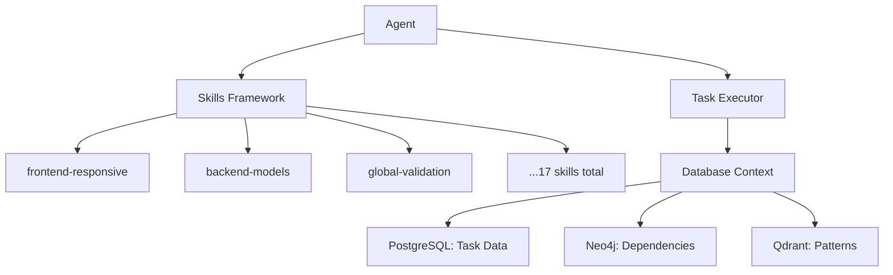

# DevMatrix Agent-OS Integration Blueprint

## Executive Summary

DevMatrix database-native actúa como agent-os pero con una arquitectura fundamentalmente diferente: usa bases de datos (PostgreSQL, Neo4j, Qdrant) en lugar de markdown files, y su pipeline de 10 fases reemplaza el flujo de comandos de agent-os.

## Architecture Overview

### 1. Agentes y Skills (Capa de Ejecución)



**Los 17 Skills de Agent-OS se mantienen:**
- Cada skill es un módulo Python con validaciones específicas
- Los agentes aplican skills según el tipo de tarea
- El resultado se guarda directamente en PostgreSQL

### 2. Contexto: Database-First vs Markdown

#### Agent-OS Context (Original)
```yaml
Context Passing:
  - Lee archivos markdown (spec.md, tasks.md)
  - Pasa el contenido completo al agente
  - Agente procesa todo el texto
  - Genera markdown de salida
```

#### DevMatrix Database Context (Propuesto)
```python
class DatabaseContext:
    """Contexto eficiente desde bases de datos"""

    def __init__(self, spec_id: UUID):
        self.spec_id = spec_id
        self.pg_conn = PostgreSQLConnection()
        self.neo4j_conn = Neo4jConnection()
        self.qdrant_conn = QdrantConnection()

    def get_task_context(self, task_id: UUID) -> Dict:
        """Obtiene contexto específico para una tarea"""
        return {
            'task_details': self.pg_conn.get_task(task_id),
            'dependencies': self.neo4j_conn.get_dependencies(task_id),
            'similar_patterns': self.qdrant_conn.find_similar(task_id),
            'parent_context': self.pg_conn.get_parent_tasks(task_id),
            'skill_requirements': self.pg_conn.get_required_skills(task_id)
        }

    def get_minimal_context(self, task_id: UUID) -> str:
        """Genera contexto mínimo optimizado para LLM"""
        task = self.pg_conn.get_task(task_id)
        patterns = self.qdrant_conn.find_top_patterns(task_id, limit=3)

        return f"""
        Task: {task.name}
        Type: {task.type}
        Description: {task.description}
        Required Skills: {task.skills}
        Similar Successful Patterns: {patterns}
        Dependencies Completed: {self.check_dependencies(task_id)}
        """
```

### 3. Orquestación con Neo4j Wave Analysis

```python
class GraphOrchestrator:
    """Orquestador basado en análisis de grafos"""

    def generate_execution_waves(self, spec_id: UUID) -> List[Wave]:
        """Genera waves de ejecución paralela"""

        # 1. Importar tareas desde PostgreSQL a Neo4j
        tasks = self.pg_conn.get_all_tasks(spec_id)
        self.neo4j.import_tasks(tasks)

        # 2. Analizar dependencias con Cypher
        waves_query = """
        MATCH (t:Task {spec_id: $spec_id})
        WHERE NOT (t)<-[:DEPENDS_ON]-()
        RETURN t.id as task_id, 0 as wave
        UNION
        MATCH path = (root:Task {spec_id: $spec_id})-[:DEPENDS_ON*]->(t:Task)
        WHERE NOT (root)<-[:DEPENDS_ON]-()
        RETURN t.id as task_id, length(path) as wave
        ORDER BY wave
        """

        waves = self.neo4j.query(waves_query, spec_id=spec_id)
        return self.group_tasks_by_wave(waves)

    def execute_wave(self, wave: Wave) -> WaveResult:
        """Ejecuta todas las tareas de un wave en paralelo"""

        # Asignar agentes según skills requeridos
        assignments = self.assign_agents_to_tasks(wave.tasks)

        # Ejecutar en paralelo
        with concurrent.futures.ThreadPoolExecutor(max_workers=5) as executor:
            futures = []
            for task, agent in assignments.items():
                context = DatabaseContext(task.spec_id).get_minimal_context(task.id)
                future = executor.submit(agent.execute, task, context)
                futures.append(future)

            results = [f.result() for f in futures]

        return WaveResult(wave.id, results)
```

### 4. Generación de Código: Híbrido Pipeline

```python
class HybridCodeGenerator:
    """Combina CodeGenerationService con Agent-OS patterns"""

    def __init__(self):
        self.code_gen_service = CodeGenerationService()  # DevMatrix existing
        self.pattern_store = SemanticPatternStore()      # Qdrant
        self.skill_framework = SkillsFramework()         # Agent-OS skills

    async def generate_code_for_task(self, task: Task, context: DatabaseContext) -> str:
        """Genera código combinando ambos enfoques"""

        # 1. Buscar patrones similares en Qdrant
        similar_patterns = await self.pattern_store.find_similar(task)

        # 2. Aplicar skills de agent-os
        applicable_skills = self.skill_framework.map_task_to_skills(task)

        # 3. Preparar prompt enriquecido
        enhanced_prompt = self.build_enhanced_prompt(
            task=task,
            patterns=similar_patterns,
            skills=applicable_skills,
            context=context.get_minimal_context(task.id)
        )

        # 4. Usar CodeGenerationService existente
        if task.type in ['API', 'MODEL', 'CRUD']:
            # Para tareas estructuradas, usar generate_from_requirements
            spec_requirements = self.task_to_requirements(task)
            code = await self.code_gen_service.generate_from_requirements(
                spec_requirements=spec_requirements,
                spec_content=enhanced_prompt
            )
        else:
            # Para tareas genéricas, usar generación directa
            code = await self.llm_client.generate(enhanced_prompt)

        # 5. Validar con skills
        for skill in applicable_skills:
            code = self.skill_framework.apply_skill_standards(code, skill)

        # 6. Guardar resultado en PostgreSQL
        self.pg_conn.update_task_result(task.id, code)

        # 7. Si exitoso, guardar patrón en Qdrant
        if self.validate_code(code):
            await self.pattern_store.store_success_pattern(task, code)

        return code
```

### 5. Flujo de Ejecución Completo

```python
class DevMatrixOrchestrator:
    """Orquestador principal de DevMatrix database-native"""

    async def process_spec(self, spec_content: str) -> ExecutionResult:
        """Procesa un spec completo con arquitectura database-native"""

        # FASE 1-2: Spec Ingestion & Requirements Analysis (DevMatrix Pipeline)
        spec_parser = SpecParser()
        spec_requirements = spec_parser.parse(spec_content)
        spec_id = self.db_manager.create_spec(spec_requirements)

        classifier = RequirementsClassifier()
        classified = classifier.classify(spec_requirements)

        # FASE 3: Planning - Generar jerarquía de tareas (como agent-os)
        task_hierarchy = self.generate_task_hierarchy(classified)
        self.db_manager.create_tasks(spec_id, task_hierarchy)

        # FASE 4-5: Atomization & DAG Construction
        self.graph_orchestrator.import_to_neo4j(task_hierarchy)
        waves = self.graph_orchestrator.generate_execution_waves(spec_id)

        # FASE 6: Wave Execution (Parallel con Agentes)
        for wave in waves:
            print(f"🌊 Executing Wave {wave.number} with {len(wave.tasks)} parallel tasks")

            # Contexto optimizado por tarea
            task_contexts = {}
            for task in wave.tasks:
                task_contexts[task.id] = DatabaseContext(spec_id).get_minimal_context(task.id)

            # Ejecutar tareas en paralelo con agentes
            results = await self.execute_wave_with_agents(wave, task_contexts)

            # Guardar resultados en PostgreSQL
            for task_id, result in results.items():
                self.db_manager.update_task_status(task_id, result.status)
                self.db_manager.save_task_output(task_id, result.code)

        # FASE 6.5: Code Repair (si es necesario)
        compliance = self.validator.check_compliance(spec_id)
        if compliance < 0.8:
            await self.repair_code(spec_id)

        # FASE 7-8: Validation & Deployment
        validation_result = self.validator.validate_final(spec_id)
        deployment_path = self.deploy_to_disk(spec_id)

        # FASE 9-10: Health Check & Learning
        health_status = self.verify_health(deployment_path)
        self.pattern_learner.learn_from_execution(spec_id)

        return ExecutionResult(spec_id, deployment_path, validation_result)
```

## Comparación de Estrategias

### Estrategia 1: Context Minimal (Recomendado ✅)
```python
Ventajas:
- Menor uso de tokens (30-50% menos)
- Consultas a DB más rápidas
- Contexto específico por tarea
- Cacheable en Redis

Implementación:
- Solo pasar info relevante de la tarea actual
- Top 3 patrones similares de Qdrant
- Dependencias directas completadas
- Skills requeridos
```

### Estrategia 2: Context Full (Como Agent-OS)
```python
Desventajas:
- Alto uso de tokens
- Queries pesadas a PostgreSQL
- Información redundante
- Difícil de cachear

No recomendado para database-native
```

### Estrategia 3: Context Hybrid (Balance ⚖️)
```python
Propuesta:
- Context minimal para tareas simples
- Context expandido para tareas complejas
- Decisión basada en task.complexity score
```

## Implementación Propuesta

### Fase 1: MVP (2 semanas)
1. Implementar DatabaseContext con queries optimizadas
2. Crear GraphOrchestrator para waves
3. Integrar con CodeGenerationService existente
4. Testear con simple_task_api.md

### Fase 2: Skills Integration (1 semana)
1. Portar 17 skills de agent-os a Python modules
2. Crear SkillsFramework para mapping y validación
3. Integrar con HybridCodeGenerator

### Fase 3: Pattern Learning (1 semana)
1. Configurar Qdrant embeddings
2. Implementar SemanticPatternStore
3. Conectar con learning phase (Fase 10)

### Fase 4: Optimization (1 semana)
1. Query optimization en Neo4j
2. Connection pooling para las 3 DBs
3. Redis caching para contextos frecuentes
4. Métricas y monitoring

## Decisiones Clave

### 1. ¿Contexto como Agent-OS o Optimizado?
**Decisión**: Contexto optimizado database-first
- Solo información necesaria para la tarea
- Reduce tokens 30-50%
- Mejor performance

### 2. ¿Agentes ejecutan directamente o vía CodeGenerationService?
**Decisión**: Híbrido
- CodeGenerationService para tareas estructuradas (APIs, Models)
- Agentes directos para tareas genéricas
- Reutilización máxima de código existente

### 3. ¿Cómo se pasan patterns de Qdrant?
**Decisión**: Top-K similarity con threshold
- Solo los 3 patterns más similares (>0.8 similarity)
- Incluir código y métricas de éxito
- Formato compacto en el prompt

### 4. ¿Skills se aplican antes o después de generación?
**Decisión**: Ambos
- Antes: Para guiar la generación (en el prompt)
- Después: Para validar y corregir

## Ejemplo de Ejecución

```python
# 1. Spec ingresado
spec = "Create e-commerce API with products, orders..."

# 2. Se genera task hierarchy
tasks = [
    Task(id=1, type="MODEL", name="Create Product model"),
    Task(id=2, type="MODEL", name="Create Order model"),
    Task(id=3, type="API", name="Product CRUD endpoints"),
    Task(id=4, type="API", name="Order endpoints", depends_on=[2,3])
]

# 3. Neo4j genera waves
Wave 1: [Task 1, Task 2]  # Paralelo
Wave 2: [Task 3]          # Depende de Task 1
Wave 3: [Task 4]          # Depende de Tasks 2 y 3

# 4. Contexto para Task 3
context = {
    'task': 'Product CRUD endpoints',
    'skills': ['backend-api', 'global-validation'],
    'patterns': [
        {'similarity': 0.92, 'code': 'router.get("/products"...'},
        {'similarity': 0.89, 'code': 'class ProductController...'}
    ],
    'dependencies_completed': ['Product model']
}

# 5. Agente ejecuta con contexto minimal
agent = BackendEngineer()
code = agent.execute(task=Task3, context=context)

# 6. Resultado guardado en PostgreSQL
UPDATE tasks SET status='completed', output=$code WHERE id=3;
```

## Métricas de Éxito

1. **Performance**
   - Context generation: <100ms
   - Wave analysis: <500ms
   - Task execution: <30s per task
   - Pattern search: <200ms

2. **Calidad**
   - Compliance: >90%
   - Pattern reuse: >80% for similar tasks
   - Skill validation pass rate: >95%

3. **Eficiencia**
   - Token reduction: 30-50% vs full context
   - Parallel execution: 3-5x speedup
   - Database query optimization: <100ms p95

## Conclusión

La arquitectura propuesta combina lo mejor de ambos mundos:
- **De Agent-OS**: Skills framework, task hierarchy, agent specialization
- **De DevMatrix**: Pipeline robusto, validación semántica, pattern learning
- **Database-Native**: Escalabilidad, performance, consultas optimizadas

El contexto optimizado (minimal) es claramente superior al approach de pasar todo el markdown como en agent-os original.