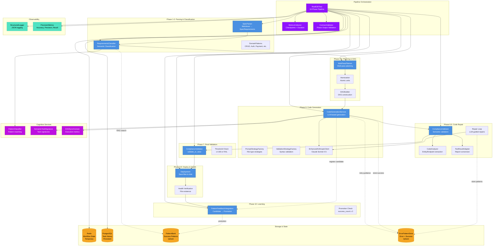
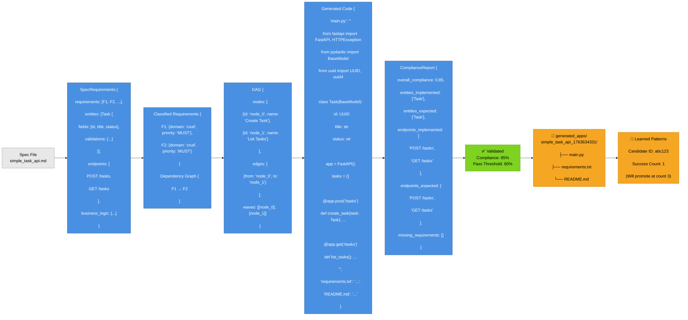
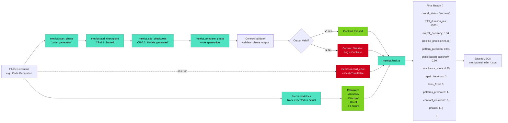
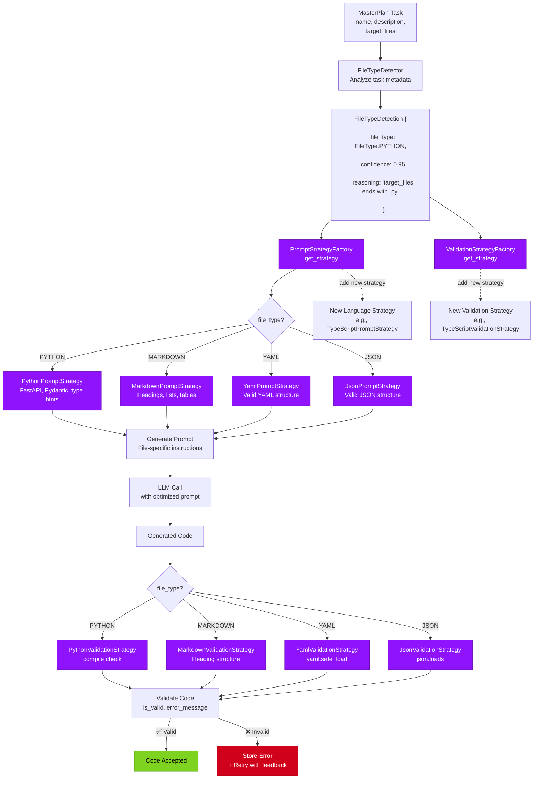
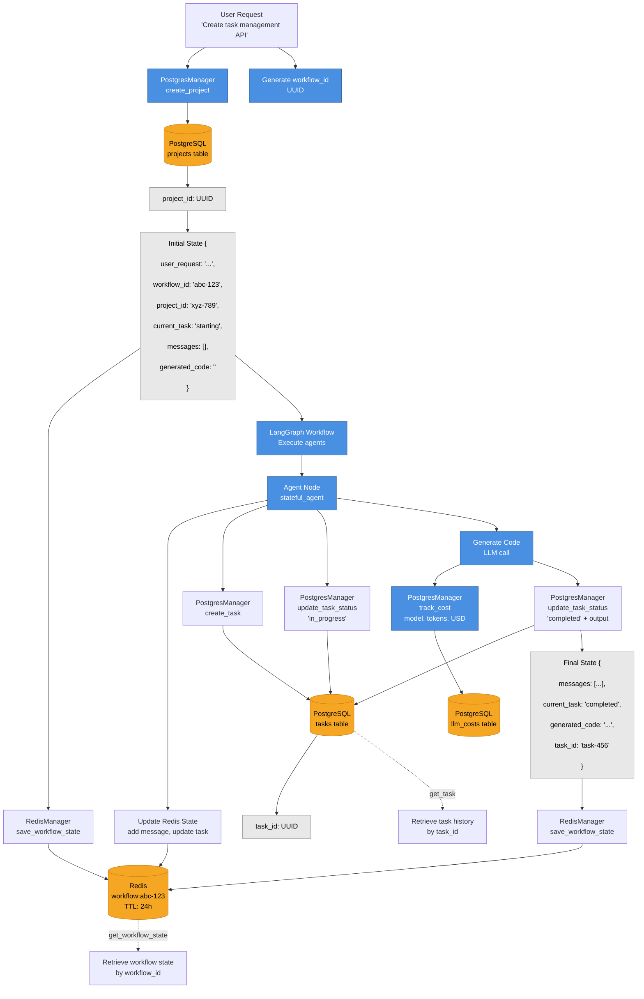

# DevMatrix E2E Pipeline - Diagrama de Arquitectura

**Fecha**: 2025-11-20

## 📊 Diagrama Principal: Pipeline Flow

```mermaid
flowchart TD
    %% Input
    START([Spec File .md]) --> P1

    %% Phase 1: Spec Ingestion
    P1[Phase 1: Spec Ingestion<br/>SpecParser]
    P1 --> P1_OUT{SpecRequirements<br/>entities, endpoints,<br/>business logic}

    %% Phase 2: Requirements Analysis
    P1_OUT --> P2[Phase 2: Requirements Analysis<br/>RequirementsClassifier]
    P2 --> PATTERN_BANK[(PatternBank<br/>RAG Search)]
    PATTERN_BANK -.-> P2
    P2 --> P2_OUT{Classified Requirements<br/>+ Dependency Graph}

    %% Phase 3: Multi-Pass Planning
    P2_OUT --> P3[Phase 3: Multi-Pass Planning<br/>MultiPassPlanner]
    P3 --> P3_OUT{Initial DAG<br/>nodes, edges, waves}

    %% Phase 4: Atomization
    P3_OUT --> P4[Phase 4: Atomization]
    P4 --> P4_OUT{Atomic Units<br/>id, complexity, LOC}

    %% Phase 5: DAG Construction
    P4_OUT --> P5[Phase 5: DAG Construction<br/>DAGBuilder]
    P5 --> P5_OUT{Final DAG<br/>with waves}

    %% Phase 6: Code Generation
    P5_OUT --> P6[Phase 6: Code Generation<br/>CodeGenerationService]
    P6 --> LLM[LLM Call<br/>Claude Sonnet 4.5<br/>+ Prompt Caching]
    LLM --> P6
    P6 --> ERROR_STORE[(ErrorPatternStore<br/>RAG Feedback)]
    ERROR_STORE -.retry guidance.-> P6
    P6 --> P6_OUT{Generated Code<br/>main.py, requirements.txt}

    %% Phase 6.5: Code Repair
    P6_OUT --> P6_5{Phase 6.5: Code Repair<br/>ComplianceValidator Pre-check}
    P6_5 -->|compliance ≥ 0.80| SKIP[SKIP REPAIR<br/>Fast Path ✅]
    P6_5 -->|compliance < 0.80| REPAIR_LOOP

    REPAIR_LOOP[Repair Loop<br/>max 3 iterations]
    REPAIR_LOOP --> ADAPTER[TestResultAdapter<br/>ComplianceReport → TestResult]
    ADAPTER --> REPAIR_LLM[Generate Repair Proposal<br/>LLM + Full Spec Context]
    REPAIR_LLM --> APPLY[Apply Repair]
    APPLY --> REVALIDATE[Re-validate Compliance]
    REVALIDATE -->|regression?| ROLLBACK[Rollback ↺]
    ROLLBACK --> REPAIR_LOOP
    REVALIDATE -->|improved!| REPAIR_OUT

    SKIP --> P6_5_OUT{Repaired Code<br/>or Original if skipped}
    REPAIR_OUT[Final Repaired Code] --> P6_5_OUT

    %% Phase 7: Validation
    P6_5_OUT --> P7[Phase 7: Validation<br/>ComplianceValidator]
    P7 --> CODE_ANALYZER[CodeAnalyzer<br/>Extract: entities,<br/>endpoints, validations]
    CODE_ANALYZER --> P7
    P7 -->|compliance < 0.80| FAIL[❌ FAIL<br/>ComplianceValidationError]
    P7 -->|compliance ≥ 0.80| P7_OUT{✅ Validation Passed<br/>Compliance Score}

    %% Phase 8: Deployment
    P7_OUT --> P8[Phase 8: Deployment<br/>Save files to disk]
    P8 --> P8_OUT{Output Directory<br/>generated_apps/...}

    %% Phase 9: Health Verification
    P8_OUT --> P9[Phase 9: Health Verification<br/>File existence checks]
    P9 --> P9_OUT{✅ App Ready}

    %% Phase 10: Learning
    P9_OUT --> P10[Phase 10: Learning<br/>PatternFeedbackIntegration]
    P10 --> REGISTER[Register Successful<br/>Code as Candidate]
    REGISTER --> PROMOTION_CHECK{Check Promotion<br/>Criteria}
    PROMOTION_CHECK -->|success_count ≥ 3| PROMOTE[Promote to PatternBank]
    PROMOTION_CHECK -->|not ready| WAIT[Wait for more successes]
    PROMOTE --> PATTERN_BANK

    %% Final Output
    P10 --> END([🎉 Generated App Ready<br/>+ Patterns Learned])

    %% Styling
    classDef phaseClass fill:#4A90E2,stroke:#2E5C8A,color:#fff
    classDef outputClass fill:#7ED321,stroke:#5FA319,color:#000
    classDef storageClass fill:#F5A623,stroke:#C77E1A,color:#000
    classDef errorClass fill:#D0021B,stroke:#9B0115,color:#fff

    class P1,P2,P3,P4,P5,P6,P6_5,P7,P8,P9,P10 phaseClass
    class P1_OUT,P2_OUT,P3_OUT,P4_OUT,P5_OUT,P6_OUT,P6_5_OUT,P7_OUT,P8_OUT,P9_OUT outputClass
    class PATTERN_BANK,ERROR_STORE storageClass
    class FAIL errorClass
```

---

## 🔄 Diagrama: Phase 6.5 Code Repair Loop (Detallado)

```mermaid
flowchart TD
    START[Generated Code<br/>from Phase 6] --> PRECHECK[CP-6.5.1: ComplianceValidator<br/>Pre-check]

    PRECHECK --> CHECK_SCORE{Compliance Score?}

    CHECK_SCORE -->|≥ 0.80| SKIP[CP-6.5.SKIP<br/>High compliance<br/>Skip repair ✅]
    CHECK_SCORE -->|< 0.80| INIT[CP-6.5.2: Initialize<br/>TestResultAdapter<br/>ErrorPatternStore]

    INIT --> CONVERT[CP-6.5.3: Convert<br/>ComplianceReport →<br/>TestResult format]

    CONVERT --> LOOP_START[CP-6.5.4: Repair Loop<br/>Iteration 1/3]

    %% Repair Loop Steps
    LOOP_START --> STEP1[Step 1: Analyze Failures<br/>Missing entities/endpoints]
    STEP1 --> STEP2[Step 2: Search RAG<br/>Similar error patterns]
    STEP2 --> STEP3[Step 3: Generate Repair Proposal<br/>LLM + Full Spec Context]

    STEP3 --> CONTEXT{Build Repair Context}
    CONTEXT --> |Missing entities<br/>Wrong entities<br/>Missing endpoints| LLM_REPAIR[LLM Call:<br/>generate_from_requirements<br/>+ repair_context]

    LLM_REPAIR --> STEP4[Step 4: Create Backup<br/>backup_code = current_code]
    STEP4 --> STEP5[Step 5: Apply Repair<br/>repaired_code = proposal]
    STEP5 --> STEP6[Step 6: Re-validate<br/>ComplianceValidator.validate]

    STEP6 --> STEP7{Step 7: Regression Check}

    STEP7 -->|new < current| REGRESSION[⚠️ Regression Detected!<br/>Rollback to backup]
    REGRESSION --> STEP8_FAIL[Step 8: Store Error Pattern<br/>ErrorPatternStore]
    STEP8_FAIL --> NO_IMPROVE{No improvement<br/>for 2 iterations?}

    STEP7 -->|new ≥ current| IMPROVED{Improvement?}
    IMPROVED -->|new > best| BETTER[✅ Better code!<br/>Update best_code]
    IMPROVED -->|new = current| SAME[= No change]

    BETTER --> STEP8_SUCCESS[Step 8: Store Success Pattern<br/>SuccessPattern]
    SAME --> NO_IMPROVE

    STEP8_SUCCESS --> TARGET_CHECK{Compliance ≥<br/>0.88 target?}
    TARGET_CHECK -->|Yes| DONE[✅ Target Achieved<br/>Exit loop]
    TARGET_CHECK -->|No| CONTINUE{Iterations<br/>< max?}

    NO_IMPROVE -->|Yes, stop| DONE
    NO_IMPROVE -->|No, continue| CONTINUE

    CONTINUE -->|Yes| LOOP_START
    CONTINUE -->|No| DONE

    %% Final metrics
    DONE --> METRICS[CP-6.5.5: Collect Metrics<br/>iterations, improvement,<br/>tests_fixed, regressions]
    SKIP --> METRICS

    METRICS --> END[Repaired Code<br/>+ Metrics<br/>→ Phase 7]

    %% Styling
    classDef goodClass fill:#7ED321,stroke:#5FA319,color:#000
    classDef badClass fill:#D0021B,stroke:#9B0115,color:#fff
    classDef processClass fill:#4A90E2,stroke:#2E5C8A,color:#fff

    class SKIP,BETTER,DONE goodClass
    class REGRESSION,STEP8_FAIL badClass
    class LOOP_START,STEP1,STEP2,STEP3,STEP4,STEP5,STEP6,STEP8_SUCCESS,METRICS processClass
```

---

## 🏗️ Diagrama: Arquitectura de Componentes

---

## 📊 Diagrama: Data Flow (SpecRequirements → Generated Code)

---

## 🔄 Diagrama: Cognitive Feedback Loop (RAG + Learning)

```mermaid
flowchart TD
    %% Code Generation Phase
    TASK[Code Generation Task<br/>Task: 'Create Product endpoint']

    TASK --> ATTEMPT1{Attempt 1}
    ATTEMPT1 --> GENERATE1[Generate Code<br/>Standard prompt]
    GENERATE1 --> VALIDATE1{Validate Syntax}

    VALIDATE1 -->|✅ Valid| SUCCESS[Store Success Pattern<br/>ErrorPatternStore]
    VALIDATE1 -->|❌ Invalid| ERROR1[Store Error Pattern<br/>SyntaxError: incomplete class]

    %% Retry with RAG
    ERROR1 --> ATTEMPT2{Attempt 2<br/>Retry with RAG}
    ATTEMPT2 --> RAG_SEARCH[Search Similar Errors<br/>ErrorPatternStore]
    RAG_SEARCH --> SIMILAR[Found 3 similar errors<br/>All had incomplete class def]

    ATTEMPT2 --> RAG_SUCCESS[Search Success Patterns<br/>ErrorPatternStore]
    RAG_SUCCESS --> PATTERNS[Found 5 success patterns<br/>Complete class definitions]

    SIMILAR --> ENHANCED_PROMPT[Build Enhanced Prompt<br/>with RAG feedback]
    PATTERNS --> ENHANCED_PROMPT

    ENHANCED_PROMPT --> GENERATE2[Generate Code<br/>+ explicit class completion instruction]
    GENERATE2 --> VALIDATE2{Validate Syntax}

    VALIDATE2 -->|✅ Valid| SUCCESS2[✅ Store Success Pattern<br/>+ metadata: used_feedback=True]
    VALIDATE2 -->|❌ Invalid| ERROR2[Store Error Pattern<br/>Attempt 2]

    ERROR2 --> ATTEMPT3{Attempt 3<br/>max_retries reached}
    ATTEMPT3 --> FAIL[❌ Code Generation Failed<br/>After 3 attempts]

    %% Success Path: Pattern Promotion
    SUCCESS --> REGISTER[Register as Candidate<br/>PatternFeedbackIntegration]
    SUCCESS2 --> REGISTER

    REGISTER --> CANDIDATE_STORE[(Candidate Store<br/>success_count++)]

    CANDIDATE_STORE --> CHECK_PROMOTION{Check Promotion<br/>success_count ≥ 3?}

    CHECK_PROMOTION -->|No| WAIT[Wait for more<br/>successful uses]
    CHECK_PROMOTION -->|Yes| DUAL_VAL[Dual Validation<br/>Syntactic + Semantic]

    DUAL_VAL -->|✅ Pass| PROMOTE[Promote to PatternBank<br/>Available for future tasks]
    DUAL_VAL -->|❌ Fail| REJECT[Reject promotion<br/>Quality issues]

    PROMOTE --> PATTERN_BANK[(PatternBank<br/>Qdrant Vector Store)]

    %% Future Task Uses Pattern
    PATTERN_BANK -.reuse in future tasks.-> NEW_TASK[New Similar Task<br/>Search PatternBank]
    NEW_TASK --> PATTERN_MATCH[Pattern Match<br/>similarity > 0.45]
    PATTERN_MATCH --> REUSE[Reuse Promoted Pattern<br/>Fast generation]

    %% Styling
    classDef successClass fill:#7ED321,stroke:#5FA319,color:#000
    classDef errorClass fill:#D0021B,stroke:#9B0115,color:#fff
    classDef ragClass fill:#F5A623,stroke:#C77E1A,color:#000
    classDef storeClass fill:#4A90E2,stroke:#2E5C8A,color:#fff

    class SUCCESS,SUCCESS2,PROMOTE,REUSE successClass
    class ERROR1,ERROR2,FAIL,REJECT errorClass
    class RAG_SEARCH,RAG_SUCCESS,SIMILAR,PATTERNS,ENHANCED_PROMPT ragClass
    class CANDIDATE_STORE,PATTERN_BANK storeClass
```

---

## 🎯 Diagrama: Metrics Collection Flow

---

## 🔧 Diagrama: Strategy Pattern (Prompt & Validation)

---

## 📦 Diagrama: State Management (Redis + PostgreSQL)

---

**Última actualización**: 2025-11-20
