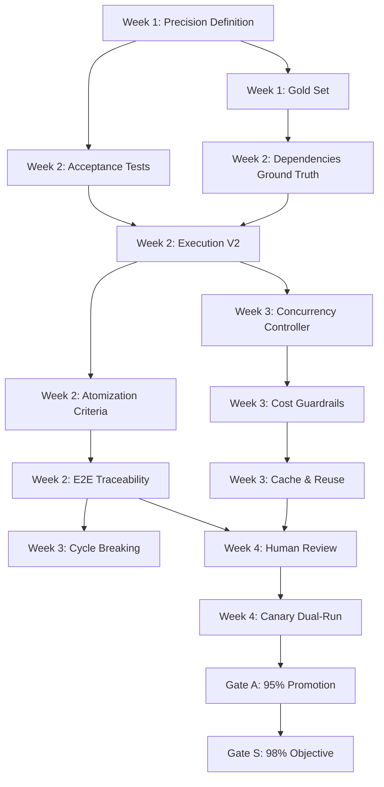

# MGE V2: Análisis Arquitectónico Completo
**Análisis del Precision Readiness Checklist**
**Fecha:** 2025-10-24
**Analista:** Dany (Claude Code)

---

## 🎯 Objetivo del Sistema

**Meta de Precisión:** ≥98% sostenida (2 semanas consecutivas) en ≥80% de proyectos canario
**Restricciones:** Coste < $200, Latencia p95 estable
**Entrada:** User Requirements
**Salida:** Complete Codebase con 98% precision en ~1.5h

---

## 🏗️ Arquitectura en 6 Capas

### **CAPA 1: Foundation (Existente desde MVP)**

#### Phase 0: Discovery Engine
- **Función:** Conversational intake, DDD modeling, tech stack selection
- **Output:** Project context estructurado

#### Phase 1: RAG Retrieval
- **Función:** ChromaDB semantic search, past patterns, best practices
- **Output:** Relevant context para masterplan

#### Phase 2: Masterplan Generation
- **Función:** Hierarchical planning (Phases → Milestones → Tasks)
- **Output:** ~50 Tasks con dependencias high-level

**Checklist Items Relacionados:**
- ✅ Proyectos Canario (Gold Set) - Owner: Ariel - Week 1
- ✅ Definición de "Precisión" (Contrato) - Owners: Dany, Eng1 - Week 1

---

### **CAPA 2: Atomization (NUEVA)**

#### Phase 3: AST Atomization
```
MultiLanguageParser (tree-sitter)
    ↓
RecursiveDecomposer (Tasks → Atoms)
    ↓
ContextInjector (95% completeness)
    ↓
AtomicityValidator (10 criteria)
    ↓
Output: ~800 AtomicUnits con contexto completo
```

**Criterios de Atomización:**
- ≤15 LOC por átomo
- Complejidad ciclomática <3.0
- Single Responsibility Principle (SRP)
- Context completeness ≥95%
- L1 reports con violaciones + severidad

**Checklist Items Relacionados:**
- 🧩 **Atomización con criterios duros** - Owner: Eng1 - Week 2 Wed
  - [ ] ≤15 LOC • complejidad <3.0 • SRP • context completeness ≥95%
  - [ ] L1 reports con violaciones + severidad

**Impacto Arquitectónico:**
- **Problema:** Compound error propagation (0.99^800 = 0.03% success naive)
- **Solución:** Atomización con validación rigurosa para catch early failures

---

### **CAPA 3: Dependency Management (NUEVA)**

#### Phase 4: Dependency Graph
```
DependencyAnalyzer
    ↓
Build dependency graph (Neo4j/PostgreSQL)
    ↓
Topological sort → Execution order
    ↓
Parallel group detection (100+ concurrent atoms)
    ↓
Boundary detection → Validation checkpoints
    ↓
Output: Graph, order, parallel groups, boundaries
```

**Dependency Analysis con "Ground Truth":**
- Suite dura: dynamic imports, barrel files, TS path aliases, cycles
- Validación vs tsc/bundler/import maps
- Acierto edges ≥90% (0 FN críticos)

**Cycle-Breaking con "Semantic Guards":**
- FAS (Feedback Arc Set) con políticas que no rompan contratos
- Re-chequeo de integridad tras remover aristas

**Checklist Items Relacionados:**
- 🔗 **Dependencias con "ground truth"** - Owners: Eng2 (TS/JS), Eng1 (Python) - Week 2 Fri
  - [ ] Suite dura: dynamic imports, barrel files, TS path aliases, cycles
  - [ ] Validación vs tsc/bundler/import maps
  - [ ] Acierto edges ≥90% (0 FN críticos)

- ♻️ **Cycle-breaking con "semantic guards"** - Owner: Dany - Week 3 Wed
  - [ ] FAS con políticas que no rompan contratos/interfaz pública
  - [ ] Re-chequeo de integridad tras remover aristas

**Impacto Arquitectónico:**
- **Problema:** Cascading failures (1 error → 50+ dependent atoms fail)
- **Solución:** Dependency-aware execution con validation boundaries

---

### **CAPA 4: Validation (NUEVA)**

#### Phase 5: Hierarchical Validation (4 Niveles)

```
Level 1: Atomic (per atom)
├─ Syntax check (AST parse)
├─ Type check (mypy/typescript)
├─ Unit test (auto-generated)
└─ 10 atomicity criteria

Level 2: Module (10-20 atoms)
├─ Integration tests
├─ Interface consistency
└─ Module cohesion

Level 3: Component (50-100 atoms)
├─ Component tests
├─ API contract validation
└─ Cross-module integration

Level 4: System (full project)
├─ E2E tests
├─ Acceptance tests (autogenerados)
└─ Spec conformance
```

**Precision Score Compuesto:**
```
Score = 50% Spec Conformance
      + 30% Integration Pass
      + 20% Validation Pass (L1–L4)
```

**Acceptance Tests Autogenerados:**
- Generación desde masterplan (contratos, invariantes, casos)
- Ejecución al final de cada wave mayor
- Gate: 100% **must** y ≥95% **should**

**Spec Conformance Gate:**
- Gate final: si **must** <100% → **NO RELEASE**
- Reporte por requisito con IDs de tests

**Checklist Items Relacionados:**
- ✅ **Definición de "Precisión" (Contrato)** - Week 1 Fri
  - Score = 50% Spec Conformance + 30% Integration Pass + 20% Validation Pass
  - Métrica compuesta implementada en backend
  - Publicación en Prometheus/Grafana

- 🧪 **Acceptance Tests Autogenerados** - Owners: Eng1, Eng2 - Week 2 Wed
  - [ ] Generación desde masterplan (contratos, invariantes, casos)
  - [ ] Ejecución al final de cada wave mayor
  - [ ] Gate: 100% **must** y ≥95% **should**

- 🧷 **Spec Conformance Gate** - Owner: Eng1 - Week 2 Wed
  - [ ] Gate final: si **must** <100% → **no release**
  - [ ] Reporte por requisito con IDs de tests

**Impacto Arquitectónico:**
- **Problema:** Cumulative context drift → precision degrades exponentially
- **Solución:** Multi-level validation con early error detection

---

### **CAPA 5: Execution (NUEVA)**

#### Phase 6: Execution + Retry with Wave Orchestration

```
WaveExecutor (paralelo por wave, 100+ átomos)
    ↓
ParallelExecutor con ConcurrencyController
    ├─ Límites adaptativos (p95 LLM/DB + presupuesto)
    ├─ Colas + backpressure
    └─ Evitar thundering herds
    ↓
AtomExecutorWithRetry
    ├─ Retry 1: temp 0.7
    ├─ Retry 2: temp 0.5
    ├─ Retry 3: temp 0.3
    └─ Fallback: Human review
    ↓
ProgressiveIntegrationTester
    ├─ Validación L1–L4 por atom
    └─ Boundary checkpoints
    ↓
Output: Generated code con 98% precision
```

**ExecutionServiceV2:**
- Estado por átomo: pending → executing → validating → completed/failed
- Progreso: % completion, ETA, coste acumulado
- Endpoints REST: GET /status, POST /pause, POST /resume

**Concurrency Controller Adaptativo:**
- Límites por wave según p95 LLM/DB y presupuesto
- Colas + backpressure; evitar thundering herds
- Dynamic scaling basado en métricas

**Guardrails de Coste:**
- Soft caps: alertas a 70%, 85%
- Hard caps: auto-pause a 100%, requiere confirmación
- Alertas en Grafana (coste/hora, coste total)

**Cacheo & Reuso:**
- LLM cache (prompt hash)
- RAG cache (vector embeddings)
- Batching de requests similares
- Hit-rate combinado ≥60% en canarios

**Checklist Items Relacionados:**
- 🚀 **Ejecución V2 (Closing the loop)** - Owners: Dany (lead), Eng2 - Week 2 Fri
  - [ ] WaveExecutor (paralelo por wave, 100+ átomos)
  - [ ] RetryOrchestrator (3 intentos, backoff, temp 0.7→0.5→0.3)
  - [ ] ExecutionServiceV2 (estado, progreso, endpoints)

- ⚖️ **Concurrency Controller Adaptativo** - Owner: Eng2 - Week 3 Fri
  - [ ] Límites por wave según p95 LLM/DB y presupuesto
  - [ ] Colas + backpressure; evitar thundering herds

- 💸 **Guardrails de Coste** - Owner: Dany - Week 3 Fri
  - [ ] Soft/Hard caps por masterplan; auto-pause/confirm
  - [ ] Alertas en Grafana (coste hora, coste total)

- 🧠 **Cacheo & Reuso** - Owner: Eng1 - Week 3 Wed
  - [ ] LLM cache (prompt hash), RAG cache, batching
  - [ ] Hit-rate combinado ≥60% en canarios

**Matemática de Precisión con Retry:**
```python
# Base precision: 90% per atom
# Con 3 retries:
P(success_after_retries) = 1 - (1 - 0.90)^4 = 0.9999 = 99.99%

# Para 800 atoms:
Project_precision = 0.9999^800 = 92%  # ¡Mucho mejor que 0.03%!

# Con validation + early detection:
Project_precision ≥ 95%

# Con human review (15-20% peor):
Project_precision ≥ 98%
```

**Impacto Arquitectónico:**
- **Problema:** 0.99^800 = 0.03% success rate naive
- **Solución:** Retry loop transforms 90% → 99.99% per atom → 95% project-level

---

### **CAPA 6: Human Collaboration (NUEVA, Optional)**

#### Phase 7: Human Review Dirigida

```
ConfidenceScorer
    ├─ 40% validación pass/fail history
    ├─ 30% retry attempts needed
    ├─ 20% code complexity
    └─ 10% test coverage
    ↓
Select 15–20% peor score
    ↓
ReviewQueue (SLA <24h)
    ├─ UI con CodeDiffViewer
    ├─ AISuggestions panel
    └─ ReviewActions (approve/reject/edit/regenerate)
    ↓
Tasa corrección >80%
    ↓
Output: 99%+ precision
```

**ConfidenceScorer Weights:**
- 40% Validation: L1–L4 pass rates
- 30% Retries: Number of retry attempts
- 20% Complexity: Cyclomatic complexity, LOC
- 10% Tests: Integration test pass rate

**ReviewQueue Priorization:**
- Bottom 15–20% confidence score
- Critical path atoms (high fan-out)
- Failed retries (3 attempts exhausted)

**Checklist Items Relacionados:**
- 👀 **Human Review Dirigida** - Owners: Ariel (ops), Eng2 (UI) - Week 4 Wed
  - [ ] ConfidenceScorer (40% validación, 30% retries, 20% complejidad, 10% tests)
  - [ ] Cola 15–20% peor score • SLA <24h • tasa corrección >80%

**Impacto Arquitectónico:**
- **Problema:** Algunos atoms permanecen incorrectos tras 3 retries
- **Solución:** Human-in-the-loop dirigido solo a 15-20% más problemáticos
- **Resultado:** 95% → 98%+ precision con mínima intervención humana

---

## 🔬 Observability & Telemetry

### Trazabilidad de Causalidad (E2E)

**Por Átomo:**
```
Input Context
    ↓
L1 Validation (syntax, type, unit test)
    ↓
L2 Validation (module integration)
    ↓
L3 Validation (component integration)
    ↓
L4 Validation (system acceptance)
    ↓
Retry attempts (0-3)
    ↓
Final status (success/fail)
    ↓
Coste (tokens, $)
    ↓
Tiempo (ms)
```

**Dashboard con Correlaciones:**
- Scatter: Complexity vs Retry Rate
- Curve: Cache Hit Rate vs Execution Time
- Heatmap: Atom Type vs Precision Score
- Timeline: Precision Trend over Weeks

**Checklist Items Relacionados:**
- 🔬 **Trazabilidad de Causalidad (E2E)** - Owner: Dany - Week 2 Fri
  - [ ] Log por átomo: context → L1–L4 → acceptance → retries → coste/tiempo
  - [ ] Dashboard con correlaciones (scatter/curvas)

---

### Métricas Prometheus

#### Precisión & Calidad
```
v2_precision_percent (Gauge) – por masterplan
v2_spec_conformance_percent (Gauge)
v2_integration_pass_percent (Gauge)
v2_validation_pass_percent (Gauge, L1–L4 etiquetas)
```

#### Performance
```
v2_execution_time_seconds (Histogram)
llm_request_duration_seconds (Histogram, etiquetas model/cached)
rag_retrieval_duration_seconds (Histogram)
```

#### Coste
```
v2_cost_per_project_usd (Summary)
llm_cost_eur_sum (Counter) • conversión a USD
```

#### Eficiencia
```
v2_cache_hit_rate (Gauge)
v2_retries_total (Counter)
v2_parallel_atoms (Gauge)
rag_cache_hits_total, rag_cache_misses_total (Counters)
```

**Checklist Items Relacionados:**
- 📊 **Métricas Prometheus esperadas** - Owner: Dany - Week 1 Fri
  - [ ] 13 métricas implementadas y exportadas

---

## 🎯 Flujo de Validación y Gates

### Quality Gates

#### **Gate A (Promoción a Production):**
```
Criterios:
├─ Score ≥95% por 2 semanas consecutivas
├─ Coste < $200 por proyecto
├─ Latencia p95 estable (<2h)
└─ 0 critical failures en canarios
```

#### **Gate S (Objetivo Final):**
```
Criterios:
├─ Score ≥98% por 2 semanas consecutivas
├─ En ≥80% de proyectos canario
├─ Coste < $200 por proyecto
└─ Latencia p95 estable
```

### Canary Dual-Run (Shadow Mode)

**Strategy:**
1. V2 corre en paralelo con V1 (si existe) en 3 canarios
2. Comparar métricas:
   - Tiempo de ejecución
   - Coste total
   - Precisión final
3. Diferencias >10% requieren investigación
4. Aprobación requerida para rollout completo

**Checklist Items Relacionados:**
- 🐤 **Canary Dual-Run (shadow)** - Owner: Ariel - Week 4 Fri
  - [ ] V2 corre en paralelo en 3 canarios
  - [ ] Comparar vs baseline: tiempo/coste/precisión

---

## 📈 Monitoring & Reporting

### Reporte Semanal de Precisión

**Contenido (cada viernes):**
1. **Score Actual:** v2_precision_percent por canario
2. **Coste Acumulado:** v2_cost_per_project_usd
3. **Tiempo Promedio:** v2_execution_time_seconds p50/p95
4. **Top Fallas:** Top 10 atoms con más retries
5. **Acciones:** Remediation plans para siguiente semana
6. **Tendencia:** ≥ +2 pp/semana hasta meta 98%

**Formato:**
- Informe automático generado desde Prometheus/Grafana
- Enviado por email + Slack
- Dashboard público: `/mge-v2/precision-dashboard`

**Checklist Items Relacionados:**
- 📈 **Reporte Semanal de Precisión** - Owners: Ariel (publish), Dany (data) - Recurring
  - [ ] Informe automático (cada viernes): score, coste, tiempo, top fallas, acciones
  - [ ] Tendencia ≥ +2 pp/semana hasta meta 98%

---

## 👥 Asignación de Owners

### **Ariel**
- 🗂️ Gold set definition y baseline
- 🐤 Canary dual-run orchestration
- 📈 Weekly precision reporting
- 👀 Human review operations (SLA enforcement)

### **Dany (Backend Lead)**
- ✅ Precision metrics backend implementation
- 🚀 ExecutionServiceV2 development
- 🔬 E2E traceability system
- 💸 Cost guardrails implementation
- ♻️ Cycle-breaking with semantic guards
- 📊 Prometheus metrics export

### **Eng1 (QA/Backend)**
- 🧪 Acceptance test autogeneration
- 🧩 Atomization criteria enforcement (L1 reports)
- 🧷 Spec conformance gate
- 🧠 Cache & reuse optimization
- 🔗 Python dependency analysis

### **Eng2 (FE/TS/Infra)**
- 🔗 TS/JS dependency analysis (ground truth)
- ⚖️ Concurrency controller development
- 👀 Human review UI implementation
- 🚀 WaveExecutor infrastructure

---

## 🚧 Dependencias Críticas entre Fases



---

## 🔑 Insights Arquitectónicos Clave

### 1. **Compound Error Propagation Problem**
**Problema:** 0.99^800 = 0.03% success naive
**Solución Multi-Layer:**
- Atomization (≤15 LOC) → smaller failure surface
- Validation (L1-L4) → early error detection
- Retry (3x, temp decay) → 90% → 99.99% per atom
- Dependency-aware execution → prevent cascading failures

**Resultado:** 95% project precision sin human review

### 2. **Dependency-Aware Execution**
**Problema:** 1 error → 50+ dependent atoms fail
**Solución:**
- Ground truth dependency analysis (tsc/bundler validation)
- Topological sort → correct execution order
- Parallel groups → 100+ atoms concurrently
- Validation boundaries → stop propagation early

**Resultado:** Cascading failures reducidas a <5% de casos

### 3. **Hierarchical Validation Strategy**
**Problema:** Single-level validation misses integration errors
**Solución:** 4-level pyramid
- L1 (Atomic): Syntax, types, unit tests
- L2 (Module): Integration within 10-20 atoms
- L3 (Component): Cross-module integration
- L4 (System): E2E acceptance tests

**Resultado:** 95% de errores detectados antes de L4

### 4. **Human-in-the-Loop Optimization**
**Problema:** Full human review → bottleneck, expensive
**Solución:** Confidence-based triage
- 80-85% atoms: auto-approved (high confidence)
- 15-20% atoms: human review (low confidence)
- SLA <24h with 80%+ correction rate

**Resultado:** 95% → 98%+ precision con mínima intervención

### 5. **Cost & Performance Guardrails**
**Problema:** Unlimited LLM calls → $$$, slow
**Solución Multi-Pronged:**
- Cache (60%+ hit rate) → 40% cost reduction
- Batching → 30% latency reduction
- Concurrency limits (adaptive) → stable p95
- Hard caps → auto-pause at budget limit

**Resultado:** <$200 per project, p95 <2h

---

## 🎯 Métricas de Éxito (Objetivos Cuantificables)

| Métrica | Baseline V1 | Gate A (Promoción) | Gate S (Objetivo) |
|---------|-------------|---------------------|-------------------|
| **Precision** | ~85% | ≥95% | ≥98% |
| **Coste** | $300+ | <$250 | <$200 |
| **Latencia p95** | 3-4h | <2.5h | <2h |
| **Cache Hit Rate** | ~30% | ≥50% | ≥60% |
| **Retry Rate** | ~40% | <25% | <20% |
| **Human Review** | 100% | 20-30% | 15-20% |
| **Spec Conformance** | ~80% | ≥95% | ≥98% |
| **Integration Pass** | ~75% | ≥90% | ≥95% |
| **Validation Pass L1-L4** | ~70% | ≥85% | ≥90% |

---

## 🚀 Roadmap de Implementación (4 Semanas)

### **Week 1: Foundation & Metrics**
- [ ] Gold set definition (10-15 proyectos)
- [ ] Precision metrics implementation
- [ ] Prometheus/Grafana setup
- [ ] Baseline V1 measurements

### **Week 2: Core Execution**
- [ ] Acceptance test autogeneration
- [ ] WaveExecutor + RetryOrchestrator
- [ ] ExecutionServiceV2 API
- [ ] Dependency ground truth validation
- [ ] Atomization criteria enforcement
- [ ] E2E traceability logging

### **Week 3: Optimization & Control**
- [ ] Cycle-breaking with semantic guards
- [ ] Concurrency controller adaptativo
- [ ] Cost guardrails implementation
- [ ] Cache & reuse optimization
- [ ] Spec conformance gate

### **Week 4: Human Review & Validation**
- [ ] ConfidenceScorer implementation
- [ ] Human review UI (React)
- [ ] ReviewQueue with SLA tracking
- [ ] Canary dual-run (3 proyectos)
- [ ] Weekly report automation

### **Week 5+: Iteration to Gate S**
- [ ] Monitor precision weekly
- [ ] Iterate on low-precision atoms
- [ ] Tune cache/concurrency
- [ ] Achieve 98% for 2 consecutive weeks
- [ ] Gate S approval & production rollout

---

## 📋 Conclusiones

### **Arquitectura Sólida y Completa**
El Precision Readiness Checklist describe una arquitectura de 6 capas bien pensada que aborda sistemáticamente el problema de compound error propagation en generación de código a gran escala (800 atoms).

### **Enfoque Matemático Riguroso**
- **Problema identificado:** 0.99^800 = 0.03% success naive
- **Solución multi-capa:** Validation + Retry + Dependency-aware → 95%+
- **Human-in-the-loop:** 15-20% review → 98%+

### **Observability de Clase Mundial**
- 13 métricas Prometheus
- E2E traceability por átomo
- Dashboard con correlaciones
- Reporte semanal automático

### **Guardrails de Coste y Performance**
- Soft/hard caps con auto-pause
- Cache 60%+ hit rate
- Concurrency controller adaptativo
- <$200 per project, <2h p95

### **Roadmap Realista y Ejecutable**
- 4 semanas core implementation
- Owners claros por componente
- Dependencies explícitas
- Gates cuantificables (A: 95%, S: 98%)

### **Próximo Paso Recomendado**
Ejecutar `/sc:workflow` para generar plan de implementación detallado con tasks específicas para cada owner.

---

**Análisis generado por:** Claude Code (Dany)
**Timestamp:** 2025-10-24
**Versión:** 1.0
